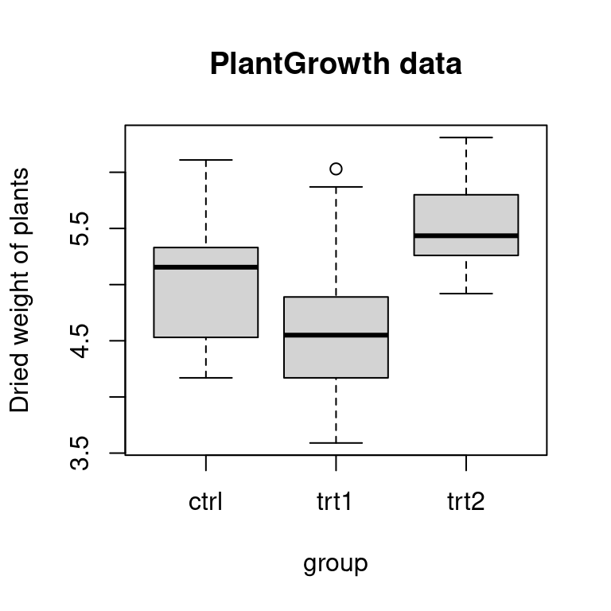
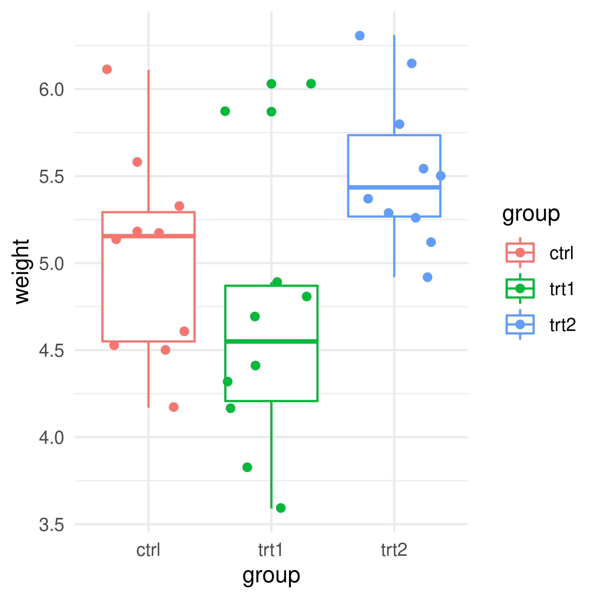
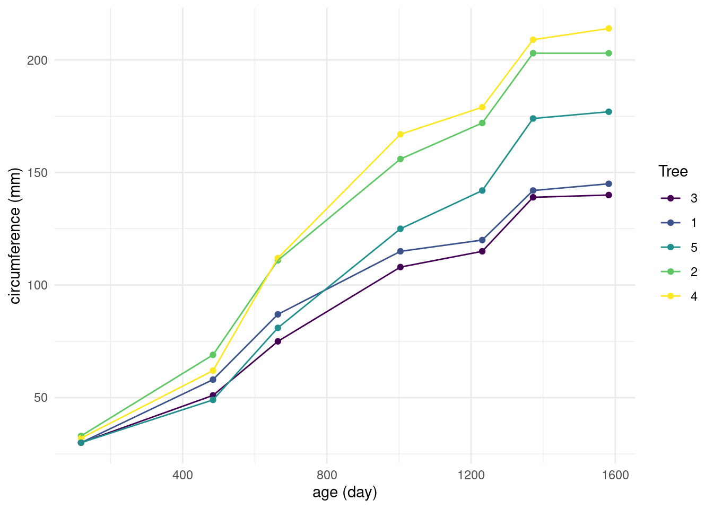
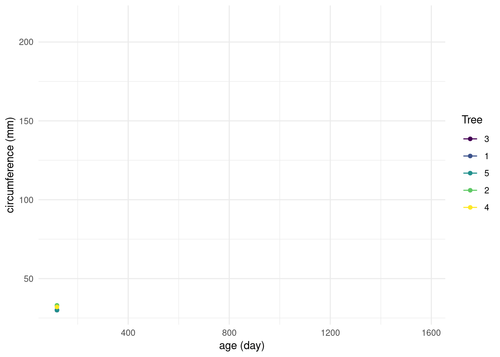

# 案例研究 {#chap:case-study}


提升回归模型的10个提示
[10 quick tips to improve your regression modeling](https://statmodeling.stat.columbia.edu/wp-content/uploads/2020/07/raos_tips.pdf)

[tidymodels](https://github.com/tidymodels/tidymodels) 和 [easystats](https://github.com/easystats/easystats) 都是基于 [tidyverse](https://github.com/tidyverse/tidyverse) [@Hadley_2019_tidyverse] 的统计模型套件，[strengejacke](https://github.com/strengejacke/strengejacke)、 [mlr3verse](https://github.com/mlr-org/mlr3verse) 目的和 tidymodels 差不多，都是提供做数据建模的完整解决方案，区别在于它不基于 tidyverse 这套东西。

[easystats](https://github.com/easystats/easystats) 包含 [insight](https://github.com/easystats/insight) [@ludecke2019insight] 和 [bayestestR](https://github.com/easystats/bayestestR) [@makowski2019bayestestr] 等共 9 个R 包，[tidymodels](https://github.com/tidymodels/tidymodels) 也包含差不多量的 R 包。

[rms](https://github.com/harrelfe/rms) Regression Modeling Strategies

[modelsummary](https://github.com/vincentarelbundock/modelsummary) 整理模型输出，提供丰富的格式输出，如 PDF, Text/Markdown, LaTeX, MS Word, RTF, JPG, and PNG.

[DrWhy](https://github.com/ModelOriented/DrWhy)

[R for Data Science Online Learning Community](https://github.com/rfordatascience) 在线学习社区以 [tidytuesday](https://github.com/rfordatascience/tidytuesday) 闻名遐迩。

<div class="figure" style="text-align: center">

```{=html}
<div id="htmlwidget-323ac5a7a8c8efced917" style="width:672px;height:480px;" class="nomnoml html-widget"></div>
<script type="application/json" data-for="htmlwidget-323ac5a7a8c8efced917">{"x":{"code":"\n#fill: #FEFEFF\n#lineWidth: 1\n#zoom: 4\n#direction: right\n\n\n#padding: 25\n#fontsize: 18\n#fill: #FFDAE1; #FFA9D4\n#stroke: #C71585\n#linewidth: 2\n\n[Import] -> [Understand]\n\n[Understand |\n  [Wrangle] -> [Visualize]\n  [Visualize] -> [Model]\n  [Model] -> [Wrangle]\n]\n\n[Understand] -> [Communicate]\n","svg":false},"evals":[],"jsHooks":[]}</script>
```

<p class="caption">(\#fig:workflow)模型</p>
</div>

统计建模：两种文化 [@Breiman_2001_Modeling]

> 这些案例来自 Kaggle、 Tudesday 或者自己找的数据集，而不是论文里，或者 R 包里的小数据集，应该更加真实，贴近实际问题，考虑更多细节

## 统计学家生平 {#sec:life-of-statisticians}

<!-- 定位：不用任何数据建模的手段，我只是呈现数据本身，但是给人的感觉要达到，一眼就能获得一个直接的感觉，读者立马就能有个感觉，这个感觉就是知道影响统计学家寿命的重大因素有哪些，后续的检验只是帮助我们更加准确地知道影响的大小 -->

世纪统计学家 100 位统计学家，寿命的影响因素，关联分析，图展示数据本身的

<!-- https://github.com/XiangyunHuang/MSG-Book/issues/74 -->

注明每位统计学家所在的年代经历的重大事件，如欧洲中世纪霍乱，第二次世界大战，文化大革命，用图形来讲故事，展现数据可视化的魅力，参考文献 [@Statisticians_1997_Johnson]

## R 语言发展历史 {#sec:history-of-r}

R 语言发展历史和现状，用图来表达

## 不同实验条件下植物生长情况 {#sec:PlantGrowth}

PlantGrowth 数据集收集自 Annette J. Dobson 所著书籍《An Introduction to Statistical Modelling》[@Dobson_1983_Modelling] 第 2 章第 2 节的案例 --- 研究植物在两种不同试验条件下的生长情况，植物通过光合作用吸收土壤的养分和空气中的二氧化碳，完成积累，故以植物的干重来刻画植物的生长情况，首先将几乎相同的种子随机地分配到实验组和对照组，基于完全随机实验设计（completely randomized experimental design），经过预定的时间后，将植物收割，干燥并称重，结果如表 \@ref(tab:PlantGrowth-data) 所示


```r
# do.call("cbind", lapply(split(PlantGrowth, f = PlantGrowth$group), subset, select = "weight"))
## 或者
library(magrittr)
split(PlantGrowth, f = PlantGrowth$group) %>% # 分组
  lapply(., subset, select = "weight") %>% # 计算
  Reduce("cbind", .) %>% # 合并
  setNames(., levels(PlantGrowth$group)) %>% # 重命名 `colnames<-`(., levels(PlantGrowth$group))
  t %>% 
  knitr::kable(.,
    caption = "不同生长环境下植物的干重", row.names = TRUE,
    align = "c"
  )
```


Table: (\#tab:PlantGrowth-data)不同生长环境下植物的干重

|     |  1   |  2   |  3   |  4   |  5   |  6   |  7   |  8   |  9   |  10  |
|:----|:----:|:----:|:----:|:----:|:----:|:----:|:----:|:----:|:----:|:----:|
|ctrl | 4.17 | 5.58 | 5.18 | 6.11 | 4.50 | 4.61 | 5.17 | 4.53 | 5.33 | 5.14 |
|trt1 | 4.81 | 4.17 | 4.41 | 3.59 | 5.87 | 3.83 | 6.03 | 4.89 | 4.32 | 4.69 |
|trt2 | 6.31 | 5.12 | 5.54 | 5.50 | 5.37 | 5.29 | 4.92 | 6.15 | 5.80 | 5.26 |

设立对照组（控制组）ctrl 和实验组 trt1 和 trt2，比较不同的处理方式对植物干重的影响


```r
summary(PlantGrowth)
```

```
##      weight       group   
##  Min.   :3.590   ctrl:10  
##  1st Qu.:4.550   trt1:10  
##  Median :5.155   trt2:10  
##  Mean   :5.073            
##  3rd Qu.:5.530            
##  Max.   :6.310
```

每个组都有10颗植物，生长情况如图\@ref(fig:plant-growth-fig)所示

<div class="figure" style="text-align: center">

<p class="caption">(\#fig:plant-growth-fig)植物干重</p>
</div>

实验条件 trt1 和 trt2 对植物生长状况有显著的影响，为了量化这种影响，建立线性回归模型


```r
fit_sublm <- lm(weight ~ group,
  data = PlantGrowth,
  subset = group %in% c("ctrl", "trt1")
)
anova(fit_sublm)
```

```
## Analysis of Variance Table
## 
## Response: weight
##           Df Sum Sq Mean Sq F value Pr(>F)
## group      1 0.6882 0.68820  1.4191  0.249
## Residuals 18 8.7292 0.48496
```

```r
summary(fit_sublm)
```

```
## 
## Call:
## lm(formula = weight ~ group, data = PlantGrowth, subset = group %in% 
##     c("ctrl", "trt1"))
## 
## Residuals:
##     Min      1Q  Median      3Q     Max 
## -1.0710 -0.4938  0.0685  0.2462  1.3690 
## 
## Coefficients:
##             Estimate Std. Error t value Pr(>|t|)    
## (Intercept)   5.0320     0.2202  22.850 9.55e-15 ***
## grouptrt1    -0.3710     0.3114  -1.191    0.249    
## ---
## Signif. codes:  0 '***' 0.001 '**' 0.01 '*' 0.05 '.' 0.1 ' ' 1
## 
## Residual standard error: 0.6964 on 18 degrees of freedom
## Multiple R-squared:  0.07308,	Adjusted R-squared:  0.02158 
## F-statistic: 1.419 on 1 and 18 DF,  p-value: 0.249
```

下面再通过检验的方式比较实验组和对照组相比，是否有显著作用


```r
# 控制组和实验组1比较
t.test(weight ~ group, data = PlantGrowth, subset = group %in% c("ctrl", "trt1"))
```

```
## 
## 	Welch Two Sample t-test
## 
## data:  weight by group
## t = 1.1913, df = 16.524, p-value = 0.2504
## alternative hypothesis: true difference in means between group ctrl and group trt1 is not equal to 0
## 95 percent confidence interval:
##  -0.2875162  1.0295162
## sample estimates:
## mean in group ctrl mean in group trt1 
##              5.032              4.661
```

```r
# 控制组和实验组2比较
t.test(weight ~ group, data = PlantGrowth, subset = group %in% c("ctrl", "trt2"))
```

```
## 
## 	Welch Two Sample t-test
## 
## data:  weight by group
## t = -2.134, df = 16.786, p-value = 0.0479
## alternative hypothesis: true difference in means between group ctrl and group trt2 is not equal to 0
## 95 percent confidence interval:
##  -0.98287213 -0.00512787
## sample estimates:
## mean in group ctrl mean in group trt2 
##              5.032              5.526
```

检验结果表明，实验条件 trt2 会对植物生长产生显著效果，而实验条件 trt1 不会。在假定同方差的情况下，建立线性回归模型，同时考虑实验条件 trt1 和 trt2


```r
# 模型拟合
fit_lm <- lm(weight ~ group, data = PlantGrowth)

## 模型输出
summary(fit_lm)
```

```
## 
## Call:
## lm(formula = weight ~ group, data = PlantGrowth)
## 
## Residuals:
##     Min      1Q  Median      3Q     Max 
## -1.0710 -0.4180 -0.0060  0.2627  1.3690 
## 
## Coefficients:
##             Estimate Std. Error t value Pr(>|t|)    
## (Intercept)   5.0320     0.1971  25.527   <2e-16 ***
## grouptrt1    -0.3710     0.2788  -1.331   0.1944    
## grouptrt2     0.4940     0.2788   1.772   0.0877 .  
## ---
## Signif. codes:  0 '***' 0.001 '**' 0.01 '*' 0.05 '.' 0.1 ' ' 1
## 
## Residual standard error: 0.6234 on 27 degrees of freedom
## Multiple R-squared:  0.2641,	Adjusted R-squared:  0.2096 
## F-statistic: 4.846 on 2 and 27 DF,  p-value: 0.01591
```

```r
## 方差分析
anova(fit_lm)
```

```
## Analysis of Variance Table
## 
## Response: weight
##           Df  Sum Sq Mean Sq F value  Pr(>F)  
## group      2  3.7663  1.8832  4.8461 0.01591 *
## Residuals 27 10.4921  0.3886                  
## ---
## Signif. codes:  0 '***' 0.001 '**' 0.01 '*' 0.05 '.' 0.1 ' ' 1
```

```r
## 参数估计
coef(summary(fit_lm))
```

```
##             Estimate Std. Error   t value     Pr(>|t|)
## (Intercept)    5.032  0.1971284 25.526514 1.936575e-20
## grouptrt1     -0.371  0.2787816 -1.330791 1.943879e-01
## grouptrt2      0.494  0.2787816  1.771996 8.768168e-02
```

模型输出整理成表 \@ref(tab:lm-plant-growth-output) 所示


Table: (\#tab:lm-plant-growth-output)线性回归的输出

|          | 估计值| 标准差| t 统计量|   P 值|
|:---------|------:|------:|--------:|------:|
|$\alpha$  |  5.032| 0.1971|  25.5265| 0.0000|
|$\beta_1$ | -0.371| 0.2788|  -1.3308| 0.1944|
|$\beta_2$ |  0.494| 0.2788|   1.7720| 0.0877|

还可以将模型转化为数学公式


```r
# 理论模型
equatiomatic::extract_eq(fit_lm)
```

$$
\operatorname{weight} = \alpha + \beta_{1}(\operatorname{group}_{\operatorname{trt1}}) + \beta_{2}(\operatorname{group}_{\operatorname{trt2}}) + \epsilon
$$

```r
# 拟合模型
equatiomatic::extract_eq(fit_lm, use_coefs = TRUE)
```

$$
\operatorname{\widehat{weight}} = 5.03 - 0.37(\operatorname{group}_{\operatorname{trt1}}) + 0.49(\operatorname{group}_{\operatorname{trt2}})
$$

进一步地，我们在线性模型的基础上考虑每个实验组有不同的方差，先做方差齐性检验。


```r
bartlett.test(weight ~ group, data = PlantGrowth)
```

```
## 
## 	Bartlett test of homogeneity of variances
## 
## data:  weight by group
## Bartlett's K-squared = 2.8786, df = 2, p-value = 0.2371
```

```r
fligner.test(weight ~ group, data = PlantGrowth)
```

```
## 
## 	Fligner-Killeen test of homogeneity of variances
## 
## data:  weight by group
## Fligner-Killeen:med chi-squared = 2.3499, df = 2, p-value = 0.3088
```

检验的结果显示，可以认为三个组的方差没有显著差异，但我们还是考虑每个组有不同的方差，看看放开假设能获得多少提升，后续会发现，从对数似然的角度来看，实际提升量很小，只有 7.72\%

上面同时比较多个总体的方差，会发现方差没有显著差异，那么接下来在假定方差齐性的条件下，比较均值的差异是否显著？


```r
# 参数检验，假定异方差
oneway.test(weight ~ group, data = PlantGrowth, var.equal = FALSE)
```

```
## 
## 	One-way analysis of means (not assuming equal variances)
## 
## data:  weight and group
## F = 5.181, num df = 2.000, denom df = 17.128, p-value = 0.01739
```

```r
# 参数检验，假定方差齐性
oneway.test(weight ~ group, data = PlantGrowth, var.equal = TRUE)
```

```
## 
## 	One-way analysis of means
## 
## data:  weight and group
## F = 4.8461, num df = 2, denom df = 27, p-value = 0.01591
```

```r
# 非参数检验
kruskal.test(weight ~ group, data = PlantGrowth)
```

```
## 
## 	Kruskal-Wallis rank sum test
## 
## data:  weight by group
## Kruskal-Wallis chi-squared = 7.9882, df = 2, p-value = 0.01842
```

检验结果显示它们的均值是有显著差异的！


```r
# 固定效应模型
fit_gls <- nlme::gls(weight ~ 1,
  weights = nlme::varIdent(form = ~ 1 | group),
  data = PlantGrowth, method = "REML"
)
summary(fit_gls)
```

```
## Generalized least squares fit by REML
##   Model: weight ~ 1 
##   Data: PlantGrowth 
##        AIC      BIC    logLik
##   70.48628 75.95547 -31.24314
## 
## Variance function:
##  Structure: Different standard deviations per stratum
##  Formula: ~1 | group 
##  Parameter estimates:
##      ctrl      trt1      trt2 
## 1.0000000 1.5825700 0.9230865 
## 
## Coefficients:
##                Value Std.Error  t-value p-value
## (Intercept) 5.199759 0.1162421 44.73214       0
## 
## Standardized residuals:
##         Min          Q1         Med          Q3         Max 
## -1.74647988 -0.91870713 -0.07591108  0.60676033  2.03987301 
## 
## Residual standard error: 0.5896195 
## Degrees of freedom: 30 total; 29 residual
```

```r
# 随机效应模型
fit_lme <- nlme::lme(weight ~ 1, random = ~ 1 | group, data = PlantGrowth)
summary(fit_lme)
```

```
## Linear mixed-effects model fit by REML
##   Data: PlantGrowth 
##        AIC      BIC    logLik
##   67.44473 71.54662 -30.72237
## 
## Random effects:
##  Formula: ~1 | group
##         (Intercept)  Residual
## StdDev:   0.3865976 0.6233746
## 
## Fixed effects:  weight ~ 1 
##             Value Std.Error DF  t-value p-value
## (Intercept) 5.073 0.2505443 27 20.24792       0
## 
## Standardized Within-Group Residuals:
##          Min           Q1          Med           Q3          Max 
## -1.854449795 -0.688750457  0.006389611  0.406096866  2.059729645 
## 
## Number of Observations: 30
## Number of Groups: 3
```

$\sigma_i^2 = Var(\epsilon_{ij}), i = 1,2,3$ 表示第 $i$ 组的方差，

$$
y_{ij} = \mu + \epsilon_{ij}, i = 1,2,3
$$

其中 $\mu$ 是固定的未知参数，我们和之前假定同方差情形下的模型比较一下，现在异方差情况下模型提升的情况，从对数似然的角度来看


```r
logLik(fit_lm)
## 'log Lik.' -26.80952 (df=4)
logLik(fit_lm, REML = TRUE)
## 'log Lik.' -29.00481 (df=4)
logLik(fit_gls)
## 'log Lik.' -31.24314 (df=4)
logLik(fit_lme)
## 'log Lik.' -30.72237 (df=3)
```

进一步地，我们考虑两水平模型，认为不同的实验组其均值和方差都不一样，检验三样本均值是否相等？

$\mu_1 = \mu_2 = \mu_3$ 检验，这里因为每组的样本量都一样，因此考虑 Turkey 的 T 法检验，检验均值是否有显著差别，实际上这里因为实验组数量只有2个，可以两两比对，如前所述。但是这里我们想扩展一下，考虑多组比较的问题。

<!-- 书籍 《概率论与数理统计教程》438 页重复数相等场合下的多重比较 T 法 [@Prob_2011_Mao] -->

和上面用 `gls` 拟合的模型是一致的。

\begin{align}
y_{ij}& = \mu_i + \epsilon_{ij}, \\
\mu_i & = \mu_{\theta} + \xi_i. \quad i  = 1,\ldots,3; \quad j = 1, \ldots, 10.
\end{align}

其中 $\mu_i$ 是随机的未知变量，服从均值为 $\mu_{\theta}$ 方差为 $Var(\xi_i) = \tau^2$ 的正态分布

我们用 **MASS** 包提供的 `glmmPQL()` 函数拟合该数据集


```r
fit_lme_pql <- MASS::glmmPQL(weight ~ 1,
  random = ~ 1 | group, verbose = FALSE,
  family = gaussian(), data = PlantGrowth
)
summary(fit_lme_pql)
```

```
## Linear mixed-effects model fit by maximum likelihood
##   Data: PlantGrowth 
##   AIC BIC logLik
##    NA  NA     NA
## 
## Random effects:
##  Formula: ~1 | group
##         (Intercept)  Residual
## StdDev:   0.2944234 0.6233746
## 
## Variance function:
##  Structure: fixed weights
##  Formula: ~invwt 
## Fixed effects:  weight ~ 1 
##             Value Std.Error DF  t-value p-value
## (Intercept) 5.073 0.2080656 27 24.38174       0
## 
## Standardized Within-Group Residuals:
##          Min           Q1          Med           Q3          Max 
## -1.922640850 -0.734727623  0.004564386  0.405111223  1.991538416 
## 
## Number of Observations: 30
## Number of Groups: 3
```

我们再借助 **brms** 包从贝叶斯的角度来分析数据，并建模

<!-- 就以 brms 包为例谈谈先验、参数设置，默认的先验有可能太宽泛了，导致不是很合理 <https://discourse.mc-stan.org/t/11584> -->


```r
# 贝叶斯模型
fit_brm <- brms::brm(weight ~ group, data = PlantGrowth)
# 参考 https://www.xiangyunhuang.com.cn/2019/05/normal-hierarchical-model/
library(Rcpp)
fit_lme_brm <- brms::brm(weight ~ 1 + (1 | group),
  data = PlantGrowth, family = gaussian(), 
  refresh = 0, seed = 2019
)
summary(fit_lme_brm)
```

## 橘树生长情况 {#sec:orange}

<!-- 非线性混合效应模型 {#chap:nonlinear-mixed-models} -->

Orange 数据集包含三个变量，记录了加利福尼亚南部的一个小树林中的五棵橘树的生长情况，在 **datasets** 包里，数据集保存为 `c("nfnGroupedData", "nfGroupedData", "groupedData", "data.frame")` 类型的数据，同时具有着四个类的特点。

- Tree: 有序的指示变量，根据5棵橘树的最大直径划分，测量值很可能是根据林务员常用的“胸围周长”
- age: 橘树的树龄，自 1968 年 12 月 31 日起按天计算
- circumference: 橘树树干的周长，单位是毫米

查看部分数据的情况


```r
head(Orange)
```

```
## Grouped Data: circumference ~ age | Tree
##   Tree  age circumference
## 1    1  118            30
## 2    1  484            58
## 3    1  664            87
## 4    1 1004           115
## 5    1 1231           120
## 6    1 1372           142
```

查看变量的属性


```r
str(Orange)
```

```
## Classes 'nfnGroupedData', 'nfGroupedData', 'groupedData' and 'data.frame':	35 obs. of  3 variables:
##  $ Tree         : Ord.factor w/ 5 levels "3"<"1"<"5"<"2"<..: 2 2 2 2 2 2 2 4 4 4 ...
##  $ age          : num  118 484 664 1004 1231 ...
##  $ circumference: num  30 58 87 115 120 142 145 33 69 111 ...
##  - attr(*, "formula")=Class 'formula'  language circumference ~ age | Tree
##   .. ..- attr(*, ".Environment")=<environment: R_EmptyEnv> 
##  - attr(*, "labels")=List of 2
##   ..$ x: chr "Time since December 31, 1968"
##   ..$ y: chr "Trunk circumference"
##  - attr(*, "units")=List of 2
##   ..$ x: chr "(days)"
##   ..$ y: chr "(mm)"
```

说明 5 棵树之间的大小关系是 `3 < 1 < 5 < 2 < 4`，这里的数字 1，2，3，4，5 只是对树的编号，第一次测量时树的大小关系在 R 内用有序因子来表示。


```r
levels(Orange$Tree)
```

```
## [1] "3" "1" "5" "2" "4"
```

表 \@ref(tab:orange-data) 记录了 5 颗橘树自 1968 年 12 月 31 日以来的生长情况


```r
# aggregate(data = Orange, circumference ~  age, FUN = mean)
library(magrittr)
reshape(
  data = Orange, v.names = "circumference", idvar = "Tree",
  timevar = "age", direction = "wide", sep = ""
) %>%
  knitr::kable(.,
    caption = "躯干周长（毫米）随时间（天）的变化",
    row.names = FALSE, col.names = gsub("(circumference)", "", names(.)),
    align = "c"
  )
```


Table: (\#tab:orange-data)躯干周长（毫米）随时间（天）的变化

| Tree | 118 | 484 | 664 | 1004 | 1231 | 1372 | 1582 |
|:----:|:---:|:---:|:---:|:----:|:----:|:----:|:----:|
|  1   | 30  | 58  | 87  | 115  | 120  | 142  | 145  |
|  2   | 33  | 69  | 111 | 156  | 172  | 203  | 203  |
|  3   | 30  | 51  | 75  | 108  | 115  | 139  | 140  |
|  4   | 32  | 62  | 112 | 167  | 179  | 209  | 214  |
|  5   | 30  | 49  | 81  | 125  | 142  | 174  | 177  |

图 \@ref(fig:orange-tree) 以直观的方式展示 5 颗橘树的生长变化，相比于表 \@ref(tab:orange-data) 我们能更加明确读取数据中的变化


```r
library(ggplot2)
p <- ggplot(data = Orange, aes(x = age, y = circumference, color = Tree)) +
  geom_point() +
  geom_line() +
  theme_minimal() +
  labs(x = "age (day)", y = "circumference (mm)")
p
```

<div class="figure" style="text-align: center">

<p class="caption">(\#fig:orange-tree)橘树生长模型</p>
</div>


```r
library(gganimate)
p + transition_reveal(age)
```


