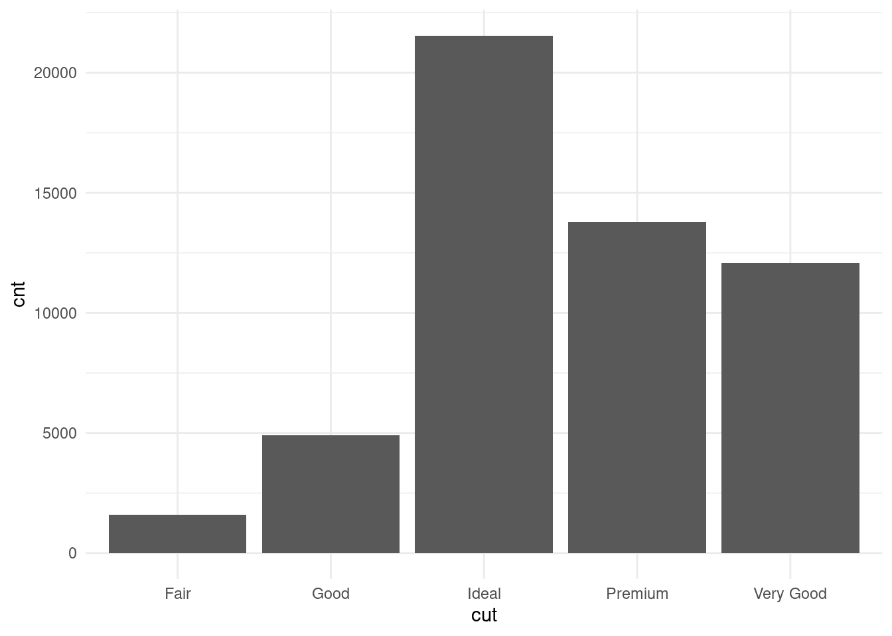

# 数据搬运 {#chap:data-transportation}

美团使用的大数据工具有很多，最常用的 Hive、Spark、Kylin、Impala、Presto 等，详见 <https://tech.meituan.com/2018/08/02/mt-r-practice.html>。下面主要介绍如何在 R 中连接 MySQL、Presto 和 Spark。

[sparklyr.flint](https://github.com/r-spark/sparklyr.flint) 支持 Spark 的时间序列库 [flint](https://github.com/twosigma/flint)，[sparkxgb](https://github.com/rstudio/sparkxgb) 为 Spark 上的 XGBoost 提供 R 接口，[sparkwarc](https://github.com/r-spark/sparkwarc) 支持加载 Web ARChive 文件到 Spark 里
[sparkavro](https://github.com/chezou/sparkavro) 支持从 Apache Avro (<https://avro.apache.org/>) 读取文件到 Spark 里，[sparkbq](https://github.com/miraisolutions/sparkbq) 是一个 sparkly 扩展包，集成 Google BigQuery 服务，[geospark](https://github.com/harryprince/geospark) 提供 GeoSpark 库的 R 接口，并且以 sf 的数据操作方式，[rsparkling](https://github.com/h2oai/sparkling-water/tree/master/r) H2O Sparkling Water 机器学习库的 R 接口。

Spark 性能优化，参考三篇博文

- [Spark在美团的实践](https://tech.meituan.com/2016/03/31/spark-in-meituan.html)
- [Spark性能优化指南——基础篇](https://tech.meituan.com/2016/04/29/spark-tuning-basic.html)
- [Spark性能优化指南——高级篇](https://tech.meituan.com/2016/05/12/spark-tuning-pro.html)

其他材料

- 朱俊晖收集的 Spark 资源列表 <https://github.com/harryprince/awesome-sparklyr>，推荐使用 sparklyr <https://github.com/sparklyr/sparklyr> 连接 Spark
- Spark 与 R 语言 <https://docs.microsoft.com/en-us/azure/databricks/spark/latest/sparkr/>
- Mastering Spark with R <https://therinspark.com/>

## Spark 与 R 语言 {#sec:spark-with-r}

### sparklyr {#subsec:sparklyr}

::: {.rmdwarn data-latex="{警告}"}
Spark 依赖特定版本的 Java、Hadoop，三者之间的版本应该要相融。
:::

在 MacOS 上配置 Java 环境，注意 Spark 仅支持 Java 8 至 11，所以安装指定版本的 Java 开发环境

```bash
# 安装 openjdk 11
brew install openjdk@11
# 全局设置 JDK 11
sudo ln -sfn /usr/local/opt/openjdk@11/libexec/openjdk.jdk /Library/Java/JavaVirtualMachines/openjdk-11.jdk
# Java 11 JDK 添加到 .zshrc 
export CPPFLAGS="-I/usr/local/opt/openjdk@11/include"
export PATH="/usr/local/opt/openjdk@11/bin:$PATH"
```

配置 R 环境，让 R 能够识别 Java 环境，再安装 **rJava** 包

```bash
# 配置
sudo R CMD javareconf
# 系统软件依赖
brew install pcre2
# 安装 rJava
Rscript -e 'install.packages("rJava", type="source")'
```

最后安装 **sparklyr** 包，以及 Spark 环境，可以借助 `spark_install()` 安装 Spark，比如下面 Spark 3.0 连同 hadoop 2.7 一起安装。


```r
install.packages('sparklyr')
sparklyr::spark_install(version = '3.0', hadoop_version = '2.7')
```

也可以先手动下载 Spark 软件环境，建议选择就近镜像站点下载，比如在北京选择清华站点
<https://mirrors.tuna.tsinghua.edu.cn/apache/spark/spark-3.0.1/spark-3.0.1-bin-hadoop2.7.tgz>，此环境自带 R 和 Python 接口。为了供 sparklyr 调用，先设置 `SPARK_HOME` 环境变量指向 Spark 安装位置，再连接单机版 Spark。


```r
# 排错 https://github.com/sparklyr/sparklyr/issues/2827
options(sparklyr.log.console = TRUE)
# 连接 Spark 
library(sparklyr)
library(ggplot2)
sc <- spark_connect(
  master = "local",
  # config = list(sparklyr.gateway.address = "127.0.0.1"),
  spark_home = Sys.getenv("SPARK_HOME")
)
# diamonds 数据集导入 Spark
diamonds_tbl <- copy_to(sc, ggplot2::diamonds, "diamonds")
```

做数据的聚合统计，有两种方式。一种是使用用 R 包 dplyr 提供的数据操作语法，下面以按 cut 分组统计钻石的数量为例，说明 dplyr 提供的数据操作方式。


```r
library(dplyr)
# 列出数据源下所有的表 tbls
src_tbls(sc)

diamonds_tbl <- diamonds_tbl %>%
  group_by(cut) %>%
  summarise(cnt = n()) %>%
  collect
```

另一种是使用结构化查询语言 SQL，这自不必说，大多数情况下，使用和一般的 SQL 没什么两样。


```r
library(DBI)
diamonds_preview <- dbGetQuery(sc, "SELECT count(*) as cnt, cut FROM diamonds GROUP BY cut")
diamonds_preview
```

```
##     cnt       cut
## 1 21551     Ideal
## 2 13791   Premium
## 3  4906      Good
## 4  1610      Fair
## 5 12082 Very Good
```

:::::: {.columns}
::: {.column width="47.5%" data-latex="{0.475\textwidth}"}


```r
# SQL 中的 AVG 和 R 中的 mean 函数是类似的
diamonds_price <- dbGetQuery(sc, "SELECT AVG(price) as mean_price, cut FROM diamonds GROUP BY cut")
diamonds_price
```

```
##   mean_price       cut
## 1   3457.542     Ideal
## 2   4584.258   Premium
## 3   3928.864      Good
## 4   4358.758      Fair
## 5   3981.760 Very Good
```

:::
::: {.column width="5%" data-latex="{0.05\textwidth}"}
\ 
<!-- an empty Div (with a white space), serving as
a column separator -->
:::
::: {.column width="47.5%" data-latex="{0.475\textwidth}"}


```r
library(ggplot2)
library(data.table)
diamonds <- as.data.table(diamonds)
diamonds[,.(mean_price = mean(price)), by = .(cut)]
```

```
##          cut mean_price
## 1:     Ideal   3457.542
## 2:   Premium   4584.258
## 3:      Good   3928.864
## 4: Very Good   3981.760
## 5:      Fair   4358.758
```

:::
::::::

将结果数据用 ggplot2 呈现出来


```r
ggplot(diamonds_preview, aes(cut, cnt)) +
  geom_col() +
  theme_minimal()
```



diamonds 数据集总共 53940 条数据，下面用 BUCKET 分桶抽样，将原数据随机分成 1000 个桶，取其中的一个桶，由于是随机分桶，所以每次的结果都不一样，解释详见<https://spark.apache.org/docs/latest/sql-ref-syntax-qry-select-sampling.html>


```r
diamonds_sample <- dbGetQuery(sc, "SELECT * FROM diamonds TABLESAMPLE (BUCKET 1 OUT OF 1000) LIMIT 6")
diamonds_sample
```

```
##   carat     cut color clarity depth table price    x    y    z
## 1  0.70   Ideal     G     VS2  62.7    54  3172 5.65 5.70 3.65
## 2  0.74   Ideal     D     VS2  62.2    56  3454 5.79 5.81 3.61
## 3  0.74   Ideal     F     VS1  61.9    54  3590 5.78 5.82 3.59
## 4  1.39 Premium     I      I1  62.6    57  3985 7.15 7.10 4.46
## 5  0.90 Premium     F     SI1  62.6    60  4103 6.11 6.06 3.81
## 6  0.91 Premium     G     VS2  59.5    58  4241 6.34 6.26 3.75
```

将抽样的结果用窗口函数 `RANK()` 排序，详见 <https://spark.apache.org/docs/latest/sql-ref-syntax-qry-select-window.html>

窗口函数 <https://www.cnblogs.com/ZackSun/p/9713435.html>


```r
diamonds_rank <- dbGetQuery(sc, "
  SELECT cut, price, RANK() OVER (PARTITION BY cut ORDER BY price) AS rank 
  FROM diamonds TABLESAMPLE (BUCKET 1 OUT OF 1000)
  LIMIT 6
")
diamonds_rank
```

```
##     cut price rank
## 1  Fair   960    1
## 2  Good  1801    1
## 3  Good  3768    2
## 4  Good  4761    3
## 5  Good 17447    4
## 6 Ideal   531    1
```

LATERAL VIEW 把一列拆成多行

<https://liam.page/2020/03/09/LATERAL-VIEW-in-Hive-SQL/>
<https://spark.apache.org/docs/latest/sql-ref-syntax-qry-select-lateral-view.html>

创建数据集


```r
# 先删除存在的表 person
dbGetQuery(sc, "DROP TABLE IF EXISTS person")
# 创建表 person
dbGetQuery(sc, "CREATE TABLE IF NOT EXISTS person (id INT, name STRING, age INT, class INT, address STRING)")
# 插入数据到表 person
dbGetQuery(sc, "
INSERT INTO person VALUES
    (100, 'John', 30, 1, 'Street 1'),
    (200, 'Mary', NULL, 1, 'Street 2'),
    (300, 'Mike', 80, 3, 'Street 3'),
    (400, 'Dan', 50, 4, 'Street 4')
")
```

查看数据集


```r
dbGetQuery(sc, "SELECT * FROM person")
```

```
##    id name age class  address
## 1 100 John  30     1 Street 1
## 2 200 Mary  NA     1 Street 2
## 3 300 Mike  80     3 Street 3
## 4 400  Dan  50     4 Street 4
```

行列转换 <https://www.cnblogs.com/kimbo/p/6208973.html>，LATERAL VIEW 展开


```r
dbGetQuery(sc,"
SELECT * FROM person
    LATERAL VIEW EXPLODE(ARRAY(30, 60)) tabelName AS c_age
    LATERAL VIEW EXPLODE(ARRAY(40, 80)) AS d_age
LIMIT 6
")
```

```
##    id name age class  address c_age d_age
## 1 100 John  30     1 Street 1    30    40
## 2 100 John  30     1 Street 1    30    80
## 3 100 John  30     1 Street 1    60    40
## 4 100 John  30     1 Street 1    60    80
## 5 200 Mary  NA     1 Street 2    30    40
## 6 200 Mary  NA     1 Street 2    30    80
```

日期相关的函数 <https://spark.apache.org/docs/latest/sql-ref-functions-builtin.html#date-and-timestamp-functions>


```r
# 今天
dbGetQuery(sc, "select current_date")
```

```
##   current_date()
## 1     2021-07-04
```

```r
# 昨天
dbGetQuery(sc, "select date_sub(current_date, 1)")
```

```
##   date_sub(current_date(), 1)
## 1                  2021-07-03
```

```r
# 本月最后一天 current_date 所属月份的最后一天
dbGetQuery(sc, "select last_day(current_date)")
```

```
##   last_day(current_date())
## 1               2021-07-31
```

```r
# 星期几
dbGetQuery(sc, "select dayofweek(current_date)")
```

```
##   dayofweek(current_date())
## 1                         1
```

最后，使用完记得关闭 Spark 连接


```r
spark_disconnect(sc)
```

### SparkR {#subsec:sparkr}

::: {.rmdnote data-latex="{注意}"}
考虑到和第\@ref(subsec:sparklyr)节的重合性，以及 sparklyr 的优势，本节代码都不会执行，仅作为补充信息予以描述。完整的介绍见 [SparkR 包](https://spark.apache.org/docs/latest/sparkr.html#running-sql-queries-from-sparkr)
:::

```r
if (nchar(Sys.getenv("SPARK_HOME")) < 1) {
  Sys.setenv(SPARK_HOME = "/opt/spark/spark-3.0.1-bin-hadoop2.7")
}
library(SparkR, lib.loc = c(file.path(Sys.getenv("SPARK_HOME"), "R", "lib")))
sparkR.session(master = "local[*]", sparkConfig = list(spark.driver.memory = "2g"))
```

::: {.rmdwarn data-latex="{警告}"}
**SparkR** 要求 Java 版本满足：大于等于8，而小于12，本地 MacOS 安装高版本，比如 oracle-jdk 16.0.1 会报不兼容的错误。

```
Spark package found in SPARK_HOME: /opt/spark/spark-3.1.1-bin-hadoop3.2
Error in checkJavaVersion() : 
  Java version, greater than or equal to 8 and less than 12, is required for this package; found version: 16.0.1
```
:::


`sparkConfig` 有哪些参数可以传递

| Property Name                   | Property group         | `spark-submit` equivalent |
| :------------------------------ | :--------------------- | :------------------------ |
| `spark.master`                  | Application Properties | `--master`                |
| `spark.kerberos.keytab`         | Application Properties | `--keytab`                |
| `spark.kerberos.principal`      | Application Properties | `--principal`             |
| `spark.driver.memory`           | Application Properties | `--driver-memory`         |
| `spark.driver.extraClassPath`   | Runtime Environment    | `--driver-class-path`     |
| `spark.driver.extraJavaOptions` | Runtime Environment    | `--driver-java-options`   |
| `spark.driver.extraLibraryPath` | Runtime Environment    | `--driver-library-path`   |

将 data.frame 转化为 SparkDataFrame

```r
faithful_sdf <- as.DataFrame(faithful)
```

SparkDataFrame

```r
head(faithful_sdf)
```

查看结构

```r
str(faithful_sdf)
```

## 数据库与 R 语言 {#sec:database-with-r}

[Presto](https://github.com/prestodb/presto) 的 R 接口 <https://github.com/prestodb/RPresto> 和文档 <https://prestodb.io/docs/current/index.html>，Presto 数据库


```r
install.packages('RPresto')
```

MySQL 为例介绍 odbc 的连接和使用，详见 [从 R 连接 MySQL](https://cosx.org/2020/06/connect-mysql-from-r/)


```sql
-- !preview conn=DBI::dbConnect(odbc::odbc(),  driver = "MariaDB", database = "demo", 
--                              uid = "root", pwd = "cloud", host = "localhost", port = 3306)

SELECT * FROM mtcars
LIMIT 10
```

我的系统已经安装了多款数据库的 ODBC 驱动

```bash
dnf install -y unixODBC unixODBC-devel mariadb mariadb-server mariadb-devel mariadb-connector-odbc
```

```r
odbc::odbcListDrivers()
```

```
# Driver from the mariadb-connector-odbc package
# Setup from the unixODBC package
[MariaDB]
Description     = ODBC for MariaDB
Driver          = /usr/lib/libmaodbc.so
Driver64        = /usr/lib64/libmaodbc.so
FileUsage       = 1
```

## 批量读取 csv 文件 {#sec:batch-import-csv}

iris 数据转化为 data.table 类型，按照 Species 分组拆成单独的 csv 文件，各个文件的文件名用鸢尾花的类别名表示


```r
# 批量分组导出
library(data.table)
as.data.table(iris)[, fwrite(.SD, paste0("data/user_", unique(Species), ".csv")), by = Species, .SDcols = colnames(iris)]
```

读取文件夹 `data/` 所有 csv 数据文件


```r
library(data.table)
merged_df <- do.call('rbind', lapply(list.files(pattern = "*.csv", path = "data/"), fread ) )
# 或者
merged_df <- rbindlist(lapply(list.files(pattern = "*.csv", path = "data/"), fread ))
```


```r
xdf$date <- as.Date(xdf$date)
xdf$ts <- as.POSIXct(as.numeric(xdf$ts), origin = "1978-01-01")
split(xdf[order(xdf$ts), ], interaction(xdf$study, xdf$port)) %>%
  lapply(function(.x) {
    .x[nrow(.x), ]
  }) %>%
  unname() %>%
  Filter(function(.x) {
    nrow(.x) > 0
  }, .) %>%
  do.call(rbind.data.frame, .)

library(dplyr)
xdf %>%
  mutate(
    date = as.Date(date),
    ts = anytime::anytime(as.numeric(ts))
  ) %>%
  arrange(ts) %>%
  group_by(study, port) %>%
  slice(n()) %>%
  ungroup()
```


```r
library(tibble)
library(magrittr)

mtcars <- tibble(mtcars)

mtcars %>% 
  print(n = 16, width = 69)
```

```
## # A tibble: 32 x 11
##      mpg   cyl  disp    hp  drat    wt  qsec    vs    am  gear  carb
##    <dbl> <dbl> <dbl> <dbl> <dbl> <dbl> <dbl> <dbl> <dbl> <dbl> <dbl>
##  1  21       6  160    110  3.9   2.62  16.5     0     1     4     4
##  2  21       6  160    110  3.9   2.88  17.0     0     1     4     4
##  3  22.8     4  108     93  3.85  2.32  18.6     1     1     4     1
##  4  21.4     6  258    110  3.08  3.22  19.4     1     0     3     1
##  5  18.7     8  360    175  3.15  3.44  17.0     0     0     3     2
##  6  18.1     6  225    105  2.76  3.46  20.2     1     0     3     1
##  7  14.3     8  360    245  3.21  3.57  15.8     0     0     3     4
##  8  24.4     4  147.    62  3.69  3.19  20       1     0     4     2
##  9  22.8     4  141.    95  3.92  3.15  22.9     1     0     4     2
## 10  19.2     6  168.   123  3.92  3.44  18.3     1     0     4     4
## 11  17.8     6  168.   123  3.92  3.44  18.9     1     0     4     4
## 12  16.4     8  276.   180  3.07  4.07  17.4     0     0     3     3
## 13  17.3     8  276.   180  3.07  3.73  17.6     0     0     3     3
## 14  15.2     8  276.   180  3.07  3.78  18       0     0     3     3
## 15  10.4     8  472    205  2.93  5.25  18.0     0     0     3     4
## 16  10.4     8  460    215  3     5.42  17.8     0     0     3     4
## # … with 16 more rows
```


```r
mtcars %>% 
  print(., n = nrow(.)/4)
```

```
## # A tibble: 32 x 11
##     mpg   cyl  disp    hp  drat    wt  qsec    vs    am  gear  carb
##   <dbl> <dbl> <dbl> <dbl> <dbl> <dbl> <dbl> <dbl> <dbl> <dbl> <dbl>
## 1  21       6  160    110  3.9   2.62  16.5     0     1     4     4
## 2  21       6  160    110  3.9   2.88  17.0     0     1     4     4
## 3  22.8     4  108     93  3.85  2.32  18.6     1     1     4     1
## 4  21.4     6  258    110  3.08  3.22  19.4     1     0     3     1
## 5  18.7     8  360    175  3.15  3.44  17.0     0     0     3     2
## 6  18.1     6  225    105  2.76  3.46  20.2     1     0     3     1
## 7  14.3     8  360    245  3.21  3.57  15.8     0     0     3     4
## 8  24.4     4  147.    62  3.69  3.19  20       1     0     4     2
## # … with 24 more rows
```

## 批量导出 xlsx 文件 {#sec:batch-export-xlsx}

将 R 环境中的数据集导出为 xlsx 表格


```r
## 加载 openxlsx 包
library(openxlsx)
## 创建空白的工作薄，标题为鸢尾花数据集
wb <- createWorkbook(title = "鸢尾花数据集")
## 添加 sheet 页
addWorksheet(wb, sheetName = "iris")
# 将数据写进 sheet 页
writeData(wb, sheet = "iris", x = iris, colNames = TRUE)
# 导出数据到本地
saveWorkbook(wb, file = "iris.xlsx", overwrite = TRUE)
```


```r
library(openxlsx)
xlsxFile <- system.file("extdata", "readTest.xlsx", package = "openxlsx")
# 导入
dat = read.xlsx(xlsxFile = xlsxFile)
# 导出
write.xlsx(dat, xlsxfile)
```
