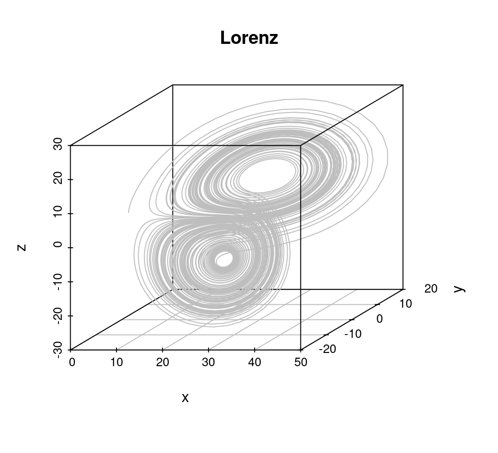
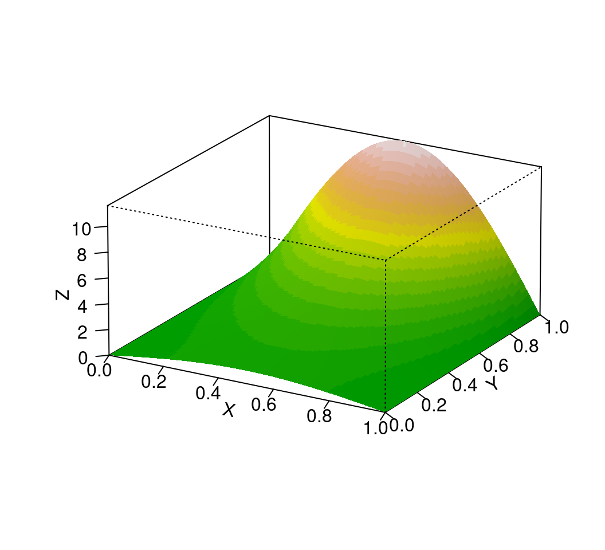

# 微分方程 {#chap-differential-equations}

<!-- 介绍洛伦兹方程、人口模型、寿险精算模型、混沌 -->


```r
library(deSolve)         # ODE 常微分方程
library(scatterplot3d)   # 三维曲线图

library(shape)
library(ReacTran)        # PDE 偏微分方程
library(PBSddesolve)     # DAE 延迟微分方程

library(nlme)              # 混合效应模型
# library(nlmeODE)         # ODE 应用于混合效应模型
# library(Sim.DiffProc)    # SDE 随机微分方程 种群 ODE 建模
# library(nlmixr)          # Population ODE modeling
```

[ode45 求解偏微分方程](https://blog.hamaluik.ca/posts/solving-systems-of-partial-differential-equations/)

**pracma** 实现了 ode23, ode23s, ode45 等几个自适应的 Runge-Kutta 求解器，**deSolve** 包求解 ODE（常微分方程）, DAE（微分代数方程）, DDE（延迟微分方程，包含刚性和非刚性方程）和 PDE（偏微分方程），**bvpSolve**包求解 DAE/ODE 方程的边值问题。**ReacTran** [@ReacTran2012] 可将偏微分方程转为常微分方程组，解决反应运输问题，在笛卡尔、极坐标、圆柱形和球形网格上离散偏微分方程。 [sundials](https://github.com/LLNL/sundials) 提供一系列非线性方程、常微分方程、微分代数方程求解器，Satyaprakash Nayak 开发了相应的 [**sundialr**](https://github.com/sn248/sundialr) 包。

## 常微分方程 {#sec-ordinary-differential-equations}

[洛伦兹系统](https://en.wikipedia.org/wiki/Lorenz_system)是一个常微分方程组，系统参数的默认值为 $(\sigma = 10, \rho = 28, \beta = 8/3)$，初值为 $(-13, -14, 47)$。

```{=tex}
\begin{equation*}
\left\{ 
  \begin{array}{l}
    \frac{\partial x}{\partial t} = \sigma (y - x) \\
    \frac{\partial y}{\partial t} = x(\rho -z) - y \\
    \frac{\partial x}{\partial t} = xy - \beta z
  \end{array} \right.
\end{equation*}
```

```r
library(deSolve)
# 参数
pars <- c(a = -8 / 3, b = -10, c = 28)
# 初值
state <- c(X = 1, Y = 1, Z = 1)
# 时间间隔
times <- seq(0, 100, by = 0.01)
# 定义方程组
lorenz_fun <- function(t, state, parameters) {
  with(as.list(c(state, parameters)), {
    dX <- a * X + Y * Z
    dY <- b * (Y - Z)
    dZ <- -X * Y + c * Y - Z
    list(c(dX, dY, dZ))
  })
}
out <- ode(
  y = state, times = times,
  func = lorenz_fun, parms = pars
)
```

调用 **scatterplot3d** 绘制三维曲线图，如图\@ref(fig:ode-lorenz) 所示


```r
library(scatterplot3d)

scatterplot3d(
  x = out[, "X"], y = out[, "Y"], z = out[, "Z"],
  col.axis = "black", type = "l", color = "gray",
  xlab = expression(x), ylab = expression(y), zlab = expression(z),
  col.grid = "gray", main = "Lorenz"
)
```

<div class="figure" style="text-align: center">

<p class="caption">(\#fig:ode-lorenz)洛伦兹曲线</p>
</div>

## 偏微分方程 {#sec-partial-differential-equations}

ReacTran 的几个关键函数介绍

一维热传导方程

```{=tex}
\begin{equation*}
\left\{ 
  \begin{array}{l}
    \frac{\partial y}{\partial t} = D \frac{\partial^2 y}{\partial x^2}
  \end{array} \right.
\end{equation*}
```

参数 $D = 0.01$，边界条件 $y_{t,x=0} = 0, y_{t, x = 1} = 1$，初始条件 $y_{t=0,x} = \sin(\pi x)$。


```r
library(ReacTran)

N <- 100
xgrid <- setup.grid.1D(x.up = 0, x.down = 1, N = N)
x <- xgrid$x.mid
D.coeff <- 0.01
Diffusion <- function(t, Y, parms) {
  tran <- tran.1D(
    C = Y, C.up = 0, C.down = 1,
    D = D.coeff, dx = xgrid
  )
  list(
    dY = tran$dC, 
    flux.up = tran$flux.up,
    flux.down = tran$flux.down
  )
}
yini <- sin(pi * x)
times <- seq(from = 0, to = 5, by = 0.01)
out <- ode.1D(
  y = yini, times = times, func = Diffusion,
  parms = NULL, dimens = N
)
```


```r
image(out,
  grid = xgrid$x.mid, xlab = "times",
  ylab = "Distance", main = "PDE", add.contour = TRUE
)
```

<div class="figure" style="text-align: center">

<p class="caption">(\#fig:pde-1d)一维热传导方程的数值解热力图</p>
</div>

二维拉普拉斯方程

```{=tex}
\begin{equation*}
\left\{ 
  \begin{array}{l}
    \frac{\partial^2 u}{\partial^2 x} + \frac{\partial^2 u}{\partial y^2} = 0
  \end{array} \right.
\end{equation*}
```

边界条件

```{=tex}
\begin{equation*}
\left\{ 
  \begin{array}{l}
    u_{x=0,y} = u_{x=1,y} = 0 \\
    \frac{\partial u_{x, y=0}}{\partial y} = 0 \\
    \frac{\partial u_{x,y=1}}{\partial y} = \pi\sinh(\pi)\sin(\pi x)
  \end{array} \right.
\end{equation*}
```

它有解析解

$$
u(x,y) = \sin(\pi x)\cosh(\pi y)
$$

其中 $x \in [0,1], y\in [0,1]$


```r
fn <- function(x, y) {
  sin(pi * x) * cosh(pi * y)
}
x <- seq(0, 1, length.out = 101)
y <- seq(0, 1, length.out = 101)
z <- outer(x, y, fn)
```


```r
image(z, col = terrain.colors(20))
contour(z, method = "flattest", add = TRUE, lty = 1)
```

<div class="figure" style="text-align: center">

<p class="caption">(\#fig:laplace-eq-image)解析解的二维图像</p>
</div>


```r
persp(z, 
  theta = 30, phi = 20, 
  r = 50, d = 0.1, expand = 0.5, ltheta = 90, lphi = 180,
  shade = 0.1, ticktype = "detailed", nticks = 5, box = TRUE,
  col = drapecol(z, col = terrain.colors(20)),
  border = "transparent",
  xlab = "X", ylab = "Y", zlab = "Z", 
  main = ""
)
```

<div class="figure" style="text-align: center">

<p class="caption">(\#fig:laplace-eq-persp)解析解的三维透视图像</p>
</div>

求解 PDE


```r
dx <- 0.2
xgrid <- setup.grid.1D(-100, 100, dx.1 = dx)
x <- xgrid$x.mid
N <- xgrid$N

uini <- exp(-0.05 * x^2)
vini <- rep(0, N)
yini <- c(uini, vini)
times <- seq(from = 0, to = 50, by = 1)

wave <- function(t, y, parms) {
  u1 <- y[1:N]
  u2 <- y[-(1:N)]
  du1 <- u2
  du2 <- tran.1D(C = u1, C.up = 0, C.down = 0, D = 1, dx = xgrid)$dC
  return(list(c(du1, du2)))
}

out <- ode.1D(
  func = wave, y = yini, times = times, parms = NULL,
  nspec = 2, method = "ode45", dimens = N, names = c("u", "v")
)
```

## 延迟微分方程 {#sec-delay-differential-equations}


```r
library(PBSddesolve)    # DAE 延迟微分方程
```

[**PBSddesolve**](https://github.com/pbs-software/pbs-ddesolve) [@PBSddesolve] **PBSmodelling** **PBSmapping**

**nlmeODE** 通过微分方程整合用于混合效应模型的 odesolve 和 nlme 包。

## 随机微分方程 {#sec-stochastic-differential-equations}

[Sim.DiffProc](https://github.com/acguidoum/Sim.DiffProc)

[随机微分方程入门：基于 R 语言的模拟和推断](https://uploads.cosx.org/2008/12/stochastic-differential-equation-with-r.pdf)


```r
# library(Sim.DiffProc)
```

[nlmixr](https://github.com/nlmixrdevelopment/nlmixr) 借助 [RxODE](https://github.com/nlmixrdevelopment/RxODE/) 求解基于常微分方程的非线性混合效应模型
