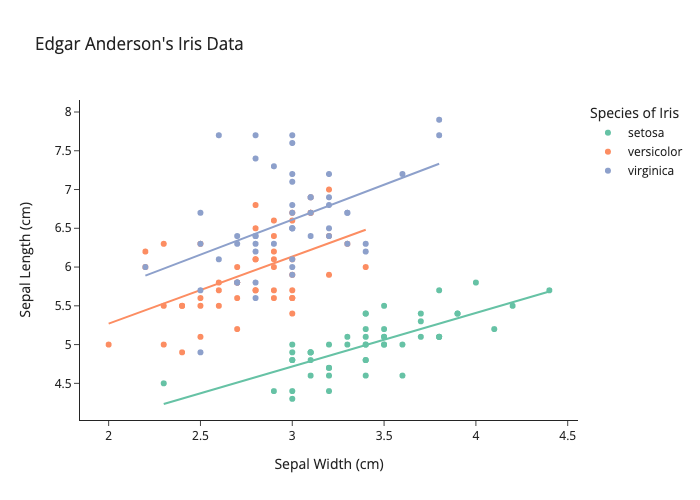

# 文档元素 {#chap-document-elements}


```r
library(knitr)
library(nomnoml)
library(magrittr)
library(rmarkdown)
```

knitr 将 R Markdown 文件转化为 Markdown 文件， Pandoc 可以将 Markdown 文件转化为 HTML5、Word、PowerPoint 和 PDF 等文档格式。

\begin{figure}

{\centering \href{https://www.ardata.fr/img/illustrations}{\includegraphics[width=0.15\linewidth,height=0.15\textheight]{images/html5} }\href{https://www.ardata.fr/img/illustrations}{\includegraphics[width=0.15\linewidth,height=0.15\textheight]{images/word} }\href{https://www.ardata.fr/img/illustrations}{\includegraphics[width=0.15\linewidth,height=0.15\textheight]{images/powerpoint} }\href{https://www.ardata.fr/img/illustrations}{\includegraphics[width=0.15\linewidth,height=0.15\textheight]{images/pdf} }

}

\caption{rmarkdown 支持的输出格式}(\#fig:rmarkdown-output)
\end{figure}

rmarkdown 自 2014年09月17日在 CRAN 上发布第一个正式版本以来，逐渐形成了一个强大的生态系统，世界各地的开发者贡献各种各样的扩展功能，见图 \@ref(fig:rmarkdown-ecosystem)

\begin{figure}

{\centering \includegraphics{document-elements_files/figure-latex/rmarkdown-ecosystem-1} 

}

\caption{rmarkdown 生态系统}(\#fig:rmarkdown-ecosystem)
\end{figure}


\begin{figure}

{\centering \includegraphics[width=0.75\linewidth]{diagrams/rmarkdown} 

}

\caption{R Markdown 概念图}(\#fig:rmarkdown-concept-map)
\end{figure}

## 控制选项 {#sec-sql-engine}

[Using SQL in RStudio](https://irene.rbind.io/post/using-sql-in-rstudio/)


```r
library(DBI)
conn <- DBI::dbConnect(RSQLite::SQLite(),
  dbname = system.file("db", "datasets.sqlite", package = "RSQLite")
)
```

Base R 内置的数据集都整合进 RSQLite 的样例数据库里了，


```r
dbListTables(conn)
```

```
##  [1] "BOD"              "CO2"              "ChickWeight"      "DNase"           
##  [5] "Formaldehyde"     "Indometh"         "InsectSprays"     "LifeCycleSavings"
##  [9] "Loblolly"         "Orange"           "OrchardSprays"    "PlantGrowth"     
## [13] "Puromycin"        "Theoph"           "ToothGrowth"      "USArrests"       
## [17] "USJudgeRatings"   "airquality"       "anscombe"         "attenu"          
## [21] "attitude"         "cars"             "chickwts"         "esoph"           
## [25] "faithful"         "freeny"           "infert"           "iris"            
## [29] "longley"          "morley"           "mtcars"           "npk"             
## [33] "pressure"         "quakes"           "randu"            "rock"            
## [37] "sleep"            "stackloss"        "swiss"            "trees"           
## [41] "warpbreaks"       "women"
```

随意选择 5 行数据记录，将结果保存到变量 iris_preview


```sql
SELECT * FROM iris LIMIT 5;
```

查看变量 iris_preview 的内容


```r
iris_preview
```

```
##   Sepal.Length Sepal.Width Petal.Length Petal.Width Species
## 1          5.1         3.5          1.4         0.2  setosa
## 2          4.9         3.0          1.4         0.2  setosa
## 3          4.7         3.2          1.3         0.2  setosa
## 4          4.6         3.1          1.5         0.2  setosa
## 5          5.0         3.6          1.4         0.2  setosa
```

结束后关闭连接


```r
dbDisconnect(conn = conn)
```

## Markdown {#markdown}

Markdown 为核心，Pandoc's Markdown 和 R Markdown 仅介绍扩展的功能，三剑客 Markdown & Pandoc's Markdown & R Markdown，[Markdown for scientific writing](https://github.com/scholmd/scholmd/wiki)

首先介绍 Markdown 在强调、标题、列表、断行、链接、图片、引用、代码块、LaTeX 公式等使用方式，然后在 Markdown 的基础上介绍 Pandoc's Markdown 功能有加强的地方，R Markdown 在 Pandoc's Markdown 的基础上介绍功能有加强的地方。

Markdown 基础语法见 RStudio IDE 自带的 Markdown 手册：RStudio 顶部菜单栏 -> Help -> Markdown Quick Reference，这里主要介绍一下Markdown 高级语法，特别是 [Pandoc's Markdown](https://pandoc.org/MANUAL.html#pandocs-markdown)，其实是 Pandoc 提供了很多对 Markdown 的扩展支持，下面介绍一下被 Pandoc 加强后的 Markdown 表格、图片和公式的使用

### 列表 {#markdown-list}

- 有序的列表
  1. 第一条
  1. 第二条

- 无序的列表
  - 第一条
  - 第二条

  * here is my first
    list item.
  * and my second.

- 嵌套的列表

  1. 有序
  2. Item 2
  3. Item 3
      + Item 3a
      + Item 3b

  * 无序
  * Item 2
      + Item 2a
      + Item 2b

定义型列表中包含代码

Term 1

:   Definition 1

Term 2 with *inline markup*

:   Definition 2

        { some code, part of Definition 2 }

    Third paragraph of definition 2.

定义类型的列表，紧凑形式

Term 1
  ~ Definition 1

Term 2
  ~ Definition 2a
  ~ Definition 2b
  

无序列表

* fruits
  + apples
    - macintosh
    - red delicious
  + pears
  + peaches
* vegetables
  + broccoli
  + chard


对应  LaTeX 列表环境里的有序环境，通篇计数

(@)  My first example will be numbered (1).
(@)  My second example will be numbered (2).

Explanation of examples.

(@)  My third example will be numbered (3).

`(@)` 环境可以引用

(@good)  这是一个好例子

正如 (@good) 所指出的那样，


列表里包含代码块

-   item one
-   item two

<!-- end of list -->

    { my code block }

显示反引号 `` ` ``


### 引用 {#markdown-quote}

注意在引用末尾空两格，出处另起一行，引用名人名言:

> It's always better to give than to receive.  


> Trellis graphics are a bit like hash functions: 
> you can be close to the target, but get a far-off result.[^lattice-panel]
>
> --- Dieter Menne

[^lattice-panel]: (about problems with creating a suitable lattice panel function) R-help (August 2008)

> If you imagine that this pen is Trellis, then Lattice is not this pen.[^lattice-pen]
>
> --- Paul Murrell

[^lattice-pen]: (on the difference of Lattice (which eventually was called grid) and Trellis) DSC 2001, Wien (March 2001)

> You're overlooking something like line 800 of the documentation for xyplot. [...] 
> It's probably in the R-FAQ as well, 
> since my original feeling was that this behaviour was chosen 
> in order to confuse people and see how many people read the FAQ... :) [^xyplot]
>
> --- Barry Rowlingson 

[^xyplot]: (about the fact that lattice objects have to be print()ed) R-help (May 2005)

### 表格 {#markdown-table}

插入表格很简单的，复杂的表格制作可以借助 R 包 knitr 提供的 kable 函数以及 kableExtra 包^[<https://xiangyunhuang.github.io/bookdown-kableExtra/>]，此外谢益辉的书籍 [bookdown: Authoring Books and Technical Documents with R Markdown](https://bookdown.org/yihui/bookdown/) 中也有一节专门介绍表格 <https://bookdown.org/yihui/bookdown/tables.html>

`kable` 支持多个表格并排，


```r
knitr::kable(
  list(
    head(iris[, 1:2], 3),
    head(mtcars[, 1:3], 5)
  ),
  caption = 'A Tale of Two Tables.', booktabs = TRUE
)
```

\begin{table}
\caption{(\#tab:table-multi)A Tale of Two Tables.}

\centering
\begin{tabular}[t]{rr}
\toprule
Sepal.Length & Sepal.Width\\
\midrule
5.1 & 3.5\\
4.9 & 3.0\\
4.7 & 3.2\\
\bottomrule
\end{tabular}
\centering
\begin{tabular}[t]{lrrr}
\toprule
  & mpg & cyl & disp\\
\midrule
Mazda RX4 & 21.0 & 6 & 160\\
Mazda RX4 Wag & 21.0 & 6 & 160\\
Datsun 710 & 22.8 & 4 & 108\\
Hornet 4 Drive & 21.4 & 6 & 258\\
Hornet Sportabout & 18.7 & 8 & 360\\
\bottomrule
\end{tabular}
\end{table}

在表格中引入数学符号

[kableExtra](https://github.com/haozhu233/kableExtra) 、broom 和 [pixiedust](https://github.com/nutterb/pixiedust) 包实现表格样式的精细调整，如黄湘云制作的 [样例](https://xiangyunhuang.github.io/bookdown-kableExtra/) 


### 图片 {#image}

利用 `knitr::include_graphics` 函数在代码块中插入图片是很简单的，如图\@ref(fig:knitr-footnote)所示，图、表的标题很长或者需要插入脚注，可以使用[文本引用][text-references]

\begin{figure}

{\centering \includegraphics[width=0.45\linewidth]{/opt/R/4.1.2/lib/R/library/graphics/help/figures/mai} 

}

\caption{(ref:footnote)}(\#fig:knitr-footnote)
\end{figure}


```r
par(mar = c(4.1, 4.1, 0.5, 0.5))
plot(rnorm(10), xlab = "", ylab = "")
```

\begin{figure}

{\centering \includegraphics[height=4in]{document-elements_files/figure-latex/unnamed-chunk-7-1} 

}

\caption{(ref:fig-cap)}(\#fig:unnamed-chunk-7)
\end{figure}

控制图片插入的宽度参考谢益辉的博客： CSS 的位置属性以及如何居中对齐超宽元素 https://yihui.name/cn/2018/05/css-position/

-   One

-   Two

     { width=25% }

-   Three


根据代码动态生成图片，并插入文档中；外部图片插入文档中


```r
plot(AirPassengers)
```

\begin{figure}

{\centering \includegraphics{document-elements_files/figure-latex/air-passengers-1} 

}

\caption{时间序列图}(\#fig:air-passengers)
\end{figure}


```r
plot(pressure)
plot(AirPassengers)
```

\begin{figure}

{\centering \subfloat[压力与温度的关系(\#fig:two-rows-1)]{\includegraphics{document-elements_files/figure-latex/two-rows-1} }\\\subfloat[时间序列图(\#fig:two-rows-2)]{\includegraphics{document-elements_files/figure-latex/two-rows-2} }

}

\caption{2行1列布局}(\#fig:two-rows)
\end{figure}


```r
plot(pressure)
plot(AirPassengers)
```

\begin{figure}

{\centering \subfloat[压力与温度的关系(\#fig:two-cols-1)]{\includegraphics[width=0.35\linewidth]{document-elements_files/figure-latex/two-cols-1} }\subfloat[时间序列图(\#fig:two-cols-2)]{\includegraphics[width=0.35\linewidth]{document-elements_files/figure-latex/two-cols-2} }

}

\caption{1行2列布局}(\#fig:two-cols)
\end{figure}


```r
plot(pressure)
plot(AirPassengers)
plot(pressure)
plot(AirPassengers)
```

\begin{figure}

{\centering \subfloat[压力与温度的关系(\#fig:two-rows-two-cols-1)]{\includegraphics[width=0.35\linewidth]{document-elements_files/figure-latex/two-rows-two-cols-1} }\subfloat[压力与温度的关系(\#fig:two-rows-two-cols-2)]{\includegraphics[width=0.35\linewidth]{document-elements_files/figure-latex/two-rows-two-cols-2} }\\\subfloat[压力与温度的关系(\#fig:two-rows-two-cols-3)]{\includegraphics[width=0.35\linewidth]{document-elements_files/figure-latex/two-rows-two-cols-3} }\subfloat[压力与温度的关系(\#fig:two-rows-two-cols-4)]{\includegraphics[width=0.35\linewidth]{document-elements_files/figure-latex/two-rows-two-cols-4} }

}

\caption{2x2图布局}(\#fig:two-rows-two-cols)
\end{figure}

(ref:fig-cap) 测试文本引用
(ref:text-references) 图表标题很长可使用[文本引用][text-references] 
(ref:footnote) 表格标题里插入脚注，但是 ebooks 不支持这样插入脚注[^longnote]
[^longnote]: Here's one with multiple blocks.
[text-references]: https://bookdown.org/yihui/bookdown/markdown-extensions-by-bookdown.html#text-references

### 公式 {#markdown-math}

行内公式一对美元符号 $\alpha$ 或者 \(\alpha+\beta\)，行间公式 $$\alpha$$ 或者 \[\alpha + \beta\] 对公式编号，如公式 \@ref(eq:likelihood)

\begin{equation}
L(\beta,\boldsymbol{\theta}) = f(y;\beta,\boldsymbol{\theta}) = \int_{\mathbb{R}^{n}}N(t;D\beta,\Sigma(\boldsymbol{\theta}))f(y|t)dt (\#eq:likelihood)
\end{equation}

多行公式分别编号，如公式\@ref(eq:BL-SGLMM) 和公式\@ref(eq:Poss-SGLMM) 

\begin{align}
\log\{\frac{p_i}{1-p_i}\} & = T_{i} = d(x_i)'\beta + S(x_i) + Z_i (\#eq:BL-SGLMM)\\
\log(\lambda_i)           & = T_{i} = d(x_i)'\beta + S(x_i) + Z_i (\#eq:Poss-SGLMM)
\end{align}

多行公式中对某一（些）行编号，如公式 \@ref(eq:align) 和 公式 \@ref(eq:Poss-SGLMM2)

\begin{align} 
g(X_{n}) &= g(\theta)+g'({\tilde{\theta}})(X_{n}-\theta) \\
\sqrt{n}[g(X_{n})-g(\theta)] &= g'\left({\tilde{\theta}}\right) 
  \sqrt{n}[X_{n}-\theta ] (\#eq:align) \\
\log(\lambda_i)  & = T_{i} = d(x_i)'\beta + S(x_i) + Z_i (\#eq:Poss-SGLMM2)  
\end{align} 

多行公式共用一个编号，如公式 \@ref(eq:likelihood2)

\begin{equation}
\begin{aligned}
L(\beta,\boldsymbol{\theta})
& = \int_{\mathbb{R}^{n}} \frac{N(t;D\beta,\Sigma(\boldsymbol{\theta}))f(y|t)}{N(t;D\beta_{0},\Sigma(\boldsymbol{\theta}_{0}))f(y|t)}f(y,t)dt\\
& \varpropto \int_{\mathbb{R}^{n}} \frac{N(t;D\beta,\Sigma(\boldsymbol{\theta}))}{N(t;D\beta_{0},\Sigma(\boldsymbol{\theta}_{0}))}f(t|y)dt \\
&= E_{T|y}\left[\frac{N(t;D\beta,\Sigma(\boldsymbol{\theta}))}{N(t;D\beta_{0},\Sigma(\boldsymbol{\theta}_{0}))}\right] 
\end{aligned}
(\#eq:likelihood2)
\end{equation}

推荐在 `equation` 公式中，使用 `split` 环境，意思是一个公式很长，需要拆成多行，如公式\@ref(eq:var-beta)

\begin{equation} 
\begin{split}
\mathrm{Var}(\hat{\beta}) & =\mathrm{Var}((X'X)^{-1}X'y)\\
 & =(X'X)^{-1}X'\mathrm{Var}(y)((X'X)^{-1}X')'\\
 & =(X'X)^{-1}X'\mathrm{Var}(y)X(X'X)^{-1}\\
 & =(X'X)^{-1}X'\sigma^{2}IX(X'X)^{-1}\\
 & =(X'X)^{-1}\sigma^{2}
\end{split}
(\#eq:var-beta)
\end{equation} 

注意，`\mathbf` 只对字母 $a,b,c,A,B,C$ 加粗，mathjax 不支持公式中使用 `\bm` 对 $\theta,\alpha,\beta,\ldots,\gamma$ 加粗，应该使用 `\boldsymbol`

## 表格 {#sec-rmarkdown-table}

**knitr** 的 `kable()` 函数提供了制作表格的基本功能 <https://bookdown.org/yihui/rmarkdown-cookbook/tables.html>，[flextable](https://github.com/davidgohel/flextable) 支持更加细粒度的表格定制功能。[beautifyR](https://github.com/mwip/beautifyR) 整理 Markdown 表格非常方便，[datapasta](https://github.com/MilesMcBain/datapasta) 快速复制粘贴 data.frame 和 tibble 类型的数据表格。[rpivotTable](https://github.com/smartinsightsfromdata/rpivotTable) 不更新了，[pivottabler](https://github.com/cbailiss/pivottabler) 在更新，内容似乎更好。[remedy](https://github.com/ThinkR-open/remedy) 提供了更加通用的 Markdown 写作功能，简化创作的技术难度。

## 流程图 {#sec-rmarkdown-uml}

[nomnoml](https://github.com/rstudio/nomnoml) 流程图、思维导图


```r
nomnoml::nomnoml(" 
#stroke: #26A63A
#.box: fill=#8f8 dashed visual=note
#direction: down

[Sweave-test-1.Rnw] -> utils::Sweave() [Sweave-test-1.tex|Sweave-test-1-006.pdf|Sweave-test-1-007.pdf]
[Sweave-test-1.Rnw] -> utils::Stangle() [Sweave-test-1.R]
[Sweave-test-1.tex] -> tools::texi2pdf() [Sweave-test-1.pdf]
[Sweave-test-1.tex] -> tools::texi2dvi() [Sweave-test-1.dvi]
")
```


\begin{center}\includegraphics{document-elements_files/figure-latex/unnamed-chunk-8-1} \end{center}


## 编程语言引擎 {#sec-eng}

语法高亮


```
## Warning in matrix(names(knitr::knit_engines$get()), ncol = 3, byrow = TRUE):
## data length [61] is not a sub-multiple or multiple of the number of rows [21]
```

\begin{table}

\caption{(\#tab:knitr-engine)knitr 支持的引擎}
\centering
\begin{tabular}[t]{l|l|l}
\hline
awk & bash & coffee\\
\hline
gawk & groovy & haskell\\
\hline
lein & mysql & node\\
\hline
octave & perl & psql\\
\hline
Rscript & ruby & sas\\
\hline
scala & sed & sh\\
\hline
stata & zsh & asis\\
\hline
asy & block & block2\\
\hline
bslib & c & cat\\
\hline
cc & comment & css\\
\hline
dot & embed & fortran\\
\hline
fortran95 & go & highlight\\
\hline
js & julia & python\\
\hline
R & Rcpp & sass\\
\hline
scss & sql & stan\\
\hline
targets & tikz & verbatim\\
\hline
theorem & lemma & corollary\\
\hline
proposition & conjecture & definition\\
\hline
example & exercise & hypothesis\\
\hline
proof & remark & solution\\
\hline
nomnoml & awk & bash\\
\hline
\end{tabular}
\end{table}

Pandoc 通过 LaTeX 环境 lstlisting 支持语法高亮，比如

\begin{table}

\caption{(\#tab:pandoc-lang)Pandoc 支持的语法高亮}
\centering
\begin{tabular}[t]{l|l|l|l|l|l|l}
\hline
ABAP & IDL & Plasm & ACSL & inform & POV & Ada\\
\hline
Java & Prolog & Algol & JVMIS & Promela & Ant & ksh\\
\hline
Python & Assembler & Lisp & R & Awk & Logo & Reduce\\
\hline
bash & make & Rexx & Basic & Mathematica & RSL & C\\
\hline
Matlab & Ruby & C++ & Mercury & S & Caml & MetaPost\\
\hline
SAS & Clean & Miranda & Scilab & Cobol & Mizar & sh\\
\hline
Comal & ML & SHELXL & csh & Modula-2 & Simula & Delphi\\
\hline
MuPAD & SQL & Eiffel & NASTRAN & tcl & Elan & Oberon-2\\
\hline
TeX & erlang & OCL & VBScript & Euphoria & Octave & Verilog\\
\hline
Fortran & Oz & VHDL & GCL & Pascal & VRML & Gnuplot\\
\hline
Perl & XML & Haskell & PHP & XSLT & HTML & PL/I\\
\hline
\end{tabular}
\end{table}

## 快速创建书籍项目 {#sec-bookdown-skeleton}

在指定目录创建 Book 项目


```r
bookdown:::bookdown_skeleton("~/bookdown-demo")
```

项目根目录的文件列表

```md
directory/
├──  index.Rmd
├── 01-intro.Rmd
├── 02-literature.Rmd
├── 03-method.Rmd
├── 04-application.Rmd
├── 05-summary.Rmd
├── 06-references.Rmd
├── _bookdown.yml
├── _output.yml
├──  book.bib
├──  preamble.tex
├──  README.md
└──  style.css
```

## Markdown 生态系统 {#markdown-ecosystem}

大量基于 Markdown 的软件工具，比如 Wiki Gollum、 Typora 和 VS Code 等

Pandoc's Markdown 在 Markdown 的基础上添加的功能

## R Markdown 生态系统  {#rmarkdown-ecosystem}

R Markdown 站在巨人的肩膀上，这些巨人有 [Markdown](https://daringfireball.net/projects/markdown/)、 [Pandoc](http://pandoc.org) 和 [LaTeX](https://www.latex-project.org/) 等。 

markdown 简洁设计哲学， Sweave 文学编程思想，期间各种工具粉墨登场，最后分别回到 Pandoc 和 R Markdown


Table: (\#tab:rmarkdown-eco)R Markdown 生态系统

Package              Title                                                                 
-------------------  ----------------------------------------------------------------------
**addinsOutline**    RStudio Addins for Show Outline of a R Markdown/LaTeX Project         
**blogdown**         Create Blogs and Websites with R Markdown                             
**bookdown**         Authoring Books and Technical Documents with R Markdown               
**bsplus**           Adds Functionality to the R Markdown + Shiny Bootstrap Framework      
**chronicle**        Grammar for Creating R Markdown Reports                               
**distill**          R Markdown Format for Scientific and Technical Writing                
**flexdashboard**    R Markdown Format for Flexible Dashboards                             
**govdown**          GOV.UK Style Templates for R Markdown                                 
**jds.rmd**          R Markdown Templates for Journal of Data Science                      
**komaletter**       Simply Beautiful PDF Letters from Markdown                            
**liftr**            Containerize R Markdown Documents for Continuous Reproducibility      
**mailmerge**        Mail Merge Using R Markdown Documents and 'gmailr'                    
**memoiR**           R Markdown and Bookdown Templates to Publish Documents                
**memor**            A rmarkdown Template that Can be Highly Customized                    
**officedown**       Enhanced R Markdown Format for 'Word' and 'PowerPoint'                
**pagedown**         Paginate the HTML Output of R Markdown with CSS for Print             
**parsermd**         Formal Parser and Related Tools for R Markdown Documents              
**posterdown**       Generate PDF Conference Posters Using R Markdown                      
**prereg**           R Markdown Templates to Preregister Scientific Studies                
**prettydoc**        Creating Pretty Documents from R Markdown                             
**quarto**           R Interface to 'Quarto' Markdown Publishing System                    
**reportfactory**    Lightweight Infrastructure for Handling Multiple R Markdown Documents 
**revealjs**         R Markdown Format for reveal.js Presentations                         
**rmdfiltr**         Lua-Filters for R Markdown                                            
**rmdformats**       HTML Output Formats and Templates for rmarkdown Documents             
**rmdplugr**         Plugins for R Markdown Formats                                        
**rmdshower**        R Markdown Format for shower Presentations                            
**rticles**          Article Formats for R Markdown                                        
**siteymlgen**       Automatically Generate _site.yml File for R Markdown                  
**stevetemplates**   Steve's R Markdown Templates                                          
**tufte**            Tufte's Styles for R Markdown Documents                               
**tufterhandout**    Tufte-style html document format for rmarkdown                        
**uiucthemes**       R Markdown Themes for UIUC Documents and Presentations                
**vitae**            Curriculum Vitae for R Markdown                                       
**webexercises**     Create Interactive Web Exercises in R Markdown (Formerly 'webex')     
**ymlthis**          Write YAML for R Markdown, bookdown, blogdown, and More               

## 支持网页图形 {#sec-web-graphics}


```r
library(ggplot2)
p1 <- ggplot(data = iris, aes(x = Sepal.Length, y = Sepal.Width, color = Species)) +
  geom_point() +
  theme_minimal()

p2 <- ggplot(data = iris, aes(x = Petal.Length, y = Petal.Width, color = Species)) +
  geom_point() +
  theme_minimal()

library(patchwork)
p1 + p2
```

\begin{figure}

{\centering \includegraphics{document-elements_files/figure-latex/iris-ggplot2-1} 

}

\caption{组合 ggplot2 图形}(\#fig:iris-ggplot2)
\end{figure}

ggiraph 将 ggplot 对象转化为网页


```r
library(ggiraph)
girafe(code = print(p1 + p2), width_svg = 8, height_svg = 3)
```

## 支持 Shiny App {#sec-load-shiny-app}

将动态图形嵌入 Shiny App 中

\begin{figure}

{\centering \href{https://xiangyun.shinyapps.io/01-iris-ggiraph/}{\includegraphics{document-elements_files/figure-latex/iris-ggiraph-shiny-1} }

}

\caption{A Shiny app created via the ggiraph package; you can see a live version at https://xiangyun.shinyapps.io/01-iris-ggiraph/.}(\#fig:iris-ggiraph-shiny)
\end{figure}

