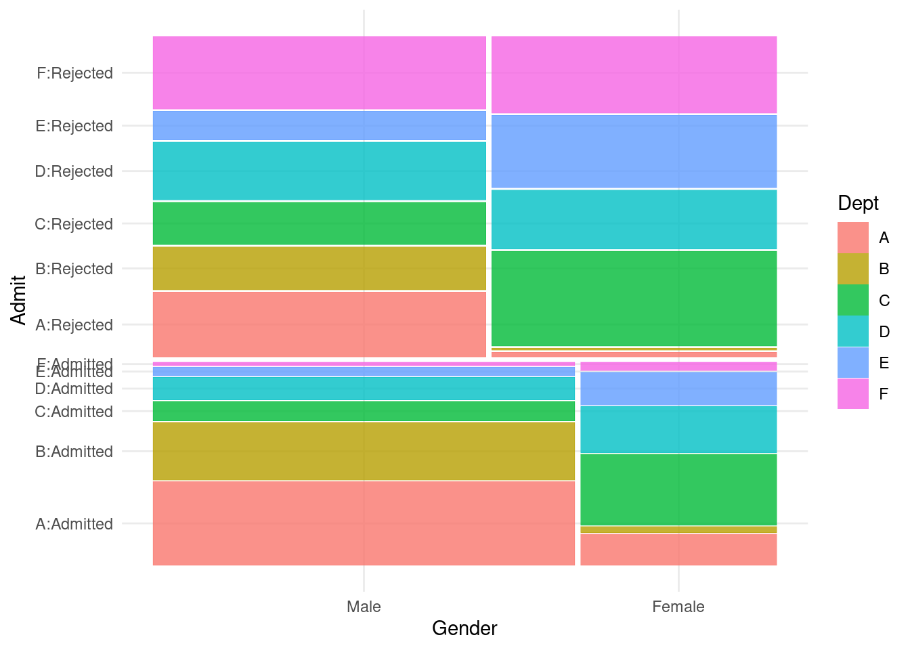

# 假设检验 {#chap:hypothesis-test}


> The Earth is Round ($p < 0.05$)
> 
> --- Jacob Cohen [@Cohen_1994_Earth]


```r
x = seq(from = -4, to = 8, length.out = 193)
y1 = dnorm(x, mean = 3, sd = 1) 
y2 = dnorm(x, mean = 2, sd = 1.5)
library(magrittr)
hline <- function(y = 0, color = "red") {
  list(
    type = "line", 
    x0 = 0, 
    x1 = 1, 
    xref = "paper",
    y0 = y, 
    y1 = y, 
    line = list(color = color, dash = 'dash', width = .5)
  )
}

vline <- function(x = 0, color = "red") {
  list(
    type = "line", 
    x0 = x, 
    x1 = x, 
    yref = "paper",
    y0 = 0, 
    y1 = 1, 
    line = list(color = color, dash = 'dash', width = .5)
  )
}

plotly::plot_ly(
  x = x, y = y1,
  type = "scatter", mode = "lines",
  fill = "tozeroy", fillcolor = "rgba(92, 184, 92, 0.2)",
  text = ~ paste0(
    "x：", x, "<br>",
    "y：", round(y1, 3), "<br>"
  ),
  hoverinfo = "text",
  name = plotly::TeX("\\mathcal{N}(3,1^2)"),
  line = list(shape = "spline", color = "#5CB85C")
) %>%
  plotly::add_trace(
    x = x, y = y2,
    type = "scatter", mode = "lines",
    fill = "tozeroy", fillcolor = "rgba(91, 192, 222, 0.2)",
    text = ~ paste0(
      "x：", x, "<br>",
      "y：", round(y2, 3), "<br>"
    ),
    hoverinfo = "text",
    name = plotly::TeX("\\mathcal{N}(2, 1.5^2)"),
    line = list(shape = "spline", color = "#5BC0DE")
  ) %>%
  plotly::add_segments(
    x = 2,
    y = 0.28,
    xend = 3,
    yend = 0.28,
    line = list(color = "black"),
    showlegend = F
  ) %>%
  plotly::add_annotations(
    x = 2.5, y = 0.3,
    showarrow = F, font = list(size = 24),
    text = plotly::TeX("d")
  ) %>%
  plotly::add_annotations(
    x = 0, y = 1 / sqrt(2 * pi), 
    font = list(size = 100), showarrow = F,
    text = plotly::TeX("\\frac{1}{\\sqrt{2\\pi}}")
  ) %>%
  plotly::add_annotations(
    x = 0, y = 1 / (1.5 * sqrt(2 * pi)), 
    font = list(size = 100), showarrow = F,
    text = plotly::TeX("\\frac{1}{1.5\\sqrt{2\\pi}}")
  ) %>%
  plotly::layout(
    shapes = list(
      hline(y = 1 / sqrt(2 * pi), color = "#F27B0C"),
      hline(y = 1 / (1.5 * sqrt(2 * pi)), color = "#F27B0C"),
      vline(x = 3, color = "#F27B0C"),
      vline(x = 2, color = "#F27B0C")
    ),
    xaxis = list(showgrid = F, title = plotly::TeX("x")),
    yaxis = list(showgrid = F, title = plotly::TeX("f(x)")),
    legend = list(x = 0.8, y = 1, orientation = "v")
  ) %>%
  plotly::config(displayModeBar = FALSE, mathjax = "cdn")
```

<div class="figure" style="text-align: center">

```{=html}
<div id="htmlwidget-1b312ef349a56b6162d4" style="width:672px;height:480px;" class="plotly html-widget"></div>
<script type="application/json" data-for="htmlwidget-1b312ef349a56b6162d4">{"x":{"visdat":{"53ee402e9b64":["function () ","plotlyVisDat"]},"cur_data":"53ee402e9b64","attrs":{"53ee402e9b64":{"x":[-4,-3.9375,-3.875,-3.8125,-3.75,-3.6875,-3.625,-3.5625,-3.5,-3.4375,-3.375,-3.3125,-3.25,-3.1875,-3.125,-3.0625,-3,-2.9375,-2.875,-2.8125,-2.75,-2.6875,-2.625,-2.5625,-2.5,-2.4375,-2.375,-2.3125,-2.25,-2.1875,-2.125,-2.0625,-2,-1.9375,-1.875,-1.8125,-1.75,-1.6875,-1.625,-1.5625,-1.5,-1.4375,-1.375,-1.3125,-1.25,-1.1875,-1.125,-1.0625,-1,-0.9375,-0.875,-0.8125,-0.75,-0.6875,-0.625,-0.5625,-0.5,-0.4375,-0.375,-0.3125,-0.25,-0.1875,-0.125,-0.0625,0,0.0625,0.125,0.1875,0.25,0.3125,0.375,0.4375,0.5,0.5625,0.625,0.6875,0.75,0.8125,0.875,0.9375,1,1.0625,1.125,1.1875,1.25,1.3125,1.375,1.4375,1.5,1.5625,1.625,1.6875,1.75,1.8125,1.875,1.9375,2,2.0625,2.125,2.1875,2.25,2.3125,2.375,2.4375,2.5,2.5625,2.625,2.6875,2.75,2.8125,2.875,2.9375,3,3.0625,3.125,3.1875,3.25,3.3125,3.375,3.4375,3.5,3.5625,3.625,3.6875,3.75,3.8125,3.875,3.9375,4,4.0625,4.125,4.1875,4.25,4.3125,4.375,4.4375,4.5,4.5625,4.625,4.6875,4.75,4.8125,4.875,4.9375,5,5.0625,5.125,5.1875,5.25,5.3125,5.375,5.4375,5.5,5.5625,5.625,5.6875,5.75,5.8125,5.875,5.9375,6,6.0625,6.125,6.1875,6.25,6.3125,6.375,6.4375,6.5,6.5625,6.625,6.6875,6.75,6.8125,6.875,6.9375,7,7.0625,7.125,7.1875,7.25,7.3125,7.375,7.4375,7.5,7.5625,7.625,7.6875,7.75,7.8125,7.875,7.9375,8],"y":[9.13472040836459e-12,1.41205256360855e-11,2.17425263571897e-11,3.33482220042278e-11,5.09493795884368e-11,7.7536939206216e-11,1.17538986990503e-10,1.77483821400852e-10,2.66955661476285e-10,3.99965965694357e-10,5.96912229143432e-10,8.87363279064327e-10,1.31400181815588e-09,1.93817959362031e-09,2.84770897829682e-09,4.16774106808677e-09,6.07588284982329e-09,8.82310791037702e-09,1.27625462035364e-08,1.83889359876902e-08,2.63924320357057e-08,3.77316467529389e-08,5.37323265056915e-08,7.6220021592826e-08,1.07697600425433e-07,1.51581612874024e-07,2.12515473831029e-07,2.96782390621129e-07,4.12847098863e-07,5.72063030643556e-07,7.89590774069399e-07,1.08558487793733e-06,1.4867195147343e-06,2.02813955965596e-06,2.75594259754997e-06,3.73031954825449e-06,5.02950728859245e-06,6.75473607614296e-06,9.03638788905137e-06,1.20416190057855e-05,1.59837411069055e-05,2.11336995134455e-05,2.78340342292149e-05,3.65157582304373e-05,4.7718636541205e-05,6.21153971704162e-05,8.05404485555941e-05,0.000104023714767684,0.000133830225764885,0.000171506111194723,0.000218931637764612,0.000278381896598362,0.000352595682367445,0.00044485300411281,0.000559061522232165,0.000699852010946943,0.00087268269504576,0.00108395199911465,0.00134111887349038,0.00165282942240626,0.00202904805729977,0.0024811908361033,0.00302225803519876,0.00366696234629423,0.00443184841193801,0.00533539873158631,0.00639812031072356,0.0076426058187464,0.00909356250159105,0.0107778017002709,0.0127241815968314,0.0149634957859139,0.0175283004935685,0.0204526737727814,0.0237719008299138,0.0275220808029045,0.0317396518356674,0.0364608331761921,0.0417209852563386,0.0475538912606396,0.0539909665131881,0.0610604050410663,0.0687862758266919,0.0771875844397107,0.0862773188265115,0.0960615009051134,0.106538268130585,0.11769701122432,0.129517595665892,0.141969695205216,0.155012265458293,0.168593184518115,0.182649085389022,0.197105401918587,0.211876645775699,0.226866926968813,0.241970724519143,0.257073907346735,0.272054998378544,0.286786667566414,0.301137432154804,0.314973535426593,0.328160968550375,0.340567594319831,0.3520653267643,0.362532317040445,0.371855093869769,0.379930606198628,0.386668116802849,0.391990898252572,0.39583768694475,0.398163856686887,0.398942280401433,0.398163856686887,0.39583768694475,0.391990898252572,0.386668116802849,0.379930606198628,0.371855093869769,0.362532317040445,0.3520653267643,0.340567594319831,0.328160968550375,0.314973535426593,0.301137432154804,0.286786667566414,0.272054998378544,0.257073907346735,0.241970724519143,0.226866926968813,0.211876645775699,0.197105401918587,0.182649085389022,0.168593184518115,0.155012265458293,0.141969695205216,0.129517595665892,0.11769701122432,0.106538268130585,0.0960615009051134,0.0862773188265115,0.0771875844397107,0.0687862758266919,0.0610604050410663,0.0539909665131881,0.0475538912606396,0.0417209852563386,0.0364608331761921,0.0317396518356674,0.0275220808029045,0.0237719008299138,0.0204526737727814,0.0175283004935685,0.0149634957859139,0.0127241815968314,0.0107778017002709,0.00909356250159105,0.0076426058187464,0.00639812031072356,0.00533539873158631,0.00443184841193801,0.00366696234629423,0.00302225803519876,0.0024811908361033,0.00202904805729977,0.00165282942240626,0.00134111887349038,0.00108395199911465,0.00087268269504576,0.000699852010946943,0.000559061522232165,0.00044485300411281,0.000352595682367445,0.000278381896598362,0.000218931637764612,0.000171506111194723,0.000133830225764885,0.000104023714767684,8.05404485555941e-05,6.21153971704162e-05,4.7718636541205e-05,3.65157582304373e-05,2.78340342292149e-05,2.11336995134455e-05,1.59837411069055e-05,1.20416190057855e-05,9.03638788905137e-06,6.75473607614296e-06,5.02950728859245e-06,3.73031954825449e-06,2.75594259754997e-06,2.02813955965596e-06,1.4867195147343e-06],"mode":"lines","fill":"tozeroy","fillcolor":"rgba(92, 184, 92, 0.2)","text":{},"hoverinfo":"text","line":{"shape":"spline","color":"#5CB85C"},"name":"$\\mathcal{N}(3,1^2)$","alpha_stroke":1,"sizes":[10,100],"spans":[1,20],"type":"scatter"},"53ee402e9b64.1":{"x":[-4,-3.9375,-3.875,-3.8125,-3.75,-3.6875,-3.625,-3.5625,-3.5,-3.4375,-3.375,-3.3125,-3.25,-3.1875,-3.125,-3.0625,-3,-2.9375,-2.875,-2.8125,-2.75,-2.6875,-2.625,-2.5625,-2.5,-2.4375,-2.375,-2.3125,-2.25,-2.1875,-2.125,-2.0625,-2,-1.9375,-1.875,-1.8125,-1.75,-1.6875,-1.625,-1.5625,-1.5,-1.4375,-1.375,-1.3125,-1.25,-1.1875,-1.125,-1.0625,-1,-0.9375,-0.875,-0.8125,-0.75,-0.6875,-0.625,-0.5625,-0.5,-0.4375,-0.375,-0.3125,-0.25,-0.1875,-0.125,-0.0625,0,0.0625,0.125,0.1875,0.25,0.3125,0.375,0.4375,0.5,0.5625,0.625,0.6875,0.75,0.8125,0.875,0.9375,1,1.0625,1.125,1.1875,1.25,1.3125,1.375,1.4375,1.5,1.5625,1.625,1.6875,1.75,1.8125,1.875,1.9375,2,2.0625,2.125,2.1875,2.25,2.3125,2.375,2.4375,2.5,2.5625,2.625,2.6875,2.75,2.8125,2.875,2.9375,3,3.0625,3.125,3.1875,3.25,3.3125,3.375,3.4375,3.5,3.5625,3.625,3.6875,3.75,3.8125,3.875,3.9375,4,4.0625,4.125,4.1875,4.25,4.3125,4.375,4.4375,4.5,4.5625,4.625,4.6875,4.75,4.8125,4.875,4.9375,5,5.0625,5.125,5.1875,5.25,5.3125,5.375,5.4375,5.5,5.5625,5.625,5.6875,5.75,5.8125,5.875,5.9375,6,6.0625,6.125,6.1875,6.25,6.3125,6.375,6.4375,6.5,6.5625,6.625,6.6875,6.75,6.8125,6.875,6.9375,7,7.0625,7.125,7.1875,7.25,7.3125,7.375,7.4375,7.5,7.5625,7.625,7.6875,7.75,7.8125,7.875,7.9375,8],"y":[8.92201505099236e-05,0.000105309699484658,0.000124085150530496,0.000145954425176408,0.000171380236708204,0.000200886256755444,0.000235063788244964,0.000274578957593722,0.00032018043441388,0.00037270768148811,0.000433099731279709,0.000502404477714495,0.00058178846336384,0.000672547132437612,0.000776115509144256,0.000894079248993585,0.0010281859975274,0.00118035697680993,0.00135269870486651,0.00154751473722805,0.0017673173029534,0.0020148386901325,0.00229304221812166,0.00260513261587192,0.00295456560795867,0.00334505649262177,0.00378058747963059,0.00426541354048237,0.00480406650973948,0.00540135716465233,0.0060623750010607,0.00679248541739243,0.00759732401586496,0.00848278773122096,0.0094550225029582,0.0105204072174879,0.011685533662379,0.0129571822561766,0.0143422933445158,0.0158479338866092,0.0174812593958063,0.0192494710438316,0.0211597678904449,0.0232192942584229,0.025435082337612,0.0278139901708924,0.0303626352486037,0.0330873240155727,0.0359939776754587,0.0390880547596564,0.0423744710113082,0.0458575172177946,0.0495407757059954,0.0534270362921773,0.0575182125510077,0.0618152593343438,0.0663180925284991,0.0710255120870567,0.0759351294134613,0.0810433001921206,0.0863450637772612,0.0918340902441319,0.0975026361863571,0.103341510305529,0.109340049783996,0.115486108359012,0.121766056926015,0.128164797391188,0.134665790369373,0.1412510971838,0.147901436470491,0.154596255524162,0.161313816346096,0.16803129617003,0.174724902052201,0.181369998919029,0.187941250273535,0.194412770572437,0.200758288103203,0.206951317017228,0.212965337014902,0.218773979033583,0.224351215163302,0.229671550909808,0.234710217842866,0.239443364611206,0.243848244276002,0.247903395913179,0.251588818461995,0.254886134853278,0.257778744535233,0.260251962626908,0.26229314406796,0.2638917912965,0.265039644172228,0.265730751067124,0.265961520267622,0.265730751067124,0.265039644172228,0.2638917912965,0.26229314406796,0.260251962626908,0.257778744535233,0.254886134853278,0.251588818461995,0.247903395913179,0.243848244276002,0.239443364611206,0.234710217842866,0.229671550909808,0.224351215163302,0.218773979033583,0.212965337014902,0.206951317017228,0.200758288103203,0.194412770572437,0.187941250273535,0.181369998919029,0.174724902052201,0.16803129617003,0.161313816346096,0.154596255524162,0.147901436470491,0.1412510971838,0.134665790369373,0.128164797391188,0.121766056926015,0.115486108359012,0.109340049783996,0.103341510305529,0.0975026361863571,0.0918340902441319,0.0863450637772612,0.0810433001921206,0.0759351294134613,0.0710255120870567,0.0663180925284991,0.0618152593343438,0.0575182125510077,0.0534270362921773,0.0495407757059954,0.0458575172177946,0.0423744710113082,0.0390880547596564,0.0359939776754587,0.0330873240155727,0.0303626352486037,0.0278139901708924,0.025435082337612,0.0232192942584229,0.0211597678904449,0.0192494710438316,0.0174812593958063,0.0158479338866092,0.0143422933445158,0.0129571822561766,0.011685533662379,0.0105204072174879,0.0094550225029582,0.00848278773122096,0.00759732401586496,0.00679248541739243,0.0060623750010607,0.00540135716465233,0.00480406650973948,0.00426541354048237,0.00378058747963059,0.00334505649262177,0.00295456560795867,0.00260513261587192,0.00229304221812166,0.0020148386901325,0.0017673173029534,0.00154751473722805,0.00135269870486651,0.00118035697680993,0.0010281859975274,0.000894079248993585,0.000776115509144256,0.000672547132437612,0.00058178846336384,0.000502404477714495,0.000433099731279709,0.00037270768148811,0.00032018043441388,0.000274578957593722,0.000235063788244964,0.000200886256755444,0.000171380236708204,0.000145954425176408,0.000124085150530496,0.000105309699484658,8.92201505099236e-05],"mode":"lines","fill":"tozeroy","fillcolor":"rgba(91, 192, 222, 0.2)","text":{},"hoverinfo":"text","line":{"shape":"spline","color":"#5BC0DE"},"name":"$\\mathcal{N}(2, 1.5^2)$","alpha_stroke":1,"sizes":[10,100],"spans":[1,20],"type":"scatter","inherit":true},"53ee402e9b64.2":{"x":2,"y":0.28,"mode":"lines","fill":"tozeroy","fillcolor":"rgba(92, 184, 92, 0.2)","text":{},"hoverinfo":"text","line":{"shape":"spline","color":"black"},"name":"$\\mathcal{N}(3,1^2)$","alpha_stroke":1,"sizes":[10,100],"spans":[1,20],"type":"scatter","xend":3,"yend":0.28,"showlegend":false,"inherit":true}},"layout":{"margin":{"b":40,"l":60,"t":25,"r":10},"annotations":[{"text":"$d$","x":2.5,"y":0.3,"showarrow":false,"font":{"size":24}},{"text":"$\\frac{1}{\\sqrt{2\\pi}}$","x":0,"y":0.398942280401433,"font":{"size":100},"showarrow":false},{"text":"$\\frac{1}{1.5\\sqrt{2\\pi}}$","x":0,"y":0.265961520267622,"font":{"size":100},"showarrow":false}],"shapes":[{"type":"line","x0":0,"x1":1,"xref":"paper","y0":0.398942280401433,"y1":0.398942280401433,"line":{"color":"#F27B0C","dash":"dash","width":0.5}},{"type":"line","x0":0,"x1":1,"xref":"paper","y0":0.265961520267622,"y1":0.265961520267622,"line":{"color":"#F27B0C","dash":"dash","width":0.5}},{"type":"line","x0":3,"x1":3,"yref":"paper","y0":0,"y1":1,"line":{"color":"#F27B0C","dash":"dash","width":0.5}},{"type":"line","x0":2,"x1":2,"yref":"paper","y0":0,"y1":1,"line":{"color":"#F27B0C","dash":"dash","width":0.5}}],"xaxis":{"domain":[0,1],"automargin":true,"showgrid":false,"title":"$x$"},"yaxis":{"domain":[0,1],"automargin":true,"showgrid":false,"title":"$f(x)$"},"legend":{"x":0.8,"y":1,"orientation":"v"},"hovermode":"closest","showlegend":true},"source":"A","config":{"showSendToCloud":false,"displayModeBar":false},"data":[{"fillcolor":"rgba(92, 184, 92, 0.2)","x":[-4,-3.9375,-3.875,-3.8125,-3.75,-3.6875,-3.625,-3.5625,-3.5,-3.4375,-3.375,-3.3125,-3.25,-3.1875,-3.125,-3.0625,-3,-2.9375,-2.875,-2.8125,-2.75,-2.6875,-2.625,-2.5625,-2.5,-2.4375,-2.375,-2.3125,-2.25,-2.1875,-2.125,-2.0625,-2,-1.9375,-1.875,-1.8125,-1.75,-1.6875,-1.625,-1.5625,-1.5,-1.4375,-1.375,-1.3125,-1.25,-1.1875,-1.125,-1.0625,-1,-0.9375,-0.875,-0.8125,-0.75,-0.6875,-0.625,-0.5625,-0.5,-0.4375,-0.375,-0.3125,-0.25,-0.1875,-0.125,-0.0625,0,0.0625,0.125,0.1875,0.25,0.3125,0.375,0.4375,0.5,0.5625,0.625,0.6875,0.75,0.8125,0.875,0.9375,1,1.0625,1.125,1.1875,1.25,1.3125,1.375,1.4375,1.5,1.5625,1.625,1.6875,1.75,1.8125,1.875,1.9375,2,2.0625,2.125,2.1875,2.25,2.3125,2.375,2.4375,2.5,2.5625,2.625,2.6875,2.75,2.8125,2.875,2.9375,3,3.0625,3.125,3.1875,3.25,3.3125,3.375,3.4375,3.5,3.5625,3.625,3.6875,3.75,3.8125,3.875,3.9375,4,4.0625,4.125,4.1875,4.25,4.3125,4.375,4.4375,4.5,4.5625,4.625,4.6875,4.75,4.8125,4.875,4.9375,5,5.0625,5.125,5.1875,5.25,5.3125,5.375,5.4375,5.5,5.5625,5.625,5.6875,5.75,5.8125,5.875,5.9375,6,6.0625,6.125,6.1875,6.25,6.3125,6.375,6.4375,6.5,6.5625,6.625,6.6875,6.75,6.8125,6.875,6.9375,7,7.0625,7.125,7.1875,7.25,7.3125,7.375,7.4375,7.5,7.5625,7.625,7.6875,7.75,7.8125,7.875,7.9375,8],"y":[9.13472040836459e-12,1.41205256360855e-11,2.17425263571897e-11,3.33482220042278e-11,5.09493795884368e-11,7.7536939206216e-11,1.17538986990503e-10,1.77483821400852e-10,2.66955661476285e-10,3.99965965694357e-10,5.96912229143432e-10,8.87363279064327e-10,1.31400181815588e-09,1.93817959362031e-09,2.84770897829682e-09,4.16774106808677e-09,6.07588284982329e-09,8.82310791037702e-09,1.27625462035364e-08,1.83889359876902e-08,2.63924320357057e-08,3.77316467529389e-08,5.37323265056915e-08,7.6220021592826e-08,1.07697600425433e-07,1.51581612874024e-07,2.12515473831029e-07,2.96782390621129e-07,4.12847098863e-07,5.72063030643556e-07,7.89590774069399e-07,1.08558487793733e-06,1.4867195147343e-06,2.02813955965596e-06,2.75594259754997e-06,3.73031954825449e-06,5.02950728859245e-06,6.75473607614296e-06,9.03638788905137e-06,1.20416190057855e-05,1.59837411069055e-05,2.11336995134455e-05,2.78340342292149e-05,3.65157582304373e-05,4.7718636541205e-05,6.21153971704162e-05,8.05404485555941e-05,0.000104023714767684,0.000133830225764885,0.000171506111194723,0.000218931637764612,0.000278381896598362,0.000352595682367445,0.00044485300411281,0.000559061522232165,0.000699852010946943,0.00087268269504576,0.00108395199911465,0.00134111887349038,0.00165282942240626,0.00202904805729977,0.0024811908361033,0.00302225803519876,0.00366696234629423,0.00443184841193801,0.00533539873158631,0.00639812031072356,0.0076426058187464,0.00909356250159105,0.0107778017002709,0.0127241815968314,0.0149634957859139,0.0175283004935685,0.0204526737727814,0.0237719008299138,0.0275220808029045,0.0317396518356674,0.0364608331761921,0.0417209852563386,0.0475538912606396,0.0539909665131881,0.0610604050410663,0.0687862758266919,0.0771875844397107,0.0862773188265115,0.0960615009051134,0.106538268130585,0.11769701122432,0.129517595665892,0.141969695205216,0.155012265458293,0.168593184518115,0.182649085389022,0.197105401918587,0.211876645775699,0.226866926968813,0.241970724519143,0.257073907346735,0.272054998378544,0.286786667566414,0.301137432154804,0.314973535426593,0.328160968550375,0.340567594319831,0.3520653267643,0.362532317040445,0.371855093869769,0.379930606198628,0.386668116802849,0.391990898252572,0.39583768694475,0.398163856686887,0.398942280401433,0.398163856686887,0.39583768694475,0.391990898252572,0.386668116802849,0.379930606198628,0.371855093869769,0.362532317040445,0.3520653267643,0.340567594319831,0.328160968550375,0.314973535426593,0.301137432154804,0.286786667566414,0.272054998378544,0.257073907346735,0.241970724519143,0.226866926968813,0.211876645775699,0.197105401918587,0.182649085389022,0.168593184518115,0.155012265458293,0.141969695205216,0.129517595665892,0.11769701122432,0.106538268130585,0.0960615009051134,0.0862773188265115,0.0771875844397107,0.0687862758266919,0.0610604050410663,0.0539909665131881,0.0475538912606396,0.0417209852563386,0.0364608331761921,0.0317396518356674,0.0275220808029045,0.0237719008299138,0.0204526737727814,0.0175283004935685,0.0149634957859139,0.0127241815968314,0.0107778017002709,0.00909356250159105,0.0076426058187464,0.00639812031072356,0.00533539873158631,0.00443184841193801,0.00366696234629423,0.00302225803519876,0.0024811908361033,0.00202904805729977,0.00165282942240626,0.00134111887349038,0.00108395199911465,0.00087268269504576,0.000699852010946943,0.000559061522232165,0.00044485300411281,0.000352595682367445,0.000278381896598362,0.000218931637764612,0.000171506111194723,0.000133830225764885,0.000104023714767684,8.05404485555941e-05,6.21153971704162e-05,4.7718636541205e-05,3.65157582304373e-05,2.78340342292149e-05,2.11336995134455e-05,1.59837411069055e-05,1.20416190057855e-05,9.03638788905137e-06,6.75473607614296e-06,5.02950728859245e-06,3.73031954825449e-06,2.75594259754997e-06,2.02813955965596e-06,1.4867195147343e-06],"mode":"lines","fill":"tozeroy","text":["x：-4<br>y：0<br>","x：-3.9375<br>y：0<br>","x：-3.875<br>y：0<br>","x：-3.8125<br>y：0<br>","x：-3.75<br>y：0<br>","x：-3.6875<br>y：0<br>","x：-3.625<br>y：0<br>","x：-3.5625<br>y：0<br>","x：-3.5<br>y：0<br>","x：-3.4375<br>y：0<br>","x：-3.375<br>y：0<br>","x：-3.3125<br>y：0<br>","x：-3.25<br>y：0<br>","x：-3.1875<br>y：0<br>","x：-3.125<br>y：0<br>","x：-3.0625<br>y：0<br>","x：-3<br>y：0<br>","x：-2.9375<br>y：0<br>","x：-2.875<br>y：0<br>","x：-2.8125<br>y：0<br>","x：-2.75<br>y：0<br>","x：-2.6875<br>y：0<br>","x：-2.625<br>y：0<br>","x：-2.5625<br>y：0<br>","x：-2.5<br>y：0<br>","x：-2.4375<br>y：0<br>","x：-2.375<br>y：0<br>","x：-2.3125<br>y：0<br>","x：-2.25<br>y：0<br>","x：-2.1875<br>y：0<br>","x：-2.125<br>y：0<br>","x：-2.0625<br>y：0<br>","x：-2<br>y：0<br>","x：-1.9375<br>y：0<br>","x：-1.875<br>y：0<br>","x：-1.8125<br>y：0<br>","x：-1.75<br>y：0<br>","x：-1.6875<br>y：0<br>","x：-1.625<br>y：0<br>","x：-1.5625<br>y：0<br>","x：-1.5<br>y：0<br>","x：-1.4375<br>y：0<br>","x：-1.375<br>y：0<br>","x：-1.3125<br>y：0<br>","x：-1.25<br>y：0<br>","x：-1.1875<br>y：0<br>","x：-1.125<br>y：0<br>","x：-1.0625<br>y：0<br>","x：-1<br>y：0<br>","x：-0.9375<br>y：0<br>","x：-0.875<br>y：0<br>","x：-0.8125<br>y：0<br>","x：-0.75<br>y：0<br>","x：-0.6875<br>y：0<br>","x：-0.625<br>y：0.001<br>","x：-0.5625<br>y：0.001<br>","x：-0.5<br>y：0.001<br>","x：-0.4375<br>y：0.001<br>","x：-0.375<br>y：0.001<br>","x：-0.3125<br>y：0.002<br>","x：-0.25<br>y：0.002<br>","x：-0.1875<br>y：0.002<br>","x：-0.125<br>y：0.003<br>","x：-0.0625<br>y：0.004<br>","x：0<br>y：0.004<br>","x：0.0625<br>y：0.005<br>","x：0.125<br>y：0.006<br>","x：0.1875<br>y：0.008<br>","x：0.25<br>y：0.009<br>","x：0.3125<br>y：0.011<br>","x：0.375<br>y：0.013<br>","x：0.4375<br>y：0.015<br>","x：0.5<br>y：0.018<br>","x：0.5625<br>y：0.02<br>","x：0.625<br>y：0.024<br>","x：0.6875<br>y：0.028<br>","x：0.75<br>y：0.032<br>","x：0.8125<br>y：0.036<br>","x：0.875<br>y：0.042<br>","x：0.9375<br>y：0.048<br>","x：1<br>y：0.054<br>","x：1.0625<br>y：0.061<br>","x：1.125<br>y：0.069<br>","x：1.1875<br>y：0.077<br>","x：1.25<br>y：0.086<br>","x：1.3125<br>y：0.096<br>","x：1.375<br>y：0.107<br>","x：1.4375<br>y：0.118<br>","x：1.5<br>y：0.13<br>","x：1.5625<br>y：0.142<br>","x：1.625<br>y：0.155<br>","x：1.6875<br>y：0.169<br>","x：1.75<br>y：0.183<br>","x：1.8125<br>y：0.197<br>","x：1.875<br>y：0.212<br>","x：1.9375<br>y：0.227<br>","x：2<br>y：0.242<br>","x：2.0625<br>y：0.257<br>","x：2.125<br>y：0.272<br>","x：2.1875<br>y：0.287<br>","x：2.25<br>y：0.301<br>","x：2.3125<br>y：0.315<br>","x：2.375<br>y：0.328<br>","x：2.4375<br>y：0.341<br>","x：2.5<br>y：0.352<br>","x：2.5625<br>y：0.363<br>","x：2.625<br>y：0.372<br>","x：2.6875<br>y：0.38<br>","x：2.75<br>y：0.387<br>","x：2.8125<br>y：0.392<br>","x：2.875<br>y：0.396<br>","x：2.9375<br>y：0.398<br>","x：3<br>y：0.399<br>","x：3.0625<br>y：0.398<br>","x：3.125<br>y：0.396<br>","x：3.1875<br>y：0.392<br>","x：3.25<br>y：0.387<br>","x：3.3125<br>y：0.38<br>","x：3.375<br>y：0.372<br>","x：3.4375<br>y：0.363<br>","x：3.5<br>y：0.352<br>","x：3.5625<br>y：0.341<br>","x：3.625<br>y：0.328<br>","x：3.6875<br>y：0.315<br>","x：3.75<br>y：0.301<br>","x：3.8125<br>y：0.287<br>","x：3.875<br>y：0.272<br>","x：3.9375<br>y：0.257<br>","x：4<br>y：0.242<br>","x：4.0625<br>y：0.227<br>","x：4.125<br>y：0.212<br>","x：4.1875<br>y：0.197<br>","x：4.25<br>y：0.183<br>","x：4.3125<br>y：0.169<br>","x：4.375<br>y：0.155<br>","x：4.4375<br>y：0.142<br>","x：4.5<br>y：0.13<br>","x：4.5625<br>y：0.118<br>","x：4.625<br>y：0.107<br>","x：4.6875<br>y：0.096<br>","x：4.75<br>y：0.086<br>","x：4.8125<br>y：0.077<br>","x：4.875<br>y：0.069<br>","x：4.9375<br>y：0.061<br>","x：5<br>y：0.054<br>","x：5.0625<br>y：0.048<br>","x：5.125<br>y：0.042<br>","x：5.1875<br>y：0.036<br>","x：5.25<br>y：0.032<br>","x：5.3125<br>y：0.028<br>","x：5.375<br>y：0.024<br>","x：5.4375<br>y：0.02<br>","x：5.5<br>y：0.018<br>","x：5.5625<br>y：0.015<br>","x：5.625<br>y：0.013<br>","x：5.6875<br>y：0.011<br>","x：5.75<br>y：0.009<br>","x：5.8125<br>y：0.008<br>","x：5.875<br>y：0.006<br>","x：5.9375<br>y：0.005<br>","x：6<br>y：0.004<br>","x：6.0625<br>y：0.004<br>","x：6.125<br>y：0.003<br>","x：6.1875<br>y：0.002<br>","x：6.25<br>y：0.002<br>","x：6.3125<br>y：0.002<br>","x：6.375<br>y：0.001<br>","x：6.4375<br>y：0.001<br>","x：6.5<br>y：0.001<br>","x：6.5625<br>y：0.001<br>","x：6.625<br>y：0.001<br>","x：6.6875<br>y：0<br>","x：6.75<br>y：0<br>","x：6.8125<br>y：0<br>","x：6.875<br>y：0<br>","x：6.9375<br>y：0<br>","x：7<br>y：0<br>","x：7.0625<br>y：0<br>","x：7.125<br>y：0<br>","x：7.1875<br>y：0<br>","x：7.25<br>y：0<br>","x：7.3125<br>y：0<br>","x：7.375<br>y：0<br>","x：7.4375<br>y：0<br>","x：7.5<br>y：0<br>","x：7.5625<br>y：0<br>","x：7.625<br>y：0<br>","x：7.6875<br>y：0<br>","x：7.75<br>y：0<br>","x：7.8125<br>y：0<br>","x：7.875<br>y：0<br>","x：7.9375<br>y：0<br>","x：8<br>y：0<br>"],"hoverinfo":["text","text","text","text","text","text","text","text","text","text","text","text","text","text","text","text","text","text","text","text","text","text","text","text","text","text","text","text","text","text","text","text","text","text","text","text","text","text","text","text","text","text","text","text","text","text","text","text","text","text","text","text","text","text","text","text","text","text","text","text","text","text","text","text","text","text","text","text","text","text","text","text","text","text","text","text","text","text","text","text","text","text","text","text","text","text","text","text","text","text","text","text","text","text","text","text","text","text","text","text","text","text","text","text","text","text","text","text","text","text","text","text","text","text","text","text","text","text","text","text","text","text","text","text","text","text","text","text","text","text","text","text","text","text","text","text","text","text","text","text","text","text","text","text","text","text","text","text","text","text","text","text","text","text","text","text","text","text","text","text","text","text","text","text","text","text","text","text","text","text","text","text","text","text","text","text","text","text","text","text","text","text","text","text","text","text","text","text","text","text","text","text","text"],"line":{"color":"#5CB85C","shape":"spline"},"name":"$\\mathcal{N}(3,1^2)$","type":"scatter","marker":{"color":"rgba(31,119,180,1)","line":{"color":"rgba(31,119,180,1)"}},"error_y":{"color":"rgba(31,119,180,1)"},"error_x":{"color":"rgba(31,119,180,1)"},"xaxis":"x","yaxis":"y","frame":null},{"fillcolor":"rgba(91, 192, 222, 0.2)","x":[-4,-3.9375,-3.875,-3.8125,-3.75,-3.6875,-3.625,-3.5625,-3.5,-3.4375,-3.375,-3.3125,-3.25,-3.1875,-3.125,-3.0625,-3,-2.9375,-2.875,-2.8125,-2.75,-2.6875,-2.625,-2.5625,-2.5,-2.4375,-2.375,-2.3125,-2.25,-2.1875,-2.125,-2.0625,-2,-1.9375,-1.875,-1.8125,-1.75,-1.6875,-1.625,-1.5625,-1.5,-1.4375,-1.375,-1.3125,-1.25,-1.1875,-1.125,-1.0625,-1,-0.9375,-0.875,-0.8125,-0.75,-0.6875,-0.625,-0.5625,-0.5,-0.4375,-0.375,-0.3125,-0.25,-0.1875,-0.125,-0.0625,0,0.0625,0.125,0.1875,0.25,0.3125,0.375,0.4375,0.5,0.5625,0.625,0.6875,0.75,0.8125,0.875,0.9375,1,1.0625,1.125,1.1875,1.25,1.3125,1.375,1.4375,1.5,1.5625,1.625,1.6875,1.75,1.8125,1.875,1.9375,2,2.0625,2.125,2.1875,2.25,2.3125,2.375,2.4375,2.5,2.5625,2.625,2.6875,2.75,2.8125,2.875,2.9375,3,3.0625,3.125,3.1875,3.25,3.3125,3.375,3.4375,3.5,3.5625,3.625,3.6875,3.75,3.8125,3.875,3.9375,4,4.0625,4.125,4.1875,4.25,4.3125,4.375,4.4375,4.5,4.5625,4.625,4.6875,4.75,4.8125,4.875,4.9375,5,5.0625,5.125,5.1875,5.25,5.3125,5.375,5.4375,5.5,5.5625,5.625,5.6875,5.75,5.8125,5.875,5.9375,6,6.0625,6.125,6.1875,6.25,6.3125,6.375,6.4375,6.5,6.5625,6.625,6.6875,6.75,6.8125,6.875,6.9375,7,7.0625,7.125,7.1875,7.25,7.3125,7.375,7.4375,7.5,7.5625,7.625,7.6875,7.75,7.8125,7.875,7.9375,8],"y":[8.92201505099236e-05,0.000105309699484658,0.000124085150530496,0.000145954425176408,0.000171380236708204,0.000200886256755444,0.000235063788244964,0.000274578957593722,0.00032018043441388,0.00037270768148811,0.000433099731279709,0.000502404477714495,0.00058178846336384,0.000672547132437612,0.000776115509144256,0.000894079248993585,0.0010281859975274,0.00118035697680993,0.00135269870486651,0.00154751473722805,0.0017673173029534,0.0020148386901325,0.00229304221812166,0.00260513261587192,0.00295456560795867,0.00334505649262177,0.00378058747963059,0.00426541354048237,0.00480406650973948,0.00540135716465233,0.0060623750010607,0.00679248541739243,0.00759732401586496,0.00848278773122096,0.0094550225029582,0.0105204072174879,0.011685533662379,0.0129571822561766,0.0143422933445158,0.0158479338866092,0.0174812593958063,0.0192494710438316,0.0211597678904449,0.0232192942584229,0.025435082337612,0.0278139901708924,0.0303626352486037,0.0330873240155727,0.0359939776754587,0.0390880547596564,0.0423744710113082,0.0458575172177946,0.0495407757059954,0.0534270362921773,0.0575182125510077,0.0618152593343438,0.0663180925284991,0.0710255120870567,0.0759351294134613,0.0810433001921206,0.0863450637772612,0.0918340902441319,0.0975026361863571,0.103341510305529,0.109340049783996,0.115486108359012,0.121766056926015,0.128164797391188,0.134665790369373,0.1412510971838,0.147901436470491,0.154596255524162,0.161313816346096,0.16803129617003,0.174724902052201,0.181369998919029,0.187941250273535,0.194412770572437,0.200758288103203,0.206951317017228,0.212965337014902,0.218773979033583,0.224351215163302,0.229671550909808,0.234710217842866,0.239443364611206,0.243848244276002,0.247903395913179,0.251588818461995,0.254886134853278,0.257778744535233,0.260251962626908,0.26229314406796,0.2638917912965,0.265039644172228,0.265730751067124,0.265961520267622,0.265730751067124,0.265039644172228,0.2638917912965,0.26229314406796,0.260251962626908,0.257778744535233,0.254886134853278,0.251588818461995,0.247903395913179,0.243848244276002,0.239443364611206,0.234710217842866,0.229671550909808,0.224351215163302,0.218773979033583,0.212965337014902,0.206951317017228,0.200758288103203,0.194412770572437,0.187941250273535,0.181369998919029,0.174724902052201,0.16803129617003,0.161313816346096,0.154596255524162,0.147901436470491,0.1412510971838,0.134665790369373,0.128164797391188,0.121766056926015,0.115486108359012,0.109340049783996,0.103341510305529,0.0975026361863571,0.0918340902441319,0.0863450637772612,0.0810433001921206,0.0759351294134613,0.0710255120870567,0.0663180925284991,0.0618152593343438,0.0575182125510077,0.0534270362921773,0.0495407757059954,0.0458575172177946,0.0423744710113082,0.0390880547596564,0.0359939776754587,0.0330873240155727,0.0303626352486037,0.0278139901708924,0.025435082337612,0.0232192942584229,0.0211597678904449,0.0192494710438316,0.0174812593958063,0.0158479338866092,0.0143422933445158,0.0129571822561766,0.011685533662379,0.0105204072174879,0.0094550225029582,0.00848278773122096,0.00759732401586496,0.00679248541739243,0.0060623750010607,0.00540135716465233,0.00480406650973948,0.00426541354048237,0.00378058747963059,0.00334505649262177,0.00295456560795867,0.00260513261587192,0.00229304221812166,0.0020148386901325,0.0017673173029534,0.00154751473722805,0.00135269870486651,0.00118035697680993,0.0010281859975274,0.000894079248993585,0.000776115509144256,0.000672547132437612,0.00058178846336384,0.000502404477714495,0.000433099731279709,0.00037270768148811,0.00032018043441388,0.000274578957593722,0.000235063788244964,0.000200886256755444,0.000171380236708204,0.000145954425176408,0.000124085150530496,0.000105309699484658,8.92201505099236e-05],"mode":"lines","fill":"tozeroy","text":["x：-4<br>y：0<br>","x：-3.9375<br>y：0<br>","x：-3.875<br>y：0<br>","x：-3.8125<br>y：0<br>","x：-3.75<br>y：0<br>","x：-3.6875<br>y：0<br>","x：-3.625<br>y：0<br>","x：-3.5625<br>y：0<br>","x：-3.5<br>y：0<br>","x：-3.4375<br>y：0<br>","x：-3.375<br>y：0<br>","x：-3.3125<br>y：0.001<br>","x：-3.25<br>y：0.001<br>","x：-3.1875<br>y：0.001<br>","x：-3.125<br>y：0.001<br>","x：-3.0625<br>y：0.001<br>","x：-3<br>y：0.001<br>","x：-2.9375<br>y：0.001<br>","x：-2.875<br>y：0.001<br>","x：-2.8125<br>y：0.002<br>","x：-2.75<br>y：0.002<br>","x：-2.6875<br>y：0.002<br>","x：-2.625<br>y：0.002<br>","x：-2.5625<br>y：0.003<br>","x：-2.5<br>y：0.003<br>","x：-2.4375<br>y：0.003<br>","x：-2.375<br>y：0.004<br>","x：-2.3125<br>y：0.004<br>","x：-2.25<br>y：0.005<br>","x：-2.1875<br>y：0.005<br>","x：-2.125<br>y：0.006<br>","x：-2.0625<br>y：0.007<br>","x：-2<br>y：0.008<br>","x：-1.9375<br>y：0.008<br>","x：-1.875<br>y：0.009<br>","x：-1.8125<br>y：0.011<br>","x：-1.75<br>y：0.012<br>","x：-1.6875<br>y：0.013<br>","x：-1.625<br>y：0.014<br>","x：-1.5625<br>y：0.016<br>","x：-1.5<br>y：0.017<br>","x：-1.4375<br>y：0.019<br>","x：-1.375<br>y：0.021<br>","x：-1.3125<br>y：0.023<br>","x：-1.25<br>y：0.025<br>","x：-1.1875<br>y：0.028<br>","x：-1.125<br>y：0.03<br>","x：-1.0625<br>y：0.033<br>","x：-1<br>y：0.036<br>","x：-0.9375<br>y：0.039<br>","x：-0.875<br>y：0.042<br>","x：-0.8125<br>y：0.046<br>","x：-0.75<br>y：0.05<br>","x：-0.6875<br>y：0.053<br>","x：-0.625<br>y：0.058<br>","x：-0.5625<br>y：0.062<br>","x：-0.5<br>y：0.066<br>","x：-0.4375<br>y：0.071<br>","x：-0.375<br>y：0.076<br>","x：-0.3125<br>y：0.081<br>","x：-0.25<br>y：0.086<br>","x：-0.1875<br>y：0.092<br>","x：-0.125<br>y：0.098<br>","x：-0.0625<br>y：0.103<br>","x：0<br>y：0.109<br>","x：0.0625<br>y：0.115<br>","x：0.125<br>y：0.122<br>","x：0.1875<br>y：0.128<br>","x：0.25<br>y：0.135<br>","x：0.3125<br>y：0.141<br>","x：0.375<br>y：0.148<br>","x：0.4375<br>y：0.155<br>","x：0.5<br>y：0.161<br>","x：0.5625<br>y：0.168<br>","x：0.625<br>y：0.175<br>","x：0.6875<br>y：0.181<br>","x：0.75<br>y：0.188<br>","x：0.8125<br>y：0.194<br>","x：0.875<br>y：0.201<br>","x：0.9375<br>y：0.207<br>","x：1<br>y：0.213<br>","x：1.0625<br>y：0.219<br>","x：1.125<br>y：0.224<br>","x：1.1875<br>y：0.23<br>","x：1.25<br>y：0.235<br>","x：1.3125<br>y：0.239<br>","x：1.375<br>y：0.244<br>","x：1.4375<br>y：0.248<br>","x：1.5<br>y：0.252<br>","x：1.5625<br>y：0.255<br>","x：1.625<br>y：0.258<br>","x：1.6875<br>y：0.26<br>","x：1.75<br>y：0.262<br>","x：1.8125<br>y：0.264<br>","x：1.875<br>y：0.265<br>","x：1.9375<br>y：0.266<br>","x：2<br>y：0.266<br>","x：2.0625<br>y：0.266<br>","x：2.125<br>y：0.265<br>","x：2.1875<br>y：0.264<br>","x：2.25<br>y：0.262<br>","x：2.3125<br>y：0.26<br>","x：2.375<br>y：0.258<br>","x：2.4375<br>y：0.255<br>","x：2.5<br>y：0.252<br>","x：2.5625<br>y：0.248<br>","x：2.625<br>y：0.244<br>","x：2.6875<br>y：0.239<br>","x：2.75<br>y：0.235<br>","x：2.8125<br>y：0.23<br>","x：2.875<br>y：0.224<br>","x：2.9375<br>y：0.219<br>","x：3<br>y：0.213<br>","x：3.0625<br>y：0.207<br>","x：3.125<br>y：0.201<br>","x：3.1875<br>y：0.194<br>","x：3.25<br>y：0.188<br>","x：3.3125<br>y：0.181<br>","x：3.375<br>y：0.175<br>","x：3.4375<br>y：0.168<br>","x：3.5<br>y：0.161<br>","x：3.5625<br>y：0.155<br>","x：3.625<br>y：0.148<br>","x：3.6875<br>y：0.141<br>","x：3.75<br>y：0.135<br>","x：3.8125<br>y：0.128<br>","x：3.875<br>y：0.122<br>","x：3.9375<br>y：0.115<br>","x：4<br>y：0.109<br>","x：4.0625<br>y：0.103<br>","x：4.125<br>y：0.098<br>","x：4.1875<br>y：0.092<br>","x：4.25<br>y：0.086<br>","x：4.3125<br>y：0.081<br>","x：4.375<br>y：0.076<br>","x：4.4375<br>y：0.071<br>","x：4.5<br>y：0.066<br>","x：4.5625<br>y：0.062<br>","x：4.625<br>y：0.058<br>","x：4.6875<br>y：0.053<br>","x：4.75<br>y：0.05<br>","x：4.8125<br>y：0.046<br>","x：4.875<br>y：0.042<br>","x：4.9375<br>y：0.039<br>","x：5<br>y：0.036<br>","x：5.0625<br>y：0.033<br>","x：5.125<br>y：0.03<br>","x：5.1875<br>y：0.028<br>","x：5.25<br>y：0.025<br>","x：5.3125<br>y：0.023<br>","x：5.375<br>y：0.021<br>","x：5.4375<br>y：0.019<br>","x：5.5<br>y：0.017<br>","x：5.5625<br>y：0.016<br>","x：5.625<br>y：0.014<br>","x：5.6875<br>y：0.013<br>","x：5.75<br>y：0.012<br>","x：5.8125<br>y：0.011<br>","x：5.875<br>y：0.009<br>","x：5.9375<br>y：0.008<br>","x：6<br>y：0.008<br>","x：6.0625<br>y：0.007<br>","x：6.125<br>y：0.006<br>","x：6.1875<br>y：0.005<br>","x：6.25<br>y：0.005<br>","x：6.3125<br>y：0.004<br>","x：6.375<br>y：0.004<br>","x：6.4375<br>y：0.003<br>","x：6.5<br>y：0.003<br>","x：6.5625<br>y：0.003<br>","x：6.625<br>y：0.002<br>","x：6.6875<br>y：0.002<br>","x：6.75<br>y：0.002<br>","x：6.8125<br>y：0.002<br>","x：6.875<br>y：0.001<br>","x：6.9375<br>y：0.001<br>","x：7<br>y：0.001<br>","x：7.0625<br>y：0.001<br>","x：7.125<br>y：0.001<br>","x：7.1875<br>y：0.001<br>","x：7.25<br>y：0.001<br>","x：7.3125<br>y：0.001<br>","x：7.375<br>y：0<br>","x：7.4375<br>y：0<br>","x：7.5<br>y：0<br>","x：7.5625<br>y：0<br>","x：7.625<br>y：0<br>","x：7.6875<br>y：0<br>","x：7.75<br>y：0<br>","x：7.8125<br>y：0<br>","x：7.875<br>y：0<br>","x：7.9375<br>y：0<br>","x：8<br>y：0<br>"],"hoverinfo":["text","text","text","text","text","text","text","text","text","text","text","text","text","text","text","text","text","text","text","text","text","text","text","text","text","text","text","text","text","text","text","text","text","text","text","text","text","text","text","text","text","text","text","text","text","text","text","text","text","text","text","text","text","text","text","text","text","text","text","text","text","text","text","text","text","text","text","text","text","text","text","text","text","text","text","text","text","text","text","text","text","text","text","text","text","text","text","text","text","text","text","text","text","text","text","text","text","text","text","text","text","text","text","text","text","text","text","text","text","text","text","text","text","text","text","text","text","text","text","text","text","text","text","text","text","text","text","text","text","text","text","text","text","text","text","text","text","text","text","text","text","text","text","text","text","text","text","text","text","text","text","text","text","text","text","text","text","text","text","text","text","text","text","text","text","text","text","text","text","text","text","text","text","text","text","text","text","text","text","text","text","text","text","text","text","text","text","text","text","text","text","text","text"],"line":{"color":"#5BC0DE","shape":"spline"},"name":"$\\mathcal{N}(2, 1.5^2)$","type":"scatter","marker":{"color":"rgba(255,127,14,1)","line":{"color":"rgba(255,127,14,1)"}},"error_y":{"color":"rgba(255,127,14,1)"},"error_x":{"color":"rgba(255,127,14,1)"},"xaxis":"x","yaxis":"y","frame":null},{"fillcolor":"rgba(92, 184, 92, 0.2)","x":[2,3,null,2,3,null,2,3,null,2,3,null,2,3,null,2,3,null,2,3,null,2,3,null,2,3,null,2,3,null,2,3,null,2,3,null,2,3,null,2,3,null,2,3,null,2,3,null,2,3,null,2,3,null,2,3,null,2,3,null,2,3,null,2,3,null,2,3,null,2,3,null,2,3,null,2,3,null,2,3,null,2,3,null,2,3,null,2,3,null,2,3,null,2,3,null,2,3,null,2,3,null,2,3,null,2,3,null,2,3,null,2,3,null,2,3,null,2,3,null,2,3,null,2,3,null,2,3,null,2,3,null,2,3,null,2,3,null,2,3,null,2,3,null,2,3,null,2,3,null,2,3,null,2,3,null,2,3,null,2,3,null,2,3,null,2,3,null,2,3,null,2,3,null,2,3,null,2,3,null,2,3,null,2,3,null,2,3,null,2,3,null,2,3,null,2,3,null,2,3,null,2,3,null,2,3,null,2,3,null,2,3,null,2,3,null,2,3,null,2,3,null,2,3,null,2,3,null,2,3,null,2,3,null,2,3,null,2,3,null,2,3,null,2,3,null,2,3,null,2,3,null,2,3,null,2,3,null,2,3,null,2,3,null,2,3,null,2,3,null,2,3,null,2,3,null,2,3,null,2,3,null,2,3,null,2,3,null,2,3,null,2,3,null,2,3,null,2,3,null,2,3,null,2,3,null,2,3,null,2,3,null,2,3,null,2,3,null,2,3,null,2,3,null,2,3,null,2,3,null,2,3,null,2,3,null,2,3,null,2,3,null,2,3,null,2,3,null,2,3,null,2,3,null,2,3,null,2,3,null,2,3,null,2,3,null,2,3,null,2,3,null,2,3,null,2,3,null,2,3,null,2,3,null,2,3,null,2,3,null,2,3,null,2,3,null,2,3,null,2,3,null,2,3,null,2,3,null,2,3,null,2,3,null,2,3,null,2,3,null,2,3,null,2,3,null,2,3,null,2,3,null,2,3,null,2,3,null,2,3,null,2,3,null,2,3,null,2,3,null,2,3,null,2,3,null,2,3,null,2,3,null,2,3,null,2,3,null,2,3,null,2,3,null,2,3,null,2,3,null,2,3,null,2,3,null,2,3,null,2,3,null,2,3,null,2,3,null,2,3,null,2,3,null,2,3,null,2,3,null,2,3,null,2,3,null,2,3,null,2,3,null,2,3,null,2,3,null,2,3,null,2,3,null,2,3,null,2,3,null,2,3,null,2,3,null,2,3,null,2,3,null,2,3,null,2,3,null,2,3,null,2,3,null,2,3,null,2,3,null,2,3,null,2,3,null,2,3],"y":[0.28,0.28,null,0.28,0.28,null,0.28,0.28,null,0.28,0.28,null,0.28,0.28,null,0.28,0.28,null,0.28,0.28,null,0.28,0.28,null,0.28,0.28,null,0.28,0.28,null,0.28,0.28,null,0.28,0.28,null,0.28,0.28,null,0.28,0.28,null,0.28,0.28,null,0.28,0.28,null,0.28,0.28,null,0.28,0.28,null,0.28,0.28,null,0.28,0.28,null,0.28,0.28,null,0.28,0.28,null,0.28,0.28,null,0.28,0.28,null,0.28,0.28,null,0.28,0.28,null,0.28,0.28,null,0.28,0.28,null,0.28,0.28,null,0.28,0.28,null,0.28,0.28,null,0.28,0.28,null,0.28,0.28,null,0.28,0.28,null,0.28,0.28,null,0.28,0.28,null,0.28,0.28,null,0.28,0.28,null,0.28,0.28,null,0.28,0.28,null,0.28,0.28,null,0.28,0.28,null,0.28,0.28,null,0.28,0.28,null,0.28,0.28,null,0.28,0.28,null,0.28,0.28,null,0.28,0.28,null,0.28,0.28,null,0.28,0.28,null,0.28,0.28,null,0.28,0.28,null,0.28,0.28,null,0.28,0.28,null,0.28,0.28,null,0.28,0.28,null,0.28,0.28,null,0.28,0.28,null,0.28,0.28,null,0.28,0.28,null,0.28,0.28,null,0.28,0.28,null,0.28,0.28,null,0.28,0.28,null,0.28,0.28,null,0.28,0.28,null,0.28,0.28,null,0.28,0.28,null,0.28,0.28,null,0.28,0.28,null,0.28,0.28,null,0.28,0.28,null,0.28,0.28,null,0.28,0.28,null,0.28,0.28,null,0.28,0.28,null,0.28,0.28,null,0.28,0.28,null,0.28,0.28,null,0.28,0.28,null,0.28,0.28,null,0.28,0.28,null,0.28,0.28,null,0.28,0.28,null,0.28,0.28,null,0.28,0.28,null,0.28,0.28,null,0.28,0.28,null,0.28,0.28,null,0.28,0.28,null,0.28,0.28,null,0.28,0.28,null,0.28,0.28,null,0.28,0.28,null,0.28,0.28,null,0.28,0.28,null,0.28,0.28,null,0.28,0.28,null,0.28,0.28,null,0.28,0.28,null,0.28,0.28,null,0.28,0.28,null,0.28,0.28,null,0.28,0.28,null,0.28,0.28,null,0.28,0.28,null,0.28,0.28,null,0.28,0.28,null,0.28,0.28,null,0.28,0.28,null,0.28,0.28,null,0.28,0.28,null,0.28,0.28,null,0.28,0.28,null,0.28,0.28,null,0.28,0.28,null,0.28,0.28,null,0.28,0.28,null,0.28,0.28,null,0.28,0.28,null,0.28,0.28,null,0.28,0.28,null,0.28,0.28,null,0.28,0.28,null,0.28,0.28,null,0.28,0.28,null,0.28,0.28,null,0.28,0.28,null,0.28,0.28,null,0.28,0.28,null,0.28,0.28,null,0.28,0.28,null,0.28,0.28,null,0.28,0.28,null,0.28,0.28,null,0.28,0.28,null,0.28,0.28,null,0.28,0.28,null,0.28,0.28,null,0.28,0.28,null,0.28,0.28,null,0.28,0.28,null,0.28,0.28,null,0.28,0.28,null,0.28,0.28,null,0.28,0.28,null,0.28,0.28,null,0.28,0.28,null,0.28,0.28,null,0.28,0.28,null,0.28,0.28,null,0.28,0.28,null,0.28,0.28,null,0.28,0.28,null,0.28,0.28,null,0.28,0.28,null,0.28,0.28,null,0.28,0.28,null,0.28,0.28,null,0.28,0.28,null,0.28,0.28,null,0.28,0.28,null,0.28,0.28,null,0.28,0.28,null,0.28,0.28,null,0.28,0.28,null,0.28,0.28,null,0.28,0.28,null,0.28,0.28,null,0.28,0.28,null,0.28,0.28,null,0.28,0.28,null,0.28,0.28,null,0.28,0.28,null,0.28,0.28,null,0.28,0.28,null,0.28,0.28,null,0.28,0.28,null,0.28,0.28,null,0.28,0.28,null,0.28,0.28,null,0.28,0.28,null,0.28,0.28,null,0.28,0.28,null,0.28,0.28,null,0.28,0.28,null,0.28,0.28,null,0.28,0.28,null,0.28,0.28,null,0.28,0.28,null,0.28,0.28,null,0.28,0.28,null,0.28,0.28],"mode":"lines","fill":"tozeroy","text":["x：-4<br>y：0<br>","x：-4<br>y：0<br>",null,"x：-3.9375<br>y：0<br>","x：-3.9375<br>y：0<br>",null,"x：-3.875<br>y：0<br>","x：-3.875<br>y：0<br>",null,"x：-3.8125<br>y：0<br>","x：-3.8125<br>y：0<br>",null,"x：-3.75<br>y：0<br>","x：-3.75<br>y：0<br>",null,"x：-3.6875<br>y：0<br>","x：-3.6875<br>y：0<br>",null,"x：-3.625<br>y：0<br>","x：-3.625<br>y：0<br>",null,"x：-3.5625<br>y：0<br>","x：-3.5625<br>y：0<br>",null,"x：-3.5<br>y：0<br>","x：-3.5<br>y：0<br>",null,"x：-3.4375<br>y：0<br>","x：-3.4375<br>y：0<br>",null,"x：-3.375<br>y：0<br>","x：-3.375<br>y：0<br>",null,"x：-3.3125<br>y：0<br>","x：-3.3125<br>y：0<br>",null,"x：-3.25<br>y：0<br>","x：-3.25<br>y：0<br>",null,"x：-3.1875<br>y：0<br>","x：-3.1875<br>y：0<br>",null,"x：-3.125<br>y：0<br>","x：-3.125<br>y：0<br>",null,"x：-3.0625<br>y：0<br>","x：-3.0625<br>y：0<br>",null,"x：-3<br>y：0<br>","x：-3<br>y：0<br>",null,"x：-2.9375<br>y：0<br>","x：-2.9375<br>y：0<br>",null,"x：-2.875<br>y：0<br>","x：-2.875<br>y：0<br>",null,"x：-2.8125<br>y：0<br>","x：-2.8125<br>y：0<br>",null,"x：-2.75<br>y：0<br>","x：-2.75<br>y：0<br>",null,"x：-2.6875<br>y：0<br>","x：-2.6875<br>y：0<br>",null,"x：-2.625<br>y：0<br>","x：-2.625<br>y：0<br>",null,"x：-2.5625<br>y：0<br>","x：-2.5625<br>y：0<br>",null,"x：-2.5<br>y：0<br>","x：-2.5<br>y：0<br>",null,"x：-2.4375<br>y：0<br>","x：-2.4375<br>y：0<br>",null,"x：-2.375<br>y：0<br>","x：-2.375<br>y：0<br>",null,"x：-2.3125<br>y：0<br>","x：-2.3125<br>y：0<br>",null,"x：-2.25<br>y：0<br>","x：-2.25<br>y：0<br>",null,"x：-2.1875<br>y：0<br>","x：-2.1875<br>y：0<br>",null,"x：-2.125<br>y：0<br>","x：-2.125<br>y：0<br>",null,"x：-2.0625<br>y：0<br>","x：-2.0625<br>y：0<br>",null,"x：-2<br>y：0<br>","x：-2<br>y：0<br>",null,"x：-1.9375<br>y：0<br>","x：-1.9375<br>y：0<br>",null,"x：-1.875<br>y：0<br>","x：-1.875<br>y：0<br>",null,"x：-1.8125<br>y：0<br>","x：-1.8125<br>y：0<br>",null,"x：-1.75<br>y：0<br>","x：-1.75<br>y：0<br>",null,"x：-1.6875<br>y：0<br>","x：-1.6875<br>y：0<br>",null,"x：-1.625<br>y：0<br>","x：-1.625<br>y：0<br>",null,"x：-1.5625<br>y：0<br>","x：-1.5625<br>y：0<br>",null,"x：-1.5<br>y：0<br>","x：-1.5<br>y：0<br>",null,"x：-1.4375<br>y：0<br>","x：-1.4375<br>y：0<br>",null,"x：-1.375<br>y：0<br>","x：-1.375<br>y：0<br>",null,"x：-1.3125<br>y：0<br>","x：-1.3125<br>y：0<br>",null,"x：-1.25<br>y：0<br>","x：-1.25<br>y：0<br>",null,"x：-1.1875<br>y：0<br>","x：-1.1875<br>y：0<br>",null,"x：-1.125<br>y：0<br>","x：-1.125<br>y：0<br>",null,"x：-1.0625<br>y：0<br>","x：-1.0625<br>y：0<br>",null,"x：-1<br>y：0<br>","x：-1<br>y：0<br>",null,"x：-0.9375<br>y：0<br>","x：-0.9375<br>y：0<br>",null,"x：-0.875<br>y：0<br>","x：-0.875<br>y：0<br>",null,"x：-0.8125<br>y：0<br>","x：-0.8125<br>y：0<br>",null,"x：-0.75<br>y：0<br>","x：-0.75<br>y：0<br>",null,"x：-0.6875<br>y：0<br>","x：-0.6875<br>y：0<br>",null,"x：-0.625<br>y：0.001<br>","x：-0.625<br>y：0.001<br>",null,"x：-0.5625<br>y：0.001<br>","x：-0.5625<br>y：0.001<br>",null,"x：-0.5<br>y：0.001<br>","x：-0.5<br>y：0.001<br>",null,"x：-0.4375<br>y：0.001<br>","x：-0.4375<br>y：0.001<br>",null,"x：-0.375<br>y：0.001<br>","x：-0.375<br>y：0.001<br>",null,"x：-0.3125<br>y：0.002<br>","x：-0.3125<br>y：0.002<br>",null,"x：-0.25<br>y：0.002<br>","x：-0.25<br>y：0.002<br>",null,"x：-0.1875<br>y：0.002<br>","x：-0.1875<br>y：0.002<br>",null,"x：-0.125<br>y：0.003<br>","x：-0.125<br>y：0.003<br>",null,"x：-0.0625<br>y：0.004<br>","x：-0.0625<br>y：0.004<br>",null,"x：0<br>y：0.004<br>","x：0<br>y：0.004<br>",null,"x：0.0625<br>y：0.005<br>","x：0.0625<br>y：0.005<br>",null,"x：0.125<br>y：0.006<br>","x：0.125<br>y：0.006<br>",null,"x：0.1875<br>y：0.008<br>","x：0.1875<br>y：0.008<br>",null,"x：0.25<br>y：0.009<br>","x：0.25<br>y：0.009<br>",null,"x：0.3125<br>y：0.011<br>","x：0.3125<br>y：0.011<br>",null,"x：0.375<br>y：0.013<br>","x：0.375<br>y：0.013<br>",null,"x：0.4375<br>y：0.015<br>","x：0.4375<br>y：0.015<br>",null,"x：0.5<br>y：0.018<br>","x：0.5<br>y：0.018<br>",null,"x：0.5625<br>y：0.02<br>","x：0.5625<br>y：0.02<br>",null,"x：0.625<br>y：0.024<br>","x：0.625<br>y：0.024<br>",null,"x：0.6875<br>y：0.028<br>","x：0.6875<br>y：0.028<br>",null,"x：0.75<br>y：0.032<br>","x：0.75<br>y：0.032<br>",null,"x：0.8125<br>y：0.036<br>","x：0.8125<br>y：0.036<br>",null,"x：0.875<br>y：0.042<br>","x：0.875<br>y：0.042<br>",null,"x：0.9375<br>y：0.048<br>","x：0.9375<br>y：0.048<br>",null,"x：1<br>y：0.054<br>","x：1<br>y：0.054<br>",null,"x：1.0625<br>y：0.061<br>","x：1.0625<br>y：0.061<br>",null,"x：1.125<br>y：0.069<br>","x：1.125<br>y：0.069<br>",null,"x：1.1875<br>y：0.077<br>","x：1.1875<br>y：0.077<br>",null,"x：1.25<br>y：0.086<br>","x：1.25<br>y：0.086<br>",null,"x：1.3125<br>y：0.096<br>","x：1.3125<br>y：0.096<br>",null,"x：1.375<br>y：0.107<br>","x：1.375<br>y：0.107<br>",null,"x：1.4375<br>y：0.118<br>","x：1.4375<br>y：0.118<br>",null,"x：1.5<br>y：0.13<br>","x：1.5<br>y：0.13<br>",null,"x：1.5625<br>y：0.142<br>","x：1.5625<br>y：0.142<br>",null,"x：1.625<br>y：0.155<br>","x：1.625<br>y：0.155<br>",null,"x：1.6875<br>y：0.169<br>","x：1.6875<br>y：0.169<br>",null,"x：1.75<br>y：0.183<br>","x：1.75<br>y：0.183<br>",null,"x：1.8125<br>y：0.197<br>","x：1.8125<br>y：0.197<br>",null,"x：1.875<br>y：0.212<br>","x：1.875<br>y：0.212<br>",null,"x：1.9375<br>y：0.227<br>","x：1.9375<br>y：0.227<br>",null,"x：2<br>y：0.242<br>","x：2<br>y：0.242<br>",null,"x：2.0625<br>y：0.257<br>","x：2.0625<br>y：0.257<br>",null,"x：2.125<br>y：0.272<br>","x：2.125<br>y：0.272<br>",null,"x：2.1875<br>y：0.287<br>","x：2.1875<br>y：0.287<br>",null,"x：2.25<br>y：0.301<br>","x：2.25<br>y：0.301<br>",null,"x：2.3125<br>y：0.315<br>","x：2.3125<br>y：0.315<br>",null,"x：2.375<br>y：0.328<br>","x：2.375<br>y：0.328<br>",null,"x：2.4375<br>y：0.341<br>","x：2.4375<br>y：0.341<br>",null,"x：2.5<br>y：0.352<br>","x：2.5<br>y：0.352<br>",null,"x：2.5625<br>y：0.363<br>","x：2.5625<br>y：0.363<br>",null,"x：2.625<br>y：0.372<br>","x：2.625<br>y：0.372<br>",null,"x：2.6875<br>y：0.38<br>","x：2.6875<br>y：0.38<br>",null,"x：2.75<br>y：0.387<br>","x：2.75<br>y：0.387<br>",null,"x：2.8125<br>y：0.392<br>","x：2.8125<br>y：0.392<br>",null,"x：2.875<br>y：0.396<br>","x：2.875<br>y：0.396<br>",null,"x：2.9375<br>y：0.398<br>","x：2.9375<br>y：0.398<br>",null,"x：3<br>y：0.399<br>","x：3<br>y：0.399<br>",null,"x：3.0625<br>y：0.398<br>","x：3.0625<br>y：0.398<br>",null,"x：3.125<br>y：0.396<br>","x：3.125<br>y：0.396<br>",null,"x：3.1875<br>y：0.392<br>","x：3.1875<br>y：0.392<br>",null,"x：3.25<br>y：0.387<br>","x：3.25<br>y：0.387<br>",null,"x：3.3125<br>y：0.38<br>","x：3.3125<br>y：0.38<br>",null,"x：3.375<br>y：0.372<br>","x：3.375<br>y：0.372<br>",null,"x：3.4375<br>y：0.363<br>","x：3.4375<br>y：0.363<br>",null,"x：3.5<br>y：0.352<br>","x：3.5<br>y：0.352<br>",null,"x：3.5625<br>y：0.341<br>","x：3.5625<br>y：0.341<br>",null,"x：3.625<br>y：0.328<br>","x：3.625<br>y：0.328<br>",null,"x：3.6875<br>y：0.315<br>","x：3.6875<br>y：0.315<br>",null,"x：3.75<br>y：0.301<br>","x：3.75<br>y：0.301<br>",null,"x：3.8125<br>y：0.287<br>","x：3.8125<br>y：0.287<br>",null,"x：3.875<br>y：0.272<br>","x：3.875<br>y：0.272<br>",null,"x：3.9375<br>y：0.257<br>","x：3.9375<br>y：0.257<br>",null,"x：4<br>y：0.242<br>","x：4<br>y：0.242<br>",null,"x：4.0625<br>y：0.227<br>","x：4.0625<br>y：0.227<br>",null,"x：4.125<br>y：0.212<br>","x：4.125<br>y：0.212<br>",null,"x：4.1875<br>y：0.197<br>","x：4.1875<br>y：0.197<br>",null,"x：4.25<br>y：0.183<br>","x：4.25<br>y：0.183<br>",null,"x：4.3125<br>y：0.169<br>","x：4.3125<br>y：0.169<br>",null,"x：4.375<br>y：0.155<br>","x：4.375<br>y：0.155<br>",null,"x：4.4375<br>y：0.142<br>","x：4.4375<br>y：0.142<br>",null,"x：4.5<br>y：0.13<br>","x：4.5<br>y：0.13<br>",null,"x：4.5625<br>y：0.118<br>","x：4.5625<br>y：0.118<br>",null,"x：4.625<br>y：0.107<br>","x：4.625<br>y：0.107<br>",null,"x：4.6875<br>y：0.096<br>","x：4.6875<br>y：0.096<br>",null,"x：4.75<br>y：0.086<br>","x：4.75<br>y：0.086<br>",null,"x：4.8125<br>y：0.077<br>","x：4.8125<br>y：0.077<br>",null,"x：4.875<br>y：0.069<br>","x：4.875<br>y：0.069<br>",null,"x：4.9375<br>y：0.061<br>","x：4.9375<br>y：0.061<br>",null,"x：5<br>y：0.054<br>","x：5<br>y：0.054<br>",null,"x：5.0625<br>y：0.048<br>","x：5.0625<br>y：0.048<br>",null,"x：5.125<br>y：0.042<br>","x：5.125<br>y：0.042<br>",null,"x：5.1875<br>y：0.036<br>","x：5.1875<br>y：0.036<br>",null,"x：5.25<br>y：0.032<br>","x：5.25<br>y：0.032<br>",null,"x：5.3125<br>y：0.028<br>","x：5.3125<br>y：0.028<br>",null,"x：5.375<br>y：0.024<br>","x：5.375<br>y：0.024<br>",null,"x：5.4375<br>y：0.02<br>","x：5.4375<br>y：0.02<br>",null,"x：5.5<br>y：0.018<br>","x：5.5<br>y：0.018<br>",null,"x：5.5625<br>y：0.015<br>","x：5.5625<br>y：0.015<br>",null,"x：5.625<br>y：0.013<br>","x：5.625<br>y：0.013<br>",null,"x：5.6875<br>y：0.011<br>","x：5.6875<br>y：0.011<br>",null,"x：5.75<br>y：0.009<br>","x：5.75<br>y：0.009<br>",null,"x：5.8125<br>y：0.008<br>","x：5.8125<br>y：0.008<br>",null,"x：5.875<br>y：0.006<br>","x：5.875<br>y：0.006<br>",null,"x：5.9375<br>y：0.005<br>","x：5.9375<br>y：0.005<br>",null,"x：6<br>y：0.004<br>","x：6<br>y：0.004<br>",null,"x：6.0625<br>y：0.004<br>","x：6.0625<br>y：0.004<br>",null,"x：6.125<br>y：0.003<br>","x：6.125<br>y：0.003<br>",null,"x：6.1875<br>y：0.002<br>","x：6.1875<br>y：0.002<br>",null,"x：6.25<br>y：0.002<br>","x：6.25<br>y：0.002<br>",null,"x：6.3125<br>y：0.002<br>","x：6.3125<br>y：0.002<br>",null,"x：6.375<br>y：0.001<br>","x：6.375<br>y：0.001<br>",null,"x：6.4375<br>y：0.001<br>","x：6.4375<br>y：0.001<br>",null,"x：6.5<br>y：0.001<br>","x：6.5<br>y：0.001<br>",null,"x：6.5625<br>y：0.001<br>","x：6.5625<br>y：0.001<br>",null,"x：6.625<br>y：0.001<br>","x：6.625<br>y：0.001<br>",null,"x：6.6875<br>y：0<br>","x：6.6875<br>y：0<br>",null,"x：6.75<br>y：0<br>","x：6.75<br>y：0<br>",null,"x：6.8125<br>y：0<br>","x：6.8125<br>y：0<br>",null,"x：6.875<br>y：0<br>","x：6.875<br>y：0<br>",null,"x：6.9375<br>y：0<br>","x：6.9375<br>y：0<br>",null,"x：7<br>y：0<br>","x：7<br>y：0<br>",null,"x：7.0625<br>y：0<br>","x：7.0625<br>y：0<br>",null,"x：7.125<br>y：0<br>","x：7.125<br>y：0<br>",null,"x：7.1875<br>y：0<br>","x：7.1875<br>y：0<br>",null,"x：7.25<br>y：0<br>","x：7.25<br>y：0<br>",null,"x：7.3125<br>y：0<br>","x：7.3125<br>y：0<br>",null,"x：7.375<br>y：0<br>","x：7.375<br>y：0<br>",null,"x：7.4375<br>y：0<br>","x：7.4375<br>y：0<br>",null,"x：7.5<br>y：0<br>","x：7.5<br>y：0<br>",null,"x：7.5625<br>y：0<br>","x：7.5625<br>y：0<br>",null,"x：7.625<br>y：0<br>","x：7.625<br>y：0<br>",null,"x：7.6875<br>y：0<br>","x：7.6875<br>y：0<br>",null,"x：7.75<br>y：0<br>","x：7.75<br>y：0<br>",null,"x：7.8125<br>y：0<br>","x：7.8125<br>y：0<br>",null,"x：7.875<br>y：0<br>","x：7.875<br>y：0<br>",null,"x：7.9375<br>y：0<br>","x：7.9375<br>y：0<br>",null,"x：8<br>y：0<br>","x：8<br>y：0<br>"],"hoverinfo":["text","text",null,"text","text",null,"text","text",null,"text","text",null,"text","text",null,"text","text",null,"text","text",null,"text","text",null,"text","text",null,"text","text",null,"text","text",null,"text","text",null,"text","text",null,"text","text",null,"text","text",null,"text","text",null,"text","text",null,"text","text",null,"text","text",null,"text","text",null,"text","text",null,"text","text",null,"text","text",null,"text","text",null,"text","text",null,"text","text",null,"text","text",null,"text","text",null,"text","text",null,"text","text",null,"text","text",null,"text","text",null,"text","text",null,"text","text",null,"text","text",null,"text","text",null,"text","text",null,"text","text",null,"text","text",null,"text","text",null,"text","text",null,"text","text",null,"text","text",null,"text","text",null,"text","text",null,"text","text",null,"text","text",null,"text","text",null,"text","text",null,"text","text",null,"text","text",null,"text","text",null,"text","text",null,"text","text",null,"text","text",null,"text","text",null,"text","text",null,"text","text",null,"text","text",null,"text","text",null,"text","text",null,"text","text",null,"text","text",null,"text","text",null,"text","text",null,"text","text",null,"text","text",null,"text","text",null,"text","text",null,"text","text",null,"text","text",null,"text","text",null,"text","text",null,"text","text",null,"text","text",null,"text","text",null,"text","text",null,"text","text",null,"text","text",null,"text","text",null,"text","text",null,"text","text",null,"text","text",null,"text","text",null,"text","text",null,"text","text",null,"text","text",null,"text","text",null,"text","text",null,"text","text",null,"text","text",null,"text","text",null,"text","text",null,"text","text",null,"text","text",null,"text","text",null,"text","text",null,"text","text",null,"text","text",null,"text","text",null,"text","text",null,"text","text",null,"text","text",null,"text","text",null,"text","text",null,"text","text",null,"text","text",null,"text","text",null,"text","text",null,"text","text",null,"text","text",null,"text","text",null,"text","text",null,"text","text",null,"text","text",null,"text","text",null,"text","text",null,"text","text",null,"text","text",null,"text","text",null,"text","text",null,"text","text",null,"text","text",null,"text","text",null,"text","text",null,"text","text",null,"text","text",null,"text","text",null,"text","text",null,"text","text",null,"text","text",null,"text","text",null,"text","text",null,"text","text",null,"text","text",null,"text","text",null,"text","text",null,"text","text",null,"text","text",null,"text","text",null,"text","text",null,"text","text",null,"text","text",null,"text","text",null,"text","text",null,"text","text",null,"text","text",null,"text","text",null,"text","text",null,"text","text",null,"text","text",null,"text","text",null,"text","text",null,"text","text",null,"text","text",null,"text","text",null,"text","text",null,"text","text",null,"text","text",null,"text","text",null,"text","text",null,"text","text",null,"text","text",null,"text","text",null,"text","text",null,"text","text",null,"text","text",null,"text","text",null,"text","text",null,"text","text",null,"text","text",null,"text","text",null,"text","text",null,"text","text",null,"text","text",null,"text","text",null,"text","text",null,"text","text",null,"text","text",null,"text","text",null,"text","text",null,"text","text",null,"text","text",null,"text","text",null,"text","text",null,"text","text",null,"text","text",null,"text","text",null,"text","text",null,"text","text",null,"text","text",null,"text","text",null,"text","text"],"line":{"color":"black","shape":"spline"},"name":"$\\mathcal{N}(3,1^2)$","type":"scatter","showlegend":false,"marker":{"color":"rgba(44,160,44,1)","line":{"color":"rgba(44,160,44,1)"}},"error_y":{"color":"rgba(44,160,44,1)"},"error_x":{"color":"rgba(44,160,44,1)"},"xaxis":"x","yaxis":"y","frame":null}],"highlight":{"on":"plotly_click","persistent":false,"dynamic":false,"selectize":false,"opacityDim":0.2,"selected":{"opacity":1},"debounce":0},"shinyEvents":["plotly_hover","plotly_click","plotly_selected","plotly_relayout","plotly_brushed","plotly_brushing","plotly_clickannotation","plotly_doubleclick","plotly_deselect","plotly_afterplot","plotly_sunburstclick"],"base_url":"https://plot.ly"},"evals":[],"jsHooks":[]}</script>
```

<p class="caption">(\#fig:hypothesis-test)假设检验</p>
</div>

R. A. Fisher 将抽样分布、参数估计和假设检验列为统计推断的三个中心内容，可见假设检验的重要地位

呈现常见检验的公式，将手写代码和 R 内置函数计算结果进行比较，每一组原假设和备择假设要说明对应的 R 函数和及其参数设置，尽量理论和代码并重，最后结合实际的数据予以解释说明。

Jacob Cohen 实际谈的是更加深刻的问题。开篇介绍为什么需要假设检验，做检验和不做检验有什么区别？ 杨灿老师在[讨论帖](https://d.cosx.org/d/420930/11)提出检验的作用和实际应用问题

有了均值和方差，为什么还要位置参数和尺度参数？为了更一般地描述问题，扩展范围。

[Summary and Analysis of Extension Program Evaluation in R](https://rcompanion.org/handbook/) 介绍了各类假设检验方法

[The IQUIT R video series](https://mbjoseph.github.io/posts/2018-12-27-the-iquit-r-video-series/)

假设检验， 实验 A 和 B 的区分度 适用于在线服务的 A/B 测试方法论 http://www.fengjunchen.com/


[统计分布的检验](https://yihui.org/cn/2009/02/test-statistical-distributions/)

[从心理学和可视化的角度谈 Cohen's d](https://rpsychologist.com/d3/cohend/)

[Bootstrap 方法和置换/秩检验（Permutation Test）的入门读物](https://yihui.org/cn/2008/09/introduction-to-bootstrap-and-permutation-test/)

[非平衡的 A/B 试验设计 Optimal unbalanced design for A/B test](https://stats.stackexchange.com/questions/471232/optimal-unbalanced-design-for-a-b-test)

[Wilcoxon (WMWU) test sensitivity 检验的灵敏性](https://stats.stackexchange.com/questions/471486/wilcoxon-wmwu-test-sensitivity)

[从抛硬币到 P 值和统计显著性](https://blog.ephorie.de/from-coin-tosses-to-p-hacking-make-statistics-significant-again)

[一分钟学会 A/B 测试](https://blog.ephorie.de/learning-data-science-a-b-testing-in-under-one-minute)


[rstatix](https://github.com/kassambara/rstatix) 包提供了一个简明的管道友好的框架，和 tidyverse 的设计哲学保持一致，支持常见的统计检验，如 T 检验，Wilcoxon 检验，方差分析，Kruskal-Wallis 检验，相关性分析，并将结果整理成干净的数据框形式，以方便可视化。


## Ansari-Bradley 检验 `ansari.test` {#sec:ansari-test}

Ansari-Bradley 检验目的是检验两样本的尺度参数是否有显著性差异

尺度参数可以理解为方差 $\sigma^2$

位置参数可以理解为均值 $\mu$


```r
usage(ansari.test)
ansari.test(x, ...)
usage("ansari.test.default")
## Default S3 method:
ansari.test(x, y, alternative = c("two.sided", "less", "greater"), exact = NULL,
    conf.int = FALSE, conf.level = 0.95, ...)
usage("ansari.test.formula")
## S3 method for class 'formula'
ansari.test(formula, data, subset, na.action, ...)
```


## Bartlett 检验 `bartlett.test` {#sec:bartlett-test}

`ansari.test` 和 `mood.test` 是基于秩的两样本尺度参数显著性差异检验，是非参数检验

Bartlett 检验：检验各个组的方差是否有显著性差异，即方差齐性检验。

`var.test` 和 `bartlett.test` 都属于参数检验，用于检验方差齐性问题，前者考虑正态总体下方差齐性检验，后者没有对总体的分布形式做限定。


```r
usage(bartlett.test)
bartlett.test(x, ...)
usage("bartlett.test.default")
## Default S3 method:
bartlett.test(x, g, ...)
usage("bartlett.test.formula")
## S3 method for class 'formula'
bartlett.test(formula, data, subset, na.action, ...)
```

## 二项检验 `binom.test` {#sec:binom-test}

比例 $p$ 的检验， 做 $n$ 次独立试验，样本 $X_1,\ldots,X_n \sim b(1, p)$，事件发生的总次数  $\sum_{i=1}^{n}X_i$   


函数 `binom.test` 用来检验伯努利试验中成功概率 $p$ 和给定概率 $p_0$ 的关系，属于精确检验。

编程手动实现一个，再调用函数计算，比较结果


```r
# 模拟一组样本
x <- sample(x = c(0, 1), size = 100, replace = TRUE, prob = c(0.8, 0.2))
```

二项分布中成功概率的检验


```r
binom.test(sum(x), n = 100, p = 0.5)
```

```
## 
## 	Exact binomial test
## 
## data:  sum(x) and 100
## number of successes = 25, number of trials = 100, p-value = 5.636e-07
## alternative hypothesis: true probability of success is not equal to 0.5
## 95 percent confidence interval:
##  0.1687797 0.3465525
## sample estimates:
## probability of success 
##                   0.25
```

检验成功概率 p 是否等于 0.5， P 值 $6.148 \times 10^{-11}$ 结论是拒绝原假设


```r
binom.test(sum(x), n = 100, p = 0.2)
```

```
## 
## 	Exact binomial test
## 
## data:  sum(x) and 100
## number of successes = 25, number of trials = 100, p-value = 0.2118
## alternative hypothesis: true probability of success is not equal to 0.2
## 95 percent confidence interval:
##  0.1687797 0.3465525
## sample estimates:
## probability of success 
##                   0.25
```

检验成功概率 p 是否等于 0.2， P 值 0.7081 结论是不能拒绝原假设


二项检验 [@Test_1934_binom]


```r
usage(binom.test)
```

```
binom.test(x, n, p = 0.5, alternative = c("two.sided", "less", "greater"),
    conf.level = 0.95)
```

## 时间序列独立性检验 `Box.test` {#sec:Box-test}

计算 Box-Pierce 或 Ljung-Box 检验统计量来检查给定时间序列的独立性假设。


```r
usage(Box.test)
```

```
Box.test(x, lag = 1, type = c("Box-Pierce", "Ljung-Box"), fitdf = 0)
```

## 皮尔逊卡方检验 `chisq.test` {#sec:chisq-test}

用于计数数据的皮尔逊卡方检验：列联表独立性检验和拟合优度检验

`chisq.test` $\chi^2$ 检验：列联表检验和拟合优度检验


```r
usage(chisq.test)
```

```
chisq.test(x, y = NULL, correct = TRUE, p = rep(1/length(x), length(x)),
    rescale.p = FALSE, simulate.p.value = FALSE, B = 2000)
```


## 费舍尔精确检验 `fisher.test` {#sec:fisher-test}

固定边际的情况下，检验列联表行和列之间的独立性


```r
usage(fisher.test)
```

```
fisher.test(x, y = NULL, workspace = 2e+05, hybrid = FALSE,
    hybridPars = c(expect = 5, percent = 80, Emin = 1), control = list(),
    or = 1, alternative = "two.sided", conf.int = TRUE, conf.level = 0.95,
    simulate.p.value = FALSE, B = 2000)
```

## 方差齐性检验 `fligner.test` {#sec:fligner-test}

Fligner-Killeen (中位数) 检验各个组的样本方差是不是一致的，也是方差齐性检验


```r
usage(fligner.test)
fligner.test(x, ...)
usage("fligner.test.default")
## Default S3 method:
fligner.test(x, g, ...)
usage("fligner.test.formula")
## S3 method for class 'formula'
fligner.test(formula, data, subset, na.action, ...)
```

## Friedman 秩和检验 `friedman.test` {#sec:friedman-test}

Friedman 秩和检验

Performs a Friedman rank sum test with unreplicated blocked data.


```r
usage(friedman.test)
friedman.test(y, ...)
usage("friedman.test.default")
## Default S3 method:
friedman.test(y, groups, blocks, ...)
usage("friedman.test.formula")
## S3 method for class 'formula'
friedman.test(formula, data, subset, na.action, ...)
```

## Kruskal-Wallis 秩和检验 `kruskal.test` {#sec:kruskal-test}

Kruskal-Wallis 秩和检验


```r
usage(kruskal.test)
kruskal.test(x, ...)
usage("kruskal.test.default")
## Default S3 method:
kruskal.test(x, g, ...)
usage("kruskal.test.formula")
## S3 method for class 'formula'
kruskal.test(formula, data, subset, na.action, ...)
```


## 同分布检验 `ks.test` {#sec:ks-test}

Lilliefors 检验 [^Lilliefors-test] 和单样本的 ks 检验的关系

[^Lilliefors-test]: <https://personal.utdallas.edu/~herve/Abdi-Lillie2007-pretty.pdf>

> As to whether you can do a **Lilliefors test** for several groups, that depends entirely on your ability to understand what the underlying question would be (see Adams D 1979).
>
>   --- Knut M. Wittkowski [^KW-help-2004]

[^KW-help-2004]: <https://stat.ethz.ch/pipermail/r-help/2004-February/045597.html>

Kolmogorov-Smirnov 检验：单样本或两样本的同分布检验


```r
usage(ks.test)
```

```
ks.test(x, y, ..., alternative = c("two.sided", "less", "greater"),
    exact = NULL)
```

## Cochran-Mantel-Haenszel 卡方检验 `mantelhaen.test` {#sec:mantelhaen-test}

用于计数数据的 Cochran-Mantel-Haenszel 卡方检验

Performs a Cochran-Mantel-Haenszel chi-squared test of the null that two nominal variables are conditionally independent in each stratum, assuming that there is no three-way interaction.


```r
usage(mantelhaen.test)
```

```
mantelhaen.test(x, y = NULL, z = NULL,
    alternative = c("two.sided", "less", "greater"), correct = TRUE,
    exact = FALSE, conf.level = 0.95)
```

## Mauchly 球形检验 `mauchly.test` {#sec:mauchly-test}

检验：Wishart 分布的协方差矩阵是否正比于给定的矩阵

Mauchly's Test of Sphericity

Tests whether a Wishart-distributed covariance matrix (or transformation thereof) is proportional to a given matrix.


```r
usage(mauchly.test)
mauchly.test(object, ...)
usage("mauchly.test.mlm")
## S3 method for class 'mlm'
mauchly.test(object, ...)
usage("mauchly.test.SSD")
## S3 method for class 'SSD'
mauchly.test(object, Sigma = diag(nrow = p), T = Thin.row(proj(M) - proj(X)),
    M = diag(nrow = p), X = ~0, idata = data.frame(index = seq_len(p)), ...)
```

## McNemar 卡方检验 `mcnemar.test` {#sec:mcnemar-test}

两种统计量的比较 参看谢益辉的博文 [渐近理想国：McNemar 检验的两种统计量](https://yihui.org/cn/2010/05/asymptotia-mcnemar-test-statistics/)

用于计数数据的 McNemar's 卡方检验

McNemar's $\chi^2$ 检验：检验二维列联表行和列的对称性

<!-- 怎么理解对称性？ -->


```r
usage(mcnemar.test)
```

```
mcnemar.test(x, y = NULL, correct = TRUE)
```

## Mood 方差检验 `mood.test` {#sec:mood-test}

检验方差

Mood's 两样本检验：检验两样本尺度参数之间的差异性


```r
usage(mood.test)
mood.test(x, ...)
usage("mood.test.default")
## Default S3 method:
mood.test(x, y, alternative = c("two.sided", "less", "greater"), ...)
usage("mood.test.formula")
## S3 method for class 'formula'
mood.test(formula, data, subset, na.action, ...)
```

## 单因素多重比较 `oneway.test` {#sec:oneway-test}

单因素方差分析，各个组的方差不一定相同，检验两个及以上来自正态分布的样本是否有相同的均值？


```r
usage(oneway.test)
```

```
oneway.test(formula, data, subset, na.action, var.equal = FALSE)
```


```r
## 假定方差不等
oneway.test(extra ~ group, data = sleep)
```

```
## 
## 	One-way analysis of means (not assuming equal variances)
## 
## data:  extra and group
## F = 3.4626, num df = 1.000, denom df = 17.776, p-value = 0.07939
```

```r
## 假定方差相等
oneway.test(extra ~ group, data = sleep, var.equal = TRUE)
```

```
## 
## 	One-way analysis of means
## 
## data:  extra and group
## F = 3.4626, num df = 1, denom df = 18, p-value = 0.07919
```

```r
## 和线性回归结果一样
anova(lm(extra ~ group, data = sleep))
```

```
## Analysis of Variance Table
## 
## Response: extra
##           Df Sum Sq Mean Sq F value  Pr(>F)  
## group      1 12.482 12.4820  3.4626 0.07919 .
## Residuals 18 64.886  3.6048                  
## ---
## Signif. codes:  0 '***' 0.001 '**' 0.01 '*' 0.05 '.' 0.1 ' ' 1
```

CO2 数据


```r
# coplot(uptake ~ conc | Plant, data = CO2, show.given = FALSE, type = "b")
# levels(CO2$Plant) # Plant 是有序的
library(ggplot2)
library(patchwork)
p1 <- ggplot(data = CO2, aes(x = conc, y = uptake)) +
  geom_point(aes(color = Treatment)) +
  geom_line(aes(color = Treatment)) +
  facet_wrap(~Plant, ncol = 4, dir = "v")
p2 <- ggplot(data = CO2, aes(x = conc, y = uptake)) +
  geom_point(aes(color = Type)) +
  geom_line(aes(color = Type)) +
  facet_wrap(~Plant, ncol = 4, dir = "v")
p1 / p2
```

<div class="figure" style="text-align: center">

<p class="caption">(\#fig:CO2)草类植物吸收 CO2</p>
</div>

## 配对样本的检验 {#sec:pairwise-test}

配对样本和单样本的等价转化

### 配对比例检验 `pairwise.prop.test` {#subsec:pairwise-prop-test}

配对数据的比例检验

Pairwise comparisons for proportions

Calculate pairwise comparisons between pairs of proportions with correction for multiple testing


```r
usage(pairwise.prop.test)
```

```
pairwise.prop.test(x, n, p.adjust.method = p.adjust.methods, ...)
```

### 配对 t 检验 `pairwise.t.test` {#subsec:pairwise-t-test}

Calculate pairwise comparisons between group levels with corrections for multiple testing


```r
usage(pairwise.t.test)
```

```
pairwise.t.test(x, g, p.adjust.method = p.adjust.methods, pool.sd = !paired,
    paired = FALSE, alternative = c("two.sided", "less", "greater"), ...)
```

谢益辉以配对组 t 检验谈 [Cohen's d](https://yihui.org/cn/2018/02/cohen-s-d/)


```r
pairwise.t.test(x = sleep$extra, g = sleep$group, paired = T)
```

```
## 
## 	Pairwise comparisons using paired t tests 
## 
## data:  sleep$extra and sleep$group 
## 
##   1     
## 2 0.0028
## 
## P value adjustment method: holm
```

成对的 t 检验

### 配对 Wilcoxon 检验 `pairwise.wilcox.test` {#subsec:pairwise-wilcox-test}

Pairwise Wilcoxon Rank Sum Tests 配对的 Wilcoxon 秩和检验

Calculate pairwise comparisons between group levels with corrections for multiple testing.


```r
usage(pairwise.wilcox.test)
```

```
pairwise.wilcox.test(x, g, p.adjust.method = p.adjust.methods, paired = FALSE,
    ...)
```

### 配对样本相关性检验 `cor.test` {#subsec:cor-test}

配对样本的相关性检验：Pearson's 相关系数

Test for association between paired samples, using one of Pearson's product moment correlation coefficient, 

Kendall's $\tau$ 检验或者 Spearman's $\rho$ 检验.


```r
usage(cor.test)
```

```
cor.test(x, ...)
```

- `Kendall::Kendall` [@Kendall]
- `SuppDists::pKendall` 和 `SuppDists::pSpearman` [@SuppDists]
- `pspearman::spearman.test` [@pspearman]


## 精确泊松检验 `poisson.test` {#sec:poisson-test}

泊松分布是 1837年由法国数学家泊松 (Poisson, 1781-1840) 首次提出

<!-- 发现泊松分布的历史故事作为泊松分布的介绍怎么样？ -->

泊松分布的参数 $\lambda (>0)$ 的精确检验

Performs an exact test of a simple null hypothesis about the rate parameter in Poisson distribution, or for the ratio between two rate parameters. 适用于单样本和两样本


```r
usage(poisson.test)
```

```
poisson.test(x, T = 1, r = 1, alternative = c("two.sided", "less", "greater"),
    conf.level = 0.95)
```


## 单位根检验 `PP.test` {#sec:PP-test}

时间序列平稳性检验

Phillips-Perron 的单位根检验

Computes the Phillips-Perron test for the null hypothesis that x has a unit root against a stationary alternative.


```r
usage(PP.test)
```

```
PP.test(x, lshort = TRUE)
```


## 比例检验 `prop.test` {#sec:prop-test}

函数 `prop.test` 用来检验两组或多组二项分布的成功概率（比例）是否相等，或等于给定的值。近似检验


```r
usage(prop.test)
```

```
prop.test(x, n, p = NULL, alternative = c("two.sided", "less", "greater"),
    conf.level = 0.95, correct = TRUE)
```


设随机变量 X 服从参数为 $p$ 的二项分布 $b(n, p)$， $Y$ 服从参数为 $\theta$ 的二项分布 $b(m,\theta)$， $m,n$ 都假定为较大的正整数，检验如下问题

$$
H_0: P_A \geq P_B \quad vs. \quad H_1: P_A < P_B
$$

根据中心极限定理

$$
\frac{\bar{X} - \bar{Y}}{\sqrt{\frac{p(1-p)}{n} + \frac{\theta(1-\theta)}{m}}}
$$
近似服从标准正态分布 $N(0,1)$。如果用矩估计 $\bar{X}$ 和 $\bar{Y}$ 分别替代总体参数 $p$ 和 $\theta$，构造检验统计量

$$
T = \frac{\bar{X} - \bar{Y}}{\sqrt{\frac{\bar{X}(1-\bar{X})}{n} + \frac{\bar{Y}(1-\bar{Y})}{m}}}
$$
根据 Slutsky 定理，检验统计量 $T$ 近似服从标准正态分布，当 $T$ 偏大时，拒绝 $H_0$。该方法的优势在于当 $n,m$ 比较大时，二项分布比较复杂，无法建立统计表，利用标准正态分布表来给出检验所需要的临界值，简便易行！

当 $p$ 和 $\theta$ 都比较小，上述方法检验效果不好，原因在于由中心极限定理对 $\bar{X}$ 和 $\bar{Y}$ 的正态分布近似效果不好，或者间接地导致 $\bar{X}-\bar{Y}$ 的方差偏小，进而 $T$ 的分辨都不好，而且当 $p,\theta$ 很接近 1 时，上述现象也会产生！

下面介绍新的解决办法

上面的检验问题等价于

$$
H_0: \frac{P_A}{P_B} \geq 1 \quad vs. \quad H_1: \frac{P_A}{P_B} < 1
$$

引入检验统计量 

$$
T^{\star} = \frac{\bar{X}}{\bar{Y}}
$$
同样由 Slutsky 定理和中心极限定理可知， $\bar{X}/\bar{Y}$ 近似服从 正态分布$N(1,\frac{1-\theta}{m\theta})$

当 $(T^\star - 1)/\hat\sigma$ 偏大时接受 $H_0$，临界值可通过 $N(0, \hat\sigma^2)$ 分布表计算得到， $\hat\sigma^2$ 是对 $\frac{1-\theta}{m\theta}$ 的估计，比如取 $\hat\sigma^2 = \frac{1-\bar{Y}}{m}\cdot \frac{1}{\bar{Y}}$ 或取 $\hat\sigma^2 = \frac{1-\bar{Y}}{m}\cdot \frac{1}{\bar{X}}$ 

由于渐近方差形如 $\frac{1-\theta}{m\theta}$，因而在 $\theta$ 较小，渐近方差较大，克服了之前 $\bar{X} - \bar{Y}$的方差较小的问题

$p,\theta$ 很接近 1 时，我们取检验统计量

$$
T^{\star\star} = \frac{1-\bar{Y}}{1-\bar{X}}
$$
结论和 $T^\star$ 类似，当 $T^{\star\star}$ 偏大时，拒绝 $H_0$。


两个二项总体成功概率的比较 [@Prop_2011_Song]


### 两个独立二项总体等价性检验 {#subsec:equivalent-test}

关于比例的检验问题

\begin{align}
H_0: P_A = P_B \quad vs. \quad H_1: P_A > P_B \\
H_0: P_A = P_B \quad vs. \quad H_1: P_A < P_B
\end{align}

$H_0$ 成立的情况下，暗示着两个样本来自同一总体。在这种假设设置下，拒绝原假设是不是意味着接受备择假设？如何判断样本点会落在哪个拒绝域内呢？


2009 年东南大学韦博成教授将两个独立二项总体的等价性检验应用于《红楼梦》前80回与后40回某些文风差异的统计分析 [@Stone_2009_Wei]


### 不同页面的点击率问题 {#subsec:ctr}

CTR：点击率 Click Ratio


矩阵 x 第一行表示页面 A 的点击情况，即 1000 次展示有 500 次点击，第二行表示页面 B 的点击情况，即 100 次展示有 80 次点击。通过统计检验的方式比较页面 A 和 B 的点击率哪个更好？

|     |  S  |  F  |
| :-: | :-: | :-: |
|  A  | 500 | 500 |
|  B  | 80  | 20  |


```r
(x <- matrix(c(500, 80, 500, 20), nrow = 2, ncol = 2, byrow = FALSE))
```

```
##      [,1] [,2]
## [1,]  500  500
## [2,]   80   20
```

```r
# 等价于 prop.test(x, alternative = "two.sided", correct = TRUE)
prop.test(x) # 默认参数设置情形是双边检验
```

```
## 
## 	2-sample test for equality of proportions with continuity correction
## 
## data:  x
## X-squared = 31.632, df = 1, p-value = 1.863e-08
## alternative hypothesis: two.sided
## 95 percent confidence interval:
##  -0.3898012 -0.2101988
## sample estimates:
## prop 1 prop 2 
##    0.5    0.8
```

默认的假设检验问题

$$
H_0: P_A = P_B \quad vs. \quad H_1: P_A \ne P_B
$$


输出结果中 alternative hypothesis 表示备择假设，参数 `alternative` 指定备择假设的形式

<!-- 不要调用 **broom** 包的 `tidy()` 函数对 `prop_test` 计算结果进行整理，因为要引入新的依赖 -->

备择假设 $P_A < P_B$ 对应


```r
prop.test(x, alternative = "less")
```

```
## 
## 	2-sample test for equality of proportions with continuity correction
## 
## data:  x
## X-squared = 31.632, df = 1, p-value = 9.315e-09
## alternative hypothesis: less
## 95 percent confidence interval:
##  -1.0000000 -0.2237522
## sample estimates:
## prop 1 prop 2 
##    0.5    0.8
```

P 值 $9.315\times 10^{-09}$ 结论是拒绝原假设，并且接受备择假设，即 $P_A < P_B$，在原假设成立的情况下，样本落入拒绝域的概率很小，小于 0.05，即在一次实验中，样本不可能落入拒绝域，应当接受原假设，因为将备择假设设为

备择假设 $P_A > P_B$


```r
prop.test(x, alternative = "greater")
```

```
## 
## 	2-sample test for equality of proportions with continuity correction
## 
## data:  x
## X-squared = 31.632, df = 1, p-value = 1
## alternative hypothesis: greater
## 95 percent confidence interval:
##  -0.3762478  1.0000000
## sample estimates:
## prop 1 prop 2 
##    0.5    0.8
```

P 值为 1 不能拒绝原假设，在原假设成立的情况下，样本落入拒绝域的概率是 1


备择假设和原假设在这里是对立的关系


页面 A 观测到的点击率为 $50\%$ 页面 B 观测到的点击率为 $80\%$，设置检验问题

$$
H_0: P_A = P_B \quad vs. \quad H_1: P_A \leq P_B
$$

页面点击率 A 等于 B，则备择假设页面点击率 A 不大于 B

::: rmdnote
默认启用 Yates' 连续性校正 (continuity correction, 简称 CC) 
:::

### 比例齐性检验 {#subsec:prop-home}

原假设四个组里面病人中吸烟的比例是相同的，备择假设是四个组里面至少有一个组的吸烟比例是不同的


```r
## Data from Fleiss (1981), p. 139.
## H0: The null hypothesis is that the four populations from which
##     the patients were drawn have the same true proportion of smokers.
## A:  The alternative is that this proportion is different in at
##     least one of the populations.

smokers <- c(83, 90, 129, 70)
patients <- c(86, 93, 136, 82)
prop.test(smokers, patients)
```

```
## 
## 	4-sample test for equality of proportions without continuity
## 	correction
## 
## data:  smokers out of patients
## X-squared = 12.6, df = 3, p-value = 0.005585
## alternative hypothesis: two.sided
## sample estimates:
##    prop 1    prop 2    prop 3    prop 4 
## 0.9651163 0.9677419 0.9485294 0.8536585
```

Wilson 检验统计量 [@Test_1927_prop] 考虑单样本比例 $p$ 的区间估计问题，

Probable Inference (Usual): 可能的推断，或然推断，概率推断
  
在某个总体中抽取 n 个样本，观测到某个比率/频率 $p_0$，相应的标准差 $\sigma_0 = (p_0q_0/n)^{1/2}$，常见的概率推断表述是说：比率 $p$ 的真值落在区间 $[p_0 - \lambda\sigma_0, p_0 + \lambda\sigma_0]$ 外的概率小于等于 $P_\lambda$，并且随着 $\lambda$ 增大， $P_\lambda$ 减小。

如果使用 Tchebysheff 切比雪夫准则，我们知道 $P_\lambda$ 本身小于 $1/\lambda^2$，但是如果使用概率表 $P_\lambda$ 是概率密度曲线与坐标 $\pm\lambda\sigma_0$ 之外的部分围成的面积。尽管切比雪夫准则在估计 $P_\lambda$ 的时候过于保守，但是概率表给出了一个本质的估计。


严格来说，上面给出的概率推断的表述是简略的。真实概率$p$落在指定范围之外的机会要么是 0 要么是 1，就是说 $p$ 要么在那个范围要么不在那个范围。观测的比率 $p_0$ 有更大或更小的机会落在真实比率 $p$ 的某个区间。观测者运气不好，观测到一个相对罕见的事件发生了，基于已有的推断理论，他会获得一个相当宽的标记。

Probable Inference (Improved):

一个更好的方式来阐述推理过程：

有某个比率 $p$ 它的标准差是 $(pq/n)^{1/2} = \sigma$，一个观测糟糕如 $p_0$ 发生的可能性，即 $p_0$ 落在区间 $[p - \lambda\sigma,p + \lambda\sigma]$ 是小于等于 $P_\lambda$。

这个表述强调了特殊观测相对于一般典型情况更容易犯的错误。


两样本比例 $p$ 的检验问题。


思路需要推导，考虑如下检验问题

$$
H_0: P_A \geq P_B \quad vs. \quad H_1: P_A < P_B
$$


比例检验，未知 p 的情况下，且样本量有限，是 t 分布 
多种二项检验的办法 [@Interval_1998_Newcombe]


::: {.rmdtip data-latex="{提示}"}
切比雪夫不等式 Chebyshev, 1821-1894 

设随机变量 $X$ 的数学期望和方差都存在，则对任意常数 $\epsilon > 0$，有

\begin{align}
P(|X - EX| \geq \epsilon) & \leq \frac{Var(X)}{\epsilon^2} \\
P(|X - EX| \leq \epsilon) & \geq 1 - \frac{Var(X)}{\epsilon^2}
\end{align}
:::


## 比例趋势检验 `prop.trend.test` {#sec:prop-trend-test}

Performs $\chi^2$ test for trend in proportions, i.e., a test asymptotically optimal for local alternatives where the log odds vary in proportion with score. By default, score is chosen as the group numbers.


```r
usage(prop.trend.test)
```

```
prop.trend.test(x, n, score = seq_along(x))
```

## Quade 检验 `quade.test` {#sec:quade-test}

Quade Test

Performs a Quade test with unreplicated blocked data.


```r
usage(quade.test)
quade.test(y, ...)
usage("quade.test.default")
## Default S3 method:
quade.test(y, groups, blocks, ...)
usage("quade.test.formula")
## S3 method for class 'formula'
quade.test(formula, data, subset, na.action, ...)
```

## 正态性检验 `shapiro.test` {#sec:shapiro-test}

> Usually (but not always) doing tests of normality reflect a lack of understanding of the power of rank tests, and an assumption of high power for the tests (qq plots don't always help with that because of their subjectivity). When possible it's good to choose a robust method. Also, doing pre-testing for normality can affect the type I error of the overall analysis.  
>
>   --- Frank Harrell [^FH-help-2005-I]
      
[^FH-help-2005-I]: <https://stat.ethz.ch/pipermail/r-help/2005-April/070508.html>

检验：拒绝原假设和接受原假设的风险，数据本身和理论的正态分布的距离，抛开 P 值

<!-- nortest 包 -->

Shapiro 和 Wilk's 提出的 W 检验

Performs the Shapiro-Wilk test of normality.


```r
usage(shapiro.test)
```

```
shapiro.test(x)
```

## 正态性检验 Epps-Pully 检验 {#sec:ep-test}

> The issue really comes down to the fact that the questions: "exactly normal?", and "normal enough?" are 2 very different questions (with the difference becoming greater with increased sample size) and while the first is the easier to answer, the second is generally the more useful one.
>
>   --- Greg Snow [^GS-help-2009]

[^GS-help-2009]: <https://stat.ethz.ch/pipermail/r-help/2009-May/390164.html>

EP 检验对多种备择假设有较高的效率，利用样本的特征函数和正态分布的特征函数的差的模的平方产生的一个加权积分得到 EP 检验统计量 [@EP_1983_normality]

::: {.rmdtip data-latex="{提示}"}
样本量 $n \geq 200$ EP 检验统计量 $T_{EP}$ 非常接近 $n = \infty$ 时 $T_{EP}$ 的分位数。
:::

设 $x_1, \ldots, x_n$ 是来自正态总体 $N(\mu,\sigma^2)$ 的样本， EP 检验统计量定义为

$$
T_{EP} = 1 + \frac{n}{\sqrt{3}} + \frac{2}{n}\sum_{i=2}^{n}\sum_{j=1}^{i-1}\exp\big\{ - \frac{(x_j - x_i)^2}{2s^2_{\star}}  \big\} - \sqrt{2} \sum_{i=1}^{n}\exp\big\{- \frac{(x_i - \bar{x})^2}{4s^2_{\star}}  \big\}
$$

其中 $\bar{x},s^2_{\star}$ 就是样本均值和（除以 $n$ 的）样本方差


::: {.rmdtip data-latex="{提示}"}
几个正态性检验的功效比较 <https://arxiv.org/ftp/arxiv/papers/1605/1605.06293.pdf> 和 PoweR 包 [@JSS_2016_PoweR]
:::

## 学生 t 检验 `t.test` {#sec:t-test}

<!-- 大写字母 X 表示随机变量，小写字母 x 表示样本，即随机变量的取值 -->
<!-- t 检验只考虑两样本的情况 -->
> t 分布的推导、 t 分布的形式
> 两样本的均值检验到 Behrens-Fisher 问题到大规模推荐系统中的 A/B 检验


### 正态总体两样本的均值之差的检验 {#subsec:two-samples}

常见检验问题


\begin{align}
\mathrm{I}   \quad H_0: \mu_1 - \mu_2 \leq 0 \quad vs. \quad H_1: \mu_1 - \mu_2 > 0 \\
\mathrm{II}  \quad H_0: \mu_1 - \mu_2 \geq 0 \quad vs. \quad H_1: \mu_1 - \mu_2 < 0 \\
\mathrm{III} \quad H_0: \mu_1 - \mu_2 = 0 \quad vs. \quad H_1: \mu_1 - \mu_2 \neq 0
\end{align}


#### 方差 $\sigma^2_1,\sigma^2_2$ 已知

> 检验统计量服从标准正态分布


```r
set.seed(2019)
x1 <- rnorm(100, mean = 10, sd = 2.5)
y1 <- rnorm(80, mean = 6, sd = 4.5)
u0 <- (mean(x1) - mean(y1)) / sqrt(2.5^2 / 100 + 4.5^2 / 80)
```

$$
u = \frac{(\bar{X} - \bar{Y}) - (\mu_1 - \mu_2)}{\sqrt{\frac{\sigma^2_1}{m} + \frac{\sigma^2_2}{n}} }
$$

$u \sim N(0,1)$，检验统计量 $u$ 对应的样本值 $u_0$，检验的拒绝域和 $P$ 值如下

$$
W_1 = \{u \geq u_{1 - \alpha} \}, \quad p_1 = 1 - \varPhi(u_0) 
$$

对检验问题 I，给定显著性水平 $\alpha = 0.05$，得出拒绝域 $\{ u \geq 1.645\}$，计算样本观察值得到的检验统计量的值 $u_0 = 7.946$，而该值落在拒绝域，所以拒绝原假设，即拒绝 $\mu_1 - \mu_2 \leq 0$，则接受 $\mu_1 - \mu_2 > 0$。


```r
# 计算拒绝域
qnorm(1 - 0.05)
```

```
## [1] 1.644854
```

```r
# 计算 P 值
1 - pnorm(u0)
```

```
## [1] 9.992007e-16
```


#### 方差 $\sigma^2_1 = \sigma^2_2 = \sigma^2$ 未知

> 检验统计量服从自由度为 $m + n - 2$ 的 t 分布


```r
set.seed(2019)
x1 <- rnorm(100, mean = 10, sd = 4.5)
y1 <- rnorm(80, mean = 6, sd = 4.5)
s_w <- sqrt(1 / (100 + 80 - 2) * ((100 - 1) * var(x1) + (80 - 1) * var(y1)))
t0 <- (mean(x1) - mean(y1)) / (s_w * sqrt(1 / 100 + 1 / 80))
```

样本观察值 $t_0 = 6.6816 > t_{0.95}(100 + 80 -2) = 1.653$ 落在拒绝域内，对于检验问题 I 我们要拒绝原假设


```r
# 临界值：0.95 分位点对应的分位数
qt(1 - 0.05, df = 100 + 80 - 2)
```

```
## [1] 1.653459
```

```r
# p 值
1 - pt(t0, df = 100 + 80 - 2, lower.tail = TRUE)
```

```
## [1] 1.461666e-10
```

利用 R 内置的 `t.test()` 函数计算


```r
t.test(x = x1, y = y1, alternative = "greater", var.equal = TRUE)
```

```
## 
## 	Two Sample t-test
## 
## data:  x1 and y1
## t = 6.6816, df = 178, p-value = 1.462e-10
## alternative hypothesis: true difference in means is greater than 0
## 95 percent confidence interval:
##  3.249227      Inf
## sample estimates:
## mean of x mean of y 
##  9.669997  5.352296
```

与线性回归比较


```r
dat <- data.frame(
  value = c(x1, y1),
  group = c(rep("x1", length(x1)), rep("y1", length(y1)))
)
fit <- lm(value ~ 1 + I(group == "y1"), data = dat)
# fit <- lm(value ~ 0 + I(group == "y1"), data = dat) # 无截距项
summary(fit)
```

```
## 
## Call:
## lm(formula = value ~ 1 + I(group == "y1"), data = dat)
## 
## Residuals:
##      Min       1Q   Median       3Q      Max 
## -11.2282  -3.0198  -0.2959   3.0161  12.1921 
## 
## Coefficients:
##                      Estimate Std. Error t value Pr(>|t|)    
## (Intercept)            9.6700     0.4308  22.446  < 2e-16 ***
## I(group == "y1")TRUE  -4.3177     0.6462  -6.682 2.92e-10 ***
## ---
## Signif. codes:  0 '***' 0.001 '**' 0.01 '*' 0.05 '.' 0.1 ' ' 1
## 
## Residual standard error: 4.308 on 178 degrees of freedom
## Multiple R-squared:  0.2005,	Adjusted R-squared:  0.196 
## F-statistic: 44.64 on 1 and 178 DF,  p-value: 2.923e-10
```

::: {.rmdnote data-latex="{注意}"}
lm 回归和 t 检验的差别，回归系数第二行， t 统计量为 -6.682，P 值为 2.92e-10，前者是因为截距项，后者是因为双边检验（模型系数显著性检验是和0比较），所以有2倍的关系。直观解释详见 [翻译：常见统计检验的本质都是线性模型（或：如何教统计学）](https://cosx.org/2019/09/common-tests-as-linear-models/)
:::


两样本方差不齐、样本量严重不等，在大样本和小样本情况下的比较， [t 检验方差不齐有多重要](https://yihui.org/cn/2010/01/unequal-variance-in-t-test/)


#### 方差 $\sigma^2_1 / \sigma^2_2$ 已知

方差比 $c = \sigma^2_1 / \sigma^2_2$ 已知

#### 方差 $\sigma^2_1 / \sigma^2_2$ 未知

<!-- 样本量较小 -->

英国统计学家 William Sealy Gosset (1876-1937) 于 1908 年在杂志 《Biometrics》 上以笔名 Student 发表论文《The probable error of a mean》[@Students_1908_Gosset]，论文中展示了独立同正态分布的样本 $x_1, \ldots, x_n \stackrel{i.i.d}{\sim} \mathcal{N}(\mu,\sigma^2)$ 的样本方差 $s^2$ 和样本标准差 $s$ 的抽样分布，根据均值和标准差不相关的性质导出 t 分布，宣告 t 分布的诞生，因其在小样本领域的突出贡献，W. S. Gosset 进入世纪名人录 [@Statisticians_2001_Heyde]

$$\frac{(n-1)s^2}{\sigma^2} \sim \chi^2(n-1)$$

$$\frac{\bar{x} - \mu}{s/\sqrt{n}} \sim t(n-1)$$

$$E(s^2) = \sigma^2, \quad Var(s^2) = \frac{2\sigma^4}{n-1}$$

1. 两样本的样本量很大，总体方差未知，检验两样本均值的显著性检验，极限分布是正态，$u$ 检验
1. 两个样本的样本量不是很大，总体方差也未知，检验两样本均值的显著性检验，即著名的 Behrens-Fisher 问题，Welsh 在 1938 年提出近似服从自由度为 $\ell$ 的 t 分布。

Egon Pearson 接过他父亲 Karl Pearson 的职位，担任伦敦大学学院的高尔顿统计教授

许宝騄在 Jerzy Neyman 和 Egon Pearson 主编的杂志《Statistical Research Memoirs》发表第一篇关于 Behrens-Fisher 问题的论文

这里提及许宝騄（Pao-Lu Hsu）的贡献 [@Student_1938_HSU]，

陈家鼎和郑忠国一起整理了许宝騄的生平事迹和学术成就，见[《许宝騄先生的生平和学术成就》](https://www.math.pku.edu.cn/misc/probstat/doc.pdf)。

1998 年关于 Behrens-Fisher 问题的综述 [@Behrens_1998_Kim]

钟开涞（Kai-Lai Chung）将许宝騄的论文集整理出版 [@Collected_1983_HSU]


`t.test()` 提供单样本和两样本的检验


```r
usage(t.test)
## S3 method for class 'test'
t(x, ...)
usage("t.test.default")
## Default S3 method:
t.test(x, y = NULL, alternative = c("two.sided", "less", "greater"), mu = 0,
    paired = FALSE, var.equal = FALSE, conf.level = 0.95, ...)
usage("t.test.formula")
## S3 method for class 'formula'
t.test(formula, data, subset, na.action, ...)
```

学生睡眠数据 sleep 见图 \@ref(fig:sleep)

<div class="figure" style="text-align: center">

<p class="caption">(\#fig:sleep)学生睡眠数据 sleep</p>
</div>

两个样本的 Welch's t 检验，总体方差未知，样本量也不大，两样本均值差的显著性检验


```r
## 等价于 with(sleep, t.test(extra[group == 1], extra[group == 2]))
t.test(extra ~ group, data = sleep)
```

```
## 
## 	Welch Two Sample t-test
## 
## data:  extra by group
## t = -1.8608, df = 17.776, p-value = 0.07939
## alternative hypothesis: true difference in means between group 1 and group 2 is not equal to 0
## 95 percent confidence interval:
##  -3.3654832  0.2054832
## sample estimates:
## mean in group 1 mean in group 2 
##            0.75            2.33
```

实际上睡眠数据是配对的，我们可以做配对数据的检验


```r
## 数据变形操作，长格式变为宽格式
sleep2 <- reshape(sleep,
  direction = "wide",
  idvar = "ID", timevar = "group"
)
# R 4.0.0
t.test(Pair(extra.1, extra.2) ~ 1, data = sleep2)
```

```
## 
## 	Paired t-test
## 
## data:  Pair(extra.1, extra.2)
## t = -4.0621, df = 9, p-value = 0.002833
## alternative hypothesis: true difference in means is not equal to 0
## 95 percent confidence interval:
##  -2.4598858 -0.7001142
## sample estimates:
## mean of the differences 
##                   -1.58
```

::: {.rmdnote data-latex="{注意}"}
函数 `t.test()` 和 `wilcox.test()` 的公式接口要求 R 版本在 4.0.0 及以上
:::


## 方差比检验 `var.test` {#sec:var-test}

**TeachingDemos** 的 `sigma.test()` 方差检验，适用于正态总体，它对非正态性很敏感。

F 检验：来自正态总体的两个样本的方差比较


```r
usage(var.test)
var.test(x, ...)
usage("var.test.default")
## Default S3 method:
var.test(x, y, ratio = 1, alternative = c("two.sided", "less", "greater"),
    conf.level = 0.95, ...)
usage("var.test.formula")
## S3 method for class 'formula'
var.test(formula, data, subset, na.action, ...)
```

## Wilcoxon 秩和检验 `wilcox.test` {#sec:wilcox-test}

单样本 Wilcoxon 秩和检验，两样本 Wilcoxon 符号秩检验，也叫 Mann-Whitney 检验

Wilcoxon Rank Sum and Signed Rank Tests

Performs one- and two-sample Wilcoxon tests on vectors of data; the latter is also known as ‘Mann-Whitney’ test.


```r
usage(wilcox.test)
wilcox.test(x, ...)
usage("wilcox.test.default")
## Default S3 method:
wilcox.test(x, y = NULL, alternative = c("two.sided", "less", "greater"),
    mu = 0, paired = FALSE, exact = NULL, correct = TRUE, conf.int = FALSE,
    conf.level = 0.95, tol.root = 1e-04, digits.rank = Inf, ...)
usage("wilcox.test.formula")
## S3 method for class 'formula'
wilcox.test(formula, data, subset, na.action, ...)
```

- `coin::wilcox_test` for exact, asymptotic and Monte Carlo conditional p-values, including in the presence of ties.

coin 包 [@Hothorn_2008_coin] 提供大量基于秩的检验

### ROC 曲线和 wilcox.test 检验的关系 {#wilcox-test-roc}

<https://github.com/xrobin/pROC/wiki/FAQ---Frequently-asked-questions#can-i-test-if-a-single-roc-curve-is-significantly-different-from-05>

ROC 曲线越往左上角拱越好， AUC 是 ROC 曲线下的面积，所以 AUC 指标越接近 1 越好。

对每个标签的预测概率指定服从均匀分布，相当于随机猜测，所以最后 ROC 会接近对角线，而且样本量越大越接近，AUC 会越来越接近 0.5

[^order]: radix 排序翻译过来叫桶排序或基数排序，详细描述见 `?sort`

> 再往深一点就是研究一下 R 内置的排序算法，因为计算 AUC 最核心的步骤是排序。
`order` 函数默认的排序方法是 `auto` 即当数据量较小的时候，自动选择 radix 排序，当数据量比较大的时候，自动选择 shell 排序[^order]


```r
# 模拟一些数据
set.seed(2019) # 设置随机数种子
N <- 10^5 # 样本量
sim_dat <- cbind.data.frame(
  pred = runif(N),
  label = rbinom(N, size = 1, prob = 0.95)
)

# 计算 auc 的函数
# dat is a data.frame as input return AUC value
comp_auc <- function(dat, show_roc = TRUE) {
  # order label by predicted probability
  dat <- dat[order(dat$pred, dat$label, decreasing = TRUE), ]

  # total samples
  n_total <- length(dat$label)

  # number of positive label 1
  n_pos <- sum(dat$label)

  # number of negative label 0
  n_neg <- n_total - n_pos

  # calculate TPR and FPR
  tpr <- cumsum(dat$label) / n_pos
  fpr <- (1:n_total - cumsum(dat$label)) / n_neg

  # calculate auc
  auc <- 0
  for (i in 1:(n_total - 1)) {
    auc <- auc + (fpr[i + 1] - fpr[i]) * tpr[i]
  }
  # show ROC curve or not?
  if (show_roc) {
    plot(fpr, tpr, type = "l")
  }
  auc
}

comp_auc(dat = sim_dat, show_roc = FALSE)
```

```
## [1] 0.5015558
```

模拟一个逻辑回归模型测试自编 AUC 计算程序和 R 包 pROC 计算结果


```r
set.seed(2018)
N <- 10^4 # 样本量
x <- rnorm(N)
beta_0 <- 0.5
beta_1 <- 0.3
eta <- beta_0 + beta_1 * x
# 模拟数据集
dat <- data.frame(x = x, y = rbinom(N, 1, prob = exp(eta) / (1 + exp(eta))))

# 数据集分隔
is_train <- sample(1:nrow(dat), N * 0.7)
train <- dat[is_train, ]
test <- dat[-is_train, ]
# 模型拟合
fit <- glm(y ~ x, data = train, family = binomial(link = "logit"))
# 预测
y_pred <- predict(fit, newdata = test, type = "response")

dat2 <- data.frame(pred = y_pred, label = test$y)
# 计算 auc
comp_auc(dat = dat2, show_roc = FALSE)
```

```
## [1] 0.5850287
```

对比 R 包 pROC 的计算结果是一致的


```r
pROC::auc(test$y, y_pred)
```

计算一下运行时间


```r
# 100 万样本
system.time(comp_auc(dat = dat2, show_roc = FALSE))
```

```
##    user  system elapsed 
##   0.002   0.000   0.002
```

更多关于 auc 计算的讨论见统计之都论坛帖 <https://d.cosx.org/d/419436>，我感觉这个问题最后会归结到排序问题。


```r
# https://stat.ethz.ch/pipermail/r-help/2005-April/069217.html
trap.rule <- function(x, y) sum(diff(x) * (y[-1] + y[-length(y)])) / 2
```


## 3 + 1 统计检验 {#sec:three-plus-one-tests}

<!-- https://en.wikipedia.org/wiki/Binomial_proportion_confidence_interval -->

Wald 检验，似然比检验/ Wilks 检验，得分检验/Rao 检验，梯度检验

> Unfortunately, this is one of those situations where as far as I can tell all of the real statisticians are out there playing with large data sets where the small-sample corrections are not so important and leaving the rest of us to figure it out for ourselves ...
>
>   --- Ben Bolker [^BB-help-2011]

[^BB-help-2011]: <https://stat.ethz.ch/pipermail/r-sig-mixed-models/2011q4/017392.html>

## 经典案例 {#sec:classical-case-study}

### 1973 年加州大学伯克利分校的学生招生 {#subsec:ucb-admissions}

录取人数按院系和性别分类统计，研究目标是各个院系在录取学生的时候是否有性别歧视？统计数据见表 \@ref(tab:UCBAdmissions-data)


```r
as.data.frame(UCBAdmissions) %>%
  reshape(.,
    v.names = "Freq", idvar = c("Admit", "Gender"),
    timevar = "Dept", direction = "wide", sep = ""
  ) %>%
  knitr::kable(.,
    caption = "伯克利大学各个院系的录取人数",
    row.names = FALSE, col.names = gsub("(Freq)", "Dept", names(.)),
    align = "c"
  )
```


Table: (\#tab:UCBAdmissions-data)伯克利大学各个院系的录取人数

|  Admit   | Gender | DeptA | DeptB | DeptC | DeptD | DeptE | DeptF |
|:--------:|:------:|:-----:|:-----:|:-----:|:-----:|:-----:|:-----:|
| Admitted |  Male  |  512  |  353  |  120  |  138  |  53   |  22   |
| Rejected |  Male  |  313  |  207  |  205  |  279  |  138  |  351  |
| Admitted | Female |  89   |  17   |  202  |  131  |  94   |  24   |
| Rejected | Female |  19   |   8   |  391  |  244  |  299  |  317  |


```r
# plot(UCBAdmissions, col = "lightblue", border = "white")
library(ggmosaic)
ggplot(data = as.data.frame(UCBAdmissions)) +
  geom_mosaic(aes(weight = Freq, x = product(Gender, Admit), fill = Dept)) +
  coord_flip() +
  theme_minimal() +
  labs(x = "Admit", y = "Gender")
```

<div class="figure" style="text-align: center">

<p class="caption">(\#fig:UCBAdmissions)UCBAdmissions 马赛克图</p>
</div>

### 1976~1977年美国佛罗里达州的凶杀案件中被告肤色和死刑判决的关系 {#subsec:ethnicity}

<!-- 高维列联表，独立性检验 -->

| 被告 | 被害人 |  判死  |  不判死  |
| :--: | :----: | :--: | :--: | 
| 白人 |  白人  |  19  | 132  | 
|      |  黑人  |  0   |  9   | 
| 黑人 |  白人  |  11  |  32  | 
|      |  黑人  |  6   |  97  |


### 统计专业学生的头发和眼睛的颜色 {#subsec:HairEyeColor}

<!-- 用来描述标准 $\chi^2$ 检验和对数线性模型 -->

HairEyeColor 是一个 table 类型的数据对象，和数组的关系 array


```r
class(HairEyeColor)
```

```
## [1] "table"
```

```r
str(HairEyeColor)
```

```
##  'table' num [1:4, 1:4, 1:2] 32 53 10 3 11 50 10 30 10 25 ...
##  - attr(*, "dimnames")=List of 3
##   ..$ Hair: chr [1:4] "Black" "Brown" "Red" "Blond"
##   ..$ Eye : chr [1:4] "Brown" "Blue" "Hazel" "Green"
##   ..$ Sex : chr [1:2] "Male" "Female"
```

```r
apply(HairEyeColor, c(1, 2), sum)
```

```
##        Eye
## Hair    Brown Blue Hazel Green
##   Black    68   20    15     5
##   Brown   119   84    54    29
##   Red      26   17    14    14
##   Blond     7   94    10    16
```


```r
# plot(HairEyeColor, col = "lightblue", border = "white")
library(ggmosaic)
ggplot(data = as.data.frame(HairEyeColor)) +
  geom_mosaic(aes(weight = Freq, x = product(Hair, Eye), fill = Sex)) +
  theme_minimal() +
  labs(x = "Hair", y = "Eye")
```

<div class="figure" style="text-align: center">

<p class="caption">(\#fig:HairEyeColor)头发、眼睛颜色和性别的比例</p>
</div>


## 运行环境 {#sec:hypothesis-test-session}


```r
sessionInfo()
```

```
## R version 4.1.0 (2021-05-18)
## Platform: x86_64-pc-linux-gnu (64-bit)
## Running under: Ubuntu 20.04.2 LTS
## 
## Matrix products: default
## BLAS:   /usr/lib/x86_64-linux-gnu/blas/libblas.so.3.9.0
## LAPACK: /usr/lib/x86_64-linux-gnu/lapack/liblapack.so.3.9.0
## 
## locale:
##  [1] LC_CTYPE=en_US.UTF-8       LC_NUMERIC=C              
##  [3] LC_TIME=en_US.UTF-8        LC_COLLATE=en_US.UTF-8    
##  [5] LC_MONETARY=en_US.UTF-8    LC_MESSAGES=en_US.UTF-8   
##  [7] LC_PAPER=en_US.UTF-8       LC_NAME=C                 
##  [9] LC_ADDRESS=C               LC_TELEPHONE=C            
## [11] LC_MEASUREMENT=en_US.UTF-8 LC_IDENTIFICATION=C       
## 
## attached base packages:
## [1] stats     graphics  grDevices utils     datasets  methods   base     
## 
## other attached packages:
## [1] ggmosaic_0.3.3  patchwork_1.1.1 ggplot2_3.3.5   magrittr_2.0.1 
## [5] formatR_1.11   
## 
## loaded via a namespace (and not attached):
##  [1] tidyselect_1.1.1   xfun_0.24          bslib_0.2.5.1      purrr_0.3.4       
##  [5] colorspace_2.0-2   vctrs_0.3.8        generics_0.1.0     htmltools_0.5.1.1 
##  [9] viridisLite_0.4.0  yaml_2.2.1         utf8_1.2.1         plotly_4.9.4.1    
## [13] rlang_0.4.11       jquerylib_0.1.4    pillar_1.6.1       glue_1.4.2        
## [17] withr_2.4.2        DBI_1.1.1          plyr_1.8.6         lifecycle_1.0.0   
## [21] stringr_1.4.0      munsell_0.5.0      gtable_0.3.0       htmlwidgets_1.5.3 
## [25] evaluate_0.14      labeling_0.4.2     knitr_1.33         crosstalk_1.1.1   
## [29] fansi_0.5.0        highr_0.9          Rcpp_1.0.7         scales_1.1.1      
## [33] jsonlite_1.7.2     farver_2.1.0       digest_0.6.27      stringi_1.7.3     
## [37] bookdown_0.22      dplyr_1.0.7        ggrepel_0.9.1      grid_4.1.0        
## [41] tools_4.1.0        sass_0.4.0         productplots_0.1.1 lazyeval_0.2.2    
## [45] tibble_3.1.2       crayon_1.4.1       tidyr_1.1.3        pkgconfig_2.0.3   
## [49] ellipsis_0.3.2     data.table_1.14.0  assertthat_0.2.1   rmarkdown_2.9     
## [53] httr_1.4.2         R6_2.5.0           compiler_4.1.0
```

