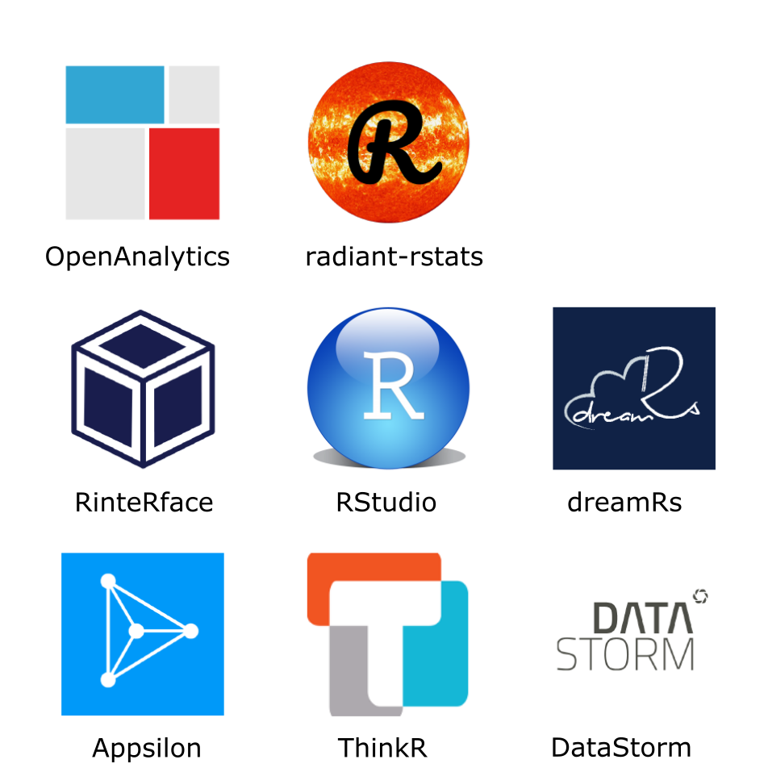

# 交互式数据报表 shiny {#chap:interactive-shiny-app}

学习 shiny 应用开发，建议多看看 [Learn Shiny](https://shiny.rstudio.com/tutorial/)。
了解 shiny server ，推荐从 [Shiny Server Professional Administrator's Guide](https://docs.rstudio.com/shiny-server/) 开始。了解 shiny 相关的生态，建议从 shiny 资源列表 <https://github.com/grabear/awesome-rshiny> 和 shiny 扩展合集 <https://github.com/nanxstats/awesome-shiny-extensions> 开始，希望读者能从中打造属于自己的最佳实践。

RStudio 首席技术官 CTO  Joe Cheng 在 2019年 RStudio 大会上介绍  [企业级 shiny 应用 原理、实践和工具](https://resources.rstudio.com/rstudio-conf-2019/shiny-in-production-principles-practices-and-tools-joe-cheng) 可以作为 shiny 从新技术到生产力的蜕变节点。支持高并发的异步编程，比如 Heather Nolis 和 Dr. Jacqueline Nolis 的报告介绍了日百万访问量下的 shiny 应用如何搭建[^scale-shiny]。 Colin Fay, Sébastien Rochette, Vincent Guyader, Cervan Girard 的书 [Engineering Production-Grade Shiny Apps](https://engineering-shiny.org/) 和 Hadley Wickham 的书 [Mastering Shiny](https://mastering-shiny.org/) 的问世宣告 shiny 的成熟稳定，以及生态的形成，在此之前 shiny 一直不被看好。shiny 生态意味着一个完整的工业级的应用圈，满足安全性、稳定性、高效性、维护性、扩展性的要求。


<div class="figure" style="text-align: center">

```{=html}
<div id="htmlwidget-e2a32784ae75d7b7080d" style="width:768px;height:384px;" class="nomnoml html-widget"></div>
<script type="application/json" data-for="htmlwidget-e2a32784ae75d7b7080d">{"x":{"code":"\n#fill: #FEFEFF\n#lineWidth: 1\n#zoom: 4\n#direction: right\n\n \n#stroke: orange\n#.box: dashed visual=ellipse\n#direction: down\n\n[<box>HTML]       -> [网页三剑客]\n[<box>JavaScript] -> [网页三剑客]\n[<box>CSS]        -> [<table>网页三剑客|bslib|htmltools||sass|jquerylib||thematic|htmlwidgets]\n\n[设计布局|flexdashboard|bs4Dash] -> [<actor>开发应用|R Shiny]\n[设计交互|shinyFeedback|shinyWidgets] -> [<actor>开发应用|R Shiny]\n\n[网页三剑客]  -> [<actor>开发应用|R Shiny]\n[网页三剑客]  -> [<actor>开发应用|R Shiny]\n[网页三剑客]  -> [<actor>开发应用|R Shiny]\n\n[开发应用] <- [<table>处理数据|Base R|SQL||data.table|dplyr||tidyr|purrr]\n[开发应用] <- [<table>制作图形|ggplot2|plotly||echarts4r|leaflet||dygraphs|apexcharter||highcharter|visNetwork]\n[开发应用] <- [<table>制作表格|DT|gt||reactable|formattable||kableExtra|sparkline]\n\n","svg":false},"evals":[],"jsHooks":[]}</script>
```

<p class="caption">(\#fig:shiny-ecosystem)Shiny 生态系统</p>
</div>

iSEE is winner of the Most Technically Impressive award of the 2019 Shiny Contest. 源码地址 <https://github.com/iSEE/isee-shiny-contest>

Six Years of Shiny in Research - Collaborative Development of Web Tools in R [@RJ-2021-004]

[^scale-shiny]: <https://resources.rstudio.com/rstudio-conf-2020/we-re-hitting-r-a-million-times-a-day-so-we-made-a-talk-about-it-heather-nolis-dr-jacqueline-nolis>

<div class="figure" style="text-align: center">

<p class="caption">(\#fig:shiny-org)开发 Shiny 应用扩展的组织</p>
</div>

以 RStudio 为核心，开发 Shiny 应用扩展的社区组织有 [RStudio](https://github.com/rstudio)、[Appsilon](https://github.com/Appsilon)、[RinteRface](https://github.com/RinteRface)、[ThinkR-open](https://github.com/ThinkR-open)、[dreamRs](https://github.com/dreamRs) 和[datastorm-open](https://github.com/datastorm-open)

## 开发流程 {#sec:dev-workflow}

报表开发从数据仓库的 DWD 层开始，可能一些业务原因，我们需要从 ODS 层甚至从点击流的日志数据开始，经过数据清洗、提取、聚合成为支撑BI报表最底层的基础表，存储在 Hive 中，然后对这一系列的基础表根据BI展示的需要进行第二层聚合形成中间表，这两层数据根据业务情况做增量更新或者全量更新，并将中间表同步到 MySQL 仓库中，全量更新的情况，往往更新数据比较大，建议用 sqoop 做数据的同步。创建第二层的中间表稍有些灵活性，原则是在中间表之上对应的数据操作和可视化是容易实现且效率较高的，否则应该构造第三层的中间表，绝不能将大规模的数据集直接导入 R 中进行分析和可视化，拖慢前端展示的速度，占用过多的服务器资源。

## 开发工具 {#sec:dev-tools}

除了在第 \@ref(sec:dev-workflow) 节介绍的和数据库紧密相关的工具外，我们还需要 Git 做代码管理， Azkaban 做任务调度 （或者其它工具做任务调度器），RStudio IDE 做开发工具（或者 VS Code 等）， Shiny Server 做报表支撑，做报表管理。具体到 shiny 页面开发，我们需要：

- RMySQL 做数据库连接，推荐 odbc 这个包，它支持连接相当广泛的数据库。
- data.table 或者 dplyr 做数据操作，推荐和管道操作 magrittr 一起使用，增加代码可读性。
- plotly 或者 highcharter 做数据可视化，reactable 和 DT 做数据呈现，也可以 [ggplot2](https://github.com/tidyverse/ggplot2) 和 [plotly](https://github.com/ropensci/plotly) 的 `ggplotly()` 函数共同实现静态图到动态图的交互可视化。
- [shiny](https://rstudio.github.io/shiny) 及其扩展工具做页面设计，比如 shinythemes 可以统一配色，[dashboardthemes](https://github.com/nik01010/dashboardthemes) 提供更加深度的主题，[shinytableau](https://github.com/rstudio/shinytableau) 提供仿 [Tableau](https://www.tableau.com/) 的 dashboard 框架。[sass](https://github.com/rstudio/sass) 在 CSS 样式层面重定义网站风格，比如[借助 sass 修改 Bootstrap 4 ](https://resources.rstudio.com/rstudio-conf-2020/styling-shiny-apps-with-sass-and-bootstrap-4-joe-cheng)， shiny 的布局其实就是魔改了 Bootstrap 库。
- 针对特定应用场景的其它交互可视化工具包，比如 [leaflet](https://github.com/rstudio/leaflet) 可以将地图嵌入 Shiny 应用，
[dygraphs](https://github.com/rstudio/dygraphs) 可以将时间序列塞进去。
- 其它加强 shiny 页面的小功能，比如 [shinyFeedback](https://github.com/merlinoa/shinyFeedback)  提供用户输入的反馈，[miniUI](https://github.com/rstudio/miniUI) 专为小屏幕设计，[shinyMobile](https://github.com/RinteRface/shinyMobile) 在 IOS 和安卓手机上访问 shiny 应用，大大加强 miniUI 的功能，[shinyWidgets](https://github.com/dreamRs/shinyWidgets) 提供自定义 widget 的功能，[shinymanager](https://github.com/datastorm-open/shinymanager) 支持单个 shiny 应用的权限管理，[firebase](https://github.com/JohnCoene/firebase) 提供访问权限设置 <https://firebase.john-coene.com/>。
- [shiny-server](https://github.com/rstudio/shiny-server) 以网络服务的方式支持 shiny 应用，是企业级 shiny 应用的核心， [shinyproxy](https://github.com/openanalytics/shinyproxy) 提供企业级部署 shiny 应用的开源解决方案，[ShinyStudio](https://github.com/clevr-dev/ShinyStudio) 打造基于容器架构的协作开发环境的开源解决方案，[golem](https://github.com/ThinkR-open/golem) 构建企业级 shiny 应用的框架，[RinteRface](https://github.com/RinteRface) 开发的系列 R 包也试图打造一套完整的解决方案，并配有速查小抄 [cheatsheets](https://github.com/RinteRface/cheatsheets)
- [radiant](https://github.com/radiant-rstats/radiant) 探索性分析解决方案


```r
library(shiny)
```

## 基础知识 {#sec:foundations}

[1920s 汽车数据分析和建模](https://xiangyun.shinyapps.io/masr-cars/)

## 基础组件 {#sec:shiny-elements}

### 书签 {#subsec:bookmark}

链接可以指向页面状态


```r
library(shiny)

ui <- function(request) {
  fluidPage(
    plotOutput("plot"),
    sliderInput("n", "Number of observations", 1, nrow(faithful), 100),
    bookmarkButton()
  )
}

server <- function(input, output, session) {
  output$plot <- renderPlot({
    hist(faithful$eruptions[seq_len(input$n)], breaks = 40)
  })
}

enableBookmarking(store = "url")
shinyApp(ui, server)
```

### 表格 {#subsec:shiny-tables}

[reactable](https://github.com/glin/reactable) 基于 JS 库 [React Table](https://github.com/tannerlinsley/react-table) 提供交互式表格渲染，和 shiny 无缝集成，是替代 DT 的不二选择，在 app.R 用 reactable 包的 `reactableOutput()` 和 `renderReactable()` 函数替代 shiny 里面的 `dataTableOutput()` 和 `renderDataTable()`。 再也不用忍受 DT 和 shiny 的函数冲突了，且其覆盖测试达到 99\%。


```r
library(shiny)
library(data.table)
```

[gt](https://github.com/rstudio/gt) 高度自定义 gt 表格样式，支持 shiny 集成， [data.table](https://github.com/Rdatatable/data.table) 提供高效的数据操作，[formattable](https://github.com/renkun-ken/formattable) 支持自定义格子。

kableExtra 包


```r
library(shiny)
library(data.table)
library(magrittr)
library(kableExtra)

ui <- fluidPage(
  title = "mtcars datasets",
  titlePanel("mtcars 数据集"),

  sidebarLayout(
    sidebarPanel(
      sliderInput("mpg", "mpg 范围",
        min = 11, max = 33, value = 15
      )
    ),

    mainPanel(
      tableOutput("mtcars_kable")
    )
  )
)

## 设置列序 https://stackoverflow.com/questions/19619666/change-column-position-of-data-table
server <- function(input, output) {
  output$mtcars_kable <- function() {
    # 转化数据类型
    mtcars_dt <- as.data.table(mtcars)
    # 添加新的列
    mtcars_dt[, car := rownames(mtcars)][mpg <= input$mpg] %>%
    setcolorder(., c("car", setdiff(names(.), "car"))) %>%
      knitr::kable("html") %>%
      kable_styling("striped", full_width = F) %>%
      add_header_above(c(" ", "Group 1" = 5, "Group 2" = 6))
  }
}

# 执行程序
shinyApp(ui = ui, server = server)
```

reactable 包


```r
library(shiny)
library(reactable)

ui <- fluidPage(
  reactableOutput("table")
)

server <- function(input, output) {
  output$table <- renderReactable({
    reactable(iris,
      filterable = TRUE, # 过滤
      searchable = TRUE, # 搜索
      showPageSizeOptions = TRUE, # 页面大小
      pageSizeOptions = c(5, 10, 15), # 页面大小可选项
      defaultPageSize = 10, # 默认显示10行
      highlight = TRUE, # 高亮选择
      striped = TRUE, # 隔行高亮
      fullWidth = FALSE, # 默认不要全宽填充，适应数据框的宽度
      defaultSorted = list(
        Sepal.Length = "asc", # 由小到大排序
        Petal.Length = "desc" # 由大到小
      ),
      columns = list(
        Sepal.Width = colDef(style = function(value) { # Sepal.Width 添加颜色标记
          if (value > 3.5) {
            color <- "#008000"
          } else if (value > 2) {
            color <- "#e00000"
          } else {
            color <- "#777"
          }
          list(color = color, fontWeight = "bold") # 字体加粗
        })

      )
    )
  })
}

shinyApp(ui, server)
```

下面介绍 DT 


```r
library(magrittr)
# ui.R 前端
library(shiny)
shinyUI(fluidPage(
  # 应用的标题名称
  titlePanel("鸢尾花数据集"),
  # 边栏
  fluidRow(
    column(
      12,
      DT::dataTableOutput("table")
    )
  )
))

# server.R 服务端
library(shiny)
shinyServer(function(input, output, session) {
  output$table <- iris %>%
    `colnames<-`(., gsub("\\.", "_", tolower(colnames(.)))) %>%
    DT::renderDataTable(.,
      options = list(
        pageLength = 5, # 每页显示5行
        initComplete = I("function(settings, json) {alert('Done.');}")
      ), server = F
    )
})
```

::: {.rmdnote data-latex="{注意}"}
加载 shiny 包后再加载 DT 包，函数 `dataTableOutput()` 和`renderDataTable()` 显示冲突，因为两个 R 包都有这两个函数。在创建 shiny 应用的过程中，如果我们需要呈现动态表格，就需要使用 DT 包的 `DT::dataTableOutput()` 和 `DT::renderDataTable()` 否则会报错，详见 <https://github.com/rstudio/shiny/issues/2653>，DT 包官方文档 <https://rstudio.github.io/DT/>。
:::

::: {.rmdtip data-latex="{提示}"}
在 server.R 里我们对数据集 iris 做了重命列名的操作，如果不使用管道操作，通常是下面这样操作。


```r
colnames(iris) <- gsub("\\.", "_", tolower(colnames(iris)))
```

换成管道操作，函数 `colnames()` 要换成 `colnames<-`，这其实类似于 `1 + 2` 换成 `+`(1, 2)，保持函数在左边，参数值在右边的一致性。
:::

设置页面默认显示的行数和列的宽度


```r
# https://stackoverflow.com/questions/45509501/set-names-of-values-in-lengthmenu-page-length-menu-in-r-dt-datatable
# 相关例子见 https://github.com/rstudio/shiny-examples/tree/master/018-datatable-options
# DT 选项 https://rstudio.github.io/DT/options.html

library(shiny)
library(DT)

ui <- fluidPage(
  DT::dataTableOutput("table")
)

server <- function(input, output) {
  output$table <- DT::renderDataTable({
    DT::datatable(iris, options = list(
      language = list(url = "//cdn.datatables.net/plug-ins/1.10.11/i18n/Chinese.json"),
      pageLength = 24, # 设置页面默认显示的行数
      lengthMenu = list(
        c(24, 48, 72, 96, -1),
        c("24", "48", "72", "96", "All")
      ),
      paging = T,
      # 设置第一列和第三列的宽度 https://rstudio.github.io/DT/options.html
      autoWidth = TRUE, columnDefs = list(list(width = '400px', targets = c(1, 3)))
    ))
  })
}

shinyApp(ui, server)
```

按指定格式显示数据


```r
# data <- data.frame(x = c(100.0011, 80.0011, -90.0011, -110.0011, -70))
#
# library(shiny)
# runApp(list(
#   ui = fluidPage(dataTableOutput("num")),
#   server = function(input, output) {
#     output$num = renderDataTable(format(round(data, 3), nsmall = 3))
#   }
# ))

library(DT)

dat <- data.frame(x = c(100.0011, 80.0011, -90.0011, -110.0067, -70))

rowCallback <- c(
  "function(row, data, index){",
  "  var N = data.length;",
  "  for(var j=1; j<data.length; j++){",
  "    $('td:eq('+j+')',row)",
  "      .html(parseFloat(data[j]).toFixed(3));", # 四舍五入保留 3 位小数
  "  }",
  "}"
)

# https://github.com/rstudio/shiny/issues/2277
datatable(dat,
  options = list(
    rowCallback = JS(rowCallback)
  )
)
```


## 高级主题 {#sec:advanced-topics}

异步编程，并发访问


```r
## shiny 异步编程
## 解决问题，多人同时访问 Shiny 应用的情况下，必须等另一个人完成访问的情况下才能继续访问

library(shiny)
library(future)
library(promises)

plan(multiprocess)

ui <- fluidPage(
  h2("测试异步下载"),
  tags$ol(
    tags$li("Verify that plot appears below"),
    tags$li("Verify that pressing Download results in 5 second delay, then rock.csv being downloaded"),
    tags$li("Check 'Throw on download?' checkbox and verify that pressing Download results in 5 second delay, then error, as well as stack traces in console")
  ),
  hr(),
  checkboxInput("throw", "Throw on download?"),
  downloadButton("download", "下载 (等待5秒)"),
  plotOutput("plot")
)

server <- function(input, output, session) {
  output$download <- downloadHandler("rock.csv", function(file) {
    future({Sys.sleep(5)}) %...>%
      {
        if (input$throw) {
          stop("boom")
        } else {
          write.csv(rock, file)
        }
      }
  })

  output$plot <- renderPlot({
    plot(cars)
  })
}

shinyApp(ui, server)
```

## 部署应用 {#sec:shiny-deployment}

## 最佳实践 {#sec:shiny-principles}

[提升 shiny 仪表盘访问性能的4个建议](https://blog.rstudio.com/2020/07/21/4-tips-to-make-your-shiny-dashboard-faster/)

## 仪表盘 {#sec:shiny-dashboard}

dashboard 翻译过来叫仪表盘，就是驾驶仓的那个玩意，形象地表达作为掌舵者应该关注的对象。R 包 shiny 出现后，仪表盘的制作显得非常容易，也很快形成了一个生态，比如 [shinydashboard](https://rstudio.github.io/shinydashboard)、 [flexdashboard](https://github.com/rstudio/flexdashboard) 等，此外 [bs4Dash](https://github.com/RinteRface/bs4Dash) 基于 Bootstrap 4 的仪表盘，目前 shiny 和 rmarkdown 都在向 Bootstrap 4 升级，这是未来的方向。 [shinydashboardPlus](https://github.com/RinteRface/shinydashboardPlus) 主要目的在于扩展 **shinydashboard** 包

shinydashboard 包


```r
## app.R ##
library(shiny)
library(shinydashboard)

ui <- dashboardPage(
    dashboardHeader(title = "Basic dashboard"),
    ## Sidebar content
    dashboardSidebar(
        sidebarMenu(
            menuItem("Dashboard", tabName = "dashboard", icon = icon("dashboard")),
            menuItem("Widgets", tabName = "widgets", icon = icon("th"))
        )
    ),
    ## Body content
    dashboardBody(
        tabItems(
            # First tab content
            tabItem(tabName = "dashboard",
                    fluidRow(
                        box(plotOutput("plot1", height = 250)),

                        box(
                            title = "Controls",
                            sliderInput("slider", "Number of observations:", 1, 100, 50)
                        )
                    )
            ),

            # Second tab content
            tabItem(tabName = "widgets",
                    h2("Widgets tab content")
            )
        )
    )
)

server <- function(input, output) {
    set.seed(122)
    histdata <- rnorm(500)

    output$plot1 <- renderPlot({
        data <- histdata[seq_len(input$slider)]
        hist(data)
    })
}

shinyApp(ui, server)
```

shinydashboardPlus 包


```r
library(shiny)
library(shinydashboard)
library(shinydashboardPlus)

shinyApp(
  ui = dashboardPage(
    dashboardHeader(),
    dashboardSidebar(),
    dashboardBody(
      box(
        solidHeader = FALSE,
        title = "Status summary",
        background = NULL,
        width = 4,
        status = "danger",
        footer = fluidRow(
          column(
            width = 6,
            descriptionBlock(
              number = "17%",
              numberColor = "green",
              numberIcon = "fa fa-caret-up",
              header = "$35,210.43",
              text = "TOTAL REVENUE",
              rightBorder = TRUE,
              marginBottom = FALSE
            )
          ),
          column(
            width = 6,
            descriptionBlock(
              number = "18%",
              numberColor = "red",
              numberIcon = "fa fa-caret-down",
              header = "1200",
              text = "GOAL COMPLETION",
              rightBorder = FALSE,
              marginBottom = FALSE
            )
          )
        )
      )
    ),
    title = "Description Blocks"
  ),
  server = function(input, output) { }
)
```


shinymaterial 包


```r
library(shiny)
library(shinymaterial)

# https://ericrayanderson.github.io/shinymaterial/
# https://github.com/ericrayanderson/shinymaterial

# Wrap shinymaterial apps in material_page
ui <- material_page(
  title = "用户画像",
  nav_bar_fixed = TRUE,
  # 每个 sidebar 内容
  material_side_nav(
    fixed = TRUE,
    # Place side-nav tabs within side-nav
    material_side_nav_tabs(
      side_nav_tabs = c(
        "数据汇总" = "tab_1",
        "趋势信息" = "tab_2"
      ),
      icons = c("cast", "insert_chart")
    )
  ),
  # 每个 tab 页面的内容
  material_side_nav_tab_content(
    side_nav_tab_id = "tab_1",
    tags$h2("第一个tab页")
  ),
  material_side_nav_tab_content(
    side_nav_tab_id = "tab_2",
    tags$h2("第二个tab页")
  )
)

server <- function(input, output) {

}
shinyApp(ui = ui, server = server)
```

miniUI 包


```r
library(shiny)
library(miniUI)
library(leaflet)
library(ggplot2)

ui <- miniPage(
  gadgetTitleBar("Shiny gadget example"),
  miniTabstripPanel(
    miniTabPanel("Parameters", icon = icon("sliders"),
                 miniContentPanel(
                   sliderInput("year", "Year", 1978, 2010, c(2000, 2010), sep = "")
                 )
    ),
    miniTabPanel("Visualize", icon = icon("area-chart"),
                 miniContentPanel(
                   plotOutput("cars", height = "100%")
                 )
    ),
    miniTabPanel("Map", icon = icon("map-o"),
                 miniContentPanel(padding = 0,
                                  leafletOutput("map", height = "100%")
                 ),
                 miniButtonBlock(
                   actionButton("resetMap", "Reset")
                 )
    ),
    miniTabPanel("Data", icon = icon("table"),
                 miniContentPanel(
                   DT::dataTableOutput("table")
                 )
    ),
    selected = "Map"
  )
)

server <- function(input, output, session) {
  output$cars <- renderPlot({
    require(ggplot2)
    ggplot(cars, aes(speed, dist)) + geom_point()
  })

  output$map <- renderLeaflet({
    force(input$resetMap)

    leaflet(quakes, height = "100%") %>% addTiles() %>%
      addMarkers(lng = ~long, lat = ~lat)
  })

  output$table <- DT::renderDataTable({
    diamonds
  })

  observeEvent(input$done, {
    stopApp(TRUE)
  })
}

shinyApp(ui, server)
```

## 交互式数据报表 dash  {#sec:interactive-dash-app}


```r
library(dash)
library(dashHtmlComponents)
library(dashCoreComponents)
library(dashTable)
```


## 运行环境 {#sec:session-shiny}


```r
sessionInfo()
```

```
## R version 4.1.0 (2021-05-18)
## Platform: x86_64-pc-linux-gnu (64-bit)
## Running under: Ubuntu 20.04.2 LTS
## 
## Matrix products: default
## BLAS:   /usr/lib/x86_64-linux-gnu/blas/libblas.so.3.9.0
## LAPACK: /usr/lib/x86_64-linux-gnu/lapack/liblapack.so.3.9.0
## 
## locale:
##  [1] LC_CTYPE=en_US.UTF-8       LC_NUMERIC=C              
##  [3] LC_TIME=en_US.UTF-8        LC_COLLATE=en_US.UTF-8    
##  [5] LC_MONETARY=en_US.UTF-8    LC_MESSAGES=en_US.UTF-8   
##  [7] LC_PAPER=en_US.UTF-8       LC_NAME=C                 
##  [9] LC_ADDRESS=C               LC_TELEPHONE=C            
## [11] LC_MEASUREMENT=en_US.UTF-8 LC_IDENTIFICATION=C       
## 
## attached base packages:
## [1] stats     graphics  grDevices utils     datasets  methods   base     
## 
## other attached packages:
## [1] data.table_1.14.0 shiny_1.6.0      
## 
## loaded via a namespace (and not attached):
##  [1] Rcpp_1.0.6        knitr_1.33        magrittr_2.0.1    xtable_1.8-4     
##  [5] R6_2.5.0          rlang_0.4.11      fastmap_1.1.0     stringr_1.4.0    
##  [9] highr_0.9         tools_4.1.0       nomnoml_0.2.3     xfun_0.23        
## [13] jquerylib_0.1.4   ellipsis_0.3.2    htmltools_0.5.1.1 yaml_2.2.1       
## [17] digest_0.6.27     lifecycle_1.0.0   bookdown_0.22     later_1.2.0      
## [21] promises_1.2.0.1  sass_0.4.0        htmlwidgets_1.5.3 mime_0.10        
## [25] evaluate_0.14     rmarkdown_2.8     stringi_1.6.2     compiler_4.1.0   
## [29] bslib_0.2.5.1     jsonlite_1.7.2    httpuv_1.6.1
```

