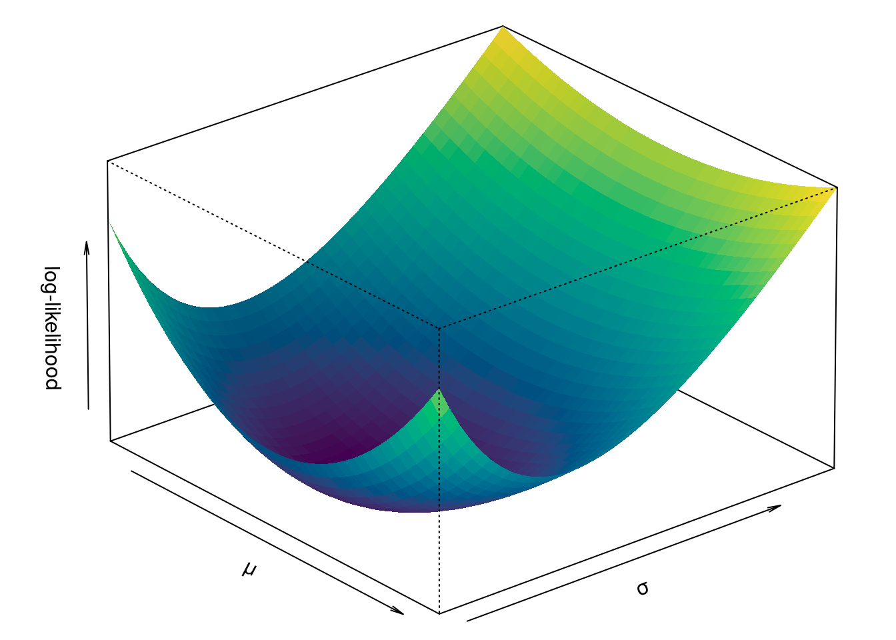

# 数值优化 {#chap:numerical-optimization}

R 语言提供了相当多的优化求解器，比较完整的概览见[优化视图](	https://CRAN.R-project.org/view=Optimization)。本章介绍一些常用的优化算法及其R实现，涵盖线性规划、整数规划、二次规划、非线性规划等。商业的优化求解器的介绍见 [MOSEK 优化材料](https://docs.mosek.com/9.2/rmosek/optimization-tutorials.html) 和
Matlab 优化工具箱 [Optimization Toolbox User’s Guide](https://ww2.mathworks.cn/help/releases/R2021a/pdf_doc/optim/optim.pdf)


Berwin A. Turlach 开发的 [quadprog](https://CRAN.R-project.org/package=quadprog) 主要用于求解二次规划问题。[Anqi Fu](https://web.stanford.edu/~anqif/) 开发的 [CVXR](https://github.com/anqif/CVXR) 可解很多凸优化问题，[Jelmer Ypma](https://www.ucl.ac.uk/~uctpjyy/nloptr.html) 开发的 [nloptr](https://github.com/jyypma/nloptr) 可解无约束和有约束的非线性规划问题，[GPareto](https://github.com/mbinois/GPareto) 求解多目标优化问题，帕雷托前沿优化和估计[@GPareto2019]。[igraph](https://github.com/igraph/igraph/) 可以用来解决最短路径、最大网络流、最小生成树等图优化相关的问题。提供了一般的求解器介绍 <https://palomar.home.ece.ust.hk/MAFS6010R_lectures/Rsession_solvers.html>。ROI 包力图统一各个求解器的调用接口，打造一个优化算法的基础设施平台。@ROI2020 详细介绍了目前优化算法发展情况及 R 社区提供的优化能力。

谷歌开源的运筹优化工具 [or-tools](https://github.com/google/or-tools) 提供了约束优化、线性优化、混合整数优化、装箱和背包算法、TSP（Traveling Salesman Problem）、VRP（Vehicle Routing Problem）、图算法（最短路径、最小成本流、最大流等）等算法和求解器。「运筹OR帷幄」社区开源的 [线性规划](https://github.com/Operations-Research-Science/Ebook-Linear_Programming) 一书值得一看。


<!-- 
TODO: 遗传算法、禁忌搜索、模拟退火、蚁群算法。需要使用启发式算法来求解组合优化、非线性混合整数、多目标优化、图规划问题，[GA](https://github.com/luca-scr/GA) 包实现了遗传算法，TSP 问题
-->

## 线性规划 {#sec:linear-programming}

[clpAPI](https://cran.r-project.org/package=clpAPI) 线性规划求解器。[glpk](https://www.gnu.org/software/glpk/) 的两个 R 接口 -- [glpkAPI](https://cran.r-project.org/package=glpkAPI) 和
[Rglpk](https://CRAN.R-project.org/package=Rglpk) 提供线性规划和混合整数规划的求解能力。[lp_solve](http://lpsolve.sourceforge.net/) 的两个 R 接口 --
[lpSolveAPI](https://cran.r-project.org/package=lpSolveAPI) 和 [lpSolve](https://github.com/gaborcsardi/lpSolve) 也提供类似的能力。[ompr](https://github.com/dirkschumacher/ompr) 求解混合整数线性规划问题。

举个例子，如下

\begin{equation*}
\begin{array}{l}
  \min_x \quad -6x_1 -5x_2 \\
    s.t.\left\{ 
    \begin{array}{l}
    x_1  + 4x_2 & \leq 16\\
    6x_1 + 4x_2 & \leq 28\\
    2x_1 - 5x_2 & \leq 6
    \end{array} \right.
\end{array}
\end{equation*}

写成矩阵形式

\begin{equation*}
\begin{array}{l}
\min_x \quad
  \begin{bmatrix}
  -6  \\
  -5
  \end{bmatrix}
  ^{T} x \\
s.t.\left\{ 
 \begin{array}{l}
  \begin{bmatrix}
  1 & 4  \\
  6 & 4  \\
  2 & -5 
  \end{bmatrix}
  x \leq
  \begin{bmatrix}
   16 \\
   28 \\
   6
  \end{bmatrix}
 \end{array} \right.
\end{array} 
\end{equation*}

对应成 R 代码如下


```r
# lpSolve 添加约束条件
library(lpSolve)
# 目标
f.obj <- c(-6, -5)
# 约束
f.con <- matrix(c(1, 4, 6, 4, 2, -5), nrow = 3, byrow = TRUE)
# 方向
f.dir <- c("<=", "<=", "<=")
# 右手边
f.rhs <- c(16, 28, 6)
res <- lp("min", f.obj, f.con, f.dir, f.rhs)
res$objval
```

```
## [1] -31.4
```

```r
res$solution
```

```
## [1] 2.4 3.4
```

## 整数规划 {#sec:integer-programming}

### 一般整数规划 {#common-integer-programming}

\begin{equation*}
\begin{array}{l}
  \max_x \quad 0.2x_1 + 0.6x_2 \\
    s.t.\left\{ 
    \begin{array}{l}
    5x_1  + 3x_2 \leq 250\\
    -3x_1 + 2x_2 \leq 4\\
    x_1,x_2 \geq 0, \quad x_1,x_2 \in \mathbb{Z}
    \end{array} \right.
\end{array}
\end{equation*}


```r
# 目标
f.obj <- c(0.2, 0.6)
# 约束
f.con <- matrix(c(5, 3, -3, 2), nrow = 2, byrow = TRUE)
# 方向
f.dir <- c("<=", "<=")
# 右手边
f.rhs <- c(250, 4)
# 限制两个变量都是整数
res <- lp("max", f.obj, f.con, f.dir, f.rhs, int.vec=1:2)
res$objval
```

```
## [1] 29.2
```

```r
res$solution
```

```
## [1] 26 40
```

### 0-1 整数规划 {#binary-integer-programming}

\begin{equation*}
\begin{array}{l}
  \max_x \quad 0.2x_1 + 0.6x_2 \\
    s.t.\left\{ 
    \begin{array}{l}
    5x_1  + 3x_2 \leq 250\\
    -3x_1 + 2x_2 \leq 4\\
    x_1,x_2 \in \{0,1\}
    \end{array} \right.
\end{array}
\end{equation*}


```r
# 目标
f.obj <- c(0.2, 0.6)
# 约束
f.con <- matrix(c(5, 3, -3, 2), nrow = 2, byrow = TRUE)
# 方向
f.dir <- c("<=", "<=")
# 右手边
f.rhs <- c(250, 4)
# 限制两个变量都是0-1整数
res <- lp("max", f.obj, f.con, f.dir, f.rhs, int.vec=1:2, all.bin = TRUE)
res$objval
```

```
## [1] 0.8
```

```r
res$solution
```

```
## [1] 1 1
```

### 混合整数规划 {#mixed-integer-programming}

一部分变量要求是整数

\begin{equation*}
\begin{array}{l}
  \max_x \quad 3x_1 + 7x_2 - 12x_3 \\
    s.t.\left\{ 
    \begin{array}{l}
    5x_1 + 7x_2 + 2x_3 \leq 61\\
    3x_1 + 2x_2 - 9x_3 \leq 35\\
    x_1 + 3x_2 + x_3 \leq 31\\
    x_1,x_2 \geq 0, \quad x_3 \in [-10, 10]
    \end{array} \right.
\end{array}
\end{equation*}


```r
# 还必须安装 ROI.plugin.lpsolve
library(ROI)
prob <- OP(
  objective = L_objective(c(3, 7, -12)),
  # 指定变量类型：第1个变量是连续值，第2、3个变量是整数
  types = c("C", "I", "I"),
  constraints = L_constraint(
    L = rbind(
      c(5, 7, 2),
      c(3, 2, -9),
      c(1, 3, 1)
    ),
    dir = c("<=", "<=", "<="),
    rhs = c(61, 35, 31)
  ),
  # 添加约束：第3个变量的下、上界分别是 -10 和 10
  bounds = V_bound(li = 3, ui = 3, lb = -10, ub = 10, nobj = 3),
  maximum = TRUE
)
prob
```

```
## ROI Optimization Problem:
## 
## Maximize a linear objective function of length 3 with
## - 1 continuous objective variable,
## - 2 integer objective variables,
## 
## subject to
## - 3 constraints of type linear.
## - 1 lower and 1 upper non-standard variable bound.
```

```r
res <- ROI_solve(prob)
res$solution
```

```
## [1]  0.3333333  8.0000000 -2.0000000
```

```r
res$objval
```

```
## [1] 81
```

## 二次规划 {#sec:quadratic-programming}

### 凸二次规划 {#sec:strictly-convex-quadratic-program}

在 R 中使用 quadprog 包求解二次规划[^intro-quadprog]，而 ipoptr 包可用来求解一般的非线性约束的非线性规划[^intro-ipoptr]，quadprogXT 包用来求解带绝对值约束的二次规划，pracma 包提供 quadprog 函数就是对 quadprog 包的 solve.QP 进行封装，使得调用风格更像 Matlab 而已。quadprog 包实现了 Goldfarb and Idnani (1982, 1983) 提出的对偶方法，主要用来求解带线性约束的严格凸二次规划问题。

$$\min_b -d^{\top}b+\frac{1}{2}b^{\top}Db, \quad A^{\top}b \geq b_{0}$$


```r
solve.QP(Dmat, dvec, Amat, bvec, meq = 0, factorized = FALSE)
```

参数 `Dmat`、`dvec`、`Amat`、`bvec` 分别对应二次规划问题中的 $D,d,A,b_{0}$。

下面举个例子，有如下二次规划问题

$$
D = 2* \begin{bmatrix}1 & -1/2\\
-1/2 & 1
\end{bmatrix}, \quad
d = (-3,2), \quad
A = \begin{bmatrix}1 & 1\\
-1 & 1 \\
0  & -1
\end{bmatrix}, \quad
b_{0} = (2,-2,-3)
$$

上述二次规划问题的可行域如图所示


```r
plot(0, 0,
  xlim = c(-2, 5.5), ylim = c(-1, 3.5), type = "n",
  xlab = "x", ylab = "y", main = "Feasible Region"
)
polygon(c(2, 5, -1), c(0, 3, 3), border = TRUE, lwd = 2, col = "gray")
```

<div class="figure" style="text-align: center">

<p class="caption">(\#fig:feasible-region)可行域</p>
</div>

**quadprog** 包的 `solve.QP` 函数求解二次规划


```r
library(quadprog)
Dmat <- 2 * matrix(c(1, -1 / 2, -1 / 2, 1), nrow = 2, byrow = TRUE)
dvec <- c(-3, 2)
A <- matrix(c(1, 1, -1, 1, 0, -1), ncol = 2, byrow = TRUE)
bvec <- c(2, -2, -3)
Amat <- t(A)
sol <- solve.QP(Dmat, dvec, Amat, bvec, meq = 0)
sol
```

```
## $solution
## [1] 0.1666667 1.8333333
## 
## $value
## [1] -0.08333333
## 
## $unconstrained.solution
## [1] -1.3333333  0.3333333
## 
## $iterations
## [1] 2 0
## 
## $Lagrangian
## [1] 1.5 0.0 0.0
## 
## $iact
## [1] 1
```

在可行域上画出等高线，表示目标解的位置，图中红点表示无约束下的解，黄点表示线性约束下的解


```r
qp_sol <- sol$solution # 二次规划的解
uc_sol <- sol$unconstrained.solution # 无约束情况下的解
# 画图
library(lattice)
x <- seq(-2, 5.5, length.out = 500)
y <- seq(-1, 3.5, length.out = 500)
grid <- expand.grid(x = x, y = y)
grid$z <- with(grid, x^2 + y^2 - x * y + 3 * x - 2 * y + 4)
levelplot(z ~ x * y, grid,
  cuts = 40,
  panel = function(...) {
    panel.levelplot(...)
    panel.polygon(c(2, 5, -1), c(0, 3, 3),
      border = TRUE,
      lwd = 2, col = "transparent"
    )
    panel.points(c(uc_sol[1], qp_sol[1]),
      c(uc_sol[2], qp_sol[2]),
      lwd = 5, col = c("red", "yellow"), pch = 19
    )
  },
  colorkey = TRUE,
  col.regions = terrain.colors(40)
)
```

<div class="figure" style="text-align: center">

<p class="caption">(\#fig:quadprog)无约束和有约束条件下的解</p>
</div>

kernlab 提供基于核的机器学习方法，可用于分类、回归、聚类、异常检测、分位回归、降维等场景，包含支撑向量机、谱聚类、核PCA、高斯过程和二次规划求解器，将优化方法用于机器学习，展示二者的关系。

R 包 kernlab 的函数 `ipop()` 实现内点法可以求解半正定的二次规划问题，对应到上面的例子，就是要求 $A \geq 0$，而 R 包 quadprog 只能求解正定的二次规划问题，即要求 $A > 0$。

以二分类问题为例，采用 SMO (Sequential Minimization Optimization) 求解器，将 SVM 的二次优化问题分解。


```r
library(kernlab)
set.seed(123)
x <- rbind(matrix(rnorm(120), 60, 2), matrix(rnorm(120, mean = 3), 60, 2))
y <- matrix(c(rep(1, 60), rep(-1, 60)))
svp <- ksvm(x, y, type = "C-svc")
plot(svp, data = x)
```

<div class="figure" style="text-align: center">

<p class="caption">(\#fig:toy-binary)二分类问题</p>
</div>

## 非线性规划 {#sec:nonlinear-programming}

### 一元非线性优化 {#sec:one-dimensional-optimization}

复合函数求极值

$$
g(x) = \int_{0}^{x} -\sqrt{t}\exp(-t^2) dt, \quad f(y) = \int_{0}^{y} g(s) \exp(-s) ds
$$


```r
g <- function(x) {
  integrate(function(t) {
    -sqrt(t) * exp(-t^2)
  }, lower = 0, upper = x)$value
}

f <- function(y) {
  integrate(function(s) {
    Vectorize(g, "x")(s) * exp(-s)
  }, lower = 0, upper = y)$value
}

optimize(f, interval = c(10, 100), maximum = FALSE)
```

```
## $minimum
## [1] 66.84459
## 
## $objective
## [1] -0.3201572
```

计算积分的时候，输入了一系列 s 值，参数是向量，而函数 g 只支持输入参数是单个值，`g(c(1,2))` 则会报错


```r
g(1)
```

```
## [1] -0.453392
```

### 多元无约束非线性优化 {#sec:unconstrained-nonlinear-optimization}

Himmelblau 函数是一个多摸函数，常用于优化算法的比较。

$$f(x,y) = (x_1^2 + x_2 -11)^2 + (x_1 + x_2^2 -7)^2$$
它在四个位置取得一样的极小值，分别是 $f(-3.7793, -3.2832) = 0$、$f(-2.8051, 3.1313) = 0$、$f(3, 2) = 0$ 和 $f(3.5844, -1.8481) = 0$。函数图像见图 \@ref(fig:himmelblau)。


```r
fn <- function(x, y) { # 输入两个向量，输出一个向量
   (x^2 + y - 11)^2 + (x + y^2 - 7)^2
}

library(magrittr)
df <- expand.grid(
  x = seq(-5, 5, length = 101),
  y = seq(-5, 5, length = 101)
) %>% 
  transform(fnxy = fn(x, y))

library(lattice)
wireframe(
  data = df, fnxy ~ x * y,
  shade = TRUE, drape = FALSE,
  xlab = expression(x[1]), 
  ylab = expression(x[2]), 
  zlab = list(expression(f(x[1],x[2])), rot = 90),
  scales = list(arrows = FALSE, col = "black"),
  par.settings = list(axis.line = list(col = "transparent")),
  screen = list(z = -240, x = -70, y = 0)
)
```

<div class="figure" style="text-align: center">

<p class="caption">(\#fig:himmelblau)Himmelblau 函数图像</p>
</div>


```r
# 目标函数
fn <- function(x){
   (x[1]^2 + x[2] - 11)^2 + (x[1] + x[2]^2 - 7)^2
}
library(numDeriv)
# 梯度函数
gr <- function(x) {
  grad(fn, c(x[1], x[2])) 
}
optim(par = c(-1.2, 1), fn = fn, gr = gr, method = "BFGS")
```

```
## $par
## [1] -2.805118  3.131313
## 
## $value
## [1] 2.069971e-27
## 
## $counts
## function gradient 
##       42       15 
## 
## $convergence
## [1] 0
## 
## $message
## NULL
```

$$f(x,y) = 100 * (x_2 -x_1^2)^2 + (1 - x_1)^2$$


```r
# 目标函数
fn <- function(x) {
  100 * (x[2] - x[1]^2)^2 + (1 - x[1])^2
}
# 梯度函数
gr <- function(x) {
  grad(fn, c(x[1], x[2])) 
}
optim(par = c(-1.2, 1), fn = fn, gr = gr, method = "BFGS")
```

```
## $par
## [1] 1 1
## 
## $value
## [1] 9.595012e-18
## 
## $counts
## function gradient 
##      110       43 
## 
## $convergence
## [1] 0
## 
## $message
## NULL
```

### 多元约束非线性优化 {#sec:constrained-nonlinear-optimization}

\begin{equation*}
\begin{array}{l}
  \min_x \quad (x_1 + 3x_2 + x_3)^2 + 4(x_1 - x_2)^2 \\
    s.t.\left\{ 
    \begin{array}{l}
     x_1 + x_2 + x_3 - 1 = 0 \\
     6 x_2 + 4 x_3 - x_1^3 - 3 > 0 \\
     x_1, x_2, x_3 > 0
    \end{array} \right.
\end{array}
\end{equation*}


```r
# 目标函数
fn <- function(x) (x[1] + 3 * x[2] + x[3])^2 + 4 * (x[1] - x[2])^2
# 目标函数的梯度
gr <- function(x) {
  g <- rep(NA, 3)
  # 对 x[1] 求偏导
  g[1] <- 2 * (x[1] + 3 * x[2] + x[3]) + 8 * (x[1] - x[2]) 
  # 对 x[2] 求偏导
  g[2] <- 6 * (x[1] + 3 * x[2] + x[3]) - 8 * (x[1] - x[2])
  # 对 x[3] 求偏导
  g[3] <- 2 * (x[1] + 3 * x[2] + x[3])
  g
}
# 等式约束
heq <- function(x) {
  h <- rep(NA, 1)
  h[1] <- x[1] + x[2] + x[3] - 1
  h
}
# 等式约束的雅可比矩阵
heq.jac <- function(x) {
  j <- matrix(NA, 1, length(x))
  j[1, ] <- c(1, 1, 1)
  j
}
# 不等式约束
hin <- function(x) {
  h <- rep(NA, 1)
  h[1] <- 6 * x[2] + 4 * x[3] - x[1]^3 - 3
  h[2] <- x[1]
  h[3] <- x[2]
  h[4] <- x[3]
  h
}
# 不等式约束的雅可比矩阵
hin.jac <- function(x) {
  j <- matrix(NA, 4, length(x))
  j[1, ] <- c(-3 * x[1]^2, 6, 4)
  j[2, ] <- c(1, 0, 0)
  j[3, ] <- c(0, 1, 0)
  j[4, ] <- c(0, 0, 1)
  j
}
```

调用求解器


```r
library(numDeriv)
library(alabama)
set.seed(12)
# 初始值
p0 <- runif(3)
# 求目标函数的极小值
ans <- constrOptim.nl(
  par = p0, 
  # 目标函数
  fn = fn, 
  gr = gr, 
  # 等式约束
  heq = heq,
  heq.jac = heq.jac, 
  # 不等式约束
  hin = hin, 
  hin.jac = hin.jac,
  # 不显示迭代过程
  control.outer = list(trace = FALSE) 
)
ans
```

```
## $par
## [1] 7.390292e-04 4.497160e-12 9.992610e-01
## 
## $value
## [1] 1.000002
## 
## $counts
## function gradient 
##     1230      163 
## 
## $convergence
## [1] 0
## 
## $message
## NULL
## 
## $hessian
##           [,1]      [,2]      [,3]
## [1,] 120517098 120517087 120517091
## [2,] 120517087 120517115 120517095
## [3,] 120517091 120517095 120517091
## 
## $outer.iterations
## [1] 13
## 
## $lambda
## [1] 4.481599
## 
## $sigma
## [1] 120517089
## 
## $barrier.value
## [1] 0.003472071
## 
## $K
## [1] 4.269112e-08
```
ans 是 `constrOptim.nl()` 返回的一个 list， convergence = 0 表示迭代成功收敛，value 表示目标函数在迭代终止时的取直，par 表示满足约束条件，成功收敛的情况下，目标函数的参数值，counts 表示迭代过程中目标函数及其梯度计算的次数。


```r
# 不提供梯度函数
ans <- constrOptim.nl(par = p0, fn = fn, heq = heq, hin = hin)
```


## 非线性方程 {#sec:nonlinear-equations}

### 一元非线性方程 {#subsec:one-optimize}

[牛顿-拉弗森方法](https://blog.hamaluik.ca/posts/solving-equations-using-the-newton-raphson-method/)


## 线性最小二乘 {#sec:linear-least-squares}

## 对数似然 {#sec:log-lik}


```r
set.seed(1234)
n <- 20 # 随机数的个数
x <- rexp(n, rate = 5) # 服从指数分布的随机数
m <- 40 # 网格数
mu <- seq(mean(x) - 1.5 * sd(x) / sqrt(n),
          mean(x) + 1.5 * sd(x) / sqrt(n),
          length.out = m
)
sigma <- seq(0.8 * sd(x), 1.5 * sd(x), length.out = m)
tmp <- expand.grid(x = mu, y = sigma)
loglikelihood <- function(b) -sum(dnorm(x, b[1], b[2], log = TRUE))
pp <- apply(tmp, 1, loglikelihood)
z <- matrix(pp, m, m)
nbcol <- 100
color <- hcl.colors(nbcol)
zfacet <- z[-1, -1] + z[-1, -m] + z[-m, -1] + z[-m, -m]
facetcol <- cut(zfacet, nbcol)

par(mar = c(0.1, 2, 0.1, 0.1))
persp(mu, sigma, z,
      xlab = "\n \u03bc", ylab = "\n \u03c3",
      zlab = "\n log-likelihood",
      border = NA,
      ticktype = "simple",
      col = color[facetcol],
      theta = 50, phi = 25,
      r = 60, d = 0.1, expand = .6,
      ltheta = 90, lphi = 180,
      shade = 0.1, nticks = 5, 
      box = TRUE, axes = TRUE
)
```



<!-- 添加极大值点，除指数分布外，还有正态、二项、泊松分布观察其似然曲面的特点，都是单峰，有唯一极值点，再考虑正态混合模型的似然曲面 -->

[^intro-quadprog]: https://rwalk.xyz/solving-quadratic-progams-with-rs-quadprog-package/
[^intro-ipoptr]: https://www.ucl.ac.uk/~uctpjyy/ipoptr.html


## 微分方程 {#sec:non-linear-tseries}

[ode45 求解偏微分方程](https://blog.hamaluik.ca/posts/solving-systems-of-partial-differential-equations/)


```r
library(nonlinearTseries)
library(plot3D)
lor <- lorenz(do.plot = F)

scatter3D(lor$x, lor$y, lor$z,
  ann = FALSE, col = terrain.colors(25),
  type = "o", cex = 0.3,
  colkey = FALSE, box = FALSE
)
```

## 运行环境 {#sec:numerical-optimization-session}


```r
sessionInfo()
```

```
## R version 4.1.0 (2021-05-18)
## Platform: x86_64-pc-linux-gnu (64-bit)
## Running under: Ubuntu 20.04.2 LTS
## 
## Matrix products: default
## BLAS:   /usr/lib/x86_64-linux-gnu/blas/libblas.so.3.9.0
## LAPACK: /usr/lib/x86_64-linux-gnu/lapack/liblapack.so.3.9.0
## 
## locale:
##  [1] LC_CTYPE=en_US.UTF-8       LC_NUMERIC=C              
##  [3] LC_TIME=en_US.UTF-8        LC_COLLATE=en_US.UTF-8    
##  [5] LC_MONETARY=en_US.UTF-8    LC_MESSAGES=en_US.UTF-8   
##  [7] LC_PAPER=en_US.UTF-8       LC_NAME=C                 
##  [9] LC_ADDRESS=C               LC_TELEPHONE=C            
## [11] LC_MEASUREMENT=en_US.UTF-8 LC_IDENTIFICATION=C       
## 
## attached base packages:
## [1] stats     graphics  grDevices utils     datasets  methods   base     
## 
## other attached packages:
## [1] alabama_2015.3-1    numDeriv_2016.8-1.1 magrittr_2.0.1     
## [4] kernlab_0.9-29      lattice_0.20-44     quadprog_1.5-8     
## [7] ROI_1.0-0           lpSolve_5.6.15     
## 
## loaded via a namespace (and not attached):
##  [1] lpSolveAPI_5.5.2.0-17.7  knitr_1.33               R6_2.5.0                
##  [4] rlang_0.4.11             stringr_1.4.0            highr_0.9               
##  [7] tools_4.1.0              grid_4.1.0               xfun_0.24               
## [10] registry_0.5-1           jquerylib_0.1.4          htmltools_0.5.1.1       
## [13] yaml_2.2.1               digest_0.6.27            bookdown_0.22           
## [16] sass_0.4.0               ROI.plugin.lpsolve_1.0-1 evaluate_0.14           
## [19] slam_0.1-48              rmarkdown_2.9            stringi_1.6.2           
## [22] compiler_4.1.0           bslib_0.2.5.1            jsonlite_1.7.2
```

