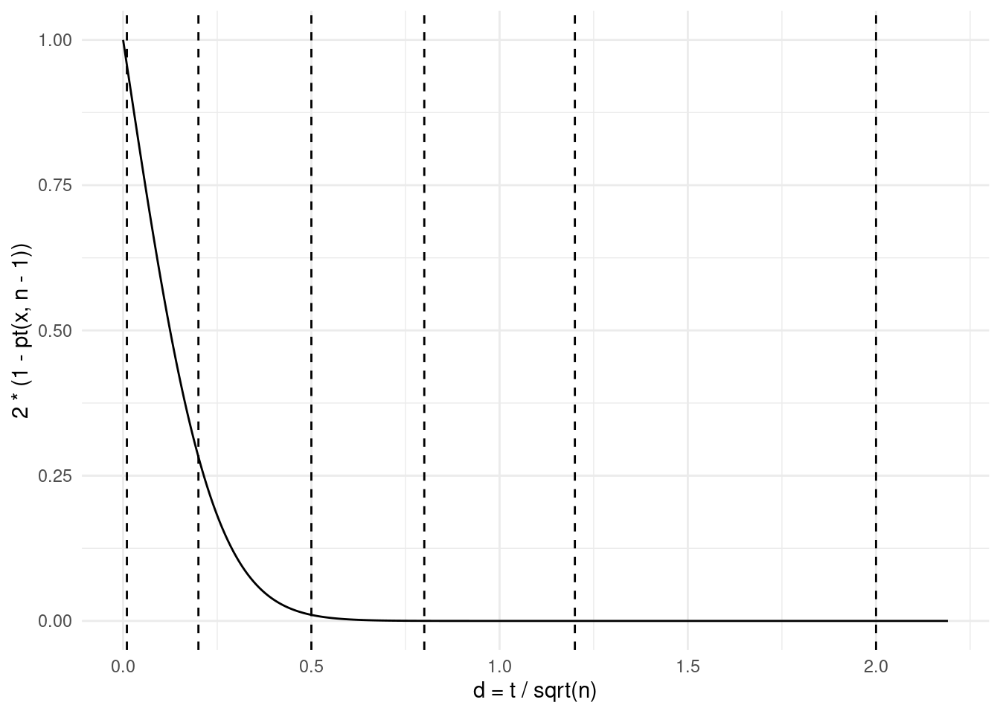

# 功效分析 {#chap:power-Analysis}


CRAN 上有很多功效计算和分析的 R 包，我们针对不同的混合效应模型和统计检验，提供对应的 R 实现。

[MKpower](https://github.com/stamats/MKpower) 包提供 Welch 和 Hsu（许宝騄）t 检验、Wilcoxon 秩和检验、符号秩检验的功效分析和样本量计算，经验功效和第一类错误的计算方法是蒙特卡罗模拟。[Superpower](https://github.com/arcaldwell49/Superpower)  基于模拟的方法分析三因素方差分析实验设计的功效，开发者写了本书介绍，详见 <https://aaroncaldwell.us/SuperpowerBook/>，也开发了两个 Shiny 应用。[powerlmm](https://github.com/rpsychologist/powerlmm) 可用于计算两、三个水平的纵向多水平/线性混合效应模型的功效。[pwrAB](https://github.com/ChaWM/pwrAB) Welch 两样本 t 检验的功效分析，常用于 A/B 测试。[Metin Bulus](https://www.metinbulus.com/) 开发 [PowerUpR](https://github.com/metinbulus/PowerUpR) 计算响应变量是连续型的多水平随机对照实验统计功效，最小可检测的效应大小，最小样本量要求。[simr](https://github.com/pitakakariki/simr) 通过模拟方法分析广义线性混合效应模型的功效。[WebPower](https://github.com/johnnyzhz/WebPower) 提供相关性、比例、t 检验、单因素方差分析、两因素方差分析、线性回归、逻辑回归、泊松回归、纵向数据分析、结构方程模型和多水平模型等的功效分析，详见网站 <https://webpower.psychstat.org/>，包含书籍和功效分析的工具。[PowerAnalysisIL](https://github.com/ginettelafit/PowerAnalysisIL) 功效分析的 shiny 应用
<http://daniellakens.blogspot.com/2015/01/always-use-welchs-t-test-instead-of.html>。

此外，还有 [lmerTest](https://github.com/runehaubo/lmerTestR) [@Kuznetsova_2017_lmerTest] 和 lmtest [@Zeileis_2002_lmtest]。
试验设计 [@Design_2004_Mao] 可以视为一种组织形式，包括各类检验， 
R 语言实战 [@Action_2015_Robert] 作者 Robert I. Kabacoff 创建了网站 [Quick-R](https://www.statmethods.net/)，实战这本书第 10 章功效分析主要基于 [pwr](https://github.com/heliosdrm/pwr) 包来介绍，Jacob Cohen 的著作《Statistical Power Analysis for the Behavioral Sciences》第二版 [@Cohen1988]

<https://powerandsamplesize.com/> 功效和样本量计算器


```r
library(pwr)
library(Matrix)
library(lme4)
```

**pbkrtest** 提供 parametric bootstrap test、Kenward-Roger-type F-test、Satterthwaite-type F-test 用于线性混合效应模型，parametric bootstrap test 用于广义线性混合效应模型

<!-- **lmerTest** 和 **lmtest** 从命名空间导入函数的方式来计算，以免引起冲突、同时能尽量减少对运行环境的污染 -->


## 方差分析检验的功效 {#sec:power-anova-test}

`power.anova.test()` 计算平衡的单因素方差分析检验的功效


```r
usage(power.anova.test)
```

```
power.anova.test(groups = NULL, n = NULL, between.var = NULL, within.var = NULL,
    sig.level = 0.05, power = NULL)
```


```r
power.anova.test(
  groups = 4,       #  4 个组  
  between.var = 1,  # 组间方差为 1
  within.var = 3,   # 组内方差为 3
  power = 0.95      # 1 - 犯第二类错误的概率
)
```

```
## 
##      Balanced one-way analysis of variance power calculation 
## 
##          groups = 4
##               n = 18.18245
##     between.var = 1
##      within.var = 3
##       sig.level = 0.05
##           power = 0.95
## 
## NOTE: n is number in each group
```


## 比例检验的功效  {#sec:power-prop-test}

`power.prop.test()` 计算两样本比例检验的功效


```r
usage(power.prop.test)
```

```
power.prop.test(n = NULL, p1 = NULL, p2 = NULL, sig.level = 0.05, power = NULL,
    alternative = c("two.sided", "one.sided"), strict = FALSE,
    tol = .Machine$double.eps^0.25)
```

功效可以用来计算实验所需要的样本量，检验统计量的功效越大/高，检验方法越好，实验所需要的样本量越少


```r
# p1 >= p2 的检验 单边和双边检验
power.prop.test(
  p1 = .65, p2 = 0.6, sig.level = .05,
  power = 0.90, alternative = "one.sided"
)
```

```
## 
##      Two-sample comparison of proportions power calculation 
## 
##               n = 1603.846
##              p1 = 0.65
##              p2 = 0.6
##       sig.level = 0.05
##           power = 0.9
##     alternative = one.sided
## 
## NOTE: n is number in *each* group
```

```r
power.prop.test(
  p1 = .65, p2 = 0.6, sig.level = .05,
  power = 0.90, alternative = "two.sided"
)
```

```
## 
##      Two-sample comparison of proportions power calculation 
## 
##               n = 1968.064
##              p1 = 0.65
##              p2 = 0.6
##       sig.level = 0.05
##           power = 0.9
##     alternative = two.sided
## 
## NOTE: n is number in *each* group
```

**pwr** 包 `pwr.2p.test()` 函数提供了类似 `power.prop.test()` 函数的功能


```r
library(pwr)
# 明确 p1 > p2 的检验
# 单边检验拆分更加明细，分为大于和小于
pwr.2p.test(
  h = ES.h(p1 = 0.65, p2 = 0.6),
  sig.level = 0.05, power = 0.9, alternative = "greater"
)
```

```
## 
##      Difference of proportion power calculation for binomial distribution (arcsine transformation) 
## 
##               h = 0.1033347
##               n = 1604.007
##       sig.level = 0.05
##           power = 0.9
##     alternative = greater
## 
## NOTE: same sample sizes
```

已知两样本的样本量不等，检验 H0: $p_1 = p_2$  H1: $p_1 \neq p_2$ 的功效


```r
library(pwr)
pwr.2p2n.test(
  h = 0.30, n1 = 80, n2 = 245,
  sig.level = 0.05, alternative = "greater"
)
```

```
## 
##      difference of proportion power calculation for binomial distribution (arcsine transformation) 
## 
##               h = 0.3
##              n1 = 80
##              n2 = 245
##       sig.level = 0.05
##           power = 0.7532924
##     alternative = greater
## 
## NOTE: different sample sizes
```

h 表示两个样本的差异，计算得到的功效是 0.75

## t 检验的功效 {#sec:power-t-test}

`power.t.test()` 计算单样本或两样本的 t 检验的功效，或者根据功效计算参数，如样本量

[Cohen's d](https://yihui.org/cn/2018/02/cohen-s-d/) 单样本/配对 t 检验的功效分析


```r
n = 30  # 样本量（只是一个例子）
x = seq(0, 12, 0.01)
library(ggplot2)
dat <- data.frame(xx = x/sqrt(n), yy = 2 * (1 - pt(x, n - 1)))
ggplot(data = dat, aes(x = xx, y = yy)) +
  geom_line() +
  geom_vline(xintercept = c(0.01, 0.2, 0.5, 0.8, 1.2, 2), linetype = 2) +
  theme_minimal() +
  labs(x = "d = t / sqrt(n)", y = "2 * (1 - pt(x, n - 1))")
```

<div class="figure" style="text-align: center">

<p class="caption">(\#fig:power-t-test)t 检验的功效</p>
</div>


```r
usage(power.t.test)
```

```
power.t.test(n = NULL, delta = NULL, sd = 1, sig.level = 0.05, power = NULL,
    type = c("two.sample", "one.sample", "paired"),
    alternative = c("two.sided", "one.sided"), strict = FALSE,
    tol = .Machine$double.eps^0.25)
```


```r
power.t.test(
  n = 100, delta = 2.2,
  sd = 1, sig.level = 0.05,
  type = "two.sample",
  alternative = "two.sided"
)
```

```
## 
##      Two-sample t test power calculation 
## 
##               n = 100
##           delta = 2.2
##              sd = 1
##       sig.level = 0.05
##           power = 1
##     alternative = two.sided
## 
## NOTE: n is number in *each* group
```

Table: (\#tab:power-t-test) 函数 `power.t.test()` 的参数表

| 参数          | 含义                                                         |
|:------------- |:------------------------------------------------------------ |
| `n`           | 每个组的样本量                                               |
| `delta`       | 两个组的均值之差                                             |
| `sd`          | 标准差，默认值 1                                             |
| `sig.level`   | 显著性水平，默认是 0.05 （犯第 I 类错误的概率）              |
| `power`       | 检验的功效（1 - 犯第 II 类错误的概率）                       |
| `type`        | t 检验的类型 `"two.sample"` 两样本、`"one.sample"` 单样本或 `"paired"` 配对样本 |
| `alternative` | 单边或双边检验，取值为 `"two.sided"` 或 `"one.sided"`        |

参数 `n`，`delta`，`power`，`sd` 和 `sig.level` 必须有一个值为 `NULL`，为 `NULL` 的参数是由其它参数决定的。

[Jacob Cohen](https://en.wikipedia.org/wiki/Jacob_Cohen_(statistician)) 提出的 Cohen's d 和 Cohen's f 详见书籍 [@Cohen1988]，他的代表性文章，地球是圆的 [@Cohen_1994_Earth]


```r
# 前面 t 检验和方差分析检验的等价功效计算
library(pwr)
pwr.t.test(
  d = 2.2 / 6.4,
  n = 100,
  sig.level = 0.05,
  type = "two.sample",
  alternative = "two.sided"
)
```

```
## 
##      Two-sample t test power calculation 
## 
##               n = 100
##               d = 0.34375
##       sig.level = 0.05
##           power = 0.6768572
##     alternative = two.sided
## 
## NOTE: n is number in *each* group
```

```r
# f 是如何和上面的组间/组内方差等价指定的
pwr.anova.test(
  k = 4, # 组数
  f = 0.5,
  power = 0.95 # 检验的效
)
```

```
## 
##      Balanced one-way analysis of variance power calculation 
## 
##               k = 4
##               n = 18.18244
##               f = 0.5
##       sig.level = 0.05
##           power = 0.95
## 
## NOTE: n is number in each group
```


```r
with(
  aggregate(
    data = PlantGrowth, weight ~ group,
    FUN = function(x) c(dist_mean = mean(x), dist_sd = sd(x))
  ),
  cbind.data.frame(weight, group)
)
```

::: {.rmdnote data-latex="{注意}"}
R 3.5.0 以后，函数 `aggregate` 的参数 `drop` 默认设置为 `TRUE` 表示扔掉未用来分组的变量，聚合返回的是一个矩阵类型的数据对象。
:::

[**ggsignif**](https://github.com/const-ae/ggsignif) 添加显著性注释


```r
library(ggplot2)
library(ggsignif)

ggplot(data = PlantGrowth, aes(x = group, y = weight)) +
  geom_boxplot() +
  geom_signif(comparisons = list(c("ctrl", "trt1"), c("trt1", "trt2")), 
              map_signif_level = function(p) sprintf("p = %.2g", p), 
              textsize = 6, test = "t.test") +
  theme_minimal()
```


无条件 $2 \times 2$ 列联表


fisher.test https://en.wikipedia.org/wiki/Fisher's_exact_test

[Exact](https://cran.r-project.org/package=Exact)
https://en.wikipedia.org/wiki/Barnard's_test
exact.test
power.exact.test

[exact2x2](https://cran.r-project.org/package=exact2x2)


## 运行环境 {#sec:power-session}


```r
sessionInfo()
```

```
## R version 4.1.0 (2021-05-18)
## Platform: x86_64-pc-linux-gnu (64-bit)
## Running under: Ubuntu 20.04.2 LTS
## 
## Matrix products: default
## BLAS:   /usr/lib/x86_64-linux-gnu/blas/libblas.so.3.9.0
## LAPACK: /usr/lib/x86_64-linux-gnu/lapack/liblapack.so.3.9.0
## 
## locale:
##  [1] LC_CTYPE=en_US.UTF-8       LC_NUMERIC=C              
##  [3] LC_TIME=en_US.UTF-8        LC_COLLATE=en_US.UTF-8    
##  [5] LC_MONETARY=en_US.UTF-8    LC_MESSAGES=en_US.UTF-8   
##  [7] LC_PAPER=en_US.UTF-8       LC_NAME=C                 
##  [9] LC_ADDRESS=C               LC_TELEPHONE=C            
## [11] LC_MEASUREMENT=en_US.UTF-8 LC_IDENTIFICATION=C       
## 
## attached base packages:
## [1] stats     graphics  grDevices utils     datasets  methods   base     
## 
## other attached packages:
## [1] ggplot2_3.3.3  lme4_1.1-27    Matrix_1.3-4   pwr_1.3-0      formatR_1.11  
## [6] magrittr_2.0.1
## 
## loaded via a namespace (and not attached):
##  [1] Rcpp_1.0.6        highr_0.9         pillar_1.6.1      bslib_0.2.5.1    
##  [5] compiler_4.1.0    nloptr_1.2.2.2    jquerylib_0.1.4   tools_4.1.0      
##  [9] boot_1.3-28       digest_0.6.27     tibble_3.1.2      jsonlite_1.7.2   
## [13] evaluate_0.14     lifecycle_1.0.0   nlme_3.1-152      gtable_0.3.0     
## [17] lattice_0.20-44   pkgconfig_2.0.3   rlang_0.4.11      DBI_1.1.1        
## [21] yaml_2.2.1        xfun_0.23         withr_2.4.2       dplyr_1.0.6      
## [25] stringr_1.4.0     knitr_1.33        generics_0.1.0    vctrs_0.3.8      
## [29] sass_0.4.0        tidyselect_1.1.1  grid_4.1.0        glue_1.4.2       
## [33] R6_2.5.0          fansi_0.5.0       rmarkdown_2.8     bookdown_0.22    
## [37] minqa_1.2.4       farver_2.1.0      purrr_0.3.4       ellipsis_0.3.2   
## [41] scales_1.1.1      htmltools_0.5.1.1 MASS_7.3-54       splines_4.1.0    
## [45] assertthat_0.2.1  colorspace_2.0-1  labeling_0.4.2    utf8_1.2.1       
## [49] stringi_1.6.2     munsell_0.5.0     crayon_1.4.1
```

