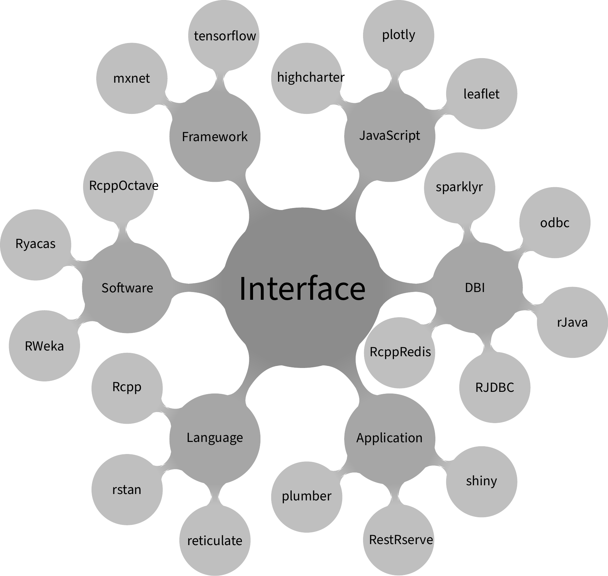
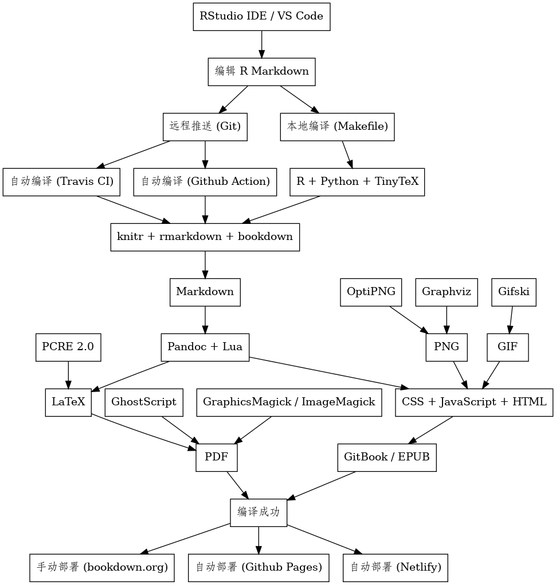

# 前言 {#chap:preface}


> 荃者所以在鱼，得鱼而忘荃；蹄者所以在兔；得兔而忘蹄；言者所以在意，得意而忘言。吾安得夫忘言之人而与之言哉！
>
> --- 摘自 《庄子·杂篇·物》

庄子谈学习，余深以为然，故引之。

> The fish trap exists because of the fish; once you've gotten the fish, you can forget the trap. The rabbit snare exists because of the rabbit; once you've gotten the rabbit, you can forget the snare. Words exist because of meaning; once you've gotten the meaning, you can forget the words. Where can I find a man who has forgotten words so I can have a word with him ? [^notes]
>
> --- Chuang Tzu

[^notes]: 译文摘自 [Eric D. Kolaczyk](http://math.bu.edu/people/kolaczyk/teach.html)

## 语言抉择 {#sec:r-or-python}

\index{Octave}
\index{Python}

行业内可以做统计分析和建模的软件汗牛充栋，比较顶级的收费产品有 SAS 和 SPSS，在科学计算领域的 Matlab 和 Mathematica 也有相当强的统计功能，而用户基数最大的是微软 Excel，抛开微软公司的商业手段不说，Excel 的市场份额却是既成事实。 Brian D. Ripley 20 多年前的一句话很有意思，放在当下也是适用的。

> Let's not kid ourselves: the most widely used piece of software for statistics is Excel.
>
> --- Brian D. Ripley [@Ripley_2002_SS]

有鉴于 Excel 在人文、社会、经济和管理等领域的影响力，熟悉 R 语言的人把它看作超级收费版的 Excel，这实在是一点也不过分。事实上，我司就是一个很好的明证，一个在线教育类的互联网公司，各大业务部门都在使用 Excel 作为主要的数据分析工具。然而，Excel 的不足也十分突出，工作过程无法保存和重复利用，Excel 也不是数据库，数据集稍大，操作起来愈发困难，对于复杂的展示，需要借助内嵌的 VBA，由于缺乏版本控制，随着时间的推移，几乎不可维护。所以，我们还是放弃 Excel 吧，Jenny Bryan 更在 2016 年国际 R 语言大会上的直截了当地喊出了这句话[^bye-excel]。Nathan Stephens 对 Excel 的缺陷不足做了全面的总结[^without-excel]。

> Some people familiar with R describe it as a supercharged version of Microsoft's Excel spreadsheet software.
> 
> --- Ashlee Vance [^AV-NYT-2009]

[^AV-NYT-2009]: <https://www.nytimes.com/2009/01/07/technology/business-computing/07program.html>
[^bye-excel]: <https://channel9.msdn.com/Events/useR-international-R-User-conference/useR2016/jailbreakr-Get-out-of-Excel-free>
[^without-excel]: <https://resources.rstudio.com/wistia-rstudio-essentials-2/how-to-excel-without-using-excel>

另一方面，我们谈谈开源领域的佼佼者 --- R (<https://cran.r-project.org/>)，Python (<https://www.python.org/>) 和 Octave (<http://www.gnu.org/software/octave/>)。Python 号称万能的胶水语言，从系统运维到深度学习都有它的广泛存在，它被各大主流 Linux 系统内置，语言风格上更接近于基数庞大的开发人员，形成了强大的生态平台。 Octave 号称是可以替代 Matlab 的科学计算软件，在兼容 Matlab 的方面确实做的很不错，然而，根据 Julia 官网给出的各大编程语言的测试 <https://julialang.org/benchmarks/>，性能上不能相提并论。

<div class="figure" style="text-align: center">

<p class="caption">(\#fig:r-eco-system)R 语言扩展包生态系统</p>
</div>

R 提供了丰富的图形接口，包括 Tcl/Tk , Gtk, Shiny 等，以及基于它们的衍生品 rattle（[RGtk2](http://www.ggobi.org/rgtk2/)）、[Rcmdr]( https://CRAN.R-project.org/package=Rcmdr)（tcl/tk）、[radiant](https://github.com/radiant-rstats/radiant)（shiny）。更多底层介绍，见 John Chamber 的著作《Extending R》。

TikZ 在绘制示意图方面有很大优势，特别是示意图里包含数学公式，这更是 LaTeX 所擅长的方面

JASP <https://jasp-stats.org> 是一款免费的统计软件，源代码托管在 Github 上 <https://github.com/jasp-stats/jasp-desktop>，主要由阿姆斯特丹大学 E. J. Wagenmakers 教授 <https://www.ejwagenmakers.com/> 领导的团队维护开发，实现了很多贝叶斯和频率统计方法，相似的图形用户界面使得 JASP 可以作为 SPSS 的替代，目前实现的功能见 <https://jasp-stats.org/current-functionality/>，统计方法见博客 <https://www.bayesianspectacles.org/>。

国内可视化分析平台，比如 [hiplot](https://github.com/hiplot) 基于 R 语言实现可视化分析，各类图形的介绍见[文档](https://hiplot.com.cn/docs/zh/)，极大地降低数据分析人员探索分析的门槛，节省了时间，同时非专业内的人也可借助其完成分析探索的过程，只需明白各类图形的含义即可。美团也建设了自己的可视化分析平台帮助运营人员，详见[文档](https://tech.meituan.com/2018/08/02/mt-r-practice.html)

[Patrick Burns](https://www.burns-stat.com/) 收集整理了 R 语言中奇葩的现象，写成 [The R Inferno](https://www.burns-stat.com/pages/Tutor/R_inferno.pdf) 直译过来就是《R 之炼狱》。这些奇葩的怪现象可以看做是 R 风格的一部分，对于编程人员来说就是一些建议和技巧，参考之可以避开某些坑。 Paul E. Johnson 整理了一份真正的 R 语言建议，记录了他自己从 SAS 转换到 R 的过程中遇到的各种问题 <http://pj.freefaculty.org/R/Rtips.html>。Michail Tsagris 和 Manos Papadakis 也收集了 70 多条 R 编程的技巧和建议，力求以更加 R 范地将语言特性发挥到极致 [@Rfast_2018_Tsagris]，Martin Mächler 提供了一份 [Good Practices in R Programming](https://stat.ethz.ch/Teaching/maechler/R/useR_2014/)。 Python 社区广泛流传着 Tim Peters 的 《Python 之禅》，它已经整合进每一版 Python 软件中，只需在 Python 控制台里执行  `import this` 可以获得。

> 1. Beautiful is better than ugly.
1. Explicit is better than implicit.
1. Simple is better than complex.
1. Complex is better than complicated.
1. Flat is better than nested.
1. Sparse is better than dense.
1. Readability counts.
1. Special cases aren't special enough to break the rules.
1. Although practicality beats purity.
1. Errors should never pass silently.
1. Unless explicitly silenced.
1. In the face of ambiguity, refuse the temptation to guess.
1. There should be one-- and preferably only one --obvious way to do it.
1. Although that way may not be obvious at first unless you're Dutch.
1. Now is better than never.
1. Although never is often better than *right* now.
1. If the implementation is hard to explain, it's a bad idea.
1. If the implementation is easy to explain, it may be a good idea.
1. Namespaces are one honking great idea -- let's do more of those!
>
>   --- The Zen of Python

总之，编程语言到一定境界都是殊途同归的，对美的认识也是趋同的，道理更是相通的，Python 社区的 Pandas <https://github.com/pandas-dev/pandas> 和 Matplotlib <https://github.com/matplotlib/matplotlib> 也有数据框和图形语法的影子。Pandas <https://github.com/pandas-dev/pandas> 明确说了要提供与 data.frame 类似的数据结构和对应统计函数等，而  Matplotlib 偷了 ggplot2 绘图样式 <https://matplotlib.org/3.2.2/gallery/style_sheets/ggplot.html>。

## 数据科学 {#sec:data-science}

John M. Chambers 谈了数据科学的源起以及和 S、R 语言的渊源 [@RS_2020_John]。


## 获取帮助 {#sec:r-help}

R 社区提供了丰富的帮助资源，可以在 R 官网搜集的高频问题 <https://cran.r-project.org/faqs.html> 中查找，也可在线搜索 <https://cran.r-project.org/search.html> 或 <https://rseek.org/> ，更多获取帮助方式见 <https://www.r-project.org/help.html>。爆栈网问题以标签分类，比如 [r-plotly](https://stackoverflow.com/questions/tagged/r-plotly)、[r-markdown](https://stackoverflow.com/questions/tagged/r-markdown)、 [data.table](https://stackoverflow.com/questions/tagged/data.table) 和 [ggplot2](https://stackoverflow.com/questions/tagged/ggplot2)，还可以关注一些活跃的社区大佬，比如 [谢益辉](https://stackoverflow.com/users/559676/yihui-xie)。


## 写作环境 {#sec:writing-details}

\index{bookdown}
\index{Pandoc}

<div class="figure" style="text-align: center">

<p class="caption">(\#fig:book-workflow)书籍项目架构图</p>
</div>

本书 R Markdown 源文件托管在 Github 仓库里，本地使用 RStudio IDE 编辑，bookdown 组织各个章节的 Rmd 文件和输出格式，使用 Git 进行版本控制。每次提交修改到 Github 上都会触发 Travis 自动编译书籍，将一系列 Rmd 文件经 knitr 调用 R 解释器执行里面的代码块，并将输出结果返回，Pandoc 将 Rmd 文件转化为 md 、 html 或者 tex 文件。若想输出 pdf 文件，还需要准备 TeX 排版环境，最后使用 Netlify 托管书籍网站，和 Travis 一起实现连续部署，使得每次修改都会同步到网站。最近一次编译时间 2021年06月25日15时31分41秒，本书用 R version 4.1.0 (2021-05-18) 编译，完整运行环境如下：


```r
xfun::session_info(packages = c(
  "knitr", "rmarkdown", "bookdown"
), dependencies = FALSE)
```

```
## R version 4.1.0 (2021-05-18)
## Platform: x86_64-pc-linux-gnu (64-bit)
## Running under: Ubuntu 20.04.2 LTS
## 
## Locale:
##   LC_CTYPE=en_US.UTF-8       LC_NUMERIC=C              
##   LC_TIME=en_US.UTF-8        LC_COLLATE=en_US.UTF-8    
##   LC_MONETARY=en_US.UTF-8    LC_MESSAGES=en_US.UTF-8   
##   LC_PAPER=en_US.UTF-8       LC_NAME=C                 
##   LC_ADDRESS=C               LC_TELEPHONE=C            
##   LC_MEASUREMENT=en_US.UTF-8 LC_IDENTIFICATION=C       
## 
## Package version:
##   bookdown_0.22 knitr_1.33    rmarkdown_2.8
## 
## Pandoc version: 2.11.4
```

借助 **bookdown** [@xie2016] 可以将 Rmd 文件组织起来， **rmarkdown** [@rmarkdown]和 **knitr** [@xie2015] 将源文件编译成 Markdown 文件， [Pandoc](https://pandoc.org/) 将 Markdown 文件转化成 HTML 和 TeX 文件， [TinyTeX](https://yihui.name/tinytex/) [@xie2019] 可以将 TeX 文件进一步编译成 PDF 文档，书中大量的图形在用 **ggplot2** 包制作 [@Wickham_2016_ggplot2]，而统计理论相关的示意图用 Base R 创作。


最后，本书在三个位置提供网页版， 网站 [Github Pages](https://pages.github.com/) 发布最近一次在 Travis 构建成功的版本 <https://xiangyunhuang.github.io/masr/>，网站 [Bookdown](https://bookdown.org) 发布本地手动创建的版本 <https://bookdown.org/xiangyun/masr/> ，网站 [Netlify](https://netlify.com/) 发布最新的开发版 <https://masr.netlify.app/>。


## 记号约定 {#sec:conventions}

正文中的代码、函数、参数及参数值以等宽正体表示，如 `data(list = c('iris', 'BOD'))`{.R}，
其中函数名称 `data()`，参数及参数值 `list = c('iris', 'BOD')`{.R} ，R 程序包用粗体表示，如 **graphics**。
 


```r
ruler()
```

```
----+----1----+----2----+----3----+----4----+----5----+----6----+----7----+----8
12345678901234567890123456789012345678901234567890123456789012345678901234567890
```

## 复现环境 {#sec:contribute}

> 构建容器

本书借助 Github Action 从 Dockerfile 构建容器镜像，然后将镜像文件推送到 Github Package。完成这些操作首先需要从 <https://github.com/settings/tokens> 新建拥有 GitHub Package [^github-package] 读写删的权限的 TOKEN（俗称访问令牌或密钥），命名为 `GITHUB_PKG`，并将此令牌保存到本地 TOKEN.txt 文件中，以备后用。

镜像内默认暴露 8181 端口供外部连接使用，进入容器后，默认工作路径是 `/home/docker/`。创建好镜像后，要先登陆 GitHub Package 然后才有权限将镜像拉取下来

```bash
# 登陆 GitHub Package
cat ~/TOKEN.txt | docker login https://docker.pkg.github.com -u XiangyunHuang --password-stdin
# 拉取镜像
docker pull docker.pkg.github.com/xiangyunhuang/masr/masr-book:devel
```

读者可以先查看下容器内的信息

```bash
docker run --rm -u root -v "/${PWD}://home/docker/" \
  docker.pkg.github.com/xiangyunhuang/masr/masr-book:devel \
  bash -c "locale; fc-list | sort"
```

> 运行容器

下面从镜像创建一个叫 masr-book 的容器，并让它在后台运行，允许以真正的 root 账户权限交互式执行命令，停止容器后，自动销毁容器。 此处，不再介绍 Docker 容器的使用，用容器打包本书所有软件环境仅供读者完整复现本书之用，感兴趣的读者可以去参考书籍[Docker 从入门到实践](https://vuepress.mirror.docker-practice.com/)。

```bash
docker run -itd -p 8282:8787 --rm --name=masr-book --privileged=true \
  docker.pkg.github.com/xiangyunhuang/masr/masr-book:devel /sbin/init
```

接着登陆进入 masr-book 容器，

```bash
docker exec -it masr-book bash
```

一番骚操作后，用户退出容器，然后停止容器。

```bash
docker stop masr-book
```

> 使用 RStudio Server

启动容器后，接着获取容器 masr-book 的 IP 地址，然后依据端口号 8282 从网页进入 RStudio Sever，比如 <http://192.168.100.23:8282>

```bash
docker inspect --format='{{.NetworkSettings.IPAddress}}' masr-book
```

[^github-package]: <https://docs.github.com/en/packages/using-github-packages-with-your-projects-ecosystem/configuring-docker-for-use-with-github-packages>

## 如何发问 {#sec:help-me}

> The phrase "does not work" is not very helpful, it can mean quite a few things including:
> 
* Your computer exploded.
* No explosion, but smoke is pouring out the back and microsoft's "NoSmoke" utility is not compatible with your power supply.
* The computer stopped working.
* The computer sits around on the couch all day eating chips and watching talk shows.
* The computer has started picketing your house shouting catchy slogans and demanding better working conditions and an increase in memory.
* Everything went dark and you cannot check the cables on the back of the computer because the lights are off due to the power outage.
* R crashed, but the other programs are still working.
* R gave an error message and stopped processing your code after running for a while.
* R gave an error message without running any of your code (and is waiting for your next command).
* R is still running your code and the time has exceeded your patience so you think it has hung.
* R completed and returned a result, but also gave warnings.
* R completed your command, but gave an incorrect answer.
* R completed your command but the answer is different from what you expect (but is correct according to the documentation).
> 
> There are probably others. Running your code I think the answer is the last one.
>
> --- Greg Snow [^GS-help-2012]

[^GS-help-2012]: 来自 R 社区论坛收集的智语 `fortunes::fortune(324)`。


## 作者简介 {#sec:about-author}

热心开源事业，统计之都副主编，经常混迹于统计之都论坛、Github 和爆栈网。个人主页 <https://xiangyun.rbind.io/>
