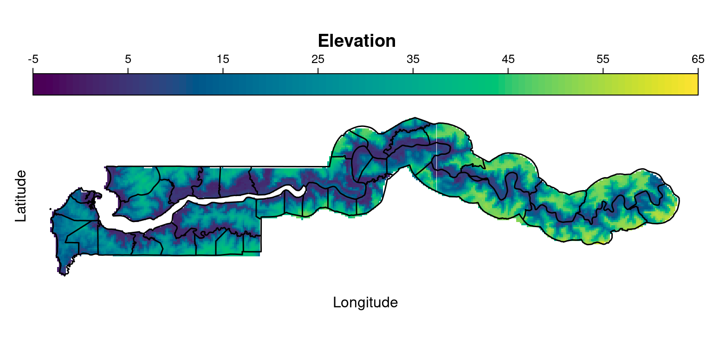

# 空间分析  {#chap:spatial-analysis}


[mapdeck](https://github.com/SymbolixAU/mapdeck) 支持调用 GPU 渲染
[deck.gl](https://github.com/visgl/deck.gl) MIT 协议


Edzer Pebesma

- UseR2020 [Analyzing and visualising spatial and spatiotemporal data cubes - Part I](https://edzer.github.io/UseR2020/)
- UseR2019 [UseR! 2019 Spatial workshop part I](https://edzer.github.io/UseR2019/part1.html) [UseR! 2019 Spatial workshop part II](https://edzer.github.io/UseR2019/part2.html)
- UseR2017 [Spatial Data in R: New Directions](https://edzer.github.io/UseR2017/)
- UseR2016 [Handling and Analyzing Spatial, Spatiotemporal and Movement Data](https://edzer.github.io/UseR2016/)


```r
library(sp)
library(RColorBrewer)
library(raster)
library(lattice)
library(latticeExtra)
library(rasterVis) # https://oscarperpinan.github.io/rastervis/
# https://oscarperpinan.github.io/rastervis/FAQ.html
library(sf)
library(rgdal)
library(highcharter)
```

## 冈比亚儿童疟疾 {#sec:gambia-malaria}

冈比亚地形


```r
sp_path <- "data/" # 存储临时地形文件
if (!dir.exists(sp_path)) dir.create(sp_path, recursive = TRUE)
# Gambia 海拔数据
gambia_alt <- raster::getData(name = "alt", country = "GMB", mask = TRUE, path = sp_path)
# Gambia 市级行政边界数据
gambia_map <- raster::getData("GADM", country = "GMB", level = 2, path = sp_path)
# 绘制冈比亚地形
rasterVis::levelplot(gambia_alt,
  margin = FALSE,
  main = "Elevation",
  colorkey = list(
    space = "top",
    labels = list(at = seq(from = -5, to = 65, by = 10)),
    axis.line = list(col = "black")
  ),
  par.settings = list(
    axis.line = list(col = "transparent")
  ),
  scales = list(draw = FALSE),
  col.regions = hcl.colors,
  at = seq(-5, 65, len = 101)
) +
  latticeExtra::layer(sp::sp.polygons(gambia_map, lwd = 1.5))
```

<div class="figure" style="text-align: center">

<p class="caption">(\#fig:gambia-altitude)冈比亚地形海拔数据</p>
</div>

[rgdal](https://rgdal.r-forge.r-project.org/) 包可以实现坐标变换


```r
# 加载数据
data(gambia, package = "geoR")
# 坐标变换
library(rgdal)
sps <- SpatialPoints(gambia[, c("x", "y")],
  proj4string = CRS("+proj=utm +zone=28")
)
spst <- spTransform(sps, CRS("+proj=longlat +datum=WGS84"))
gambia[, c("x", "y")] <- coordinates(spst)
# 聚合数据
gambia_agg <- aggregate(
  formula = cbind(pos, netuse, treated) ~ x + y + green + phc,
  data = gambia, FUN = function(x) sum(x) / length(x)
)
# 抽取指定位置的海拔数据
# raster::extract(gambia_alt, gambia[, c("x", "y")])
```

$Y \sim b(1,p)$ 每个人检验结果，就是感染 1 或是没有感染 0，感染率 $p$ 的建模分析，个体水平


```r
library(highcharter)
hchart(gambia_agg, "bubble", hcaes(x = x, y = y, fill = pos, size = pos),
  maxSize = "5%", name = "Gambia", showInLegend = FALSE
) %>%
  hc_yAxis(title = list(text = "Latitude")) %>%
  hc_xAxis(title = list(text = "Longitude"), labels = list(align = "center")) %>%
  hc_colorAxis(
    stops = color_stops(colors = hcl.colors(palette = "Plasma", n = 10))
  ) %>%
  hc_tooltip(
    pointFormat = "({point.x:.2f}, {point.y:.2f}) <br/> Size: {point.z:.2f}"
  )
```

<div class="figure" style="text-align: center">

```{=html}
<div id="htmlwidget-dd2d1c9500f242bb5a7c" style="width:100%;height:500px;" class="highchart html-widget"></div>
<script type="application/json" data-for="htmlwidget-dd2d1c9500f242bb5a7c">{"x":{"hc_opts":{"chart":{"reflow":true},"title":{"text":null},"yAxis":{"title":{"text":"Latitude"},"type":"linear"},"credits":{"enabled":false},"exporting":{"enabled":false},"boost":{"enabled":false},"plotOptions":{"series":{"label":{"enabled":false},"turboThreshold":0,"showInLegend":false},"treemap":{"layoutAlgorithm":"squarified"},"scatter":{"marker":{"symbol":"circle"}}},"series":[{"group":"group","data":[{"x":-16.1097141012472,"y":13.2012198348079,"green":40.1,"phc":0,"pos":0.25,"netuse":1,"treated":0,"fill":0.25,"size":0.25,"z":0.25},{"x":-16.2891408396563,"y":13.2037423480732,"green":40.1,"phc":0,"pos":0.411764705882353,"netuse":1,"treated":0,"fill":0.411764705882353,"size":0.411764705882353,"z":0.411764705882353},{"x":-16.2329368454913,"y":13.2060262670302,"green":40.85,"phc":0,"pos":0.384615384615385,"netuse":1,"treated":0,"fill":0.384615384615385,"size":0.384615384615385,"z":0.384615384615385},{"x":-16.2143123870568,"y":13.2090173879772,"green":40.85,"phc":0,"pos":0.631578947368421,"netuse":0.973684210526316,"treated":0,"fill":0.631578947368421,"size":0.631578947368421,"z":0.631578947368421},{"x":-16.2304134706125,"y":13.2309364551102,"green":40.85,"phc":0,"pos":0.388888888888889,"netuse":0.611111111111111,"treated":0,"fill":0.388888888888889,"size":0.388888888888889,"z":0.388888888888889},{"x":-16.0177351068672,"y":13.2617445004008,"green":40.85,"phc":0,"pos":0.4,"netuse":1,"treated":0,"fill":0.4,"size":0.4,"z":0.4},{"x":-16.2586908179484,"y":13.5374248337525,"green":40.85,"phc":0,"pos":0.333333333333333,"netuse":0.166666666666667,"treated":0,"fill":0.333333333333333,"size":0.333333333333333,"z":0.333333333333333},{"x":-16.1956855743878,"y":13.561872253698,"green":40.85,"phc":0,"pos":0.105263157894737,"netuse":0,"treated":0,"fill":0.105263157894737,"size":0.105263157894737,"z":0.105263157894737},{"x":-15.9987934504427,"y":13.5645094425938,"green":40.85,"phc":0,"pos":0.37037037037037,"netuse":0.444444444444444,"treated":0,"fill":0.37037037037037,"size":0.37037037037037,"z":0.37037037037037},{"x":-15.9513506559961,"y":13.5836450585512,"green":40.85,"phc":0,"pos":0.65,"netuse":0,"treated":0,"fill":0.65,"size":0.65,"z":0.65},{"x":-14.9408510671109,"y":13.5340472787706,"green":44.1,"phc":0,"pos":0.171428571428571,"netuse":1,"treated":0,"fill":0.171428571428571,"size":0.171428571428571,"z":0.171428571428571},{"x":-14.8642295944965,"y":13.4690482283121,"green":45.5,"phc":0,"pos":0.363636363636364,"netuse":1,"treated":0,"fill":0.363636363636364,"size":0.363636363636364,"z":0.363636363636364},{"x":-14.8167440745926,"y":13.5377035490104,"green":45.5,"phc":0,"pos":0.268292682926829,"netuse":0.926829268292683,"treated":0,"fill":0.268292682926829,"size":0.268292682926829,"z":0.268292682926829},{"x":-14.0752890635798,"y":13.3029572206348,"green":50.1,"phc":0,"pos":0.612903225806452,"netuse":0.354838709677419,"treated":0,"fill":0.612903225806452,"size":0.612903225806452,"z":0.612903225806452},{"x":-15.0316911671915,"y":13.6132357606664,"green":52.25,"phc":0,"pos":0.15,"netuse":1,"treated":0,"fill":0.15,"size":0.15,"z":0.15},{"x":-14.3324796891712,"y":13.3436194894807,"green":54.2,"phc":0,"pos":0.297297297297297,"netuse":0.756756756756757,"treated":0,"fill":0.297297297297297,"size":0.297297297297297,"z":0.297297297297297},{"x":-14.0325318361365,"y":13.4375495939275,"green":54.2,"phc":0,"pos":0.481481481481481,"netuse":0.851851851851852,"treated":0,"fill":0.481481481481481,"size":0.481481481481481,"z":0.481481481481481},{"x":-15.0334383078111,"y":13.5991657364986,"green":54.2,"phc":0,"pos":0,"netuse":1,"treated":0.0833333333333333,"fill":0,"size":0,"z":0},{"x":-14.0204139971555,"y":13.346927485487,"green":56.6,"phc":0,"pos":0.625,"netuse":0.5,"treated":0,"fill":0.625,"size":0.625,"z":0.625},{"x":-14.1266018185558,"y":13.2755709463541,"green":58.95,"phc":0,"pos":0.933333333333333,"netuse":0.866666666666667,"treated":0,"fill":0.933333333333333,"size":0.933333333333333,"z":0.933333333333333},{"x":-14.1266628146512,"y":13.2858785497203,"green":58.95,"phc":0,"pos":0.818181818181818,"netuse":0.818181818181818,"treated":0,"fill":0.818181818181818,"size":0.818181818181818,"z":0.818181818181818},{"x":-14.1570770051232,"y":13.3049233007948,"green":58.95,"phc":0,"pos":0.555555555555556,"netuse":0.740740740740741,"treated":0,"fill":0.555555555555556,"size":0.555555555555556,"z":0.555555555555556},{"x":-13.8906069755123,"y":13.5445867118458,"green":58.95,"phc":0,"pos":0.923076923076923,"netuse":0.230769230769231,"treated":0,"fill":0.923076923076923,"size":0.923076923076923,"z":0.923076923076923},{"x":-13.9716796802591,"y":13.5653479295677,"green":58.95,"phc":0,"pos":0.783783783783784,"netuse":0,"treated":0,"fill":0.783783783783784,"size":0.783783783783784,"z":0.783783783783784},{"x":-16.1174324036202,"y":13.566158379176,"green":28.85,"phc":1,"pos":0.4375,"netuse":0.9375,"treated":0.8125,"fill":0.4375,"size":0.4375,"z":0.4375},{"x":-16.0923707698178,"y":13.4908051622507,"green":33.65,"phc":1,"pos":0.0943396226415094,"netuse":1,"treated":0,"fill":0.0943396226415094,"size":0.0943396226415094,"z":0.0943396226415094},{"x":-16.1364209586996,"y":13.5296475443355,"green":33.65,"phc":1,"pos":0.193548387096774,"netuse":1,"treated":1,"fill":0.193548387096774,"size":0.193548387096774,"z":0.193548387096774},{"x":-16.1238587369455,"y":13.1995669194331,"green":40.1,"phc":1,"pos":0.375,"netuse":1,"treated":0.875,"fill":0.375,"size":0.375,"z":0.375},{"x":-16.3875510346675,"y":13.1854096027587,"green":40.85,"phc":1,"pos":0.515151515151515,"netuse":0.818181818181818,"treated":0,"fill":0.515151515151515,"size":0.515151515151515,"z":0.515151515151515},{"x":-16.3054302344997,"y":13.2044372719998,"green":40.85,"phc":1,"pos":0.301587301587302,"netuse":0.73015873015873,"treated":0.619047619047619,"fill":0.301587301587302,"size":0.301587301587302,"z":0.301587301587302},{"x":-16.1960397520862,"y":13.2066805166336,"green":40.85,"phc":1,"pos":0.125,"netuse":0.892857142857143,"treated":0,"fill":0.125,"size":0.125,"z":0.125},{"x":-16.0416881090156,"y":13.2281591583243,"green":40.85,"phc":1,"pos":0.214285714285714,"netuse":0.928571428571429,"treated":0,"fill":0.214285714285714,"size":0.214285714285714,"z":0.214285714285714},{"x":-16.0869288666465,"y":13.2317227932836,"green":40.85,"phc":1,"pos":0.137931034482759,"netuse":0.758620689655172,"treated":0.620689655172414,"fill":0.137931034482759,"size":0.137931034482759,"z":0.137931034482759},{"x":-16.0115828839701,"y":13.2357301198612,"green":40.85,"phc":1,"pos":0.5,"netuse":0.9,"treated":0,"fill":0.5,"size":0.5,"z":0.5},{"x":-15.9856536826947,"y":13.544562690998,"green":40.85,"phc":1,"pos":0.333333333333333,"netuse":0.166666666666667,"treated":0,"fill":0.333333333333333,"size":0.333333333333333,"z":0.333333333333333},{"x":-16.0799143315418,"y":13.5750298525923,"green":40.85,"phc":1,"pos":0.266666666666667,"netuse":1,"treated":0.966666666666667,"fill":0.266666666666667,"size":0.266666666666667,"z":0.266666666666667},{"x":-16.045846499426,"y":13.5776883693428,"green":40.85,"phc":1,"pos":0.714285714285714,"netuse":0.0476190476190476,"treated":0,"fill":0.714285714285714,"size":0.714285714285714,"z":0.714285714285714},{"x":-16.1608815273821,"y":13.5783367673809,"green":40.85,"phc":1,"pos":0.307692307692308,"netuse":0.0384615384615385,"treated":0,"fill":0.307692307692308,"size":0.307692307692308,"z":0.307692307692308},{"x":-14.929932830459,"y":13.5374082069845,"green":44.1,"phc":1,"pos":0.0967741935483871,"netuse":1,"treated":0.935483870967742,"fill":0.0967741935483871,"size":0.0967741935483871,"z":0.0967741935483871},{"x":-15.121762326665,"y":13.5953314263299,"green":44.1,"phc":1,"pos":0.206896551724138,"netuse":0.931034482758621,"treated":0,"fill":0.206896551724138,"size":0.206896551724138,"z":0.206896551724138},{"x":-14.0515069009844,"y":13.4702336779315,"green":45.5,"phc":1,"pos":0.451612903225806,"netuse":0.903225806451613,"treated":0.774193548387097,"fill":0.451612903225806,"size":0.451612903225806,"z":0.451612903225806},{"x":-14.8377812654872,"y":13.4720617378021,"green":45.5,"phc":1,"pos":0.266666666666667,"netuse":0.9,"treated":0.766666666666667,"fill":0.266666666666667,"size":0.266666666666667,"z":0.266666666666667},{"x":-14.835725345411,"y":13.4953082623297,"green":45.5,"phc":1,"pos":0.214285714285714,"netuse":1,"treated":0,"fill":0.214285714285714,"size":0.214285714285714,"z":0.214285714285714},{"x":-15.1081305126543,"y":13.6451334505171,"green":45.5,"phc":1,"pos":0.379310344827586,"netuse":1,"treated":0,"fill":0.379310344827586,"size":0.379310344827586,"z":0.379310344827586},{"x":-15.9661319280627,"y":13.4839272300477,"green":47.65,"phc":1,"pos":0.0294117647058824,"netuse":1,"treated":1,"fill":0.0294117647058824,"size":0.0294117647058824,"z":0.0294117647058824},{"x":-14.0629824610548,"y":13.294223355707,"green":50.1,"phc":1,"pos":0.655172413793103,"netuse":0.620689655172414,"treated":0.551724137931034,"fill":0.655172413793103,"size":0.655172413793103,"z":0.655172413793103},{"x":-13.9517296401983,"y":13.3299899300031,"green":50.1,"phc":1,"pos":0.714285714285714,"netuse":0.214285714285714,"treated":0,"fill":0.714285714285714,"size":0.714285714285714,"z":0.714285714285714},{"x":-13.8727270264025,"y":13.330944101097,"green":50.1,"phc":1,"pos":0.483870967741935,"netuse":0.419354838709677,"treated":0,"fill":0.483870967741935,"size":0.483870967741935,"z":0.483870967741935},{"x":-13.9406976493241,"y":13.3340306880992,"green":50.1,"phc":1,"pos":0.419354838709677,"netuse":0.0645161290322581,"treated":0,"fill":0.419354838709677,"size":0.419354838709677,"z":0.419354838709677},{"x":-13.9808758446358,"y":13.3586426561805,"green":50.1,"phc":1,"pos":0.5,"netuse":0.6,"treated":0,"fill":0.5,"size":0.5,"z":0.5},{"x":-13.9408876346407,"y":13.4108353343229,"green":50.1,"phc":1,"pos":0.25,"netuse":0.666666666666667,"treated":0,"fill":0.25,"size":0.25,"z":0.25},{"x":-14.7825560321666,"y":13.4383553991106,"green":50.55,"phc":1,"pos":0.25,"netuse":0.571428571428571,"treated":0,"fill":0.25,"size":0.25,"z":0.25},{"x":-15.0618905926577,"y":13.664382136929,"green":50.55,"phc":1,"pos":0.0625,"netuse":1,"treated":0.9375,"fill":0.0625,"size":0.0625,"z":0.0625},{"x":-14.2181727309202,"y":13.3829496614494,"green":52.25,"phc":1,"pos":0.338709677419355,"netuse":0.338709677419355,"treated":0.290322580645161,"fill":0.338709677419355,"size":0.338709677419355,"z":0.338709677419355},{"x":-14.9740220556185,"y":13.545853166365,"green":52.25,"phc":1,"pos":0.148148148148148,"netuse":1,"treated":0.925925925925926,"fill":0.148148148148148,"size":0.148148148148148,"z":0.148148148148148},{"x":-15.0616171706532,"y":13.6084106165391,"green":52.25,"phc":1,"pos":0,"netuse":1,"treated":0.96,"fill":0,"size":0,"z":0},{"x":-14.219210568185,"y":13.374408466602,"green":54.2,"phc":1,"pos":0.310344827586207,"netuse":0.827586206896552,"treated":0,"fill":0.310344827586207,"size":0.310344827586207,"z":0.310344827586207},{"x":-14.2033947600653,"y":13.3789794487089,"green":54.2,"phc":1,"pos":0.2,"netuse":0.942857142857143,"treated":0.942857142857143,"fill":0.2,"size":0.2,"z":0.2},{"x":-14.8548947413597,"y":13.4958807065469,"green":54.2,"phc":1,"pos":0.107142857142857,"netuse":1,"treated":1,"fill":0.107142857142857,"size":0.107142857142857,"z":0.107142857142857},{"x":-14.0832118847772,"y":13.401049243998,"green":55.4,"phc":1,"pos":0.633333333333333,"netuse":0.766666666666667,"treated":0.766666666666667,"fill":0.633333333333333,"size":0.633333333333333,"z":0.633333333333333},{"x":-14.1118821447581,"y":13.3346516196092,"green":56.6,"phc":1,"pos":0.633333333333333,"netuse":0.166666666666667,"treated":0.166666666666667,"fill":0.633333333333333,"size":0.633333333333333,"z":0.633333333333333},{"x":-14.2408346301728,"y":13.4368983025681,"green":56.6,"phc":1,"pos":0.586206896551724,"netuse":0.137931034482759,"treated":0,"fill":0.586206896551724,"size":0.586206896551724,"z":0.586206896551724},{"x":-14.0333508616595,"y":13.3756833015196,"green":58.95,"phc":1,"pos":0.655172413793103,"netuse":0.862068965517241,"treated":0.827586206896552,"fill":0.655172413793103,"size":0.655172413793103,"z":0.655172413793103},{"x":-14.272228504554,"y":13.405317664289,"green":58.95,"phc":1,"pos":0.566666666666667,"netuse":0.6,"treated":0,"fill":0.566666666666667,"size":0.566666666666667,"z":0.566666666666667},{"x":-14.1214061992167,"y":13.4123693366092,"green":58.95,"phc":1,"pos":0.419354838709677,"netuse":0.967741935483871,"treated":0.935483870967742,"fill":0.419354838709677,"size":0.419354838709677,"z":0.419354838709677}],"type":"bubble","maxSize":"5%","name":"Gambia","showInLegend":false}],"xAxis":{"type":"linear","title":{"text":"Longitude"},"labels":{"align":"center"}},"colorAxis":{"stops":[[0,"#001889"],[0.111111111111111,"#58008B"],[0.222222222222222,"#87008D"],[0.333333333333333,"#AB1488"],[0.444444444444444,"#C73B7B"],[0.555555555555556,"#DB6063"],[0.666666666666667,"#E8853A"],[0.777777777777778,"#EDAC00"],[0.888888888888889,"#E8D400"],[1,"#DAFF47"]]},"tooltip":{"pointFormat":"({point.x:.2f}, {point.y:.2f}) <br/> Size: {point.z:.2f}"}},"theme":{"chart":{"backgroundColor":"transparent"},"colors":["#7cb5ec","#434348","#90ed7d","#f7a35c","#8085e9","#f15c80","#e4d354","#2b908f","#f45b5b","#91e8e1"]},"conf_opts":{"global":{"Date":null,"VMLRadialGradientURL":"http =//code.highcharts.com/list(version)/gfx/vml-radial-gradient.png","canvasToolsURL":"http =//code.highcharts.com/list(version)/modules/canvas-tools.js","getTimezoneOffset":null,"timezoneOffset":0,"useUTC":true},"lang":{"contextButtonTitle":"Chart context menu","decimalPoint":".","downloadJPEG":"Download JPEG image","downloadPDF":"Download PDF document","downloadPNG":"Download PNG image","downloadSVG":"Download SVG vector image","drillUpText":"Back to {series.name}","invalidDate":null,"loading":"Loading...","months":["January","February","March","April","May","June","July","August","September","October","November","December"],"noData":"No data to display","numericSymbols":["k","M","G","T","P","E"],"printChart":"Print chart","resetZoom":"Reset zoom","resetZoomTitle":"Reset zoom level 1:1","shortMonths":["Jan","Feb","Mar","Apr","May","Jun","Jul","Aug","Sep","Oct","Nov","Dec"],"thousandsSep":" ","weekdays":["Sunday","Monday","Tuesday","Wednesday","Thursday","Friday","Saturday"]}},"type":"chart","fonts":[],"debug":false},"evals":[],"jsHooks":[]}</script>
```

<p class="caption">(\#fig:hc-gambia-pos)各个村庄疟疾流行度</p>
</div>


```r
# gm_data <- download_map_data("https://code.highcharts.com/mapdata/countries/gm/gm-all.js")
# get_data_from_map(gm_data)

hcmap("countries/gm/gm-all.js") %>%
  hc_title(text = "Gambia")
```

```{=html}
<div id="htmlwidget-27da1ece175135332315" style="width:100%;height:500px;" class="highchart html-widget"></div>
<script type="application/json" data-for="htmlwidget-27da1ece175135332315">{"x":{"hc_opts":{"chart":{"reflow":true},"title":{"text":"Gambia"},"yAxis":{"title":{"text":null}},"credits":{"enabled":true},"exporting":{"enabled":false},"boost":{"enabled":false},"plotOptions":{"series":{"label":{"enabled":false},"turboThreshold":0},"treemap":{"layoutAlgorithm":"squarified"}},"series":[{"mapData":{"title":"Gambia","version":"1.1.3","type":"FeatureCollection","copyright":"Copyright (c) 2020 Highsoft AS, Based on data from Natural Earth","copyrightShort":"Natural Earth","copyrightUrl":"http://www.naturalearthdata.com","crs":{"type":"name","properties":{"name":"urn:ogc:def:crs:EPSG:32628"}},"hc-transform":{"default":{"crs":"+proj=utm +zone=28 +datum=WGS84 +units=m +no_defs","scale":0.00214685731148,"jsonres":15.5,"jsonmarginX":-999,"jsonmarginY":9851,"xoffset":301826.770693,"yoffset":1527819.77649}},"features":[{"type":"Feature","id":"GM.MC","properties":{"hc-group":"admin1","hc-middle-x":0.55,"hc-middle-y":0.42,"hc-key":"gm-mc","hc-a2":"MC","labelrank":"6","hasc":"GM.MC","alt-name":null,"woe-id":"2345445","subregion":null,"fips":"GA03","postal-code":"MC","name":"Central River","country":"Gambia","type-en":"Division","region":null,"longitude":"-14.9804","woe-name":"Maccarthy Island","latitude":"13.637","woe-label":"MacCarthy Island, GM, The Gambia","type":"Division"},"geometry":{"type":"Polygon","coordinates":[[[4515,8660],[4507,8660],[4296,8814],[4254,8918],[4260,9088],[4271,9139],[4230,9162],[4106,9170],[4016,9169],[3853,9194],[3803,9196],[3836,9302],[3873,9379],[3913,9441],[4026,9562],[4178,9674],[4345,9736],[4500,9711],[4534,9679],[4604,9587],[4634,9564],[4711,9582],[4982,9755],[5244,9851],[5321,9847],[5535,9766],[5898,9750],[6030,9706],[6157,9603],[6202,9541],[6235,9473],[6305,9234],[6330,9206],[6478,9117],[6528,9099],[6572,9113],[6793,9237],[6939,9276],[7087,9265],[7242,9193],[7311,9137],[7360,9077],[7395,9006],[7443,8847],[7466,8797],[7532,8737],[7477,8701],[7446,8663],[7421,8586],[7392,8547],[7329,8504],[7417,8316],[7438,8302],[7386,8272],[7355,8287],[7305,8249],[7225,8071],[7210,8024],[7106,8120],[7065,8134],[6948,8105],[6815,8089],[6683,8104],[6563,8155],[6462,8245],[6389,8346],[6351,8370],[6277,8384],[6211,8405],[6090,8479],[6036,8495],[5898,8506],[5777,8538],[5541,8658],[5361,8788],[5199,8940],[5100,9005],[5018,8972],[4943,8894],[4913,8904],[4885,8898],[4841,8866],[4751,8824],[4524,8692],[4515,8660]]]}},{"type":"Feature","id":"GM.UR","properties":{"hc-group":"admin1","hc-middle-x":0.57,"hc-middle-y":0.5,"hc-key":"gm-ur","hc-a2":"UR","labelrank":"6","hasc":"GM.UR","alt-name":null,"woe-id":"2345446","subregion":null,"fips":"GA04","postal-code":"UR","name":"Upper River","country":"Gambia","type-en":"Division","region":null,"longitude":"-14.1857","woe-name":"Upper River","latitude":"13.3797","woe-label":"Upper River, GM, The Gambia","type":"Division"},"geometry":{"type":"Polygon","coordinates":[[[7532,8737],[7794,8550],[7881,8510],[7947,8501],[8009,8516],[8220,8592],[8419,8717],[8488,8747],[8695,8795],[8862,8881],[8934,8899],[9036,8896],[9073,8902],[9116,8921],[9189,8964],[9237,8972],[9313,8959],[9404,8928],[9491,8884],[9551,8835],[9570,8803],[9593,8734],[9612,8703],[9645,8675],[9727,8627],[9764,8597],[9851,8424],[9838,8235],[9736,8078],[9558,8000],[9286,7975],[9141,7936],[8996,7933],[8841,7877],[8779,7877],[8725,7853],[8552,7722],[8474,7683],[8369,7679],[8173,7715],[7968,7696],[7871,7704],[7777,7730],[7645,7798],[7573,7854],[7505,7933],[7457,7946],[7343,7951],[7291,7966],[7243,7993],[7210,8024],[7225,8071],[7305,8249],[7355,8287],[7386,8272],[7438,8302],[7417,8316],[7329,8504],[7392,8547],[7421,8586],[7446,8663],[7477,8701],[7532,8737]]]}},{"type":"Feature","id":"GM.BJ","properties":{"hc-group":"admin1","hc-middle-x":0.5,"hc-middle-y":0.53,"hc-key":"gm-bj","hc-a2":"BJ","labelrank":"6","hasc":"GM.BJ","alt-name":null,"woe-id":"2345443","subregion":null,"fips":"GA01","postal-code":"BJ","name":"Banjul","country":"Gambia","type-en":"Independent City","region":null,"longitude":"-16.6831","woe-name":"Banjul","latitude":"13.4063","woe-label":"Banjul, GM, The Gambia","type":"Independent City"},"geometry":{"type":"Polygon","coordinates":[[[-757,8346],[-544,8604],[-451,8680],[-444,8642],[-424,8615],[-356,8576],[-292,8610],[-228,8612],[-173,8590],[-135,8550],[-116,8483],[-155,8472],[-215,8468],[-256,8425],[-201,8375],[-154,8269],[-240,8200],[-400,8085],[-547,8098],[-660,8214],[-757,8346]]]}},{"type":"Feature","id":"GM.LR","properties":{"hc-group":"admin1","hc-middle-x":0.22,"hc-middle-y":0.7,"hc-key":"gm-lr","hc-a2":"LR","labelrank":"6","hasc":"GM.LR","alt-name":"South Bank","woe-id":"2345444","subregion":null,"fips":"GA02","postal-code":"LR","name":"Lower River","country":"Gambia","type-en":"Division","region":null,"longitude":"-15.7046","woe-name":"Lower River","latitude":"13.4062","woe-label":"Lower River, GM, The Gambia","type":"Division"},"geometry":{"type":"Polygon","coordinates":[[[1446,7888],[1406,7883],[1336,7851],[1272,7797],[1257,7819],[1232,7997],[1191,8021],[1180,8043],[1171,8103],[1183,8170],[1213,8216],[1358,8335],[1385,8364],[1397,8403],[1412,8421],[1447,8414],[1506,8390],[2011,8361],[2204,8405],[2273,8412],[2351,8405],[2412,8423],[2457,8461],[2535,8466],[2768,8438],[2842,8445],[3052,8510],[3153,8578],[3187,8587],[3222,8575],[3273,8522],[3309,8509],[3397,8516],[3431,8530],[3472,8559],[3503,8596],[3561,8685],[3595,8710],[3638,8711],[3683,8697],[3756,8649],[3793,8632],[3832,8638],[3903,8661],[3971,8641],[4015,8596],[4049,8545],[4087,8507],[4211,8467],[4369,8456],[4498,8510],[4534,8660],[4515,8660],[4524,8692],[4751,8824],[4841,8866],[4885,8898],[4913,8904],[4943,8894],[4861,8809],[4811,8728],[4797,8500],[4775,8398],[4701,8302],[4597,8233],[4479,8190],[4362,8168],[4229,8168],[3836,8253],[3724,8258],[3639,8227],[3556,8181],[3447,8145],[3389,8140],[3146,8164],[3100,8163],[2938,8112],[2687,8088],[2645,8066],[2631,8014],[2624,7753],[2096,7868],[2067,7870],[1970,7846],[1845,7828],[1762,7846],[1725,7829],[1688,7775],[1639,7786],[1602,7820],[1580,7889],[1565,7905],[1496,7913],[1446,7888]]]}},{"type":"Feature","id":"GM.WC","properties":{"hc-group":"admin1","hc-middle-x":0.2,"hc-middle-y":0.41,"hc-key":"gm-wc","hc-a2":"WC","labelrank":"6","hasc":"GM.WE","alt-name":null,"woe-id":"2345447","subregion":null,"fips":"GA05","postal-code":"WC","name":"West Coast","country":"Gambia","type-en":"Division","region":null,"longitude":"-16.3138","woe-name":null,"latitude":"13.2212","woe-label":null,"type":"Division"},"geometry":{"type":"Polygon","coordinates":[[[-154,8269],[-129,8159],[-137,8097],[-6,7939],[23,7918],[206,7909],[257,7894],[304,7864],[332,7838],[369,7820],[443,7813],[477,7788],[498,7731],[499,7665],[477,7614],[548,7673],[581,7675],[628,7638],[607,7676],[527,7753],[519,7800],[493,7831],[455,7844],[405,7840],[405,7866],[511,7863],[560,7870],[604,7892],[640,7818],[681,7834],[730,7885],[789,7914],[856,7934],[990,8021],[1062,8040],[1162,8009],[1177,7936],[1161,7851],[1170,7786],[1234,7768],[1322,7794],[1445,7860],[1446,7888],[1496,7913],[1565,7905],[1580,7889],[1602,7820],[1639,7786],[1688,7775],[1725,7829],[1762,7846],[1845,7828],[1970,7846],[2067,7870],[2096,7868],[2624,7753],[2615,7433],[2590,7416],[311,7446],[-440,7458],[-566,7431],[-620,7341],[-632,7306],[-689,7250],[-712,7220],[-726,7179],[-732,7094],[-786,7142],[-842,7161],[-851,7188],[-809,7271],[-816,7326],[-884,7509],[-887,7553],[-877,7725],[-885,7773],[-905,7822],[-966,7893],[-981,7942],[-953,8000],[-966,8020],[-999,8103],[-966,8142],[-927,8255],[-889,8279],[-845,8289],[-798,8314],[-757,8346],[-660,8214],[-547,8098],[-400,8085],[-240,8200],[-154,8269]]]}},{"type":"Feature","id":"GM.NB","properties":{"hc-group":"admin1","hc-middle-x":0.17,"hc-middle-y":0.55,"hc-key":"gm-nb","hc-a2":"NB","labelrank":"6","hasc":"GM.NB","alt-name":null,"woe-id":"2345448","subregion":null,"fips":"GA07","postal-code":"NB","name":"North Bank","country":"Gambia","type-en":"Division","region":null,"longitude":"-15.9799","woe-name":null,"latitude":"13.5236","woe-label":null,"type":"Division"},"geometry":{"type":"Polygon","coordinates":[[[4507,8660],[4500,8605],[4474,8556],[4436,8520],[4396,8507],[4329,8515],[4205,8550],[4149,8558],[4098,8576],[4039,8619],[3952,8697],[3920,8712],[3828,8686],[3795,8694],[3731,8737],[3681,8748],[3640,8770],[3593,8780],[3522,8760],[3485,8731],[3432,8659],[3396,8637],[3335,8634],[3238,8680],[3175,8688],[3110,8673],[2951,8588],[2823,8549],[1668,8463],[1554,8504],[1483,8516],[1416,8501],[1350,8466],[1249,8391],[1097,8239],[981,8169],[950,8192],[948,8219],[966,8300],[951,8343],[890,8287],[882,8257],[903,8215],[852,8192],[852,8167],[903,8144],[832,8108],[709,8090],[584,8087],[507,8094],[228,8164],[111,8171],[133,8204],[178,8294],[186,8333],[179,8384],[121,8511],[55,8561],[32,8602],[-11,8638],[-10,8714],[21,8868],[18,8926],[-2,8975],[-26,9011],[1541,8997],[1988,8993],[3730,8981],[3787,9000],[3794,9146],[3803,9196],[3853,9194],[4016,9169],[4106,9170],[4230,9162],[4271,9139],[4260,9088],[4254,8918],[4296,8814],[4507,8660]]]}}]}}]},"theme":{"chart":{"backgroundColor":"transparent"},"colors":["#7cb5ec","#434348","#90ed7d","#f7a35c","#8085e9","#f15c80","#e4d354","#2b908f","#f45b5b","#91e8e1"]},"conf_opts":{"global":{"Date":null,"VMLRadialGradientURL":"http =//code.highcharts.com/list(version)/gfx/vml-radial-gradient.png","canvasToolsURL":"http =//code.highcharts.com/list(version)/modules/canvas-tools.js","getTimezoneOffset":null,"timezoneOffset":0,"useUTC":true},"lang":{"contextButtonTitle":"Chart context menu","decimalPoint":".","downloadJPEG":"Download JPEG image","downloadPDF":"Download PDF document","downloadPNG":"Download PNG image","downloadSVG":"Download SVG vector image","drillUpText":"Back to {series.name}","invalidDate":null,"loading":"Loading...","months":["January","February","March","April","May","June","July","August","September","October","November","December"],"noData":"No data to display","numericSymbols":["k","M","G","T","P","E"],"printChart":"Print chart","resetZoom":"Reset zoom","resetZoomTitle":"Reset zoom level 1:1","shortMonths":["Jan","Feb","Mar","Apr","May","Jun","Jul","Aug","Sep","Oct","Nov","Dec"],"thousandsSep":" ","weekdays":["Sunday","Monday","Tuesday","Wednesday","Thursday","Friday","Saturday"]}},"type":"map","fonts":[],"debug":false},"evals":[],"jsHooks":[]}</script>
```


```r
data("USArrests", package = "datasets")
data("usgeojson") # 加载地图数据 地图数据的结构

USArrests <- transform(USArrests, state = rownames(USArrests))

highchart() %>%
  hc_title(text = "Violent Crime Rates by US State") %>%
  hc_subtitle(text = "Source: USArrests data") %>%
  hc_add_series_map(usgeojson, USArrests,
    name = "Murder arrests (per 100,000)",
    value = "Murder", joinBy = c("woename", "state"),
    dataLabels = list(
      enabled = TRUE,
      format = "{point.properties.postalcode}"
    )
  ) %>%
  hc_colorAxis(stops = color_stops()) %>%
  hc_legend(valueDecimals = 0, valueSuffix = "%") %>%
  hc_mapNavigation(enabled = TRUE)
```

```{=html}
<div id="htmlwidget-50bb0f9a1c5edcc5af09" style="width:100%;height:500px;" class="highchart html-widget"></div>
<script type="application/json" data-for="htmlwidget-50bb0f9a1c5edcc5af09">{"x":{"hc_opts":{"chart":{"reflow":true},"title":{"text":"Violent Crime Rates by US State"},"yAxis":{"title":{"text":null}},"credits":{"enabled":false},"exporting":{"enabled":false},"boost":{"enabled":false},"plotOptions":{"series":{"label":{"enabled":false},"turboThreshold":0},"treemap":{"layoutAlgorithm":"squarified"}},"subtitle":{"text":"Source: USArrests data"},"series":[{"mapData":{"title":"United States of America","version":"1.1.2","type":"FeatureCollection","copyright":"Copyright (c) 2015 Highsoft AS, Based on data from Natural Earth","copyrightShort":"Natural Earth","copyrightUrl":"http://www.naturalearthdata.com","crs":{"type":"name","properties":{"name":"urn:ogc:def:crs:EPSG:102004"}},"hc-transform":{"default":{"crs":"+proj=lcc +lat_1=33 +lat_2=45 +lat_0=39 +lon_0=-96 +x_0=0 +y_0=0 +datum=NAD83 +units=m +no_defs","scale":0.000151481324748,"jsonres":15.5,"jsonmarginX":-999,"jsonmarginY":9851,"xoffset":-2361356.09818,"yoffset":1398996.77886},"us-all-hawaii":{"xpan":190,"ypan":417,"hitZone":{"type":"Polygon","coordinates":[[[1747,3920],[3651,2950],[3651,-999],[1747,-999],[1747,3920]]]},"crs":"+proj=aea +lat_1=8 +lat_2=18 +lat_0=13 +lon_0=-157 +x_0=0 +y_0=0 +datum=NAD83 +units=m +no_defs","scale":0.000123090941806,"jsonres":15.5,"jsonmarginX":-999,"jsonmarginY":9851,"xoffset":-338610.47557,"yoffset":1022754.31736},"us-all-alaska":{"rotation":-0.0174532925199,"xpan":5,"ypan":357,"hitZone":{"type":"Polygon","coordinates":[[[-999,5188],[-707,5188],[1747,3920],[1747,-999],[-999,-999],[-999,5188]]]},"crs":"+proj=tmerc +lat_0=54 +lon_0=-142 +k=0.9999 +x_0=500000 +y_0=0 +ellps=GRS80 +towgs84=0,0,0,0,0,0,0 +units=m +no_defs","scale":5.84397059179e-05,"jsonres":15.5,"jsonmarginX":-999,"jsonmarginY":9851,"xoffset":-1566154.00853,"yoffset":1992671.14918}},"features":[{"type":"Feature","id":"US.MA","properties":{"labelrank":"0","hasc":"US.MA","woeid":"2347580","statefips":"25","fips":"US25","postalcode":"MA","name":"Massachusetts","country":"United States of America","region":"Northeast","longitude":"-71.99930000000001","woename":"Massachusetts","latitude":"42.3739","woelabel":"Massachusetts, US, United States","type":"State","code":"us-ma"},"geometry":{"type":"MultiPolygon","coordinates":[[[[9430,7889],[9476,7878],[9436,7864],[9417,7844],[9430,7889]]],[[[9314,7915],[9312,7927],[9304,7921],[9278,7938],[9254,7990],[9177,7968],[8997,7925],[8860,7896],[8853,7901],[8856,8080],[8922,8096],[9005,8115],[9005,8115],[9222,8166],[9242,8201],[9300,8236],[9318,8197],[9357,8186],[9312,8147],[9299,8081],[9324,8091],[9365,8074],[9428,7985],[9483,7974],[9525,8007],[9501,8067],[9535,8028],[9549,7982],[9504,7965],[9420,7906],[9411,7955],[9371,7921],[9373,7898],[9339,7878],[9327,7915],[9314,7915]]]]}},{"type":"Feature","id":"US.WA","properties":{"labelrank":"0","hasc":"US.WA","woeid":"2347606","statefips":"53","fips":"US53","postalcode":"WA","name":"Washington","country":"United States of America","region":"West","longitude":"-120.361","woename":"Washington","latitude":"47.4865","woelabel":"Washington, US, United States","type":"State","code":"us-wa"},"geometry":{"type":"MultiPolygon","coordinates":[[[[-77,9797],[-56,9768],[-91,9757],[-86,9712],[-136,9751],[-111,9756],[-77,9797]]],[[[-52,9689],[-85,9658],[-66,9645],[-43,9568],[-77,9588],[-74,9635],[-89,9664],[-52,9690],[-60,9697],[-61,9737],[-31,9701],[-12,9731],[-9,9774],[-33,9788],[-46,9839],[-32,9851],[926,9593],[767,8925],[779,8870],[774,8822],[398,8914],[378,8905],[289,8922],[163,8905],[94,8923],[38,8914],[-10,8925],[-22,8950],[-113,8979],[-207,8965],[-283,9014],[-271,9096],[-280,9134],[-321,9167],[-357,9171],[-365,9207],[-400,9226],[-436,9219],[-460,9259],[-436,9333],[-441,9279],[-416,9297],[-401,9347],[-434,9357],[-429,9395],[-369,9396],[-424,9436],[-424,9523],[-410,9624],[-433,9678],[-428,9749],[-385,9790],[-313,9713],[-183,9655],[-161,9666],[-146,9623],[-100,9637],[-95,9567],[-135,9518],[-77,9566],[-112,9491],[-89,9426],[-154,9433],[-175,9394],[-167,9449],[-222,9394],[-157,9376],[-124,9418],[-82,9426],[-82,9476],[-66,9527],[-18,9570],[-37,9644],[-24,9661],[-52,9689]]]]}},{"type":"Feature","id":"US.CA","properties":{"labelrank":"0","hasc":"US.CA","woeid":"2347563","statefips":"6","fips":"US06","postalcode":"CA","name":"California","country":"United States of America","region":"West","longitude":"-119.591","woename":"California","latitude":"36.7496","woelabel":"California, US, United States","type":"State","code":"us-ca"},"geometry":{"type":"Polygon","coordinates":[[[-833,8186],[-50,7955],[-253,7203],[32,6779],[261,6430],[593,5936],[620,5788],[660,5730],[598,5702],[559,5661],[555,5605],[510,5537],[489,5536],[476,5452],[519,5416],[492,5355],[451,5357],[-76,5426],[-69,5467],[-95,5476],[-84,5583],[-110,5649],[-224,5792],[-276,5799],[-265,5822],[-284,5881],[-342,5885],[-417,5946],[-422,5975],[-484,6035],[-539,6046],[-588,6077],[-659,6091],[-686,6135],[-647,6273],[-691,6316],[-672,6333],[-720,6428],[-742,6442],[-793,6601],[-820,6637],[-816,6709],[-775,6726],[-761,6756],[-778,6807],[-821,6819],[-855,6888],[-842,6929],[-853,6979],[-833,7041],[-810,7042],[-816,6985],[-764,6931],[-772,6991],[-797,7030],[-787,7089],[-738,7083],[-782,7126],[-806,7122],[-833,7050],[-892,7126],[-903,7243],[-983,7395],[-967,7420],[-969,7507],[-943,7553],[-936,7629],[-964,7712],[-999,7766],[-993,7813],[-890,7943],[-849,8038],[-844,8118],[-860,8134],[-833,8186]]]}},{"type":"Feature","id":"US.OR","properties":{"labelrank":"0","hasc":"US.OR","woeid":"2347596","statefips":"41","fips":"US41","postalcode":"OR","name":"Oregon","country":"United States of America","region":"West","longitude":"-120.386","woename":"Oregon","latitude":"43.8333","woelabel":"Oregon, US, United States","type":"State","code":"us-or"},"geometry":{"type":"Polygon","coordinates":[[[-50,7955],[-833,8186],[-851,8223],[-847,8281],[-817,8362],[-827,8415],[-793,8455],[-756,8527],[-714,8570],[-672,8648],[-594,8829],[-582,8877],[-494,9051],[-493,9108],[-468,9158],[-460,9216],[-396,9192],[-367,9202],[-359,9169],[-321,9167],[-280,9134],[-271,9096],[-283,9014],[-207,8965],[-113,8979],[-22,8950],[-10,8925],[38,8914],[94,8923],[163,8905],[289,8922],[378,8905],[398,8914],[774,8822],[785,8775],[821,8744],[823,8698],[776,8646],[718,8545],[624,8450],[615,8403],[662,8361],[616,8265],[510,7813],[-50,7955]]]}},{"type":"Feature","id":"US.WI","properties":{"labelrank":"0","hasc":"US.WI","woeid":"2347608","statefips":"55","fips":"US55","postalcode":"WI","name":"Wisconsin","country":"United States of America","region":"Midwest","longitude":"-89.5831","woename":"Wisconsin","latitude":"44.3709","woelabel":"Wisconsin, US, United States","type":"State","code":"us-wi"},"geometry":{"type":"MultiPolygon","coordinates":[[[[6206,8297],[6197,8237],[6159,8156],[6136,8180],[6161,8249],[6206,8297]]],[[[5575,7508],[5561,7544],[5494,7563],[5465,7670],[5479,7702],[5445,7758],[5431,7866],[5405,7892],[5360,7903],[5273,7994],[5217,8029],[5181,8035],[5136,8072],[5146,8117],[5144,8214],[5158,8253],[5117,8285],[5116,8322],[5147,8375],[5220,8422],[5214,8573],[5245,8603],[5303,8589],[5410,8635],[5449,8660],[5489,8656],[5481,8617],[5508,8583],[5554,8572],[5588,8553],[5611,8510],[5795,8473],[5849,8447],[5968,8437],[5993,8394],[6045,8372],[6042,8286],[6080,8287],[6071,8242],[6096,8224],[6058,8180],[6028,8078],[6049,8076],[6099,8156],[6129,8170],[6153,8151],[6124,8019],[6136,7996],[6101,7916],[6110,7860],[6082,7742],[6089,7679],[6116,7626],[6119,7543],[5780,7519],[5606,7509],[5575,7508]]]]}},{"type":"Feature","id":"US.ME","properties":{"labelrank":"0","hasc":"US.ME","woeid":"2347578","statefips":"23","fips":"US23","postalcode":"ME","name":"Maine","country":"United States of America","region":"Northeast","longitude":"-69.1973","woename":"Maine","latitude":"45.148","woelabel":"Maine, US, United States","type":"State","code":"us-me"},"geometry":{"type":"MultiPolygon","coordinates":[[[[9623,8727],[9643,8763],[9665,8747],[9641,8690],[9623,8727]]],[[[9225,8399],[9079,8830],[9115,8824],[9130,8917],[9168,8971],[9177,9035],[9160,9062],[9160,9140],[9176,9161],[9166,9236],[9238,9459],[9272,9467],[9292,9423],[9319,9415],[9428,9491],[9519,9435],[9630,9097],[9697,9099],[9717,9017],[9747,8995],[9778,9009],[9851,8939],[9818,8875],[9789,8883],[9784,8851],[9706,8811],[9712,8773],[9690,8747],[9669,8782],[9611,8766],[9590,8707],[9615,8647],[9554,8716],[9552,8761],[9517,8719],[9529,8622],[9505,8581],[9483,8586],[9467,8544],[9433,8531],[9420,8493],[9387,8524],[9346,8471],[9362,8439],[9314,8347],[9298,8291],[9235,8354],[9225,8399]]]]}},{"type":"Feature","id":"US.MI","properties":{"labelrank":"0","hasc":"US.MI","woeid":"2347581","statefips":"26","fips":"US26","postalcode":"MI","name":"Michigan","country":"United States of America","region":"Midwest","longitude":"-84.9479","woename":"Michigan","latitude":"43.4343","woelabel":"Michigan, US, United States","type":"State","code":"us-mi"},"geometry":{"type":"MultiPolygon","coordinates":[[[[6802,8561],[6808,8523],[6764,8521],[6774,8565],[6802,8561]]],[[[5863,9010],[5834,8966],[5759,8913],[5758,8947],[5863,9010]]],[[[6976,7443],[6815,7415],[6718,7400],[6716,7416],[6323,7372],[6364,7423],[6399,7509],[6417,7630],[6409,7695],[6330,7861],[6345,7903],[6322,7979],[6361,8059],[6352,8141],[6381,8159],[6381,8204],[6423,8217],[6453,8283],[6469,8252],[6460,8196],[6479,8180],[6501,8221],[6497,8298],[6533,8342],[6567,8348],[6542,8410],[6593,8461],[6646,8436],[6627,8469],[6669,8467],[6654,8434],[6698,8433],[6726,8400],[6837,8377],[6863,8359],[6884,8307],[6860,8285],[6902,8213],[6903,8115],[6872,8094],[6868,8040],[6821,8014],[6824,7934],[6868,7920],[6900,7950],[6937,8030],[6993,8059],[7042,8027],[7097,7866],[7128,7802],[7124,7704],[7066,7697],[7061,7631],[7021,7590],[7008,7500],[6976,7443]]],[[[5874,8741],[5900,8700],[5901,8651],[5938,8693],[6017,8689],[6049,8673],[6107,8596],[6174,8609],[6192,8589],[6244,8596],[6318,8663],[6430,8674],[6485,8705],[6529,8713],[6518,8645],[6560,8631],[6591,8646],[6609,8627],[6633,8653],[6688,8665],[6692,8589],[6745,8536],[6723,8521],[6631,8516],[6606,8530],[6598,8476],[6541,8514],[6480,8529],[6444,8521],[6426,8490],[6320,8470],[6302,8429],[6244,8388],[6264,8448],[6227,8437],[6192,8395],[6185,8444],[6096,8224],[6071,8242],[6080,8287],[6042,8286],[6045,8372],[5993,8394],[5968,8437],[5849,8447],[5795,8473],[5611,8510],[5588,8553],[5554,8572],[5623,8604],[5661,8642],[5731,8656],[5776,8696],[5805,8702],[5860,8764],[5868,8750],[5893,8802],[5958,8837],[6017,8829],[5931,8757],[5903,8703],[5900,8738],[5874,8741]]]]}},{"type":"Feature","id":"US.NV","properties":{"labelrank":"0","hasc":"US.NV","woeid":"2347587","statefips":"32","fips":"US32","postalcode":"NV","name":"Nevada","country":"United States of America","region":"West","longitude":"-117.02","woename":"Nevada","latitude":"39.4299","woelabel":"Nevada, US, United States","type":"State","code":"us-nv"},"geometry":{"type":"Polygon","coordinates":[[[-50,7955],[510,7813],[897,7727],[1073,7690],[929,6975],[818,6420],[777,6221],[752,6180],[669,6227],[631,6217],[631,6159],[611,6068],[614,5982],[593,5936],[261,6430],[32,6779],[-253,7203],[-50,7955]]]}},{"type":"Feature","id":"US.NM","properties":{"labelrank":"0","hasc":"US.NM","woeid":"2347590","statefips":"35","fips":"US35","postalcode":"NM","name":"New Mexico","country":"United States of America","region":"West","longitude":"-106.024","woename":"New Mexico","latitude":"34.5002","woelabel":"New Mexico, US, United States","type":"State","code":"us-nm"},"geometry":{"type":"Polygon","coordinates":[[[1841,6242],[3091,6104],[3083,6007],[3081,5975],[3072,5970],[2976,4810],[2181,4887],[2208,4823],[1830,4873],[1815,4756],[1630,4782],[1736,5514],[1841,6242]]]}},{"type":"Feature","id":"US.CO","properties":{"labelrank":"0","hasc":"US.CO","woeid":"2347564","statefips":"8","fips":"US08","postalcode":"CO","name":"Colorado","country":"United States of America","region":"West","longitude":"-105.543","woename":"Colorado","latitude":"38.9998","woelabel":"Colorado, US, United States","type":"State","code":"us-co"},"geometry":{"type":"Polygon","coordinates":[[[3091,6104],[1841,6242],[1966,7108],[1990,7269],[2964,7155],[3357,7124],[3339,6866],[3329,6696],[3290,6089],[3091,6104]]]}},{"type":"Feature","id":"US.WY","properties":{"labelrank":"0","hasc":"US.WY","woeid":"2347609","statefips":"56","fips":"US56","postalcode":"WY","name":"Wyoming","country":"United States of America","region":"West","longitude":"-107.552","woename":"Wyoming","latitude":"42.9999","woelabel":"Wyoming, US, United States","type":"State","code":"us-wy"},"geometry":{"type":"Polygon","coordinates":[[[2964,7155],[1990,7269],[1600,7329],[1643,7585],[1677,7785],[1750,8226],[1772,8355],[3056,8191],[3019,7770],[3010,7672],[3002,7575],[2964,7155]]]}},{"type":"Feature","id":"US.KS","properties":{"labelrank":"0","hasc":"US.KS","woeid":"2347575","statefips":"20","fips":"US20","postalcode":"KS","name":"Kansas","country":"United States of America","region":"Midwest","longitude":"-98.3309","woename":"Kansas","latitude":"38.5","woelabel":"Kansas, US, United States","type":"State","code":"us-ks"},"geometry":{"type":"Polygon","coordinates":[[[3339,6866],[4682,6826],[4769,6780],[4726,6705],[4767,6667],[4781,6624],[4824,6600],[4833,6050],[3290,6089],[3329,6696],[3339,6866]]]}},{"type":"Feature","id":"US.NE","properties":{"labelrank":"0","hasc":"US.NE","woeid":"2347586","statefips":"31","fips":"US31","postalcode":"NE","name":"Nebraska","country":"United States of America","region":"Midwest","longitude":"-99.68550000000001","woename":"Nebraska","latitude":"41.5002","woelabel":"Nebraska, US, United States","type":"State","code":"us-ne"},"geometry":{"type":"Polygon","coordinates":[[[4682,6826],[3339,6866],[3357,7124],[2964,7155],[3002,7575],[3010,7672],[4071,7611],[4148,7558],[4194,7574],[4297,7577],[4330,7551],[4409,7521],[4453,7479],[4469,7474],[4478,7398],[4515,7341],[4533,7291],[4529,7228],[4559,7206],[4571,7165],[4579,7031],[4592,6986],[4592,6981],[4592,6981],[4591,6981],[4591,6981],[4619,6915],[4682,6826]]]}},{"type":"Feature","id":"US.OK","properties":{"labelrank":"0","hasc":"US.OK","woeid":"2347595","statefips":"40","fips":"US40","postalcode":"OK","name":"Oklahoma","country":"United States of America","region":"South","longitude":"-97.1309","woename":"Oklahoma","latitude":"35.452","woelabel":"Oklahoma, US, United States","type":"State","code":"us-ok"},"geometry":{"type":"Polygon","coordinates":[[[3290,6089],[4833,6050],[4833,6017],[4835,5920],[4877,5632],[4875,5180],[4790,5207],[4714,5260],[4685,5235],[4632,5257],[4595,5233],[4559,5242],[4474,5191],[4405,5248],[4360,5237],[4347,5258],[4312,5234],[4304,5199],[4283,5247],[4248,5227],[4181,5268],[4121,5246],[4093,5310],[4007,5296],[3908,5334],[3856,5341],[3842,5388],[3753,5388],[3686,5437],[3707,5936],[3081,5975],[3083,6007],[3091,6104],[3290,6089]]]}},{"type":"Feature","id":"US.MO","properties":{"labelrank":"0","hasc":"US.MO","woeid":"2347584","statefips":"29","fips":"US29","postalcode":"MO","name":"Missouri","country":"United States of America","region":"Midwest","longitude":"-92.446","woename":"Missouri","latitude":"38.5487","woelabel":"Missouri, US, United States","type":"State","code":"us-mo"},"geometry":{"type":"Polygon","coordinates":[[[4835,5920],[4833,6017],[4833,6050],[4824,6600],[4781,6624],[4767,6667],[4726,6705],[4769,6780],[4682,6826],[4619,6915],[4591,6981],[4591,6981],[4592,6981],[4846,6977],[5120,6985],[5389,7006],[5449,6947],[5449,6947],[5449,6947],[5436,6893],[5454,6813],[5475,6774],[5540,6711],[5588,6679],[5616,6596],[5642,6567],[5672,6592],[5735,6561],[5692,6420],[5752,6350],[5792,6336],[5873,6276],[5898,6211],[5886,6165],[5918,6121],[5975,6097],[5976,6033],[5956,5988],[5932,6005],[5921,5968],[5911,5955],[5907,5967],[5890,5980],[5893,5966],[5901,5936],[5869,5898],[5888,5872],[5868,5834],[5731,5821],[5790,5904],[5767,5957],[4835,5920]]]}},{"type":"Feature","id":"US.IL","properties":{"labelrank":"0","hasc":"US.IL","woeid":"2347572","statefips":"17","fips":"US17","postalcode":"IL","name":"Illinois","country":"United States of America","region":"Midwest","longitude":"-89.1991","woename":"Illinois","latitude":"39.946","woelabel":"Illinois, US, United States","type":"State","code":"us-il"},"geometry":{"type":"Polygon","coordinates":[[[6119,7543],[6121,7488],[6192,7351],[6247,6739],[6226,6674],[6254,6638],[6266,6585],[6244,6520],[6222,6503],[6194,6422],[6176,6404],[6179,6328],[6159,6283],[6171,6241],[6102,6218],[6105,6131],[6015,6162],[5987,6157],[5962,6117],[5975,6097],[5918,6121],[5886,6165],[5898,6211],[5873,6276],[5792,6336],[5752,6350],[5692,6420],[5735,6561],[5672,6592],[5642,6567],[5616,6596],[5588,6679],[5540,6711],[5475,6774],[5454,6813],[5436,6893],[5449,6947],[5449,6947],[5449,6947],[5458,7004],[5496,7020],[5535,7098],[5536,7132],[5509,7160],[5523,7224],[5579,7232],[5646,7276],[5671,7332],[5672,7411],[5625,7441],[5575,7508],[5575,7508],[5606,7509],[5848,7523],[6119,7543]]]}},{"type":"Feature","id":"US.IN","properties":{"labelrank":"0","hasc":"US.IN","woeid":"2347573","statefips":"18","fips":"US18","postalcode":"IN","name":"Indiana","country":"United States of America","region":"Midwest","longitude":"-86.1396","woename":"Indiana","latitude":"39.8874","woelabel":"Indiana, US, United States","type":"State","code":"us-in"},"geometry":{"type":"Polygon","coordinates":[[[6192,7351],[6239,7329],[6323,7372],[6716,7416],[6718,7400],[6732,7296],[6797,6730],[6792,6683],[6808,6651],[6737,6617],[6682,6619],[6693,6572],[6657,6540],[6652,6507],[6622,6498],[6608,6438],[6583,6411],[6531,6450],[6485,6413],[6485,6390],[6444,6379],[6426,6401],[6359,6356],[6303,6376],[6269,6350],[6209,6363],[6179,6328],[6176,6404],[6194,6422],[6222,6503],[6244,6520],[6266,6585],[6254,6638],[6226,6674],[6247,6739],[6192,7351]]]}},{"type":"Feature","id":"US.VT","properties":{"labelrank":"0","hasc":"US.VT","woeid":"2347604","statefips":"50","fips":"US50","postalcode":"VT","name":"Vermont","country":"United States of America","region":"Northeast","longitude":"-72.7317","woename":"Vermont","latitude":"44.0886","woelabel":"Vermont, US, United States","type":"State","code":"us-vt"},"geometry":{"type":"Polygon","coordinates":[[[8922,8096],[8856,8080],[8807,8284],[8772,8287],[8772,8328],[8740,8402],[8748,8453],[8739,8514],[8720,8537],[8695,8646],[8811,8677],[9024,8736],[9020,8661],[9045,8629],[9033,8585],[8978,8526],[8986,8490],[8981,8392],[8964,8320],[8979,8261],[8979,8148],[9005,8115],[9005,8115],[8922,8096]]]}},{"type":"Feature","id":"US.AR","properties":{"labelrank":"0","hasc":"US.AR","woeid":"2347562","statefips":"5","fips":"US05","postalcode":"AR","name":"Arkansas","country":"United States of America","region":"South","longitude":"-92.14279999999999","woename":"Arkansas","latitude":"34.7563","woelabel":"Arkansas, US, United States","type":"State","code":"us-ar"},"geometry":{"type":"Polygon","coordinates":[[[4975,5016],[4971,5157],[4910,5157],[4875,5180],[4877,5632],[4835,5920],[5767,5957],[5790,5904],[5731,5821],[5868,5834],[5871,5791],[5827,5763],[5835,5714],[5798,5670],[5802,5602],[5762,5567],[5770,5547],[5730,5520],[5706,5470],[5709,5414],[5635,5340],[5647,5309],[5609,5297],[5620,5250],[5583,5215],[5607,5162],[5598,5120],[5618,5077],[5605,5041],[5563,5038],[4975,5016]]]}},{"type":"Feature","id":"US.TX","properties":{"labelrank":"0","hasc":"US.TX","woeid":"2347602","statefips":"48","fips":"US48","postalcode":"TX","name":"Texas","country":"United States of America","region":"South","longitude":"-98.7607","woename":"Texas","latitude":"31.131","woelabel":"Texas, US, United States","type":"State","code":"us-tx"},"geometry":{"type":"MultiPolygon","coordinates":[[[[4875,5180],[4910,5157],[4971,5157],[4975,5016],[4980,4752],[5033,4679],[5031,4646],[5105,4506],[5093,4447],[5059,4380],[5065,4253],[5047,4228],[5018,4172],[5032,4146],[4989,4147],[4854,4084],[4875,4116],[4831,4102],[4842,4162],[4778,4141],[4769,4106],[4839,4052],[4789,4023],[4801,4063],[4739,3976],[4638,3901],[4557,3881],[4544,3857],[4451,3804],[4448,3787],[4381,3749],[4308,3672],[4340,3735],[4307,3756],[4261,3721],[4306,3712],[4263,3655],[4221,3658],[4249,3617],[4213,3527],[4195,3545],[4141,3510],[4206,3511],[4178,3442],[4232,3206],[4272,3164],[4203,3135],[4114,3192],[4013,3198],[3979,3230],[3915,3245],[3878,3279],[3810,3292],[3795,3375],[3727,3467],[3715,3534],[3721,3603],[3677,3628],[3595,3762],[3548,3801],[3525,3881],[3477,3970],[3469,4021],[3393,4097],[3411,4119],[3365,4132],[3310,4204],[3150,4220],[3103,4248],[3082,4218],[3018,4214],[2959,4096],[2967,4083],[2896,4024],[2861,4031],[2754,4113],[2695,4134],[2651,4187],[2595,4230],[2567,4305],[2573,4370],[2512,4503],[2437,4557],[2309,4714],[2275,4731],[2239,4806],[2208,4823],[2181,4887],[2976,4810],[3072,5970],[3081,5975],[3707,5936],[3686,5437],[3753,5388],[3842,5388],[3856,5341],[3908,5334],[4007,5296],[4093,5310],[4121,5246],[4181,5268],[4248,5227],[4283,5247],[4304,5199],[4312,5234],[4347,5258],[4360,5237],[4405,5248],[4474,5191],[4559,5242],[4595,5233],[4632,5257],[4685,5235],[4714,5260],[4790,5207],[4875,5180]]],[[[4269,3610],[4220,3493],[4219,3420],[4245,3297],[4214,3394],[4222,3530],[4269,3610]]]]}},{"type":"Feature","id":"US.RI","properties":{"labelrank":"0","hasc":"US.RI","woeid":"2347598","statefips":"44","fips":"US44","postalcode":"RI","name":"Rhode Island","country":"United States of America","region":"Northeast","longitude":"-71.5082","woename":"Rhode Island","latitude":"41.6242","woelabel":"Rhode Island, US, United States","type":"State","code":"us-ri"},"geometry":{"type":"MultiPolygon","coordinates":[[[[9339,7878],[9325,7871],[9314,7915],[9327,7915],[9339,7878]]],[[[9177,7968],[9254,7990],[9278,7938],[9304,7921],[9320,7866],[9285,7851],[9279,7822],[9216,7790],[9212,7845],[9177,7968]]]]}},{"type":"Feature","id":"US.AL","properties":{"labelrank":"0","hasc":"US.AL","woeid":"2347559","statefips":"1","fips":"US01","postalcode":"AL","name":"Alabama","country":"United States of America","region":"South","longitude":"-86.7184","woename":"Alabama","latitude":"32.8551","woelabel":"Alabama, US, United States","type":"State","code":"us-al"},"geometry":{"type":"Polygon","coordinates":[[[6487,4443],[6440,4378],[6291,4361],[6336,4375],[6317,4398],[6267,4399],[6216,4788],[6236,5574],[6215,5600],[6213,5603],[6762,5652],[6912,5135],[6947,5053],[6998,4970],[6970,4930],[6958,4846],[6990,4774],[6983,4704],[7015,4637],[6436,4574],[6431,4541],[6487,4486],[6487,4443]]]}},{"type":"Feature","id":"US.MS","properties":{"labelrank":"0","hasc":"US.MS","woeid":"2347583","statefips":"28","fips":"US28","postalcode":"MS","name":"Mississippi","country":"United States of America","region":"South","longitude":"-89.71890000000001","woename":"Mississippi","latitude":"32.8657","woelabel":"Mississippi, US, United States","type":"State","code":"us-ms"},"geometry":{"type":"Polygon","coordinates":[[[6267,4399],[6164,4396],[6059,4360],[6017,4328],[5936,4451],[5955,4536],[5523,4510],[5540,4526],[5522,4581],[5545,4585],[5545,4642],[5565,4662],[5584,4738],[5636,4781],[5670,4868],[5629,4895],[5611,4977],[5627,5018],[5605,5041],[5618,5077],[5598,5120],[5607,5162],[5583,5215],[5620,5250],[5609,5297],[5647,5309],[5635,5340],[5709,5414],[5706,5470],[5730,5520],[5770,5547],[5762,5567],[6122,5592],[6215,5600],[6236,5574],[6216,4788],[6267,4399]]]}},{"type":"Feature","id":"US.NC","properties":{"labelrank":"0","hasc":"US.NC","woeid":"2347592","statefips":"37","fips":"US37","postalcode":"NC","name":"North Carolina","country":"United States of America","region":"South","longitude":"-78.866","woename":"North Carolina","latitude":"35.6152","woelabel":"North Carolina, US, United States","type":"State","code":"us-nc"},"geometry":{"type":"MultiPolygon","coordinates":[[[[8716,6394],[8720,6381],[8694,6389],[8694,6389],[8704,6391],[8705,6390],[8709,6392],[8712,6393],[8716,6394]]],[[[8727,6396],[8756,6332],[8852,6203],[8782,6278],[8722,6395],[8724,6396],[8727,6396]]],[[[7532,6183],[7623,6187],[7858,6219],[8691,6388],[8768,6281],[8670,6318],[8707,6291],[8620,6230],[8584,6234],[8581,6204],[8719,6244],[8742,6161],[8737,6222],[8760,6252],[8795,6220],[8797,6153],[8772,6164],[8750,6091],[8709,6073],[8638,6097],[8638,6070],[8551,6078],[8664,6053],[8635,6009],[8661,6003],[8610,5957],[8551,5988],[8590,5949],[8631,5940],[8676,5955],[8686,5995],[8721,5956],[8670,5890],[8565,5865],[8469,5764],[8443,5714],[8432,5616],[8368,5624],[8302,5600],[8029,5790],[7791,5756],[7782,5790],[7714,5830],[7457,5802],[7290,5724],[7210,5711],[7034,5685],[7038,5756],[7073,5762],[7085,5807],[7131,5847],[7188,5859],[7269,5928],[7298,5973],[7352,6010],[7365,5989],[7437,6050],[7464,6038],[7490,6093],[7523,6123],[7532,6183]]]]}},{"type":"Feature","id":"US.VA","properties":{"labelrank":"0","hasc":"US.VA","woeid":"2347605","statefips":"51","fips":"US51","postalcode":"VA","name":"Virginia","country":"United States of America","region":"South","longitude":"-78.2431","woename":"Virginia","latitude":"37.7403","woelabel":"Virginia, US, United States","type":"State","code":"us-va"},"geometry":{"type":"MultiPolygon","coordinates":[[[[8722,6395],[8696,6432],[8704,6391],[8694,6389],[8694,6389],[8686,6398],[8691,6388],[7858,6219],[7623,6187],[7532,6183],[7472,6170],[7116,6120],[7221,6173],[7268,6217],[7309,6294],[7363,6332],[7431,6411],[7470,6351],[7530,6341],[7567,6378],[7595,6360],[7649,6382],[7664,6419],[7690,6412],[7773,6459],[7767,6505],[7840,6674],[7857,6759],[7932,6729],[7974,6848],[7998,6837],[8048,6900],[8072,6952],[8076,7028],[8188,6969],[8198,7020],[8256,7009],[8251,6984],[8341,6945],[8347,6939],[8353,6939],[8367,6892],[8334,6870],[8323,6802],[8347,6786],[8385,6812],[8429,6763],[8484,6768],[8507,6740],[8571,6721],[8572,6647],[8536,6648],[8499,6683],[8431,6711],[8532,6636],[8597,6606],[8561,6578],[8558,6548],[8577,6545],[8611,6494],[8586,6478],[8526,6534],[8449,6533],[8518,6510],[8580,6459],[8619,6482],[8679,6482],[8727,6396],[8724,6396],[8722,6395]],[[8558,6548],[8552,6548],[8552,6548],[8552,6548],[8484,6605],[8532,6551],[8552,6548],[8552,6548],[8552,6548],[8557,6544],[8558,6548]]],[[[8709,6392],[8713,6400],[8716,6394],[8712,6393],[8709,6392]]],[[[8765,6797],[8756,6760],[8761,6796],[8765,6797]]],[[[8688,6764],[8691,6772],[8739,6789],[8726,6737],[8674,6599],[8696,6561],[8678,6528],[8652,6583],[8652,6652],[8688,6764]]]]}},{"type":"Feature","id":"US.IA","properties":{"labelrank":"0","hasc":"US.IA","woeid":"2347574","statefips":"19","fips":"US19","postalcode":"IA","name":"Iowa","country":"United States of America","region":"Midwest","longitude":"-93.3891","woename":"Iowa","latitude":"42.0423","woelabel":"Iowa, US, United States","type":"State","code":"us-ia"},"geometry":{"type":"Polygon","coordinates":[[[5575,7508],[5625,7441],[5672,7411],[5671,7332],[5646,7276],[5579,7232],[5523,7224],[5509,7160],[5536,7132],[5535,7098],[5496,7020],[5458,7004],[5449,6947],[5449,6947],[5449,6947],[5389,7006],[5120,6985],[4846,6977],[4592,6981],[4591,6981],[4579,7031],[4571,7165],[4559,7206],[4529,7228],[4533,7291],[4515,7341],[4478,7398],[4469,7474],[4453,7479],[4423,7540],[4459,7636],[4438,7663],[4433,7734],[4459,7735],[5137,7745],[5445,7758],[5479,7702],[5465,7670],[5494,7563],[5561,7544],[5577,7513],[5575,7508],[5575,7508]]]}},{"type":"Feature","id":"US.MD","properties":{"labelrank":"0","hasc":"US.MD","woeid":"2347579","statefips":"24","fips":"US24","postalcode":"MD","name":"Maryland","country":"United States of America","region":"South","longitude":"-77.0454","woename":"Maryland","latitude":"39.3874","woelabel":"Maryland, US, United States","type":"State","code":"us-md"},"geometry":{"type":"MultiPolygon","coordinates":[[[[8761,6796],[8769,6819],[8765,6797],[8761,6796]]],[[[8779,6915],[8779,6884],[8777,6914],[8777,6914],[8779,6915]]],[[[8739,6789],[8691,6772],[8688,6764],[8647,6746],[8650,6806],[8590,6833],[8592,6815],[8525,6862],[8581,6899],[8555,6926],[8511,6936],[8544,6974],[8512,6986],[8496,7036],[8530,7108],[8537,7165],[8497,7093],[8472,7099],[8469,7056],[8432,7052],[8471,7014],[8458,6959],[8483,6868],[8513,6820],[8462,6849],[8543,6778],[8548,6753],[8491,6782],[8433,6785],[8382,6834],[8354,6797],[8335,6827],[8370,6891],[8367,6916],[8385,6943],[8341,6945],[8251,6984],[8256,7009],[8198,7020],[8162,7087],[8101,7099],[8046,7067],[8043,7043],[8000,7038],[7977,7057],[7949,7003],[7928,7007],[7857,6922],[7835,7053],[8176,7119],[8559,7201],[8650,6887],[8771,6913],[8770,6856],[8753,6848],[8739,6789]]]]}},{"type":"Feature","id":"US.DE","properties":{"labelrank":"0","hasc":"US.DE","woeid":"2347566","statefips":"10","fips":"US10","postalcode":"DE","name":"Delaware","country":"United States of America","region":"South","longitude":"-75.41119999999999","woename":"Delaware","latitude":"38.8657","woelabel":"Delaware, US, United States","type":"State","code":"us-de"},"geometry":{"type":"Polygon","coordinates":[[[8777,6914],[8771,6915],[8771,6913],[8650,6887],[8559,7201],[8589,7239],[8625,7239],[8601,7183],[8613,7145],[8652,7114],[8675,7051],[8735,6995],[8751,6999],[8779,6915],[8777,6914],[8777,6914]]]}},{"type":"Feature","id":"US.PA","properties":{"labelrank":"0","hasc":"US.PA","woeid":"2347597","statefips":"42","fips":"US42","postalcode":"PA","name":"Pennsylvania","country":"United States of America","region":"Northeast","longitude":"-77.60939999999999","woename":"Pennsylvania","latitude":"40.8601","woelabel":"Pennsylvania, US, United States","type":"State","code":"us-pa"},"geometry":{"type":"Polygon","coordinates":[[[8611,7549],[8632,7530],[8615,7490],[8627,7443],[8646,7444],[8739,7361],[8691,7310],[8673,7276],[8625,7239],[8589,7239],[8559,7201],[8176,7119],[7835,7053],[7630,7017],[7589,7253],[7589,7253],[7530,7595],[7556,7610],[7662,7693],[7674,7625],[8514,7797],[8573,7765],[8588,7712],[8673,7663],[8673,7663],[8611,7549]]]}},{"type":"Feature","id":"US.NJ","properties":{"labelrank":"0","hasc":"US.NJ","woeid":"2347589","statefips":"34","fips":"US34","postalcode":"NJ","name":"New Jersey","country":"United States of America","region":"Northeast","longitude":"-74.4653","woename":"New Jersey","latitude":"40.0449","woelabel":"New Jersey, US, United States","type":"State","code":"us-nj"},"geometry":{"type":"Polygon","coordinates":[[[8611,7549],[8673,7663],[8759,7635],[8846,7608],[8840,7532],[8810,7504],[8805,7466],[8866,7456],[8875,7438],[8886,7281],[8853,7228],[8849,7172],[8812,7122],[8784,7047],[8766,7040],[8769,7097],[8716,7095],[8623,7151],[8610,7186],[8624,7231],[8676,7269],[8691,7310],[8739,7361],[8646,7444],[8627,7443],[8615,7490],[8632,7530],[8611,7549]]]}},{"type":"Feature","id":"US.NY","properties":{"labelrank":"0","hasc":"US.NY","woeid":"2347591","statefips":"36","fips":"US36","postalcode":"NY","name":"New York","country":"United States of America","region":"Northeast","longitude":"-75.32420000000001","woename":"New York","latitude":"43.1988","woelabel":"New York, US, United States","type":"State","code":"us-ny"},"geometry":{"type":"Polygon","coordinates":[[[8673,7663],[8588,7712],[8573,7765],[8514,7797],[7674,7625],[7662,7693],[7763,7795],[7803,7872],[7754,7932],[7747,7976],[7812,8010],[7918,8040],[7988,8041],[8031,8026],[8061,8043],[8133,8055],[8180,8080],[8224,8141],[8264,8164],[8243,8232],[8257,8274],[8225,8259],[8202,8296],[8230,8345],[8280,8379],[8297,8437],[8358,8526],[8422,8581],[8453,8585],[8695,8646],[8720,8537],[8739,8514],[8748,8453],[8740,8402],[8772,8328],[8772,8287],[8807,8284],[8856,8080],[8853,7901],[8860,7896],[8896,7702],[8912,7685],[8874,7645],[8896,7623],[8881,7575],[8930,7617],[8982,7620],[9002,7641],[9094,7671],[9134,7722],[9173,7697],[9177,7721],[9184,7702],[9231,7730],[9141,7649],[9083,7619],[9032,7570],[8936,7519],[8857,7498],[8812,7468],[8814,7503],[8840,7506],[8858,7554],[8843,7544],[8846,7608],[8759,7635],[8695,7656],[8673,7663],[8673,7663]]]}},{"type":"Feature","id":"US.ID","properties":{"labelrank":"0","hasc":"US.ID","woeid":"2347571","statefips":"16","fips":"US16","postalcode":"ID","name":"Idaho","country":"United States of America","region":"West","longitude":"-114.133","woename":"Idaho","latitude":"43.7825","woelabel":"Idaho, US, United States","type":"State","code":"us-id"},"geometry":{"type":"Polygon","coordinates":[[[926,9593],[1093,9555],[1036,9301],[1076,9210],[1061,9142],[1117,9085],[1172,8979],[1170,8959],[1219,8896],[1258,8897],[1253,8859],[1219,8796],[1204,8727],[1211,8698],[1177,8675],[1167,8620],[1200,8590],[1278,8630],[1303,8596],[1303,8522],[1338,8434],[1326,8419],[1347,8377],[1374,8375],[1391,8331],[1392,8280],[1415,8254],[1451,8281],[1508,8261],[1536,8282],[1614,8258],[1671,8261],[1686,8296],[1713,8295],[1750,8226],[1677,7785],[1643,7585],[1393,7629],[1073,7690],[897,7727],[510,7813],[616,8265],[662,8361],[615,8403],[624,8450],[718,8545],[776,8646],[823,8698],[821,8744],[785,8775],[774,8822],[779,8870],[767,8925],[926,9593]]]}},{"type":"Feature","id":"US.SD","properties":{"labelrank":"0","hasc":"US.SD","woeid":"2347600","statefips":"46","fips":"US46","postalcode":"SD","name":"South Dakota","country":"United States of America","region":"Midwest","longitude":"-100.255","woename":"South Dakota","latitude":"44.4711","woelabel":"South Dakota, US, United States","type":"State","code":"us-sd"},"geometry":{"type":"Polygon","coordinates":[[[3010,7672],[3019,7770],[3056,8191],[3059,8191],[3080,8436],[4231,8374],[4444,8372],[4429,8325],[4387,8283],[4419,8232],[4462,8203],[4459,7735],[4433,7734],[4438,7663],[4459,7636],[4423,7540],[4453,7479],[4409,7521],[4330,7551],[4297,7577],[4194,7574],[4148,7558],[4071,7611],[3010,7672]]]}},{"type":"Feature","id":"US.CT","properties":{"labelrank":"0","hasc":"US.CT","woeid":"2347565","statefips":"9","fips":"US09","postalcode":"CT","name":"Connecticut","country":"United States of America","region":"Northeast","longitude":"-72.7594","woename":"Connecticut","latitude":"41.6486","woelabel":"Connecticut, US, United States","type":"State","code":"us-ct"},"geometry":{"type":"Polygon","coordinates":[[[9216,7790],[9204,7796],[9095,7743],[9023,7721],[8972,7689],[8896,7623],[8874,7645],[8912,7685],[8896,7702],[8860,7896],[8997,7925],[9177,7968],[9212,7845],[9216,7790]]]}},{"type":"Feature","id":"US.NH","properties":{"labelrank":"0","hasc":"US.NH","woeid":"2347588","statefips":"33","fips":"US33","postalcode":"NH","name":"New Hampshire","country":"United States of America","region":"Northeast","longitude":"-71.6301","woename":"New Hampshire","latitude":"43.5993","woelabel":"New Hampshire, US, United States","type":"State","code":"us-nh"},"geometry":{"type":"Polygon","coordinates":[[[9298,8291],[9306,8288],[9300,8236],[9242,8201],[9222,8166],[9005,8115],[9005,8115],[8979,8148],[8979,8261],[8964,8320],[8981,8392],[8986,8490],[8978,8526],[9033,8585],[9045,8629],[9020,8661],[9024,8736],[9036,8814],[9079,8830],[9225,8399],[9235,8354],[9298,8291]]]}},{"type":"Feature","id":"US.KY","properties":{"labelrank":"0","hasc":"US.KY","woeid":"2347576","statefips":"21","fips":"US21","postalcode":"KY","name":"Kentucky","country":"United States of America","region":"South","longitude":"-85.5729","woename":"Kentucky","latitude":"37.3994","woelabel":"Kentucky, US, United States","type":"State","code":"us-ky"},"geometry":{"type":"MultiPolygon","coordinates":[[[[5893,5966],[5890,5980],[5907,5967],[5893,5966]]],[[[5921,5968],[5932,6005],[5956,5988],[5976,6033],[5975,6097],[5962,6117],[5987,6157],[6015,6162],[6105,6131],[6102,6218],[6171,6241],[6159,6283],[6179,6328],[6209,6363],[6269,6350],[6303,6376],[6359,6356],[6426,6401],[6444,6379],[6485,6390],[6485,6413],[6531,6450],[6583,6411],[6608,6438],[6622,6498],[6652,6507],[6657,6540],[6693,6572],[6682,6619],[6737,6617],[6808,6651],[6792,6683],[6797,6730],[6873,6741],[6900,6725],[6933,6672],[7001,6669],[7036,6641],[7069,6664],[7119,6643],[7198,6692],[7216,6653],[7270,6617],[7270,6617],[7270,6617],[7272,6548],[7358,6439],[7431,6411],[7363,6332],[7309,6294],[7268,6217],[7221,6173],[7116,6120],[7104,6113],[6814,6086],[6751,6077],[6516,6061],[6250,6032],[6200,6040],[6210,5991],[5921,5968]]],[[[7270,6617],[7271,6617],[7270,6617],[7270,6617],[7270,6617],[7270,6617]]]]}},{"type":"Feature","id":"US.OH","properties":{"labelrank":"0","hasc":"US.OH","woeid":"2347594","statefips":"39","fips":"US39","postalcode":"OH","name":"Ohio","country":"United States of America","region":"Midwest","longitude":"-82.67189999999999","woename":"Ohio","latitude":"40.0924","woelabel":"Ohio, US, United States","type":"State","code":"us-oh"},"geometry":{"type":"Polygon","coordinates":[[[6718,7400],[6815,7415],[6976,7443],[7095,7408],[7082,7394],[7173,7383],[7258,7426],[7329,7440],[7383,7503],[7530,7595],[7589,7253],[7561,7233],[7587,7158],[7558,7018],[7564,6981],[7504,6911],[7454,6903],[7419,6863],[7399,6809],[7416,6775],[7391,6755],[7354,6783],[7333,6723],[7346,6679],[7321,6631],[7271,6617],[7270,6617],[7216,6653],[7198,6692],[7119,6643],[7069,6664],[7036,6641],[7001,6669],[6933,6672],[6900,6725],[6873,6741],[6797,6730],[6732,7296],[6718,7400]]]}},{"type":"Feature","id":"US.TN","properties":{"labelrank":"0","hasc":"US.TN","woeid":"2347601","statefips":"47","fips":"US47","postalcode":"TN","name":"Tennessee","country":"United States of America","region":"South","longitude":"-86.3415","woename":"Tennessee","latitude":"35.7514","woelabel":"Tennessee, US, United States","type":"State","code":"us-tn"},"geometry":{"type":"Polygon","coordinates":[[[6215,5600],[6122,5592],[5762,5567],[5802,5602],[5798,5670],[5835,5714],[5827,5763],[5871,5791],[5868,5834],[5888,5872],[5869,5898],[5901,5936],[5893,5966],[5907,5967],[5911,5955],[5921,5968],[6210,5991],[6200,6040],[6250,6032],[6516,6061],[6751,6077],[6814,6086],[7104,6113],[7116,6120],[7472,6170],[7532,6183],[7523,6123],[7490,6093],[7464,6038],[7437,6050],[7365,5989],[7352,6010],[7298,5973],[7269,5928],[7188,5859],[7131,5847],[7085,5807],[7073,5762],[7038,5756],[7034,5685],[6918,5671],[6762,5652],[6213,5603],[6215,5600]]]}},{"type":"Feature","id":"US.WV","properties":{"labelrank":"0","hasc":"US.WV","woeid":"2347607","statefips":"54","fips":"US54","postalcode":"WV","name":"West Virginia","country":"United States of America","region":"South","longitude":"-80.7128","woename":"West Virginia","latitude":"38.6422","woelabel":"West Virginia, US, United States","type":"State","code":"us-wv"},"geometry":{"type":"Polygon","coordinates":[[[7270,6617],[7271,6617],[7321,6631],[7346,6679],[7333,6723],[7354,6783],[7391,6755],[7416,6775],[7399,6809],[7419,6863],[7454,6903],[7504,6911],[7564,6981],[7558,7018],[7587,7158],[7561,7233],[7589,7253],[7630,7017],[7835,7053],[7857,6922],[7928,7007],[7949,7003],[7977,7057],[8000,7038],[8043,7043],[8046,7067],[8101,7099],[8162,7087],[8198,7020],[8188,6969],[8076,7028],[8072,6952],[8048,6900],[7998,6837],[7974,6848],[7932,6729],[7857,6759],[7840,6674],[7767,6505],[7773,6459],[7690,6412],[7664,6419],[7649,6382],[7595,6360],[7567,6378],[7530,6341],[7470,6351],[7431,6411],[7358,6439],[7272,6548],[7270,6617],[7270,6617],[7270,6617],[7270,6617],[7270,6617]]]}},{"type":"Feature","id":"US.DC","properties":{"labelrank":"9","hasc":"US.DC","woeid":"2347567","statefips":"11","fips":"US11","postalcode":"DC","name":"District of Columbia","country":"United States of America","region":"South","longitude":"-77.01130000000001","woename":"District of Columbia","latitude":"38.8922","woelabel":"District of Columbia, US, United States","type":"Federal District","code":"us-dc"},"geometry":{"type":"Polygon","coordinates":[[[8367,6916],[8366,6929],[8353,6939],[8347,6939],[8341,6945],[8385,6943],[8367,6916]]]}},{"type":"Feature","id":"US.LA","properties":{"labelrank":"0","hasc":"US.LA","woeid":"2347577","statefips":"22","fips":"US22","postalcode":"LA","name":"Louisiana","country":"United States of America","region":"South","longitude":"-91.9991","woename":"Louisiana","latitude":"30.5274","woelabel":"Louisiana, US, United States","type":"State","code":"us-la"},"geometry":{"type":"Polygon","coordinates":[[[6017,4328],[5915,4340],[5856,4368],[5812,4302],[5834,4283],[5904,4280],[5937,4313],[5992,4313],[5957,4259],[6001,4245],[6035,4298],[6067,4259],[5982,4181],[6027,4123],[6107,4114],[6148,4081],[6125,4035],[6070,4042],[6042,4077],[5966,4094],[5980,4115],[5902,4141],[5913,4064],[5876,4028],[5860,4066],[5811,4082],[5780,4036],[5724,4031],[5620,4068],[5631,4121],[5569,4128],[5532,4184],[5493,4173],[5494,4203],[5430,4175],[5437,4145],[5478,4154],[5526,4139],[5500,4112],[5431,4136],[5399,4121],[5305,4135],[5186,4176],[5128,4173],[5042,4153],[5047,4228],[5065,4253],[5059,4380],[5093,4447],[5105,4506],[5031,4646],[5033,4679],[4980,4752],[4975,5016],[5563,5038],[5605,5041],[5627,5018],[5611,4977],[5629,4895],[5670,4868],[5636,4781],[5584,4738],[5565,4662],[5545,4642],[5545,4585],[5522,4581],[5540,4526],[5523,4510],[5955,4536],[5936,4451],[6017,4328]]]}},{"type":"Feature","id":"US.FL","properties":{"labelrank":"0","hasc":"US.FL","woeid":"2347568","statefips":"12","fips":"US12","postalcode":"FL","name":"Florida","country":"United States of America","region":"South","longitude":"-81.6228","woename":"Florida","latitude":"28.1568","woelabel":"Florida, US, United States","type":"State","code":"us-fl"},"geometry":{"type":"Polygon","coordinates":[[[6487,4443],[6487,4486],[6431,4541],[6436,4574],[7015,4637],[7055,4568],[7649,4609],[7670,4559],[7699,4566],[7687,4660],[7713,4686],[7808,4673],[7822,4672],[7849,4570],[7908,4430],[8008,4269],[8125,4130],[8113,4109],[8144,4012],[8198,3936],[8297,3758],[8321,3651],[8331,3476],[8302,3361],[8313,3273],[8270,3209],[8291,3273],[8273,3290],[8230,3255],[8194,3260],[8141,3234],[8115,3258],[8115,3303],[8070,3379],[7979,3429],[7953,3420],[7907,3543],[7846,3536],[7839,3654],[7796,3674],[7819,3634],[7779,3640],[7675,3779],[7722,3884],[7712,3915],[7671,3899],[7670,3851],[7622,3872],[7618,3966],[7635,4045],[7626,4157],[7576,4229],[7525,4222],[7473,4277],[7425,4302],[7349,4395],[7265,4433],[7186,4403],[7198,4370],[7162,4370],[7148,4336],[7067,4277],[6979,4284],[6986,4316],[6958,4349],[6892,4391],[6798,4429],[6694,4444],[6468,4388],[6505,4431],[6487,4443]]]}},{"type":"Feature","id":"US.GA","properties":{"labelrank":"0","hasc":"US.GA","woeid":"2347569","statefips":"13","fips":"US13","postalcode":"GA","name":"Georgia","country":"United States of America","region":"South","longitude":"-83.4078","woename":"Georgia","latitude":"32.8547","woelabel":"Georgia, US, United States","type":"State","code":"us-ga"},"geometry":{"type":"Polygon","coordinates":[[[7713,4686],[7687,4660],[7699,4566],[7670,4559],[7649,4609],[7055,4568],[7015,4637],[6983,4704],[6990,4774],[6958,4846],[6970,4930],[6998,4970],[6947,5053],[6912,5135],[6762,5652],[6918,5671],[7034,5685],[7210,5711],[7290,5724],[7249,5641],[7323,5596],[7364,5593],[7401,5526],[7444,5475],[7523,5430],[7538,5402],[7600,5369],[7606,5340],[7651,5293],[7708,5272],[7750,5169],[7800,5140],[7844,5042],[7887,5035],[7901,5029],[7811,4893],[7836,4826],[7798,4798],[7817,4730],[7808,4673],[7713,4686]]]}},{"type":"Feature","id":"US.SC","properties":{"labelrank":"0","hasc":"US.SC","woeid":"2347599","statefips":"45","fips":"US45","postalcode":"SC","name":"South Carolina","country":"United States of America","region":"South","longitude":"-80.6471","woename":"South Carolina","latitude":"33.8578","woelabel":"South Carolina, US, United States","type":"State","code":"us-sc"},"geometry":{"type":"Polygon","coordinates":[[[8302,5600],[8236,5523],[8205,5458],[8206,5396],[8173,5348],[8140,5346],[8131,5311],[8056,5219],[7989,5173],[7913,5166],[7971,5149],[7887,5035],[7844,5042],[7800,5140],[7750,5169],[7708,5272],[7651,5293],[7606,5340],[7600,5369],[7538,5402],[7523,5430],[7444,5475],[7401,5526],[7364,5593],[7323,5596],[7249,5641],[7290,5724],[7457,5802],[7714,5830],[7782,5790],[7791,5756],[8029,5790],[8302,5600]]]}},{"type":"Feature","id":"US.MN","properties":{"labelrank":"0","hasc":"US.MN","woeid":"2347582","statefips":"27","fips":"US27","postalcode":"MN","name":"Minnesota","country":"United States of America","region":"Midwest","longitude":"-93.364","woename":"Minnesota","latitude":"46.0592","woelabel":"Minnesota, US, United States","type":"State","code":"us-mn"},"geometry":{"type":"Polygon","coordinates":[[[4333,9174],[4688,9173],[4690,9272],[4748,9253],[4770,9125],[4791,9104],[4854,9085],[4916,9083],[4938,9052],[4984,9060],[5024,9084],[5073,9082],[5132,9063],[5181,8985],[5194,9006],[5240,9014],[5304,8955],[5351,8941],[5438,8996],[5463,8964],[5570,8974],[5607,8949],[5668,8950],[5592,8895],[5514,8864],[5432,8802],[5349,8700],[5245,8603],[5214,8573],[5220,8422],[5147,8375],[5116,8322],[5117,8285],[5158,8253],[5144,8214],[5146,8117],[5136,8072],[5181,8035],[5217,8029],[5273,7994],[5360,7903],[5405,7892],[5431,7866],[5445,7758],[5137,7745],[4459,7735],[4462,8203],[4419,8232],[4387,8283],[4429,8325],[4444,8372],[4436,8472],[4402,8555],[4409,8628],[4397,8650],[4394,8777],[4347,8957],[4343,9053],[4353,9083],[4333,9174]]]}},{"type":"Feature","id":"US.MT","properties":{"labelrank":"0","hasc":"US.MT","woeid":"2347585","statefips":"30","fips":"US30","postalcode":"MT","name":"Montana","country":"United States of America","region":"West","longitude":"-110.044","woename":"Montana","latitude":"46.9965","woelabel":"Montana, US, United States","type":"State","code":"us-mt"},"geometry":{"type":"Polygon","coordinates":[[[1093,9555],[1689,9433],[3150,9234],[3084,8486],[3080,8436],[3059,8191],[3056,8191],[1772,8355],[1750,8226],[1713,8295],[1686,8296],[1671,8261],[1614,8258],[1536,8282],[1508,8261],[1451,8281],[1415,8254],[1392,8280],[1391,8331],[1374,8375],[1347,8377],[1326,8419],[1338,8434],[1303,8522],[1303,8596],[1278,8630],[1200,8590],[1167,8620],[1177,8675],[1211,8698],[1204,8727],[1219,8796],[1253,8859],[1258,8897],[1219,8896],[1170,8959],[1172,8979],[1117,9085],[1061,9142],[1076,9210],[1036,9301],[1093,9555]]]}},{"type":"Feature","id":"US.ND","properties":{"labelrank":"0","hasc":"US.ND","woeid":"2347593","statefips":"38","fips":"US38","postalcode":"ND","name":"North Dakota","country":"United States of America","region":"Midwest","longitude":"-100.302","woename":"North Dakota","latitude":"47.4675","woelabel":"North Dakota, US, United States","type":"State","code":"us-nd"},"geometry":{"type":"Polygon","coordinates":[[[3080,8436],[3084,8486],[3150,9234],[3468,9209],[4333,9174],[4353,9083],[4343,9053],[4347,8957],[4394,8777],[4397,8650],[4409,8628],[4402,8555],[4436,8472],[4444,8372],[4231,8374],[3080,8436]]]}},{"type":"Feature","id":"US.AZ","properties":{"labelrank":"0","hasc":"US.AZ","woeid":"2347561","statefips":"4","fips":"US04","postalcode":"AZ","name":"Arizona","country":"United States of America","region":"West","longitude":"-111.935","woename":"Arizona","latitude":"34.3046","woelabel":"Arizona, US, United States","type":"State","code":"us-az"},"geometry":{"type":"Polygon","coordinates":[[[1630,4782],[1196,4850],[1092,4906],[418,5307],[451,5357],[492,5355],[519,5416],[476,5452],[489,5536],[510,5537],[555,5605],[559,5661],[598,5702],[660,5730],[620,5788],[593,5936],[614,5982],[611,6068],[631,6159],[631,6217],[669,6227],[752,6180],[777,6221],[818,6420],[1488,6297],[1841,6242],[1736,5514],[1630,4782]]]}},{"type":"Feature","id":"US.UT","properties":{"labelrank":"0","hasc":"US.UT","woeid":"2347603","statefips":"49","fips":"US49","postalcode":"UT","name":"Utah","country":"United States of America","region":"West","longitude":"-111.544","woename":"Utah","latitude":"39.5007","woelabel":"Utah, US, United States","type":"State","code":"us-ut"},"geometry":{"type":"Polygon","coordinates":[[[1841,6242],[1488,6297],[818,6420],[929,6975],[1073,7690],[1393,7629],[1643,7585],[1600,7329],[1990,7269],[1966,7108],[1841,6242]]]}},{"type":"Feature","id":"US.HI","properties":{"labelrank":"0","hasc":"US.HI","woeid":"2347570","statefips":"15","fips":"US15","postalcode":"HI","name":"Hawaii","country":"United States of America","region":"West","longitude":"-157.999","woename":"Hawaii","latitude":"21.4919","woelabel":"Hawaii, US, United States","type":"State","code":"us-hi"},"geometry":{"type":"MultiPolygon","coordinates":[[[[2871.1,2945.9],[2875.2,2942.7],[2879.9,2943.9],[2887,2943.5],[2908.4,2936],[2926.2,2927],[2959.3,2906.2],[2969.8,2895.8],[2975.6,2888.1],[2975.6,2868.8],[2976.2,2860.2],[2981.8,2860.4],[2989.5,2864.1],[2995.3,2860.2],[2998,2855.8],[2997.4,2846.7],[3000.1,2841.1],[3003.5,2836],[3013.7,2826.7],[3024.4,2822.1],[3028.7,2818.5],[3031,2814.1],[3030.4,2808.4],[3019,2794.3],[3010.1,2790.9],[2997.5,2778.6],[2988.9,2776],[2988.6,2773.6],[2981.4,2771.8],[2975.3,2767.2],[2953.3,2760.6],[2944.8,2762.6],[2939.9,2762.7],[2935.5,2761.3],[2924.6,2753.9],[2920.9,2749.4],[2913.7,2747.3],[2906.4,2742.2],[2896.2,2736.4],[2893.2,2735.4],[2884.5,2727],[2883,2723.6],[2883.3,2715.9],[2873.3,2705.7],[2870.1,2696.8],[2867.2,2693.6],[2858.8,2686.4],[2857,2687.4],[2857.1,2692],[2852.9,2695.4],[2844.7,2699.6],[2830,2708.8],[2817.8,2712.1],[2815.1,2719.8],[2812.5,2720.6],[2810.9,2726.2],[2809.3,2735.1],[2811.5,2745.8],[2816,2776.4],[2815.6,2781.7],[2812.9,2786.6],[2805.6,2807.3],[2801.6,2814.3],[2802.1,2818.9],[2799.7,2823.2],[2796.3,2833.9],[2792.8,2839.1],[2789.8,2841.4],[2785.4,2846.6],[2780.6,2859.9],[2784.8,2870.8],[2795.1,2879.5],[2796.2,2883.5],[2799,2885.8],[2807.4,2888.9],[2813.4,2898.4],[2817.9,2906.3],[2822.3,2911.4],[2825.4,2911.5],[2827.7,2920.9],[2826.3,2924.9],[2822.9,2928.1],[2815.9,2938.7],[2813,2947.9],[2812.4,2962.2],[2816.2,2969.6],[2818.8,2972],[2826,2972],[2844.7,2968],[2850,2958],[2857.7,2955],[2862.8,2952.2],[2866.3,2948],[2871.1,2945.9]]],[[[2685.2,3028],[2683.1,3024.1],[2677.4,3024.1],[2672.1,3025],[2662.7,3023],[2656.2,3022.3],[2651.9,3026.6],[2654.3,3029.7],[2658.6,3033.4],[2670.2,3040.4],[2675.5,3042.3],[2679.6,3041.9],[2684.7,3036.2],[2682.1,3030],[2685.2,3028]]],[[[2609.3,3070.6],[2599.6,3070.1],[2595.6,3075.8],[2594.6,3080.7],[2594.3,3089.5],[2593.6,3094],[2590.2,3096],[2581.9,3099.3],[2579.4,3103.3],[2581,3107.7],[2585.7,3110.1],[2594,3111.1],[2613.5,3108.3],[2622.3,3100.4],[2628.7,3093.1],[2631.3,3086.9],[2630,3083.4],[2625.7,3076.7],[2616.7,3072.6],[2609.3,3070.6]]],[[[2673.9,3132.2],[2675.6,3130.2],[2683.4,3127.1],[2684.3,3124.4],[2686.7,3123.7],[2687.2,3118.4],[2690,3115.9],[2695.5,3106.3],[2699,3106.6],[2701.3,3109.2],[2705.1,3109.1],[2716.1,3110.5],[2722.5,3115.1],[2725.7,3116.2],[2732.1,3116.5],[2743.2,3114.2],[2746.4,3112.2],[2747.4,3109.8],[2752.3,3104.5],[2758.6,3099.6],[2758.8,3097.7],[2762.9,3098.7],[2765.5,3096.6],[2767.9,3092.2],[2774.8,3091.2],[2781.6,3088],[2791.4,3084.8],[2795.9,3075.7],[2794.9,3067.4],[2791.3,3060.7],[2786.3,3059.3],[2782.2,3053.3],[2776.8,3053.2],[2766,3047.7],[2754.9,3048.2],[2751.2,3048],[2731.5,3038.5],[2721.5,3040.8],[2718.9,3040.1],[2710.5,3039.7],[2704.9,3044.9],[2701.6,3049.9],[2703.3,3051.3],[2703.4,3055.1],[2701.8,3068.9],[2700.2,3072.7],[2700.3,3077],[2699,3080.5],[2694.8,3083.7],[2688.7,3082.3],[2687.7,3079.4],[2685.2,3078.9],[2679.4,3082.6],[2675,3083.4],[2670.7,3086.1],[2667.9,3085.8],[2660.5,3094.3],[2655,3101.5],[2654.7,3106.1],[2652.7,3108.6],[2654.7,3118.8],[2656.5,3123.8],[2658.6,3127.1],[2661.1,3127.3],[2664.7,3132],[2668.7,3131.6],[2672.3,3133.2],[2673.9,3132.2]]],[[[2542.4,3172.8],[2550.3,3172.5],[2552.8,3171.9],[2554.4,3169.4],[2557.4,3169.4],[2586.4,3165],[2594.1,3164.7],[2596.9,3170.6],[2598.9,3171.1],[2601.5,3167.6],[2602.5,3163.6],[2612.6,3161],[2622.6,3161.3],[2627,3161.9],[2631.9,3163.6],[2637.2,3163.5],[2642.1,3162.2],[2644.1,3162.6],[2646.1,3160.1],[2650.7,3159.2],[2646.9,3152.3],[2640.8,3146.4],[2633.3,3142.2],[2625.8,3139.1],[2618.1,3137.5],[2610.3,3138.3],[2602.5,3139.8],[2587.1,3143.9],[2577.6,3147.2],[2554.7,3145.6],[2547.6,3144.5],[2537.6,3144.7],[2533.7,3146.2],[2531.4,3149.3],[2531.3,3153.2],[2535.1,3159.1],[2538.7,3160.4],[2541.9,3164.2],[2542.9,3168.2],[2540.2,3172.9],[2542.4,3172.8]]],[[[2414.1,3252.1],[2415.3,3248.5],[2417.5,3247.3],[2418.6,3243.6],[2422.1,3243.3],[2425.5,3238.6],[2425.5,3233.8],[2422.8,3232.6],[2424.3,3223.3],[2428.6,3221.7],[2432,3216.6],[2435,3215.5],[2437.4,3213.2],[2440.6,3217.4],[2437.6,3219.4],[2437.9,3221.8],[2440.1,3222.8],[2448,3221.2],[2445.1,3218.3],[2444.8,3211.6],[2448.1,3209.6],[2451.4,3205.2],[2450.5,3202.8],[2453.3,3197.1],[2461.8,3192],[2463,3190.8],[2453.8,3181.6],[2451.7,3180.9],[2451.1,3184.2],[2449.4,3185.6],[2439.8,3183.8],[2433.5,3180],[2429,3180.6],[2426.4,3184.7],[2416.6,3189.1],[2413.7,3194.2],[2413.7,3196.2],[2409.6,3193],[2411.6,3190.7],[2403.3,3190.2],[2404.6,3191.8],[2399.9,3193],[2399.1,3199.7],[2405.5,3202.8],[2406.3,3204.6],[2400.6,3208.2],[2398.9,3204.7],[2394.5,3208.7],[2395.9,3202.7],[2394.8,3202],[2388.7,3207.1],[2390.1,3203.7],[2397.6,3196.7],[2396.6,3193.5],[2393,3192],[2373.9,3188.4],[2369.7,3190.8],[2368,3197.9],[2365.9,3203.5],[2361.4,3209.6],[2357.7,3211.5],[2356.8,3217.1],[2355.5,3220.1],[2349.9,3224.5],[2347.5,3228.2],[2347.2,3238.6],[2345.9,3240.5],[2337.4,3247.6],[2345.9,3249.6],[2354.3,3250],[2368.8,3249.7],[2370.5,3253.5],[2374.1,3255.5],[2379.9,3260.1],[2379.6,3261.3],[2382.9,3267.5],[2390.2,3273.8],[2396.5,3275.6],[2400.5,3274.5],[2406.2,3268.8],[2409.8,3262],[2408.9,3258.2],[2414.1,3252.1]]],[[[1955.8,3294.7],[1953.2,3293.9],[1948.4,3296.6],[1946,3304.1],[1946.6,3308.8],[1948.8,3313.7],[1956.7,3321.5],[1963,3326.1],[1971.1,3330.6],[1973.3,3335.9],[1973.1,3339.8],[1976.7,3341.3],[1980.1,3341.2],[1983.8,3339.7],[1985.5,3336],[1981.3,3331.1],[1979.8,3326.6],[1981.2,3321],[1978.5,3317.4],[1972.1,3314.3],[1968.3,3313.2],[1961.2,3308.2],[1959.7,3305],[1955.8,3294.7]]],[[[2117.8,3386.1],[2120.7,3384.6],[2123.8,3384.8],[2127.6,3382.7],[2129.1,3379.5],[2132.9,3376.7],[2134.9,3369.7],[2136.6,3368.7],[2136.1,3360.5],[2134.2,3358],[2131.3,3350.1],[2128.4,3348.5],[2128,3342.6],[2128.8,3334.9],[2128,3329.3],[2123,3328.3],[2125.2,3324.9],[2121.7,3323.7],[2118.3,3320.9],[2116.9,3318.4],[2109.4,3313],[2107.3,3310.8],[2098.5,3314],[2089,3314.5],[2078.6,3316.4],[2076.9,3318],[2074,3315.9],[2073.1,3317.6],[2068.2,3320.6],[2065.1,3326.1],[2062.8,3326.7],[2060,3329.4],[2056.1,3330],[2050.6,3332.5],[2043.4,3334.4],[2041.2,3340.1],[2038.1,3343],[2038.3,3352.8],[2040.3,3353.5],[2048.5,3363],[2049.2,3368.3],[2052.4,3371.8],[2062.1,3374.2],[2067.8,3377.5],[2071.4,3380.6],[2076.1,3382.7],[2077.8,3384.8],[2086,3386.8],[2088.1,3384.2],[2095.7,3382.1],[2095.7,3385.2],[2099.3,3386.6],[2107.5,3385.9],[2111.6,3384.7],[2115.5,3387.5],[2117.8,3386.1]]]]}},{"type":"Feature","id":"US.AK","properties":{"labelrank":"0","hasc":"US.AK","woeid":"2347560","statefips":"2","fips":"US02","postalcode":"AK","name":"Alaska","country":"United States of America","region":"West","longitude":"-151.604","woename":"Alaska","latitude":"65.3609","woelabel":"Alaska, US, United States","type":"State","code":"us-ak"},"geometry":{"type":"MultiPolygon","coordinates":[[[[322,4275],[321,4280],[339,4292],[360,4283],[392,4281],[424,4297],[443,4318],[478,4297],[476,4285],[459,4279],[461,4263],[472,4263],[490,4288],[507,4272],[503,4256],[519,4248],[528,4258],[548,4257],[582,4240],[564,4217],[594,4212],[584,4202],[611,4198],[655,4200],[684,4194],[704,4174],[712,4178],[723,4165],[746,4156],[788,4155],[808,4136],[832,4134],[851,4144],[877,4147],[901,4136],[913,4120],[929,4117],[943,4100],[957,4101],[989,3159],[1039,3148],[1057,3163],[1084,3166],[1081,3138],[1107,3121],[1113,3108],[1167,3060],[1180,3028],[1208,3055],[1220,3056],[1229,3102],[1271,3127],[1297,3104],[1295,3091],[1335,3059],[1347,3039],[1367,3031],[1397,3002],[1477,2890],[1491,2875],[1490,2858],[1504,2853],[1511,2833],[1523,2836],[1613,2802],[1622,2783],[1617,2766],[1636,2722],[1622,2680],[1606,2663],[1592,2664],[1577,2702],[1585,2718],[1577,2755],[1555,2778],[1526,2764],[1520,2723],[1499,2746],[1510,2753],[1513,2796],[1473,2829],[1468,2844],[1424,2880],[1406,2878],[1414,2903],[1397,2917],[1390,2938],[1366,2963],[1364,2998],[1355,2976],[1348,2979],[1354,2974],[1334,2977],[1331,2984],[1344,2982],[1324,2991],[1283,3075],[1286,3041],[1310,2985],[1307,2971],[1288,2985],[1264,2982],[1266,2998],[1249,3031],[1245,3018],[1199,3046],[1202,3028],[1224,3026],[1254,2995],[1255,2977],[1229,2976],[1225,2963],[1169,2999],[1134,3041],[1085,3062],[1050,3083],[1069,3102],[1060,3119],[1025,3098],[969,3113],[977,3128],[953,3122],[899,3136],[842,3125],[826,3141],[792,3157],[802,3194],[788,3179],[783,3158],[761,3173],[742,3174],[759,3196],[727,3195],[706,3205],[716,3212],[705,3227],[679,3222],[658,3229],[636,3221],[637,3247],[620,3199],[631,3213],[642,3184],[628,3167],[614,3132],[576,3140],[552,3130],[545,3108],[537,3114],[509,3089],[521,3115],[493,3078],[478,3071],[455,3077],[433,3070],[426,3086],[455,3099],[483,3126],[457,3115],[438,3133],[464,3170],[478,3204],[473,3223],[491,3228],[524,3249],[543,3235],[554,3240],[588,3228],[544,3260],[549,3268],[527,3271],[524,3284],[490,3256],[469,3252],[424,3205],[428,3196],[407,3182],[408,3170],[377,3133],[343,3131],[339,3114],[317,3109],[309,3075],[334,3075],[352,3048],[305,3020],[308,3008],[287,2998],[271,2977],[246,2981],[222,2955],[212,2964],[200,2941],[186,2947],[152,2925],[163,2924],[146,2893],[133,2901],[107,2879],[96,2891],[89,2869],[73,2877],[24,2852],[40,2842],[7,2817],[-44,2808],[-61,2821],[-118,2794],[-130,2803],[-155,2792],[-167,2799],[-155,2816],[-167,2823],[-200,2781],[-223,2772],[-230,2808],[-252,2775],[-262,2795],[-286,2772],[-278,2800],[-223,2823],[-171,2853],[-115,2850],[-113,2838],[-84,2825],[-99,2845],[-80,2870],[-38,2892],[12,2907],[27,2896],[31,2922],[57,2946],[97,2964],[126,3051],[154,3072],[156,3089],[95,3074],[79,3099],[90,3123],[60,3099],[61,3072],[44,3066],[28,3121],[8,3111],[-6,3123],[-7,3147],[-37,3132],[-62,3132],[-69,3120],[-112,3131],[-85,3135],[-82,3162],[-87,3191],[-63,3208],[-76,3277],[-72,3305],[-89,3269],[-149,3267],[-172,3278],[-167,3295],[-184,3332],[-198,3342],[-212,3370],[-166,3383],[-134,3368],[-125,3345],[-109,3358],[-131,3376],[-161,3385],[-185,3401],[-173,3407],[-186,3433],[-191,3419],[-205,3460],[-194,3469],[-211,3484],[-189,3485],[-198,3504],[-175,3498],[-170,3526],[-130,3555],[-118,3553],[-108,3582],[-85,3606],[-61,3612],[-46,3602],[-34,3577],[-22,3576],[7,3591],[28,3609],[31,3600],[76,3594],[100,3613],[106,3664],[92,3688],[125,3701],[117,3734],[102,3721],[73,3725],[45,3711],[20,3709],[8,3729],[-28,3742],[-59,3740],[-101,3771],[-108,3789],[-98,3804],[-111,3837],[-95,3829],[-73,3837],[-119,3868],[-138,3897],[-124,3909],[-95,3914],[-87,3908],[-68,3921],[-2,3935],[36,3937],[67,3929],[47,3893],[52,3877],[111,3858],[119,3845],[140,3868],[162,3859],[147,3882],[128,3880],[135,3893],[119,3943],[132,3945],[139,3923],[133,3914],[145,3887],[163,3891],[175,3870],[196,3867],[201,3879],[179,3900],[152,3894],[142,3915],[154,3949],[129,3950],[86,3976],[89,4000],[86,4032],[55,4092],[40,4106],[27,4135],[45,4151],[57,4180],[76,4171],[124,4160],[156,4170],[182,4190],[189,4216],[201,4233],[224,4253],[229,4246],[253,4268],[256,4258],[287,4258],[317,4277],[322,4275]],[[322,4275],[323,4272],[323,4272],[323,4272],[311,4248],[326,4263],[323,4272],[323,4272],[323,4272],[324,4274],[322,4275]]],[[[-905,2721],[-922,2724],[-904,2733],[-898,2724],[-905,2721]]],[[[-739,2715],[-724,2712],[-729,2702],[-734,2709],[-739,2715]]],[[[-645,2693],[-651,2700],[-684,2693],[-643,2725],[-634,2718],[-623,2738],[-597,2740],[-595,2719],[-626,2714],[-645,2693]]],[[[-439,2748],[-458,2742],[-469,2755],[-457,2762],[-439,2748]]],[[[-268,2722],[-267,2733],[-255,2724],[-252,2715],[-268,2722]]],[[[-303,2804],[-293,2800],[-290,2768],[-309,2757],[-338,2767],[-359,2754],[-385,2761],[-386,2779],[-369,2783],[-354,2800],[-335,2796],[-303,2804]]],[[[-59,2737],[-58,2733],[-70,2740],[-62,2746],[-59,2737]]],[[[1485,2651],[1482,2635],[1455,2672],[1458,2688],[1473,2659],[1485,2651]]],[[[1568,2687],[1567,2665],[1547,2678],[1548,2705],[1568,2687]]],[[[-81,2759],[-83,2747],[-107,2735],[-88,2750],[-81,2759]]],[[[-100,2783],[-114,2781],[-119,2759],[-135,2762],[-131,2784],[-100,2783]]],[[[1530,2716],[1542,2706],[1538,2690],[1528,2711],[1530,2716]]],[[[1427,2708],[1429,2706],[1439,2711],[1430,2683],[1427,2708]]],[[[1439,2743],[1430,2731],[1420,2735],[1421,2742],[1439,2743]]],[[[1555,2775],[1573,2753],[1578,2721],[1569,2699],[1529,2721],[1537,2731],[1531,2760],[1555,2775]]],[[[1408,2747],[1414,2765],[1435,2776],[1437,2763],[1408,2747]]],[[[1480,2788],[1503,2783],[1494,2762],[1468,2778],[1475,2803],[1480,2788]]],[[[1467,2811],[1469,2795],[1445,2798],[1451,2810],[1467,2811]]],[[[1495,2807],[1510,2793],[1504,2784],[1485,2797],[1482,2819],[1495,2807]]],[[[253,2834],[251,2826],[235,2816],[239,2829],[253,2834]]],[[[276,2825],[279,2820],[259,2824],[263,2832],[276,2825]]],[[[1448,2845],[1470,2828],[1458,2816],[1449,2816],[1448,2845]]],[[[333,2880],[345,2878],[321,2864],[319,2872],[333,2880]]],[[[1295,2870],[1295,2846],[1283,2843],[1288,2862],[1295,2870]]],[[[1246,2943],[1241,2926],[1234,2942],[1237,2951],[1246,2943]]],[[[345,2973],[360,2960],[353,2961],[333,2971],[345,2973]]],[[[370,2989],[380,3007],[393,2992],[407,2995],[413,2978],[404,2970],[365,2959],[347,2974],[353,2990],[370,2989]]],[[[389,3006],[380,3014],[397,3021],[396,3012],[389,3006]]],[[[-42,3112],[-58,3105],[-53,3120],[-31,3126],[-42,3112]]],[[[643,3141],[641,3133],[628,3129],[639,3150],[643,3141]]],[[[683,3167],[692,3162],[662,3126],[639,3113],[651,3133],[678,3156],[683,3167]]],[[[-250,3366],[-233,3350],[-243,3328],[-239,3312],[-272,3312],[-294,3323],[-315,3350],[-321,3371],[-293,3362],[-286,3369],[-250,3366]]],[[[712,3177],[732,3173],[708,3154],[714,3166],[712,3177]]],[[[655,3184],[659,3177],[651,3159],[646,3171],[655,3184]]],[[[-553,3496],[-557,3490],[-570,3515],[-566,3524],[-553,3496]]],[[[735,3177],[725,3175],[725,3181],[752,3187],[735,3177]]],[[[-478,2741],[-509,2724],[-476,2727],[-492,2716],[-574,2704],[-597,2711],[-551,2713],[-526,2758],[-501,2752],[-507,2737],[-487,2749],[-478,2741]]],[[[1452,2689],[1461,2728],[1438,2724],[1443,2751],[1435,2778],[1419,2778],[1414,2794],[1439,2796],[1449,2769],[1468,2766],[1516,2700],[1532,2652],[1522,2641],[1495,2679],[1475,2669],[1476,2693],[1452,2689]]],[[[1292,2882],[1302,2902],[1330,2883],[1354,2825],[1358,2769],[1323,2816],[1325,2832],[1311,2830],[1320,2852],[1308,2856],[1308,2872],[1292,2882]]],[[[362,2955],[355,2938],[381,2954],[386,2936],[380,2918],[395,2917],[382,2900],[349,2913],[366,2899],[363,2889],[337,2894],[303,2868],[278,2838],[275,2849],[298,2883],[281,2883],[271,2862],[256,2873],[259,2892],[247,2904],[253,2919],[284,2939],[295,2933],[298,2909],[306,2934],[302,2950],[318,2956],[321,2936],[329,2963],[348,2946],[340,2965],[362,2955]]],[[[1277,2920],[1294,2891],[1278,2884],[1270,2906],[1243,2925],[1247,2941],[1271,2972],[1321,2953],[1323,2931],[1299,2928],[1309,2919],[1325,2926],[1333,2899],[1320,2896],[1277,2920]]],[[[1355,2884],[1341,2912],[1326,2962],[1314,2989],[1331,2969],[1358,2968],[1379,2937],[1376,2926],[1357,2961],[1361,2939],[1379,2919],[1383,2888],[1350,2853],[1347,2875],[1355,2884]]],[[[-347,3767],[-339,3759],[-322,3764],[-307,3758],[-307,3734],[-290,3713],[-256,3692],[-266,3681],[-286,3692],[-315,3679],[-313,3698],[-337,3738],[-353,3750],[-371,3746],[-381,3757],[-379,3773],[-362,3796],[-362,3776],[-347,3767]]],[[[1402,2834],[1394,2792],[1400,2779],[1385,2761],[1377,2790],[1389,2804],[1373,2811],[1364,2838],[1379,2842],[1395,2828],[1402,2835],[1401,2839],[1383,2863],[1396,2866],[1441,2858],[1445,2825],[1422,2845],[1441,2817],[1439,2809],[1410,2805],[1402,2834]]]]}}]},"data":[{"value":13.2,"Assault":236,"UrbanPop":58,"Rape":21.2,"state":"Alabama"},{"value":10,"Assault":263,"UrbanPop":48,"Rape":44.5,"state":"Alaska"},{"value":8.1,"Assault":294,"UrbanPop":80,"Rape":31,"state":"Arizona"},{"value":8.8,"Assault":190,"UrbanPop":50,"Rape":19.5,"state":"Arkansas"},{"value":9,"Assault":276,"UrbanPop":91,"Rape":40.6,"state":"California"},{"value":7.9,"Assault":204,"UrbanPop":78,"Rape":38.7,"state":"Colorado"},{"value":3.3,"Assault":110,"UrbanPop":77,"Rape":11.1,"state":"Connecticut"},{"value":5.9,"Assault":238,"UrbanPop":72,"Rape":15.8,"state":"Delaware"},{"value":15.4,"Assault":335,"UrbanPop":80,"Rape":31.9,"state":"Florida"},{"value":17.4,"Assault":211,"UrbanPop":60,"Rape":25.8,"state":"Georgia"},{"value":5.3,"Assault":46,"UrbanPop":83,"Rape":20.2,"state":"Hawaii"},{"value":2.6,"Assault":120,"UrbanPop":54,"Rape":14.2,"state":"Idaho"},{"value":10.4,"Assault":249,"UrbanPop":83,"Rape":24,"state":"Illinois"},{"value":7.2,"Assault":113,"UrbanPop":65,"Rape":21,"state":"Indiana"},{"value":2.2,"Assault":56,"UrbanPop":57,"Rape":11.3,"state":"Iowa"},{"value":6,"Assault":115,"UrbanPop":66,"Rape":18,"state":"Kansas"},{"value":9.7,"Assault":109,"UrbanPop":52,"Rape":16.3,"state":"Kentucky"},{"value":15.4,"Assault":249,"UrbanPop":66,"Rape":22.2,"state":"Louisiana"},{"value":2.1,"Assault":83,"UrbanPop":51,"Rape":7.8,"state":"Maine"},{"value":11.3,"Assault":300,"UrbanPop":67,"Rape":27.8,"state":"Maryland"},{"value":4.4,"Assault":149,"UrbanPop":85,"Rape":16.3,"state":"Massachusetts"},{"value":12.1,"Assault":255,"UrbanPop":74,"Rape":35.1,"state":"Michigan"},{"value":2.7,"Assault":72,"UrbanPop":66,"Rape":14.9,"state":"Minnesota"},{"value":16.1,"Assault":259,"UrbanPop":44,"Rape":17.1,"state":"Mississippi"},{"value":9,"Assault":178,"UrbanPop":70,"Rape":28.2,"state":"Missouri"},{"value":6,"Assault":109,"UrbanPop":53,"Rape":16.4,"state":"Montana"},{"value":4.3,"Assault":102,"UrbanPop":62,"Rape":16.5,"state":"Nebraska"},{"value":12.2,"Assault":252,"UrbanPop":81,"Rape":46,"state":"Nevada"},{"value":2.1,"Assault":57,"UrbanPop":56,"Rape":9.5,"state":"New Hampshire"},{"value":7.4,"Assault":159,"UrbanPop":89,"Rape":18.8,"state":"New Jersey"},{"value":11.4,"Assault":285,"UrbanPop":70,"Rape":32.1,"state":"New Mexico"},{"value":11.1,"Assault":254,"UrbanPop":86,"Rape":26.1,"state":"New York"},{"value":13,"Assault":337,"UrbanPop":45,"Rape":16.1,"state":"North Carolina"},{"value":0.8,"Assault":45,"UrbanPop":44,"Rape":7.3,"state":"North Dakota"},{"value":7.3,"Assault":120,"UrbanPop":75,"Rape":21.4,"state":"Ohio"},{"value":6.6,"Assault":151,"UrbanPop":68,"Rape":20,"state":"Oklahoma"},{"value":4.9,"Assault":159,"UrbanPop":67,"Rape":29.3,"state":"Oregon"},{"value":6.3,"Assault":106,"UrbanPop":72,"Rape":14.9,"state":"Pennsylvania"},{"value":3.4,"Assault":174,"UrbanPop":87,"Rape":8.3,"state":"Rhode Island"},{"value":14.4,"Assault":279,"UrbanPop":48,"Rape":22.5,"state":"South Carolina"},{"value":3.8,"Assault":86,"UrbanPop":45,"Rape":12.8,"state":"South Dakota"},{"value":13.2,"Assault":188,"UrbanPop":59,"Rape":26.9,"state":"Tennessee"},{"value":12.7,"Assault":201,"UrbanPop":80,"Rape":25.5,"state":"Texas"},{"value":3.2,"Assault":120,"UrbanPop":80,"Rape":22.9,"state":"Utah"},{"value":2.2,"Assault":48,"UrbanPop":32,"Rape":11.2,"state":"Vermont"},{"value":8.5,"Assault":156,"UrbanPop":63,"Rape":20.7,"state":"Virginia"},{"value":4,"Assault":145,"UrbanPop":73,"Rape":26.2,"state":"Washington"},{"value":5.7,"Assault":81,"UrbanPop":39,"Rape":9.3,"state":"West Virginia"},{"value":2.6,"Assault":53,"UrbanPop":66,"Rape":10.8,"state":"Wisconsin"},{"value":6.8,"Assault":161,"UrbanPop":60,"Rape":15.6,"state":"Wyoming"}],"joinBy":["woename","state"],"name":"Murder arrests (per 100,000)","dataLabels":{"enabled":true,"format":"{point.properties.postalcode}"}}],"colorAxis":{"min":0,"stops":[[0,"#440154"],[0.111111111111111,"#3C2060"],[0.222222222222222,"#34406C"],[0.333333333333333,"#2C6079"],[0.444444444444444,"#248085"],[0.555555555555556,"#399980"],[0.666666666666667,"#6AAD69"],[0.777777777777778,"#9BC052"],[0.888888888888889,"#CCD33B"],[1,"#FDE725"]]},"legend":{"valueDecimals":0,"valueSuffix":"%"},"mapNavigation":{"enabled":true}},"theme":{"chart":{"backgroundColor":"transparent"},"colors":["#7cb5ec","#434348","#90ed7d","#f7a35c","#8085e9","#f15c80","#e4d354","#2b908f","#f45b5b","#91e8e1"]},"conf_opts":{"global":{"Date":null,"VMLRadialGradientURL":"http =//code.highcharts.com/list(version)/gfx/vml-radial-gradient.png","canvasToolsURL":"http =//code.highcharts.com/list(version)/modules/canvas-tools.js","getTimezoneOffset":null,"timezoneOffset":0,"useUTC":true},"lang":{"contextButtonTitle":"Chart context menu","decimalPoint":".","downloadJPEG":"Download JPEG image","downloadPDF":"Download PDF document","downloadPNG":"Download PNG image","downloadSVG":"Download SVG vector image","drillUpText":"Back to {series.name}","invalidDate":null,"loading":"Loading...","months":["January","February","March","April","May","June","July","August","September","October","November","December"],"noData":"No data to display","numericSymbols":["k","M","G","T","P","E"],"printChart":"Print chart","resetZoom":"Reset zoom","resetZoomTitle":"Reset zoom level 1:1","shortMonths":["Jan","Feb","Mar","Apr","May","Jun","Jul","Aug","Sep","Oct","Nov","Dec"],"thousandsSep":" ","weekdays":["Sunday","Monday","Tuesday","Wednesday","Thursday","Friday","Saturday"]}},"type":"map","fonts":[],"debug":false},"evals":[],"jsHooks":[]}</script>
```

highcharter 包含三个数据集分别是： worldgeojson 世界地图（国家级）、 usgeojson 美国地图（州级）、  uscountygeojson 美国地图（城镇级）。其它地图数据见 <https://code.highcharts.com/mapdata/>。


```r
# 添加地图数据
hcmap(map = "countries/cn/custom/cn-all-sar-taiwan.js") %>%
  hc_title(text = "中国地图")
```

```{=html}
<div id="htmlwidget-dbf92309781148ae956c" style="width:100%;height:500px;" class="highchart html-widget"></div>
<script type="application/json" data-for="htmlwidget-dbf92309781148ae956c">{"x":{"hc_opts":{"chart":{"reflow":true},"title":{"text":"中国地图"},"yAxis":{"title":{"text":null}},"credits":{"enabled":true},"exporting":{"enabled":false},"boost":{"enabled":false},"plotOptions":{"series":{"label":{"enabled":false},"turboThreshold":0},"treemap":{"layoutAlgorithm":"squarified"}},"series":[{"mapData":{"title":"China with Hong Kong, Macau, and Taiwan","version":"1.1.3","type":"FeatureCollection","copyright":"Copyright (c) 2020 Highsoft AS, Based on data from Natural Earth","copyrightShort":"Natural Earth","copyrightUrl":"http://www.naturalearthdata.com","crs":{"type":"name","properties":{"name":"urn:ogc:def:crs:EPSG:3415"}},"hc-transform":{"default":{"crs":"+proj=lcc +lat_1=18 +lat_2=24 +lat_0=21 +lon_0=114 +x_0=500000 +y_0=500000 +ellps=WGS72 +towgs84=0,0,1.9,0,0,0.814,-0.38 +units=m +no_defs","scale":0.000129831107685,"jsonres":15.5,"jsonmarginX":-999,"jsonmarginY":9851,"xoffset":-3139937.49309,"yoffset":4358972.7486}},"features":[{"type":"Feature","id":"TW.PH","properties":{"hc-group":"admin1","hc-middle-x":0.5,"hc-middle-y":0.41,"hc-key":"tw-ph","hc-a2":"PH","labelrank":"9","hasc":"TW.TW.PH","alt-name":null,"woe-id":"22695856","subregion":null,"fips":null,"postal-code":"PH","name":"Penghu","country":"Taiwan","type-en":"County","region":"Taiwan Province","longitude":"119.597","woe-name":"Penghu County","latitude":"23.5724","woe-label":null,"type":"Hsien"},"geometry":{"type":"Polygon","coordinates":[[[7477,2683],[7484,2676],[7473,2673],[7469,2681],[7477,2683]]]}},{"type":"Feature","id":"CN.SH","properties":{"hc-group":"admin1","hc-middle-x":0.96,"hc-middle-y":0.82,"hc-key":"cn-sh","hc-a2":"SH","labelrank":"7","hasc":"CN.SH","alt-name":"Shàngh?i","woe-id":"12578012","subregion":null,"fips":"CH23","postal-code":"SH","name":"Shanghai","country":"China","type-en":"Municipality","region":"East China","longitude":"121.409","woe-name":"Shanghai","latitude":"31.0909","woe-label":"Shanghai, CN, China","type":"Zhíxiáshì"},"geometry":{"type":"MultiPolygon","coordinates":[[[[7863,4465],[7851,4460],[7744,4504],[7716,4532],[7733,4546],[7774,4532],[7812,4507],[7875,4484],[7863,4465]]],[[[7751,4467],[7828,4423],[7860,4383],[7881,4343],[7868,4329],[7815,4322],[7747,4286],[7712,4317],[7688,4315],[7684,4355],[7672,4355],[7662,4383],[7701,4388],[7722,4458],[7751,4467]]]]}},{"type":"Feature","id":"TW.KM","properties":{"hc-group":"admin1","hc-middle-x":0.51,"hc-middle-y":0.5,"hc-key":"tw-km","hc-a2":"KM","labelrank":"9","hasc":"TW.FK.KM","alt-name":"Chinmen|Jinmen","woe-id":"28760735","subregion":null,"fips":null,"postal-code":"KM","name":"Kinmen","country":"Taiwan","type-en":"County","region":"Fujian Province","longitude":"118.368","woe-name":"Kinmen","latitude":"24.454","woe-label":null,"type":"Hsien"},"geometry":{"type":"Polygon","coordinates":[[[7234,2879],[7234,2858],[7201,2854],[7200,2871],[7234,2879]]]}},{"type":"Feature","id":"CN.ZJ","properties":{"hc-group":"admin1","hc-middle-x":0.48,"hc-middle-y":0.51,"hc-key":"cn-zj","hc-a2":"ZJ","labelrank":"2","hasc":"CN.ZJ","alt-name":"Zhèji?ng","woe-id":"12577992","subregion":null,"fips":"CH02","postal-code":"ZJ","name":"Zhejiang","country":"China","type-en":"Province","region":"East China","longitude":"119.97","woe-name":"Zhejiang","latitude":"29.1084","woe-label":"Zhejiang, CN, China","type":"Sh?ng"},"geometry":{"type":"MultiPolygon","coordinates":[[[[7972,4135],[7973,4110],[7943,4102],[7970,4114],[7972,4135]]],[[[7927,4194],[7907,4203],[7934,4217],[7929,4161],[7959,4147],[7954,4125],[7932,4137],[7901,4136],[7890,4152],[7875,4132],[7872,4153],[7904,4182],[7922,4165],[7927,4194]]],[[[7672,4355],[7684,4355],[7688,4315],[7712,4317],[7747,4286],[7690,4250],[7684,4222],[7655,4192],[7637,4214],[7585,4211],[7628,4205],[7646,4178],[7677,4165],[7726,4202],[7771,4204],[7797,4182],[7833,4134],[7894,4112],[7924,4112],[7892,4094],[7843,4037],[7809,4022],[7792,4024],[7806,3996],[7817,4014],[7884,4055],[7897,4012],[7886,3999],[7894,3925],[7864,3936],[7864,3994],[7855,3954],[7837,3949],[7823,3973],[7788,3930],[7831,3933],[7846,3889],[7809,3896],[7844,3869],[7832,3846],[7803,3837],[7837,3797],[7831,3783],[7847,3760],[7810,3756],[7795,3745],[7791,3718],[7772,3727],[7775,3703],[7749,3688],[7742,3709],[7766,3741],[7752,3765],[7741,3728],[7713,3675],[7661,3678],[7687,3667],[7683,3639],[7643,3578],[7660,3562],[7653,3536],[7635,3540],[7631,3495],[7611,3495],[7595,3533],[7555,3537],[7539,3523],[7480,3515],[7462,3558],[7434,3594],[7418,3560],[7379,3536],[7309,3545],[7301,3600],[7286,3642],[7272,3655],[7279,3716],[7267,3734],[7220,3719],[7210,3724],[7215,3734],[7203,3816],[7162,3873],[7129,3894],[7116,3914],[7126,3944],[7141,3950],[7149,3975],[7188,3986],[7223,4026],[7255,4050],[7258,4072],[7287,4108],[7278,4148],[7282,4185],[7354,4183],[7382,4198],[7367,4232],[7351,4238],[7378,4270],[7390,4260],[7414,4308],[7422,4373],[7443,4383],[7481,4379],[7483,4364],[7521,4333],[7566,4334],[7583,4324],[7593,4296],[7634,4326],[7630,4345],[7672,4355]]]]}},{"type":"Feature","id":"TW.LK","properties":{"hc-group":"admin1","hc-middle-x":0.5,"hc-middle-y":0.21,"hc-key":"tw-lk","hc-a2":"LK","labelrank":"9","hasc":"TW.FK.LK","alt-name":null,"woe-id":"28760734","subregion":null,"fips":null,"postal-code":"LK","name":"Lienchiang","country":"Taiwan","type-en":"County","region":"Fujian Province","longitude":"119.938","woe-name":"Lienchiang","latitude":"26.1519","woe-label":null,"type":"Hsien"},"geometry":{"type":"Polygon","coordinates":[[[7523,3257],[7529,3258],[7521,3253],[7519,3256],[7523,3257]]]}},{"type":"Feature","id":"CN.3664","properties":{"hc-group":"admin1","hc-middle-x":0.5,"hc-middle-y":0.5,"hc-key":"cn-3664","hc-a2":"PI","labelrank":"20","hasc":"CN","alt-name":null,"woe-id":"12497556","subregion":null,"fips":null,"postal-code":null,"name":"Paracel Islands","country":"China","type-en":null,"region":null,"longitude":"111.201","woe-name":"Paracel Islands","latitude":"15.7833","woe-label":null,"type":null},"geometry":{"type":"Polygon","coordinates":[[[5722,928],[5719,927],[5720,930],[5722,930],[5722,928]]]}},{"type":"Feature","id":"CN.3681","properties":{"hc-group":"admin1","hc-middle-x":0.3,"hc-middle-y":0.41,"hc-key":"cn-3681","hc-a2":"MA","labelrank":"20","hasc":"MO","alt-name":null,"woe-id":"20070017","subregion":null,"fips":null,"postal-code":null,"name":"Macau","country":"Macau S.A.R","type-en":null,"region":null,"longitude":"113.56","woe-name":"Macau","latitude":"22.1349","woe-label":null,"type":null},"geometry":{"type":"Polygon","coordinates":[[[6234,2344],[6240,2337],[6232,2331],[6229,2344],[6234,2344]]]}},{"type":"Feature","id":"CN.FJ","properties":{"hc-group":"admin1","hc-middle-x":0.56,"hc-middle-y":0.36,"hc-key":"cn-fj","hc-a2":"FJ","labelrank":"2","hasc":"CN.FJ","alt-name":"Fújiàn","woe-id":"12577997","subregion":null,"fips":"CH07","postal-code":"FJ","name":"Fujian","country":"China","type-en":"Province","region":null,"longitude":"118.178","woe-name":"Fujian","latitude":"26.408","woe-label":"Fujian, CN, China","type":"Sh?ng"},"geometry":{"type":"MultiPolygon","coordinates":[[[[7431,3219],[7450,3230],[7477,3217],[7455,3179],[7456,3148],[7429,3148],[7456,3099],[7409,3116],[7407,3092],[7387,3101],[7360,3087],[7375,3066],[7397,3068],[7411,3048],[7400,3036],[7362,3037],[7337,3055],[7314,3042],[7334,3035],[7313,3013],[7342,2982],[7286,2955],[7275,2980],[7266,2955],[7296,2935],[7274,2894],[7229,2906],[7181,2888],[7174,2862],[7154,2879],[7142,2863],[7100,2865],[7124,2849],[7152,2853],[7169,2822],[7137,2799],[7123,2769],[7102,2763],[7095,2778],[7073,2741],[7063,2703],[7060,2737],[7043,2733],[7033,2703],[7049,2703],[7008,2665],[7022,2689],[7001,2713],[6991,2672],[6978,2674],[6949,2701],[6924,2776],[6933,2800],[6914,2846],[6887,2881],[6890,2907],[6842,2894],[6809,2944],[6756,2945],[6710,2960],[6700,3022],[6727,3057],[6736,3121],[6763,3153],[6758,3173],[6795,3193],[6814,3237],[6809,3267],[6853,3314],[6829,3358],[6837,3398],[6861,3425],[6912,3433],[6935,3454],[6957,3491],[6946,3507],[6948,3556],[6982,3603],[6981,3622],[7025,3648],[7045,3625],[7073,3614],[7088,3642],[7135,3653],[7148,3667],[7195,3682],[7191,3708],[7210,3724],[7220,3719],[7267,3734],[7279,3716],[7272,3655],[7286,3642],[7301,3600],[7309,3545],[7379,3536],[7418,3560],[7434,3594],[7462,3558],[7480,3515],[7539,3523],[7555,3537],[7595,3533],[7611,3495],[7600,3471],[7577,3477],[7587,3433],[7555,3431],[7535,3415],[7556,3401],[7548,3367],[7524,3359],[7510,3338],[7506,3358],[7529,3368],[7546,3398],[7516,3399],[7503,3367],[7490,3374],[7490,3409],[7472,3356],[7497,3322],[7486,3312],[7464,3331],[7471,3291],[7499,3316],[7510,3291],[7469,3283],[7454,3256],[7465,3237],[7443,3241],[7431,3219]],[[7431,3219],[7424,3215],[7424,3215],[7424,3215],[7424,3215],[7388,3217],[7406,3204],[7424,3215],[7424,3215],[7424,3215],[7424,3215],[7428,3214],[7431,3219]]],[[[7486,3141],[7516,3122],[7493,3088],[7480,3094],[7497,3114],[7486,3141]]]]}},{"type":"Feature","id":"CN.GD","properties":{"hc-group":"admin1","hc-middle-x":0.46,"hc-middle-y":0.32,"hc-key":"cn-gd","hc-a2":"GD","labelrank":"2","hasc":"CN.GD","alt-name":"Gu?ngd?ng","woe-id":"12578019","subregion":null,"fips":"CH30","postal-code":"GD","name":"Guangdong","country":"China","type-en":"Province","region":"South Central China","longitude":"113.72","woe-name":"Guangdong","latitude":"23.7924","woe-label":"Guangdong, CN, China","type":"Sh?ng"},"geometry":{"type":"MultiPolygon","coordinates":[[[[5610,2081],[5566,2095],[5546,2088],[5551,2111],[5601,2111],[5610,2081]]],[[[6373,2432],[6359,2433],[6343,2426],[6318,2428],[6303,2409],[6273,2477],[6254,2477],[6246,2509],[6250,2538],[6230,2530],[6240,2552],[6219,2542],[6238,2493],[6192,2506],[6251,2454],[6234,2393],[6255,2404],[6222,2346],[6207,2349],[6172,2398],[6153,2436],[6153,2415],[6202,2348],[6174,2328],[6159,2301],[6136,2355],[6124,2340],[6124,2300],[6100,2277],[6082,2301],[6044,2275],[6037,2259],[6002,2271],[5986,2250],[5961,2244],[5946,2269],[5913,2267],[5888,2294],[5890,2270],[5910,2260],[5888,2234],[5906,2224],[5873,2213],[5883,2248],[5847,2258],[5864,2239],[5833,2207],[5793,2208],[5719,2196],[5639,2170],[5609,2118],[5578,2133],[5580,2178],[5568,2162],[5573,2130],[5533,2113],[5522,2061],[5567,2060],[5551,2018],[5588,1997],[5599,1977],[5570,1938],[5513,1928],[5492,1940],[5468,1929],[5458,1964],[5481,1952],[5490,1966],[5473,1986],[5453,1987],[5442,2057],[5419,2081],[5428,2135],[5444,2145],[5443,2176],[5476,2177],[5481,2206],[5452,2202],[5441,2225],[5477,2249],[5488,2289],[5574,2295],[5566,2359],[5593,2350],[5630,2356],[5636,2375],[5658,2378],[5640,2423],[5655,2444],[5711,2456],[5720,2478],[5744,2480],[5780,2515],[5793,2551],[5784,2566],[5790,2631],[5807,2671],[5834,2681],[5846,2721],[5870,2719],[5896,2756],[5890,2808],[5912,2818],[5927,2841],[5919,2879],[5904,2890],[5918,2920],[5948,2932],[5944,2967],[5957,3012],[6013,3014],[6054,3003],[6083,2964],[6120,2969],[6116,3017],[6126,3032],[6100,3031],[6104,3048],[6167,3089],[6241,3049],[6291,3056],[6311,3076],[6328,3073],[6331,3036],[6349,3045],[6382,3041],[6413,3062],[6441,3067],[6469,3041],[6474,3005],[6410,2972],[6387,2922],[6360,2903],[6413,2865],[6428,2877],[6477,2893],[6502,2885],[6539,2911],[6558,2907],[6615,2929],[6674,2877],[6692,2881],[6684,2940],[6710,2960],[6756,2945],[6809,2944],[6842,2894],[6890,2907],[6887,2881],[6914,2846],[6933,2800],[6924,2776],[6949,2701],[6978,2674],[6959,2659],[6956,2682],[6933,2657],[6923,2682],[6915,2636],[6896,2613],[6844,2626],[6858,2605],[6891,2608],[6871,2571],[6863,2588],[6848,2559],[6854,2539],[6840,2521],[6800,2526],[6758,2494],[6764,2510],[6703,2476],[6673,2507],[6641,2474],[6651,2458],[6610,2464],[6620,2479],[6581,2484],[6595,2496],[6546,2486],[6508,2433],[6482,2439],[6488,2490],[6442,2471],[6438,2435],[6454,2422],[6433,2409],[6408,2444],[6373,2432]]]]}},{"type":"Feature","id":"TW.TW","properties":{"hc-group":"admin1","hc-middle-x":0.55,"hc-middle-y":0.55,"hc-key":"tw-tw","hc-a2":"TW","labelrank":"9","hasc":"TW.TP.TC","alt-name":"Taibei Shi","woe-id":"20070568","subregion":null,"fips":"TW03","postal-code":"TW","name":"Taipei City","country":"Taiwan","type-en":"Special Municipality","region":"Special Municipalities","longitude":"121.559","woe-name":"Taipei City","latitude":"25.0904","woe-label":null,"type":"Zhixiashi"},"geometry":{"type":"Polygon","coordinates":[[[7875,3008],[7864,3007],[7842,3038],[7862,3059],[7882,3019],[7875,3008]]]}},{"type":"Feature","id":"TW.CS","properties":{"hc-group":"admin1","hc-middle-x":0.5,"hc-middle-y":0.43,"hc-key":"tw-cs","hc-a2":"CS","labelrank":"9","hasc":"TW.TW.CS","alt-name":"Jiayi Shi|Chiai City","woe-id":"28751583","subregion":null,"fips":null,"postal-code":"CS","name":"Chiayi City","country":"Taiwan","type-en":"Provincial City","region":"Taiwan Province","longitude":"120.441","woe-name":"Chiayi City","latitude":"23.4822","woe-label":null,"type":"Shi"},"geometry":{"type":"Polygon","coordinates":[[[7638,2670],[7651,2672],[7663,2661],[7652,2656],[7638,2670]]]}},{"type":"Feature","id":"CN.6657","properties":{"hc-group":"admin1","hc-middle-x":0.47,"hc-middle-y":0.22,"hc-key":"cn-6657","hc-a2":"SO","labelrank":"20","hasc":"HK.","alt-name":null,"woe-id":"24703130","subregion":null,"fips":null,"postal-code":null,"name":"Southern","country":"Hong Kong S.A.R.","type-en":null,"region":"Hong Kong Island","longitude":"114.204","woe-name":"Southern","latitude":"22.2402","woe-label":null,"type":null},"geometry":{"type":"Polygon","coordinates":[[[6378,2363],[6369,2350],[6349,2368],[6352,2368],[6360,2365],[6362,2365],[6365,2366],[6374,2365],[6378,2363]]]}},{"type":"Feature","id":"CN.6663","properties":{"hc-group":"admin1","hc-middle-x":0.43,"hc-middle-y":0.46,"hc-key":"cn-6663","hc-a2":"SK","labelrank":"20","hasc":"HK.","alt-name":null,"woe-id":"24703139","subregion":null,"fips":null,"postal-code":null,"name":"Sai Kung","country":"Hong Kong S.A.R.","type-en":null,"region":"The New Territories","longitude":"114.249","woe-name":"Sai Kung","latitude":"22.3463","woe-label":null,"type":null},"geometry":{"type":"Polygon","coordinates":[[[6402,2407],[6390,2374],[6376,2372],[6376,2379],[6374,2382],[6372,2387],[6375,2392],[6378,2396],[6392,2401],[6402,2407]]]}},{"type":"Feature","id":"CN.6665","properties":{"hc-group":"admin1","hc-middle-x":0.51,"hc-middle-y":0.38,"hc-key":"cn-6665","hc-a2":"KT","labelrank":"20","hasc":"HK.","alt-name":null,"woe-id":"24703132","subregion":null,"fips":null,"postal-code":null,"name":"Kwai Tsing","country":"Hong Kong S.A.R.","type-en":null,"region":"The New Territories","longitude":"114.14","woe-name":"Kwai Tsing","latitude":"22.351","woe-label":null,"type":null},"geometry":{"type":"MultiPolygon","coordinates":[[[[6354,2378],[6353,2378],[6355,2378],[6354,2378]]],[[[6356,2382],[6349,2386],[6349,2387],[6355,2389],[6357,2389],[6358,2387],[6359,2384],[6357,2383],[6356,2382]]]]}},{"type":"Feature","id":"CN.6666","properties":{"hc-group":"admin1","hc-middle-x":0.57,"hc-middle-y":0.4,"hc-key":"cn-6666","hc-a2":"TW","labelrank":"20","hasc":"HK.","alt-name":null,"woe-id":"24703140","subregion":null,"fips":null,"postal-code":null,"name":"Tsuen Wan","country":"Hong Kong S.A.R.","type-en":null,"region":"The New Territories","longitude":"114.12","woe-name":"Tsuen Wan","latitude":"22.3869","woe-label":null,"type":null},"geometry":{"type":"MultiPolygon","coordinates":[[[[6357,2389],[6355,2389],[6349,2387],[6342,2389],[6330,2386],[6330,2391],[6333,2393],[6341,2396],[6354,2399],[6358,2401],[6361,2401],[6362,2396],[6357,2389]]],[[[6325,2378],[6340,2385],[6332,2378],[6325,2378]]]]}},{"type":"Feature","id":"CN.6667","properties":{"hc-group":"admin1","hc-middle-x":0.52,"hc-middle-y":0.43,"hc-key":"cn-6667","hc-a2":"TM","labelrank":"20","hasc":"HK.","alt-name":null,"woe-id":"24703141","subregion":null,"fips":null,"postal-code":null,"name":"Tuen Mun","country":"Hong Kong S.A.R.","type-en":null,"region":"The New Territories","longitude":"113.991","woe-name":"Tuen Mun","latitude":"22.3846","woe-label":null,"type":null},"geometry":{"type":"Polygon","coordinates":[[[6333,2393],[6330,2391],[6330,2386],[6300,2393],[6314,2403],[6323,2398],[6333,2393]]]}},{"type":"Feature","id":"CN.6669","properties":{"hc-group":"admin1","hc-middle-x":0.49,"hc-middle-y":0.37,"hc-key":"cn-6669","hc-a2":"NO","labelrank":"20","hasc":"HK.","alt-name":null,"woe-id":"24703142","subregion":null,"fips":null,"postal-code":null,"name":"North","country":"Hong Kong S.A.R.","type-en":null,"region":"The New Territories","longitude":"114.148","woe-name":"North","latitude":"22.5063","woe-label":null,"type":null},"geometry":{"type":"Polygon","coordinates":[[[6344,2424],[6343,2426],[6359,2433],[6373,2432],[6386,2432],[6395,2422],[6370,2419],[6355,2412],[6347,2413],[6344,2424]]]}},{"type":"Feature","id":"CN.6670","properties":{"hc-group":"admin1","hc-middle-x":0.43,"hc-middle-y":0.35,"hc-key":"cn-6670","hc-a2":"TP","labelrank":"20","hasc":"HK.","alt-name":null,"woe-id":"24703144","subregion":null,"fips":null,"postal-code":null,"name":"Tai Po","country":"Hong Kong S.A.R.","type-en":null,"region":"The New Territories","longitude":"114.154","woe-name":"Tai Po","latitude":"22.4447","woe-label":null,"type":null},"geometry":{"type":"MultiPolygon","coordinates":[[[[6402,2407],[6392,2401],[6378,2396],[6378,2400],[6378,2404],[6393,2415],[6402,2407]]],[[[6361,2401],[6358,2401],[6354,2399],[6352,2408],[6355,2412],[6370,2419],[6395,2422],[6378,2408],[6368,2402],[6364,2401],[6361,2401]]]]}},{"type":"Feature","id":"CN.6671","properties":{"hc-group":"admin1","hc-middle-x":0.5,"hc-middle-y":0.48,"hc-key":"cn-6671","hc-a2":"IS","labelrank":"20","hasc":"HK.","alt-name":null,"woe-id":"24703127","subregion":null,"fips":null,"postal-code":null,"name":"Islands","country":"Hong Kong S.A.R.","type-en":null,"region":"The New Territories","longitude":"113.954","woe-name":"Islands","latitude":"22.2597","woe-label":null,"type":null},"geometry":{"type":"Polygon","coordinates":[[[6325,2378],[6332,2378],[6329,2358],[6294,2352],[6304,2373],[6325,2378]]]}},{"type":"Feature","id":"TW.KH","properties":{"hc-group":"admin1","hc-middle-x":0.22,"hc-middle-y":0.74,"hc-key":"tw-kh","hc-a2":"KH","labelrank":"9","hasc":"TW.KH.KC","alt-name":"Gaoxiong Shi","woe-id":"20070571","subregion":null,"fips":null,"postal-code":"KH","name":"Kaohsiung City","country":"Taiwan","type-en":"Special Municipality","region":"Special Municipalities","longitude":"120.609","woe-name":"Kaohsiung City","latitude":"23.0157","woe-label":null,"type":"Zhixiashi"},"geometry":{"type":"Polygon","coordinates":[[[7652,2442],[7635,2449],[7615,2480],[7598,2540],[7635,2533],[7651,2543],[7695,2610],[7705,2625],[7756,2667],[7764,2665],[7768,2659],[7763,2643],[7776,2629],[7750,2615],[7740,2529],[7715,2535],[7661,2521],[7652,2442]]]}},{"type":"Feature","id":"TW.HS","properties":{"hc-group":"admin1","hc-middle-x":0.43,"hc-middle-y":0.58,"hc-key":"tw-hs","hc-a2":"HS","labelrank":"9","hasc":"TW.TW.HS","alt-name":"Xinzhu Shi","woe-id":"28751582","subregion":null,"fips":null,"postal-code":"HS","name":"Hsinchu City","country":"Taiwan","type-en":"Provincial City","region":"Taiwan Province","longitude":"120.959","woe-name":"Hsinchu City","latitude":"24.7757","woe-label":null,"type":"Shi"},"geometry":{"type":"Polygon","coordinates":[[[7726,2950],[7732,2966],[7733,2974],[7760,2958],[7744,2944],[7740,2942],[7726,2950]]]}},{"type":"Feature","id":"CN.YN","properties":{"hc-group":"admin1","hc-middle-x":0.42,"hc-middle-y":0.59,"hc-key":"cn-yn","hc-a2":"YN","labelrank":"2","hasc":"CN.YN","alt-name":"Yúnnán","woe-id":"12578018","subregion":"Western","fips":"CH29","postal-code":"YN","name":"Yunnan","country":"China","type-en":"Province","region":"Southwest China","longitude":"101.661","woe-name":"Yunnan","latitude":"24.4603","woe-label":"Yunnan, CN, China","type":"Sh?ng"},"geometry":{"type":"Polygon","coordinates":[[[3171,3837],[3195,3848],[3212,3880],[3247,3853],[3281,3889],[3276,3945],[3295,3963],[3297,4012],[3322,4015],[3331,3974],[3367,4027],[3366,4057],[3390,4059],[3381,3944],[3389,3919],[3384,3882],[3422,3822],[3432,3902],[3454,3908],[3484,3958],[3502,3963],[3503,3941],[3522,3907],[3576,3843],[3578,3819],[3554,3810],[3554,3783],[3606,3707],[3619,3724],[3670,3730],[3706,3657],[3704,3642],[3726,3603],[3726,3573],[3759,3569],[3750,3537],[3788,3495],[3798,3462],[3815,3456],[3796,3427],[3821,3408],[3839,3374],[3827,3343],[3860,3333],[3875,3301],[3890,3314],[3929,3308],[3959,3338],[4025,3367],[4043,3331],[4087,3359],[4102,3354],[4126,3395],[4114,3462],[4100,3484],[4104,3566],[4123,3586],[4152,3590],[4174,3623],[4236,3686],[4230,3747],[4269,3775],[4281,3762],[4316,3784],[4302,3831],[4315,3861],[4335,3848],[4426,3848],[4431,3840],[4392,3826],[4393,3781],[4414,3768],[4425,3727],[4403,3716],[4410,3696],[4454,3668],[4513,3677],[4528,3709],[4547,3717],[4591,3695],[4578,3663],[4590,3632],[4566,3561],[4543,3565],[4500,3545],[4445,3549],[4415,3558],[4396,3580],[4360,3544],[4323,3576],[4309,3574],[4242,3508],[4262,3501],[4276,3479],[4265,3457],[4273,3394],[4319,3377],[4347,3406],[4389,3403],[4404,3416],[4410,3394],[4428,3386],[4449,3339],[4421,3316],[4409,3263],[4386,3246],[4390,3226],[4365,3184],[4409,3146],[4413,3118],[4455,3089],[4442,3078],[4436,3031],[4402,2992],[4400,2976],[4390,2940],[4407,2899],[4433,2889],[4439,2912],[4512,2895],[4524,2872],[4521,2840],[4576,2808],[4592,2825],[4645,2801],[4694,2819],[4720,2787],[4727,2763],[4710,2691],[4679,2676],[4652,2689],[4581,2613],[4540,2660],[4519,2639],[4447,2621],[4431,2604],[4434,2568],[4413,2550],[4377,2552],[4331,2521],[4307,2553],[4267,2532],[4256,2490],[4232,2502],[4190,2555],[4160,2510],[4139,2545],[4120,2557],[4082,2504],[4049,2484],[4022,2519],[3942,2564],[3926,2532],[3889,2489],[3848,2500],[3817,2487],[3801,2509],[3774,2506],[3761,2471],[3742,2460],[3756,2400],[3783,2364],[3777,2343],[3791,2321],[3775,2307],[3768,2251],[3786,2240],[3764,2214],[3720,2241],[3673,2230],[3661,2247],[3668,2272],[3656,2282],[3661,2311],[3651,2362],[3599,2348],[3561,2315],[3508,2306],[3482,2324],[3452,2305],[3433,2329],[3447,2355],[3408,2374],[3405,2404],[3413,2446],[3387,2442],[3371,2455],[3310,2473],[3272,2472],[3250,2485],[3276,2536],[3301,2557],[3296,2613],[3322,2652],[3347,2649],[3340,2679],[3305,2697],[3284,2684],[3247,2711],[3213,2718],[3226,2743],[3224,2768],[3204,2798],[3222,2812],[3209,2850],[3186,2859],[3190,2897],[3231,2919],[3235,2932],[3176,2922],[3160,2934],[3095,2940],[3033,2924],[2978,2894],[2955,2914],[2998,2951],[3004,2984],[2992,3022],[2967,3023],[2978,3092],[3028,3111],[3017,3136],[3048,3201],[3060,3187],[3108,3223],[3119,3272],[3157,3258],[3199,3315],[3218,3305],[3236,3321],[3216,3346],[3212,3374],[3245,3386],[3234,3405],[3253,3438],[3265,3485],[3262,3539],[3270,3580],[3260,3610],[3269,3638],[3270,3699],[3219,3728],[3211,3700],[3193,3698],[3179,3742],[3177,3781],[3165,3799],[3171,3837]]]}},{"type":"Feature","id":"CN.XZ","properties":{"hc-group":"admin1","hc-middle-x":0.4,"hc-middle-y":0.5,"hc-key":"cn-xz","hc-a2":"XZ","labelrank":"2","hasc":"CN.XZ","alt-name":"Tibet|X?zàng","woe-id":"12578004","subregion":"Western","fips":"CH14","postal-code":"XZ","name":"Xizang","country":"China","type-en":"Autonomous Region","region":"Southwest China","longitude":"88.41370000000001","woe-name":"Xizang","latitude":"31.4515","woe-label":"Tibet, CN, China","type":"Zìzhìqu"},"geometry":{"type":"Polygon","coordinates":[[[3390,4059],[3366,4057],[3367,4027],[3331,3974],[3322,4015],[3297,4012],[3295,3963],[3276,3945],[3281,3889],[3247,3853],[3212,3880],[3195,3848],[3171,3837],[3125,3892],[3102,3897],[3091,3928],[3067,3936],[3044,3904],[3042,3884],[3016,3869],[2978,3907],[2948,3902],[2901,3965],[2873,3967],[2857,3932],[2850,3976],[2884,3994],[2882,4017],[2845,4086],[2813,4074],[2811,4093],[2840,4104],[2847,4127],[2821,4125],[2811,4152],[2732,4154],[2724,4127],[2700,4137],[2681,4113],[2641,4118],[2634,4100],[2573,4134],[2538,4138],[2513,4175],[2491,4158],[2464,4156],[2437,4134],[2450,4116],[2405,4093],[2298,4055],[2263,4060],[2201,4028],[2185,4001],[2132,3968],[2090,3954],[2098,3938],[2080,3913],[2011,3893],[1965,3901],[1945,3888],[1878,3905],[1887,3940],[1843,3963],[1821,3989],[1778,3968],[1701,4005],[1660,4008],[1687,4040],[1620,4079],[1547,4075],[1522,4054],[1482,4049],[1429,3997],[1405,3987],[1379,3950],[1363,3948],[1338,3912],[1343,3888],[1322,3888],[1302,3912],[1300,3944],[1333,4006],[1331,4041],[1294,4072],[1244,4052],[1191,4052],[1189,4033],[1133,4053],[1110,4034],[1072,4047],[1039,4045],[998,4057],[978,4086],[924,4114],[912,4136],[888,4137],[860,4100],[818,4128],[814,4164],[794,4149],[797,4115],[769,4110],[754,4175],[738,4188],[731,4219],[712,4204],[678,4220],[660,4215],[610,4238],[614,4263],[638,4293],[618,4309],[588,4291],[543,4315],[533,4338],[504,4352],[491,4384],[469,4397],[474,4425],[457,4478],[417,4494],[383,4489],[368,4476],[342,4488],[318,4560],[292,4597],[274,4590],[258,4612],[231,4617],[185,4686],[161,4710],[115,4734],[123,4758],[116,4794],[58,4812],[25,4832],[0,4818],[-16,4831],[-40,4781],[-70,4757],[-88,4764],[-101,4821],[-135,4844],[-143,4862],[-211,4912],[-239,4921],[-221,4955],[-250,4976],[-286,5024],[-336,5030],[-365,5056],[-380,5082],[-389,5131],[-409,5161],[-431,5139],[-476,5153],[-474,5193],[-447,5209],[-467,5252],[-443,5292],[-484,5363],[-476,5404],[-484,5432],[-434,5433],[-416,5442],[-414,5401],[-392,5371],[-361,5368],[-349,5389],[-317,5386],[-272,5412],[-262,5434],[-283,5487],[-265,5532],[-333,5581],[-357,5643],[-345,5685],[-340,5763],[-288,5783],[-285,5812],[-234,5824],[-176,5818],[-125,5798],[-83,5848],[-85,5904],[-50,5919],[-53,5936],[-15,5967],[24,6019],[50,5989],[116,5962],[136,5945],[155,5963],[179,5941],[207,5939],[238,5914],[269,5906],[326,5912],[347,5937],[389,5952],[422,5979],[472,5960],[515,5957],[513,5914],[533,5892],[561,5889],[617,5864],[674,5856],[697,5861],[739,5847],[811,5874],[852,5876],[883,5891],[927,5897],[972,5890],[1000,5862],[1033,5880],[1072,5873],[1106,5894],[1139,5945],[1188,5960],[1327,5956],[1358,5968],[1398,5951],[1465,5952],[1481,5960],[1567,5951],[1610,5925],[1632,5923],[1653,5899],[1701,5886],[1779,5832],[1748,5830],[1731,5817],[1736,5791],[1791,5770],[1761,5700],[1766,5684],[1717,5668],[1707,5640],[1724,5605],[1718,5578],[1759,5565],[1763,5546],[1741,5524],[1751,5437],[1734,5400],[1702,5380],[1715,5336],[1738,5312],[1750,5266],[1779,5249],[1786,5208],[1804,5179],[1825,5174],[1864,5139],[1890,5132],[1921,5150],[1956,5149],[1970,5166],[2003,5161],[2029,5098],[2077,5066],[2104,5034],[2146,5033],[2147,5005],[2195,5004],[2229,4992],[2297,4982],[2299,4965],[2335,4960],[2387,4920],[2431,4927],[2456,4906],[2500,4897],[2542,4906],[2596,4930],[2658,4866],[2657,4845],[2677,4826],[2714,4817],[2742,4780],[2725,4750],[2731,4716],[2746,4699],[2790,4695],[2860,4676],[2871,4640],[2885,4646],[2884,4682],[2873,4693],[2901,4719],[2937,4680],[2996,4665],[2990,4721],[3046,4730],[3066,4724],[3093,4737],[3096,4766],[3118,4776],[3124,4831],[3174,4812],[3193,4833],[3248,4810],[3282,4781],[3283,4758],[3322,4693],[3313,4655],[3340,4603],[3391,4542],[3366,4517],[3343,4537],[3333,4506],[3368,4462],[3360,4442],[3392,4404],[3381,4386],[3387,4340],[3385,4268],[3394,4215],[3375,4157],[3384,4136],[3383,4079],[3390,4059]]]}},{"type":"Feature","id":"TW.HH","properties":{"hc-group":"admin1","hc-middle-x":0.43,"hc-middle-y":0.54,"hc-key":"tw-hh","hc-a2":"HH","labelrank":"9","hasc":"TW.TW.HH","alt-name":"Xinzhu","woe-id":"2347334","subregion":null,"fips":null,"postal-code":"HH","name":"Hsinchu","country":"Taiwan","type-en":"County","region":"Taiwan Province","longitude":"121.163","woe-name":"Hsinchu County","latitude":"24.6748","woe-label":null,"type":"Hsien"},"geometry":{"type":"Polygon","coordinates":[[[7744,2944],[7760,2958],[7733,2974],[7741,2986],[7744,2996],[7757,2997],[7813,2957],[7811,2934],[7837,2921],[7832,2904],[7819,2885],[7817,2885],[7808,2883],[7796,2902],[7768,2897],[7769,2918],[7744,2944]]]}},{"type":"Feature","id":"TW.CL","properties":{"hc-group":"admin1","hc-middle-x":0.6,"hc-middle-y":0.39,"hc-key":"tw-cl","hc-a2":"CL","labelrank":"9","hasc":"TW.TW.CL","alt-name":"Jilong Shi|Chilung City","woe-id":"22695855","subregion":null,"fips":null,"postal-code":"CL","name":"Keelung City","country":"Taiwan","type-en":"Provincial City","region":"Taiwan Province","longitude":"121.704","woe-name":"Keelung City","latitude":"25.1131","woe-label":null,"type":"Shi"},"geometry":{"type":"Polygon","coordinates":[[[7887,3052],[7890,3049],[7902,3046],[7905,3030],[7876,3045],[7887,3052]]]}},{"type":"Feature","id":"TW.ML","properties":{"hc-group":"admin1","hc-middle-x":0.49,"hc-middle-y":0.6,"hc-key":"tw-ml","hc-a2":"ML","labelrank":"9","hasc":"TW.TW.ML","alt-name":null,"woe-id":"2347338","subregion":null,"fips":null,"postal-code":"ML","name":"Miaoli","country":"Taiwan","type-en":"County","region":"Taiwan Province","longitude":"120.942","woe-name":"Miaoli County","latitude":"24.5253","woe-label":null,"type":"Hsien"},"geometry":{"type":"Polygon","coordinates":[[[7744,2944],[7769,2918],[7768,2897],[7796,2902],[7808,2883],[7765,2853],[7744,2860],[7726,2848],[7677,2883],[7692,2917],[7726,2950],[7740,2942],[7744,2944]]]}},{"type":"Feature","id":"CN.NX","properties":{"hc-group":"admin1","hc-middle-x":0.51,"hc-middle-y":0.43,"hc-key":"cn-nx","hc-a2":"NX","labelrank":"2","hasc":"CN.NX","alt-name":"Ningxia Hui|Níngxià Húizú","woe-id":"12578010","subregion":"Western","fips":"CH21","postal-code":"NX","name":"Ningxia","country":"China","type-en":"Autonomous Region","region":"Northwest China","longitude":"106.038","woe-name":"Ningxia","latitude":"37.1762","woe-label":"Ningxia, CN, China","type":"Zìzhìqu"},"geometry":{"type":"Polygon","coordinates":[[[5152,5919],[5142,5900],[5124,5900],[5087,5861],[5069,5794],[5084,5760],[5076,5740],[5058,5752],[5011,5752],[4985,5772],[4958,5771],[4954,5729],[4942,5714],[4955,5691],[4945,5666],[4926,5662],[4920,5561],[4940,5562],[4979,5545],[5002,5513],[4981,5469],[4993,5447],[4957,5422],[4933,5435],[4901,5430],[4914,5396],[4904,5345],[4875,5333],[4857,5362],[4800,5367],[4829,5379],[4807,5395],[4786,5388],[4762,5433],[4715,5453],[4696,5495],[4703,5523],[4720,5534],[4723,5568],[4694,5638],[4687,5671],[4707,5691],[4683,5736],[4637,5768],[4626,5797],[4583,5807],[4603,5827],[4598,5844],[4556,5853],[4536,5845],[4550,5867],[4647,5872],[4674,5897],[4725,5916],[4781,5910],[4806,5924],[4815,5970],[4804,6001],[4818,6022],[4825,6103],[4837,6141],[4870,6196],[4881,6229],[4913,6236],[4918,6267],[4953,6264],[4976,6280],[5008,6280],[5009,6241],[5039,6202],[5029,6175],[4984,6110],[4972,6069],[4937,6031],[5002,5995],[5045,5985],[5064,5990],[5093,5972],[5106,5937],[5152,5919]]]}},{"type":"Feature","id":"CN.SA","properties":{"hc-group":"admin1","hc-middle-x":0.54,"hc-middle-y":0.75,"hc-key":"cn-sa","hc-a2":"SA","labelrank":"2","hasc":"CN.SA","alt-name":"Sh?nx?","woe-id":"12578015","subregion":"Western","fips":"CH26","postal-code":"SA","name":"Shaanxi","country":"China","type-en":"Province","region":"Northwest China","longitude":"108.363","woe-name":"Shaanxi","latitude":"33.7713","woe-label":"Shaanxi, CN, China","type":"Sh?ng"},"geometry":{"type":"Polygon","coordinates":[[[5076,5740],[5084,5760],[5069,5794],[5087,5861],[5124,5900],[5142,5900],[5152,5919],[5202,5902],[5221,5865],[5275,5864],[5356,5872],[5360,5924],[5371,5943],[5393,5928],[5408,5971],[5395,5992],[5402,6023],[5435,6071],[5464,6088],[5485,6123],[5506,6126],[5533,6178],[5560,6188],[5587,6217],[5626,6240],[5615,6274],[5636,6273],[5656,6247],[5685,6260],[5711,6229],[5750,6280],[5781,6303],[5800,6306],[5785,6269],[5798,6260],[5818,6242],[5798,6185],[5775,6171],[5771,6127],[5750,6082],[5746,6043],[5682,5985],[5681,5927],[5723,5882],[5730,5834],[5700,5796],[5706,5770],[5680,5738],[5649,5680],[5661,5641],[5652,5631],[5669,5610],[5660,5506],[5670,5447],[5679,5438],[5689,5380],[5634,5289],[5618,5231],[5615,5166],[5631,5155],[5628,5124],[5656,5088],[5647,5073],[5682,5050],[5686,5008],[5676,4985],[5705,4967],[5713,4945],[5746,4920],[5754,4868],[5746,4844],[5715,4828],[5703,4806],[5674,4819],[5664,4841],[5641,4825],[5603,4822],[5577,4835],[5494,4849],[5466,4844],[5454,4824],[5511,4807],[5507,4772],[5538,4768],[5575,4750],[5588,4700],[5555,4685],[5532,4695],[5485,4696],[5470,4654],[5455,4643],[5476,4610],[5488,4571],[5476,4545],[5472,4502],[5421,4496],[5369,4551],[5318,4577],[5267,4613],[5260,4625],[5213,4630],[5177,4623],[5167,4606],[5137,4625],[5103,4663],[5064,4669],[5063,4695],[5015,4681],[4990,4698],[4991,4740],[4924,4750],[4902,4736],[4829,4721],[4797,4750],[4808,4783],[4764,4782],[4750,4762],[4704,4759],[4692,4800],[4719,4793],[4768,4812],[4776,4870],[4745,4885],[4740,4907],[4763,4931],[4811,4956],[4829,4942],[4872,4953],[4891,4935],[4903,4947],[4890,4971],[4881,5017],[4900,5064],[4915,5070],[4910,5103],[4929,5096],[4934,5126],[4902,5159],[4877,5160],[4868,5175],[4903,5209],[4915,5237],[4906,5276],[4920,5286],[4987,5286],[5012,5273],[5041,5238],[5062,5248],[5095,5243],[5109,5252],[5158,5253],[5131,5311],[5145,5332],[5186,5308],[5223,5322],[5286,5316],[5311,5343],[5309,5379],[5293,5415],[5291,5456],[5327,5484],[5332,5511],[5323,5535],[5334,5565],[5317,5583],[5286,5591],[5271,5611],[5212,5625],[5185,5663],[5150,5680],[5074,5704],[5076,5740]]]}},{"type":"Feature","id":"TW.TY","properties":{"hc-group":"admin1","hc-middle-x":0.66,"hc-middle-y":0.46,"hc-key":"tw-ty","hc-a2":"TY","labelrank":"9","hasc":"TW.TW.TY","alt-name":null,"woe-id":"2347345","subregion":null,"fips":null,"postal-code":"TY","name":"Taoyuan","country":"Taiwan","type-en":"County","region":"Taiwan Province","longitude":"121.227","woe-name":"Taoyuan County","latitude":"24.961","woe-label":null,"type":"Hsien"},"geometry":{"type":"Polygon","coordinates":[[[7837,2921],[7811,2934],[7813,2957],[7757,2997],[7744,2996],[7761,3019],[7806,3038],[7832,3020],[7816,3004],[7822,2978],[7842,2966],[7851,2941],[7847,2927],[7837,2921]]]}},{"type":"Feature","id":"CN.3682","properties":{"hc-group":"admin1","hc-middle-x":0.53,"hc-middle-y":0.42,"hc-key":"cn-3682","hc-a2":"CA","labelrank":"20","hasc":"HK.","alt-name":null,"woe-id":"24703128","subregion":null,"fips":null,"postal-code":null,"name":"Central and Western","country":"Hong Kong S.A.R.","type-en":null,"region":"Hong Kong Island","longitude":"114.144","woe-name":"Central and Western","latitude":"22.2741","woe-label":null,"type":null},"geometry":{"type":"Polygon","coordinates":[[[6349,2368],[6355,2372],[6360,2370],[6360,2365],[6352,2368],[6349,2368]]]}},{"type":"Feature","id":"TW.CG","properties":{"hc-group":"admin1","hc-middle-x":0.56,"hc-middle-y":0.48,"hc-key":"tw-cg","hc-a2":"CG","labelrank":"9","hasc":"TW.TW.CG","alt-name":"Zhanghua|Changhwa","woe-id":"20070572","subregion":null,"fips":null,"postal-code":"CG","name":"Changhua","country":"Taiwan","type-en":"County","region":"Taiwan Province","longitude":"120.464","woe-name":"Changhua County","latitude":"24.0016","woe-label":null,"type":"Hsien"},"geometry":{"type":"Polygon","coordinates":[[[7606,2742],[7624,2784],[7650,2826],[7674,2805],[7691,2786],[7685,2769],[7689,2731],[7634,2742],[7606,2742]]]}},{"type":"Feature","id":"CN.6655","properties":{"hc-group":"admin1","hc-middle-x":0.5,"hc-middle-y":0.5,"hc-key":"cn-6655","hc-a2":"WC","labelrank":"20","hasc":"HK.","alt-name":null,"woe-id":"24703129","subregion":null,"fips":null,"postal-code":null,"name":"Wan Chai","country":"Hong Kong S.A.R.","type-en":null,"region":"Hong Kong Island","longitude":"114.178","woe-name":"Wan Chai","latitude":"22.2699","woe-label":null,"type":null},"geometry":{"type":"Polygon","coordinates":[[[6360,2365],[6360,2370],[6363,2370],[6366,2369],[6365,2366],[6362,2365],[6360,2365]]]}},{"type":"Feature","id":"CN.AH","properties":{"hc-group":"admin1","hc-middle-x":0.44,"hc-middle-y":0.59,"hc-key":"cn-ah","hc-a2":"AH","labelrank":"2","hasc":"CN.AH","alt-name":"?nhu?","woe-id":"12578022","subregion":"Central","fips":"CH01","postal-code":"AH","name":"Anhui","country":"China","type-en":"Province","region":"East China","longitude":"117.253","woe-name":"Anhui","latitude":"31.9537","woe-label":"Anhui, CN, China","type":"Sh?ng"},"geometry":{"type":"Polygon","coordinates":[[[6748,4053],[6734,4093],[6726,4150],[6693,4187],[6707,4200],[6671,4255],[6689,4294],[6723,4323],[6691,4355],[6651,4374],[6628,4366],[6593,4419],[6596,4440],[6623,4492],[6648,4503],[6694,4505],[6699,4558],[6687,4673],[6653,4663],[6628,4643],[6589,4678],[6557,4685],[6554,4746],[6504,4768],[6496,4797],[6512,4806],[6545,4797],[6573,4812],[6584,4836],[6583,4893],[6639,4914],[6626,4950],[6637,4971],[6624,4984],[6641,5019],[6656,5023],[6700,5008],[6702,4986],[6743,4944],[6788,4962],[6793,4974],[6830,4999],[6810,5037],[6811,5075],[6783,5072],[6736,5111],[6734,5139],[6756,5141],[6777,5156],[6859,5102],[6887,5100],[6904,5047],[6928,5033],[6994,5025],[7017,5016],[7041,4987],[7038,4952],[7113,4963],[7124,4946],[7113,4897],[7104,4899],[7080,4840],[7109,4822],[7135,4829],[7141,4771],[7153,4738],[7173,4728],[7234,4730],[7259,4785],[7285,4784],[7318,4752],[7328,4701],[7306,4667],[7268,4700],[7243,4703],[7203,4693],[7226,4666],[7224,4617],[7198,4608],[7174,4574],[7168,4549],[7194,4530],[7193,4514],[7234,4495],[7231,4485],[7269,4480],[7274,4456],[7250,4418],[7263,4389],[7313,4393],[7330,4405],[7366,4405],[7370,4384],[7422,4373],[7414,4308],[7390,4260],[7378,4270],[7351,4238],[7367,4232],[7382,4198],[7354,4183],[7282,4185],[7278,4148],[7287,4108],[7258,4072],[7255,4050],[7223,4026],[7188,3986],[7149,3975],[7136,3999],[7111,4011],[7056,4006],[7020,4020],[6995,4053],[6995,4066],[6960,4069],[6953,4087],[6929,4067],[6932,4038],[6895,4003],[6863,4001],[6847,4018],[6852,4036],[6876,4047],[6893,4084],[6874,4107],[6846,4113],[6816,4075],[6795,4073],[6766,4051],[6748,4053]]]}},{"type":"Feature","id":"CN.HU","properties":{"hc-group":"admin1","hc-middle-x":0.55,"hc-middle-y":0.52,"hc-key":"cn-hu","hc-a2":"HU","labelrank":"2","hasc":"CN.HU","alt-name":"Húb?i","woe-id":"12578002","subregion":"Central","fips":"CH12","postal-code":"HU","name":"Hubei","country":"China","type-en":"Province","region":"South Central China","longitude":"112.264","woe-name":"Hubei","latitude":"30.9857","woe-label":"Hubei, CN, China","type":"Sh?ng"},"geometry":{"type":"Polygon","coordinates":[[[6593,4419],[6628,4366],[6651,4374],[6691,4355],[6723,4323],[6689,4294],[6671,4255],[6707,4200],[6693,4187],[6726,4150],[6734,4093],[6748,4053],[6691,4040],[6661,4068],[6618,4068],[6605,4034],[6576,4011],[6540,4021],[6550,4005],[6500,3991],[6487,3961],[6419,3944],[6383,3953],[6375,3928],[6338,3918],[6307,3887],[6258,3900],[6245,3938],[6273,3970],[6257,4024],[6235,4027],[6245,4070],[6211,4044],[6154,3977],[6115,3984],[6117,4029],[6107,4051],[6060,4014],[6020,4018],[5987,3995],[5975,4025],[5918,4068],[5888,4082],[5818,4085],[5785,4109],[5687,4126],[5681,4111],[5648,4117],[5632,4108],[5638,4074],[5656,4053],[5623,4043],[5610,4027],[5560,4058],[5496,4048],[5477,4020],[5462,4023],[5426,4005],[5406,3951],[5379,3910],[5342,3957],[5324,3967],[5317,4032],[5282,4047],[5267,4083],[5248,4054],[5225,4078],[5253,4090],[5255,4187],[5226,4207],[5237,4226],[5264,4228],[5284,4244],[5296,4232],[5342,4250],[5383,4239],[5425,4242],[5474,4271],[5496,4297],[5520,4308],[5558,4294],[5571,4311],[5568,4360],[5581,4375],[5570,4423],[5535,4451],[5498,4461],[5496,4478],[5472,4502],[5476,4545],[5488,4571],[5476,4610],[5455,4643],[5470,4654],[5485,4696],[5532,4695],[5555,4685],[5588,4700],[5575,4750],[5538,4768],[5507,4772],[5511,4807],[5454,4824],[5466,4844],[5494,4849],[5577,4835],[5603,4822],[5641,4825],[5664,4841],[5674,4819],[5703,4806],[5715,4828],[5746,4844],[5771,4816],[5790,4766],[5846,4709],[5850,4693],[5885,4690],[5898,4671],[5950,4656],[5995,4631],[6043,4637],[6085,4630],[6142,4647],[6175,4644],[6198,4622],[6235,4617],[6274,4645],[6284,4632],[6278,4581],[6286,4544],[6320,4492],[6354,4515],[6396,4490],[6434,4491],[6432,4453],[6475,4435],[6520,4432],[6545,4459],[6562,4448],[6563,4425],[6593,4419]]]}},{"type":"Feature","id":"TW.HL","properties":{"hc-group":"admin1","hc-middle-x":0.51,"hc-middle-y":0.48,"hc-key":"tw-hl","hc-a2":"HL","labelrank":"9","hasc":"TW.TW.HL","alt-name":"Hualian","woe-id":"2347335","subregion":null,"fips":null,"postal-code":"HL","name":"Hualien","country":"Taiwan","type-en":"County","region":"Taiwan Province","longitude":"121.381","woe-name":"Hualien County","latitude":"23.7743","woe-label":null,"type":"Hsien"},"geometry":{"type":"Polygon","coordinates":[[[7911,2864],[7882,2807],[7887,2796],[7869,2713],[7863,2663],[7835,2602],[7823,2589],[7776,2629],[7763,2643],[7768,2659],[7808,2699],[7805,2736],[7825,2807],[7826,2826],[7827,2840],[7843,2860],[7848,2872],[7879,2864],[7911,2864]]]}},{"type":"Feature","id":"TW.TH","properties":{"hc-group":"admin1","hc-middle-x":0.08,"hc-middle-y":0.51,"hc-key":"tw-th","hc-a2":"TH","labelrank":"9","hasc":"TW.TW.TG","alt-name":"Taizhong Shi","woe-id":"28751584","subregion":null,"fips":null,"postal-code":"TH","name":"Taichung City","country":"Taiwan","type-en":"Special Municipality","region":"Special Municipalities","longitude":"120.966","woe-name":"Taichung City","latitude":"24.238","woe-label":null,"type":"Zhixiashi"},"geometry":{"type":"Polygon","coordinates":[[[7827,2840],[7791,2836],[7754,2812],[7723,2807],[7715,2789],[7691,2786],[7674,2805],[7650,2826],[7667,2871],[7677,2883],[7726,2848],[7744,2860],[7765,2853],[7808,2883],[7817,2885],[7819,2885],[7823,2877],[7848,2872],[7843,2860],[7827,2840],[7827,2840]]]}},{"type":"Feature","id":"CN.6656","properties":{"hc-group":"admin1","hc-middle-x":0.51,"hc-middle-y":0.37,"hc-key":"cn-6656","hc-a2":"EA","labelrank":"20","hasc":"HK.","alt-name":null,"woe-id":"24703131","subregion":null,"fips":null,"postal-code":null,"name":"Eastern","country":"Hong Kong S.A.R.","type-en":null,"region":"Hong Kong Island","longitude":"114.213","woe-name":"Eastern","latitude":"22.2706","woe-label":null,"type":null},"geometry":{"type":"Polygon","coordinates":[[[6365,2366],[6366,2369],[6363,2370],[6375,2370],[6378,2363],[6374,2365],[6365,2366]]]}},{"type":"Feature","id":"TW.NT","properties":{"hc-group":"admin1","hc-middle-x":0.46,"hc-middle-y":0.46,"hc-key":"tw-nt","hc-a2":"NT","labelrank":"9","hasc":"TW.TW.NT","alt-name":null,"woe-id":"2347339","subregion":null,"fips":null,"postal-code":"NT","name":"Nantou","country":"Taiwan","type-en":"County","region":"Taiwan Province","longitude":"120.988","woe-name":"Nantou County","latitude":"23.7977","woe-label":null,"type":"Hsien"},"geometry":{"type":"Polygon","coordinates":[[[7805,2736],[7808,2699],[7768,2659],[7764,2665],[7756,2667],[7729,2668],[7727,2692],[7709,2697],[7688,2702],[7689,2731],[7685,2769],[7691,2786],[7715,2789],[7723,2807],[7754,2812],[7791,2836],[7827,2840],[7827,2840],[7828,2835],[7826,2826],[7805,2736]]]}},{"type":"Feature","id":"CN.6658","properties":{"hc-group":"admin1","hc-middle-x":0.84,"hc-middle-y":0.42,"hc-key":"cn-6658","hc-a2":"YT","labelrank":"20","hasc":"HK.","alt-name":null,"woe-id":"24703134","subregion":null,"fips":null,"postal-code":null,"name":"Yau Tsim Mong","country":"Hong Kong S.A.R.","type-en":null,"region":"Kowloon","longitude":"114.169","woe-name":"Yau Tsim Mong","latitude":"22.3128","woe-label":null,"type":null},"geometry":{"type":"Polygon","coordinates":[[[6362,2373],[6361,2376],[6359,2380],[6362,2380],[6363,2376],[6362,2373]]]}},{"type":"Feature","id":"CN.6659","properties":{"hc-group":"admin1","hc-middle-x":0.52,"hc-middle-y":0.48,"hc-key":"cn-6659","hc-a2":"KC","labelrank":"20","hasc":"HK.","alt-name":null,"woe-id":"24703135","subregion":null,"fips":null,"postal-code":null,"name":"Kowloon City","country":"Hong Kong S.A.R.","type-en":null,"region":"Kowloon","longitude":"114.19","woe-name":"Kowloon City","latitude":"22.3268","woe-label":null,"type":null},"geometry":{"type":"Polygon","coordinates":[[[6370,2377],[6366,2379],[6362,2373],[6363,2376],[6362,2380],[6362,2383],[6361,2385],[6364,2385],[6366,2382],[6368,2382],[6369,2380],[6370,2377]]]}},{"type":"Feature","id":"CN.CQ","properties":{"hc-group":"admin1","hc-middle-x":0.42,"hc-middle-y":0.62,"hc-key":"cn-cq","hc-a2":"CQ","labelrank":"2","hasc":"CN.CQ","alt-name":"Chóngqìng","woe-id":"20070171","subregion":"Western","fips":"CH33","postal-code":"CQ","name":"Chongqing","country":"China","type-en":"Municipality","region":"Southwest China","longitude":"107.73","woe-name":"Chongqing","latitude":"30.0173","woe-label":"Chongqing, CN, China","type":"Zhíxiáshì"},"geometry":{"type":"Polygon","coordinates":[[[5379,3910],[5392,3897],[5377,3803],[5385,3775],[5364,3760],[5351,3708],[5278,3719],[5290,3760],[5262,3768],[5269,3741],[5250,3750],[5252,3801],[5202,3822],[5210,3842],[5197,3910],[5151,3908],[5115,3892],[5098,3905],[5098,3927],[5054,3940],[5042,3954],[5026,3916],[5041,3897],[5027,3871],[4989,3857],[4973,3874],[4947,3877],[4932,3856],[4910,3853],[4909,3827],[4876,3789],[4850,3802],[4864,3824],[4853,3854],[4834,3867],[4844,3833],[4836,3804],[4815,3812],[4800,3835],[4794,3880],[4746,3906],[4719,3895],[4694,3913],[4688,3965],[4633,3995],[4615,4024],[4612,4050],[4637,4076],[4664,4082],[4667,4097],[4697,4110],[4705,4147],[4671,4174],[4707,4204],[4720,4234],[4784,4213],[4805,4184],[4865,4208],[4880,4191],[4897,4143],[4959,4140],[4999,4179],[5030,4237],[5051,4261],[5048,4295],[5059,4309],[5101,4322],[5118,4301],[5142,4317],[5158,4354],[5165,4395],[5197,4419],[5204,4449],[5240,4470],[5263,4502],[5260,4521],[5220,4552],[5217,4564],[5247,4591],[5236,4607],[5267,4613],[5318,4577],[5369,4551],[5421,4496],[5472,4502],[5496,4478],[5498,4461],[5535,4451],[5570,4423],[5581,4375],[5568,4360],[5571,4311],[5558,4294],[5520,4308],[5496,4297],[5474,4271],[5425,4242],[5383,4239],[5342,4250],[5296,4232],[5284,4244],[5264,4228],[5237,4226],[5226,4207],[5255,4187],[5253,4090],[5225,4078],[5248,4054],[5267,4083],[5282,4047],[5317,4032],[5324,3967],[5342,3957],[5379,3910]]]}},{"type":"Feature","id":"CN.HN","properties":{"hc-group":"admin1","hc-middle-x":0.51,"hc-middle-y":0.5,"hc-key":"cn-hn","hc-a2":"HN","labelrank":"2","hasc":"CN.HN","alt-name":"Húnán","woe-id":"12578001","subregion":"Central","fips":"CH11","postal-code":"HN","name":"Hunan","country":"China","type-en":"Province","region":"South Central China","longitude":"111.712","woe-name":"Hunan","latitude":"27.6667","woe-label":"Hunan, CN, China","type":"Sh?ng"},"geometry":{"type":"Polygon","coordinates":[[[5385,3775],[5377,3803],[5392,3897],[5379,3910],[5406,3951],[5426,4005],[5462,4023],[5477,4020],[5496,4048],[5560,4058],[5610,4027],[5623,4043],[5656,4053],[5638,4074],[5632,4108],[5648,4117],[5681,4111],[5687,4126],[5785,4109],[5818,4085],[5888,4082],[5918,4068],[5975,4025],[5987,3995],[6020,4018],[6060,4014],[6107,4051],[6117,4029],[6115,3984],[6154,3977],[6211,4044],[6245,4070],[6235,4027],[6257,4024],[6273,3970],[6245,3938],[6258,3900],[6307,3887],[6307,3862],[6354,3824],[6348,3786],[6337,3774],[6361,3761],[6371,3739],[6363,3713],[6344,3705],[6329,3671],[6309,3652],[6273,3643],[6266,3607],[6238,3556],[6246,3506],[6259,3497],[6296,3501],[6277,3455],[6304,3411],[6292,3385],[6299,3346],[6343,3329],[6340,3301],[6311,3238],[6359,3249],[6369,3238],[6334,3215],[6330,3185],[6307,3144],[6322,3106],[6311,3076],[6291,3056],[6241,3049],[6167,3089],[6104,3048],[6100,3031],[6126,3032],[6116,3017],[6120,2969],[6083,2964],[6054,3003],[6013,3014],[5957,3012],[5944,2967],[5948,2932],[5918,2920],[5903,2929],[5851,2931],[5820,2900],[5802,2909],[5811,2934],[5803,3004],[5772,3014],[5742,2991],[5722,2964],[5707,2988],[5715,3016],[5740,3035],[5751,3063],[5782,3093],[5780,3124],[5810,3187],[5776,3173],[5759,3195],[5772,3267],[5711,3293],[5697,3267],[5666,3268],[5632,3283],[5628,3257],[5588,3233],[5568,3204],[5546,3221],[5525,3218],[5531,3243],[5505,3254],[5472,3190],[5452,3187],[5438,3224],[5409,3221],[5399,3273],[5378,3283],[5401,3333],[5380,3376],[5427,3404],[5412,3414],[5425,3431],[5412,3466],[5370,3472],[5355,3456],[5343,3468],[5313,3445],[5282,3459],[5368,3537],[5382,3535],[5411,3562],[5417,3582],[5400,3607],[5390,3673],[5402,3720],[5385,3734],[5385,3775]]]}},{"type":"Feature","id":"TW.YL","properties":{"hc-group":"admin1","hc-middle-x":0.44,"hc-middle-y":0.38,"hc-key":"tw-yl","hc-a2":"YL","labelrank":"9","hasc":"TW.TW.YL","alt-name":"Yüanlin","woe-id":"2347346","subregion":null,"fips":null,"postal-code":"YL","name":"Yunlin","country":"Taiwan","type-en":"County","region":"Taiwan Province","longitude":"120.427","woe-name":"Yunlin County","latitude":"23.7253","woe-label":null,"type":"Hsien"},"geometry":{"type":"Polygon","coordinates":[[[7689,2731],[7688,2702],[7709,2697],[7677,2689],[7638,2696],[7607,2671],[7584,2670],[7595,2728],[7606,2742],[7634,2742],[7689,2731]]]}},{"type":"Feature","id":"CN.6660","properties":{"hc-group":"admin1","hc-middle-x":0.61,"hc-middle-y":0.37,"hc-key":"cn-6660","hc-a2":"SS","labelrank":"20","hasc":"HK.","alt-name":null,"woe-id":"24703133","subregion":null,"fips":null,"postal-code":null,"name":"Sham Shui Po","country":"Hong Kong S.A.R.","type-en":null,"region":"Kowloon","longitude":"114.164","woe-name":"Sham Shui Po","latitude":"22.3331","woe-label":null,"type":null},"geometry":{"type":"MultiPolygon","coordinates":[[[[6355,2378],[6356,2378],[6354,2378],[6355,2378]]],[[[6362,2380],[6359,2380],[6357,2381],[6356,2382],[6357,2383],[6359,2384],[6361,2385],[6362,2383],[6362,2380]]]]}},{"type":"Feature","id":"CN.6661","properties":{"hc-group":"admin1","hc-middle-x":0.5,"hc-middle-y":0.66,"hc-key":"cn-6661","hc-a2":"WT","labelrank":"20","hasc":"HK.","alt-name":null,"woe-id":"24703137","subregion":null,"fips":null,"postal-code":null,"name":"Wong Tai Sin","country":"Hong Kong S.A.R.","type-en":null,"region":"Kowloon","longitude":"114.215","woe-name":"Wong Tai Sin","latitude":"22.3432","woe-label":null,"type":null},"geometry":{"type":"Polygon","coordinates":[[[6368,2382],[6366,2382],[6364,2385],[6372,2387],[6374,2382],[6368,2382]]]}},{"type":"Feature","id":"CN.6662","properties":{"hc-group":"admin1","hc-middle-x":0.61,"hc-middle-y":0.47,"hc-key":"cn-6662","hc-a2":"KT","labelrank":"20","hasc":"HK.","alt-name":null,"woe-id":"24703136","subregion":null,"fips":null,"postal-code":null,"name":"Kwun Tong","country":"Hong Kong S.A.R.","type-en":null,"region":"Kowloon","longitude":"114.225","woe-name":"Kwun Tong","latitude":"22.3159","woe-label":null,"type":null},"geometry":{"type":"Polygon","coordinates":[[[6376,2372],[6375,2371],[6370,2377],[6369,2380],[6368,2382],[6374,2382],[6376,2379],[6376,2372]]]}},{"type":"Feature","id":"CN.6664","properties":{"hc-group":"admin1","hc-middle-x":0.52,"hc-middle-y":0.48,"hc-key":"cn-6664","hc-a2":"ST","labelrank":"20","hasc":"HK.","alt-name":null,"woe-id":"24703138","subregion":null,"fips":null,"postal-code":null,"name":"Sha Tin","country":"Hong Kong S.A.R.","type-en":null,"region":"The New Territories","longitude":"114.2","woe-name":"Sha Tin","latitude":"22.3807","woe-label":null,"type":null},"geometry":{"type":"Polygon","coordinates":[[[6378,2396],[6375,2392],[6372,2387],[6364,2385],[6361,2385],[6359,2384],[6358,2387],[6357,2389],[6362,2396],[6361,2401],[6364,2401],[6368,2402],[6371,2397],[6378,2404],[6378,2400],[6378,2396]]]}},{"type":"Feature","id":"CN.6668","properties":{"hc-group":"admin1","hc-middle-x":0.52,"hc-middle-y":0.58,"hc-key":"cn-6668","hc-a2":"YL","labelrank":"20","hasc":"HK.","alt-name":null,"woe-id":"24703143","subregion":null,"fips":null,"postal-code":null,"name":"Yuen Long","country":"Hong Kong S.A.R.","type-en":null,"region":"The New Territories","longitude":"114.058","woe-name":"Yuen Long","latitude":"22.4415","woe-label":null,"type":null},"geometry":{"type":"Polygon","coordinates":[[[6354,2399],[6341,2396],[6333,2393],[6323,2398],[6314,2403],[6326,2417],[6344,2424],[6347,2413],[6355,2412],[6352,2408],[6354,2399]]]}},{"type":"Feature","id":"TW.PT","properties":{"hc-group":"admin1","hc-middle-x":0.5,"hc-middle-y":0.5,"hc-key":"tw-pt","hc-a2":"PT","labelrank":"9","hasc":"TW.TW.PT","alt-name":"Pingdong","woe-id":"2347340","subregion":null,"fips":null,"postal-code":"PT","name":"Pingtung","country":"Taiwan","type-en":"County","region":"Taiwan Province","longitude":"120.661","woe-name":"Pingtung County","latitude":"22.5344","woe-label":null,"type":"Hsien"},"geometry":{"type":"Polygon","coordinates":[[[7750,2391],[7746,2317],[7717,2325],[7714,2362],[7686,2419],[7652,2442],[7661,2521],[7715,2535],[7740,2529],[7749,2498],[7721,2471],[7724,2419],[7750,2391]]]}},{"type":"Feature","id":"TW.TT","properties":{"hc-group":"admin1","hc-middle-x":0.1,"hc-middle-y":0.72,"hc-key":"tw-tt","hc-a2":"TT","labelrank":"9","hasc":"TW.TW.TT","alt-name":"Taidong","woe-id":"2347344","subregion":null,"fips":null,"postal-code":"TT","name":"Taitung","country":"Taiwan","type-en":"County","region":"Taiwan Province","longitude":"121.54","woe-name":"Taitung County","latitude":"22.0499","woe-label":null,"type":"Hsien"},"geometry":{"type":"Polygon","coordinates":[[[7750,2391],[7724,2419],[7721,2471],[7749,2498],[7740,2529],[7750,2615],[7776,2629],[7823,2589],[7835,2602],[7863,2663],[7849,2598],[7800,2506],[7776,2484],[7751,2420],[7750,2391]]]}},{"type":"Feature","id":"TW.TN","properties":{"hc-group":"admin1","hc-middle-x":0.42,"hc-middle-y":0.48,"hc-key":"tw-tn","hc-a2":"TN","labelrank":"9","hasc":"TW.TW.TN","alt-name":"Tainan Shi","woe-id":"28751581","subregion":null,"fips":null,"postal-code":"TN","name":"Tainan City","country":"Taiwan","type-en":"Special Municipality","region":"Special Municipalities","longitude":"120.182","woe-name":"Tainan City","latitude":"23.0464","woe-label":null,"type":"Zhixiashi"},"geometry":{"type":"Polygon","coordinates":[[[7695,2610],[7651,2543],[7635,2533],[7598,2540],[7574,2588],[7584,2625],[7601,2622],[7625,2643],[7649,2649],[7669,2631],[7675,2608],[7695,2610]]]}},{"type":"Feature","id":"CN.BJ","properties":{"hc-group":"admin1","hc-middle-x":0.48,"hc-middle-y":0.54,"hc-key":"cn-bj","hc-a2":"BJ","labelrank":"7","hasc":"CN.BJ","alt-name":"B?ij?ng","woe-id":"12578011","subregion":null,"fips":"CH22","postal-code":"BJ","name":"Beijing","country":"China","type-en":"Municipality","region":"North China","longitude":"116.389","woe-name":"Beijing","latitude":"39.9488","woe-label":"Beijing, CN, China","type":"Zhíxiáshì"},"geometry":{"type":"Polygon","coordinates":[[[6915,6429],[6869,6414],[6828,6408],[6832,6379],[6860,6359],[6850,6331],[6841,6315],[6836,6311],[6801,6313],[6769,6291],[6762,6272],[6729,6302],[6681,6303],[6647,6286],[6621,6309],[6593,6318],[6590,6350],[6611,6357],[6586,6393],[6613,6425],[6661,6441],[6679,6472],[6639,6530],[6665,6547],[6687,6544],[6725,6581],[6770,6592],[6751,6618],[6769,6618],[6804,6649],[6809,6628],[6852,6583],[6879,6567],[6957,6564],[6944,6549],[6913,6542],[6903,6524],[6916,6487],[6935,6468],[6928,6433],[6915,6429]]]}},{"type":"Feature","id":"CN.HB","properties":{"hc-group":"admin1","hc-middle-x":0.29,"hc-middle-y":0.7,"hc-key":"cn-hb","hc-a2":"HB","labelrank":"2","hasc":"CN.HB","alt-name":"Héb?i","woe-id":"12578000","subregion":null,"fips":"CH10","postal-code":"HB","name":"Hebei","country":"China","type-en":"Province","region":"North China","longitude":"115.314","woe-name":"Hebei","latitude":"38.5205","woe-label":"Hebei, CN, China","type":"Sh?ng"},"geometry":{"type":"MultiPolygon","coordinates":[[[[6850,6331],[6860,6359],[6832,6379],[6828,6408],[6869,6414],[6915,6429],[6899,6394],[6919,6374],[6901,6316],[6850,6331]]],[[[6978,6083],[7011,6027],[7034,6002],[7007,5955],[6985,5949],[6959,5902],[6845,5898],[6775,5812],[6762,5845],[6738,5808],[6745,5791],[6693,5775],[6671,5713],[6629,5651],[6602,5642],[6565,5577],[6600,5504],[6569,5487],[6559,5504],[6533,5509],[6509,5481],[6493,5494],[6429,5498],[6390,5523],[6355,5523],[6324,5549],[6274,5548],[6239,5578],[6224,5637],[6253,5644],[6266,5668],[6284,5672],[6280,5724],[6336,5814],[6345,5860],[6331,5872],[6287,5966],[6241,5990],[6240,6056],[6294,6120],[6282,6144],[6299,6182],[6328,6193],[6366,6181],[6398,6205],[6403,6236],[6425,6290],[6399,6320],[6396,6368],[6342,6381],[6314,6404],[6341,6444],[6419,6478],[6378,6490],[6373,6531],[6354,6577],[6329,6620],[6294,6661],[6319,6675],[6310,6708],[6313,6738],[6331,6765],[6361,6780],[6372,6844],[6401,6867],[6412,6895],[6432,6911],[6470,6920],[6491,6862],[6483,6832],[6486,6784],[6546,6779],[6567,6786],[6566,6811],[6609,6828],[6659,6862],[6673,6862],[6691,6832],[6751,6883],[6791,6863],[6837,6886],[6840,6935],[6830,6956],[6841,6977],[6871,6994],[6934,6994],[6954,7033],[6966,7017],[7000,7032],[7044,6978],[7038,6939],[7056,6930],[7065,6892],[7089,6905],[7100,6855],[7093,6828],[7072,6819],[7101,6784],[7109,6729],[7177,6733],[7253,6727],[7268,6719],[7256,6695],[7217,6657],[7203,6609],[7242,6570],[7265,6582],[7265,6563],[7285,6542],[7333,6546],[7349,6468],[7369,6468],[7369,6443],[7390,6417],[7334,6392],[7299,6350],[7286,6297],[7295,6283],[7244,6224],[7215,6227],[7204,6214],[7155,6212],[7162,6178],[7154,6158],[7145,6199],[7122,6183],[7102,6188],[7084,6215],[7060,6225],[7059,6255],[7038,6267],[7037,6306],[6986,6311],[6970,6349],[6963,6405],[7011,6400],[7008,6424],[6935,6468],[6916,6487],[6903,6524],[6913,6542],[6944,6549],[6957,6564],[6879,6567],[6852,6583],[6809,6628],[6804,6649],[6769,6618],[6751,6618],[6770,6592],[6725,6581],[6687,6544],[6665,6547],[6639,6530],[6679,6472],[6661,6441],[6613,6425],[6586,6393],[6611,6357],[6590,6350],[6593,6318],[6621,6309],[6647,6286],[6681,6303],[6729,6302],[6762,6272],[6769,6291],[6801,6313],[6836,6311],[6848,6250],[6845,6214],[6856,6194],[6823,6172],[6824,6127],[6856,6099],[6881,6102],[6895,6079],[6928,6068],[6978,6083]]]]}},{"type":"Feature","id":"TW.IL","properties":{"hc-group":"admin1","hc-middle-x":0.57,"hc-middle-y":0.47,"hc-key":"tw-il","hc-a2":"IL","labelrank":"9","hasc":"TW.TW.IL","alt-name":"Ilan","woe-id":"2347336","subregion":null,"fips":null,"postal-code":"IL","name":"Yilan","country":"Taiwan","type-en":"County","region":"Taiwan Province","longitude":"121.644","woe-name":"Yilan County","latitude":"24.5913","woe-label":null,"type":"Hsien"},"geometry":{"type":"Polygon","coordinates":[[[7819,2885],[7832,2904],[7837,2921],[7847,2927],[7851,2941],[7873,2965],[7908,2986],[7921,3007],[7947,3014],[7915,2972],[7925,2900],[7911,2864],[7879,2864],[7848,2872],[7823,2877],[7819,2885]]]}},{"type":"Feature","id":"TW.TP","properties":{"hc-group":"admin1","hc-middle-x":0.43,"hc-middle-y":0.39,"hc-key":"tw-tp","hc-a2":"TP","labelrank":"9","hasc":"TW.TW.TP","alt-name":"Xinbei Shi","woe-id":"20070569","subregion":null,"fips":"TW03","postal-code":"TP","name":"New Taipei City","country":"Taiwan","type-en":"Special Municipality","region":"Special Municipalities","longitude":"121.646","woe-name":"Taipei County","latitude":"24.911","woe-label":null,"type":"Zhixiashi"},"geometry":{"type":"Polygon","coordinates":[[[7902,3046],[7929,3041],[7947,3014],[7921,3007],[7908,2986],[7873,2965],[7851,2941],[7842,2966],[7822,2978],[7816,3004],[7832,3020],[7806,3038],[7831,3046],[7835,3065],[7868,3073],[7887,3052],[7876,3045],[7905,3030],[7902,3046]],[[7875,3008],[7882,3019],[7862,3059],[7842,3038],[7864,3007],[7875,3008]]]}},{"type":"Feature","id":"CN.SD","properties":{"hc-group":"admin1","hc-middle-x":0.37,"hc-middle-y":0.52,"hc-key":"cn-sd","hc-a2":"SD","labelrank":"2","hasc":"CN.SD","alt-name":"Sh?nd?ng","woe-id":"12578014","subregion":null,"fips":"CH25","postal-code":"SD","name":"Shandong","country":"China","type-en":"Province","region":"East China","longitude":"118.114","woe-name":"Shandong","latitude":"36.3271","woe-label":"Shandong, CN, China","type":"Sh?ng"},"geometry":{"type":"Polygon","coordinates":[[[6777,5156],[6756,5141],[6734,5139],[6722,5150],[6671,5139],[6619,5140],[6598,5162],[6597,5186],[6556,5198],[6548,5223],[6515,5238],[6484,5239],[6487,5277],[6504,5286],[6527,5324],[6557,5332],[6607,5393],[6630,5405],[6676,5451],[6708,5460],[6716,5492],[6688,5473],[6598,5444],[6576,5415],[6577,5451],[6593,5466],[6600,5504],[6565,5577],[6602,5642],[6629,5651],[6671,5713],[6693,5775],[6745,5791],[6738,5808],[6762,5845],[6775,5812],[6845,5898],[6959,5902],[6985,5949],[7007,5955],[7034,6002],[7080,5973],[7104,5975],[7165,5958],[7185,5977],[7220,5980],[7273,5911],[7297,5893],[7300,5870],[7259,5880],[7249,5854],[7244,5800],[7250,5777],[7283,5755],[7339,5743],[7400,5752],[7422,5776],[7414,5801],[7451,5821],[7494,5860],[7495,5875],[7573,5918],[7608,5916],[7629,5892],[7648,5890],[7659,5861],[7693,5871],[7714,5839],[7735,5830],[7799,5842],[7832,5867],[7845,5834],[7939,5837],[7918,5820],[7931,5786],[7909,5776],[7892,5740],[7916,5747],[7914,5727],[7878,5697],[7852,5702],[7867,5714],[7824,5732],[7750,5692],[7751,5673],[7717,5674],[7663,5651],[7640,5631],[7606,5644],[7626,5600],[7611,5581],[7589,5599],[7570,5566],[7582,5525],[7518,5499],[7507,5503],[7518,5534],[7473,5536],[7470,5510],[7488,5476],[7461,5451],[7455,5424],[7443,5431],[7438,5400],[7420,5404],[7390,5389],[7373,5341],[7350,5327],[7339,5275],[7324,5269],[7304,5276],[7286,5262],[7246,5258],[7228,5191],[7214,5176],[7175,5176],[7160,5119],[7118,5108],[7114,5142],[7094,5165],[7045,5164],[7042,5135],[6985,5122],[6959,5147],[6930,5115],[6906,5174],[6883,5213],[6861,5230],[6794,5216],[6777,5156]]]}},{"type":"Feature","id":"TW.CH","properties":{"hc-group":"admin1","hc-middle-x":0.5,"hc-middle-y":0.5,"hc-key":"tw-ch","hc-a2":"CH","labelrank":"9","hasc":"TW.TW.CH","alt-name":"Jiayi|Chiai","woe-id":"7153409","subregion":null,"fips":null,"postal-code":"CH","name":"Chiayi","country":"Taiwan","type-en":"County","region":"Taiwan Province","longitude":"120.26","woe-name":"Chiayi County","latitude":"23.4465","woe-label":null,"type":"Hsien"},"geometry":{"type":"Polygon","coordinates":[[[7756,2667],[7705,2625],[7695,2610],[7695,2610],[7675,2608],[7669,2631],[7649,2649],[7625,2643],[7601,2622],[7584,2625],[7593,2635],[7584,2670],[7607,2671],[7638,2696],[7677,2689],[7709,2697],[7727,2692],[7729,2668],[7756,2667]],[[7638,2670],[7652,2656],[7663,2661],[7651,2672],[7638,2670]]]}},{"type":"Feature","id":"CN.TJ","properties":{"hc-group":"admin1","hc-middle-x":0.8,"hc-middle-y":0.63,"hc-key":"cn-tj","hc-a2":"TJ","labelrank":"7","hasc":"CN.TJ","alt-name":"Ti?nj?n","woe-id":"12578017","subregion":null,"fips":"CH28","postal-code":"TJ","name":"Tianjin","country":"China","type-en":"Municipality","region":"North China","longitude":"117.347","woe-name":"Tianjin","latitude":"39.3708","woe-label":"Tianjin, CN, China","type":"Zhíxiáshì"},"geometry":{"type":"Polygon","coordinates":[[[6978,6083],[6928,6068],[6895,6079],[6881,6102],[6856,6099],[6824,6127],[6823,6172],[6856,6194],[6845,6214],[6848,6250],[6836,6311],[6841,6315],[6850,6331],[6901,6316],[6919,6374],[6899,6394],[6915,6429],[6928,6433],[6935,6468],[7008,6424],[7011,6400],[6963,6405],[6970,6349],[6986,6311],[7037,6306],[7038,6267],[7059,6255],[7060,6225],[7037,6221],[7007,6199],[7028,6169],[7011,6164],[6984,6128],[6978,6083]]]}},{"type":"Feature","id":"CN.HA","properties":{"hc-group":"admin1","hc-middle-x":0.38,"hc-middle-y":0.58,"hc-key":"cn-ha","hc-a2":"HA","labelrank":"2","hasc":"CN.HA","alt-name":"H?inán","woe-id":"12578020","subregion":null,"fips":"CH31","postal-code":"HA","name":"Hainan","country":"China","type-en":"Province","region":"South Central China","longitude":"109.825","woe-name":"Hainan","latitude":"19.1865","woe-label":"Hainan, CN, China","type":"Sh?ng"},"geometry":{"type":"Polygon","coordinates":[[[5482,1852],[5518,1887],[5540,1879],[5566,1889],[5603,1867],[5610,1894],[5628,1906],[5650,1872],[5681,1868],[5693,1799],[5667,1767],[5623,1733],[5587,1627],[5570,1609],[5568,1578],[5535,1576],[5498,1548],[5487,1515],[5474,1527],[5422,1518],[5417,1497],[5381,1468],[5356,1496],[5297,1497],[5220,1544],[5199,1549],[5201,1597],[5187,1623],[5194,1642],[5187,1682],[5191,1721],[5275,1790],[5316,1815],[5337,1813],[5330,1832],[5308,1817],[5308,1835],[5338,1860],[5371,1839],[5385,1865],[5426,1877],[5450,1859],[5473,1872],[5482,1852]]]}},{"type":"Feature","id":"CN.JL","properties":{"hc-group":"admin1","hc-middle-x":0.47,"hc-middle-y":0.52,"hc-key":"cn-jl","hc-a2":"JL","labelrank":"2","hasc":"CN.JL","alt-name":"Jílín","woe-id":"12577995","subregion":"Northeast","fips":"CH05","postal-code":"JL","name":"Jilin","country":"China","type-en":"Province","region":"Northeast China","longitude":"126.466","woe-name":"Jilin","latitude":"43.2978","woe-label":"Jilin, CN, China","type":"Sh?ng"},"geometry":{"type":"Polygon","coordinates":[[[9369,7396],[9377,7375],[9351,7290],[9357,7259],[9339,7242],[9300,7242],[9239,7204],[9274,7167],[9226,7182],[9210,7203],[9205,7241],[9180,7243],[9182,7258],[9135,7248],[9124,7195],[9121,7121],[9101,7120],[9093,7100],[9057,7115],[9041,7098],[9039,7059],[8989,7008],[8956,7010],[8918,6994],[8874,6999],[8834,6986],[8838,6959],[8863,6920],[8891,6892],[8867,6840],[8839,6861],[8813,6849],[8775,6845],[8757,6858],[8708,6857],[8675,6881],[8641,6923],[8618,6896],[8588,6886],[8571,6830],[8534,6757],[8514,6743],[8494,6698],[8439,6682],[8415,6693],[8434,6716],[8445,6749],[8438,6774],[8421,6783],[8384,6849],[8379,6874],[8353,6872],[8346,6938],[8376,6987],[8349,6988],[8323,7045],[8303,7064],[8300,7084],[8275,7101],[8278,7119],[8253,7156],[8255,7205],[8233,7208],[8212,7170],[8187,7143],[8165,7181],[8172,7198],[8146,7231],[8096,7248],[8048,7285],[8040,7256],[7983,7276],[7987,7317],[8001,7311],[8005,7337],[7964,7419],[7969,7446],[7951,7458],[7923,7505],[7918,7536],[7854,7484],[7796,7453],[7774,7458],[7777,7503],[7732,7566],[7721,7669],[7751,7691],[7758,7713],[7739,7752],[7719,7760],[7701,7810],[7665,7806],[7651,7820],[7677,7864],[7669,7888],[7708,7882],[7752,7843],[7778,7878],[7796,7848],[7834,7823],[7845,7842],[7845,7916],[7891,7924],[7906,7952],[8008,7968],[8041,7978],[8059,7911],[8049,7894],[8066,7875],[8061,7848],[8083,7817],[8098,7819],[8127,7777],[8160,7768],[8164,7779],[8213,7780],[8216,7800],[8239,7794],[8254,7770],[8301,7774],[8310,7794],[8355,7806],[8359,7768],[8385,7739],[8440,7721],[8509,7752],[8551,7731],[8580,7730],[8605,7683],[8590,7655],[8606,7600],[8623,7615],[8646,7607],[8663,7617],[8697,7601],[8688,7561],[8732,7503],[8758,7480],[8792,7500],[8786,7552],[8805,7557],[8813,7579],[8838,7596],[8849,7584],[8861,7513],[8921,7432],[8926,7410],[8951,7375],[8974,7373],[9010,7393],[9010,7437],[9058,7462],[9096,7467],[9120,7505],[9137,7497],[9145,7467],[9158,7466],[9186,7498],[9196,7490],[9217,7429],[9249,7422],[9288,7398],[9297,7383],[9323,7400],[9352,7386],[9369,7396]]]}},{"type":"Feature","id":"CN.QH","properties":{"hc-group":"admin1","hc-middle-x":0.5,"hc-middle-y":0.49,"hc-key":"cn-qh","hc-a2":"QH","labelrank":"2","hasc":"CN.QH","alt-name":null,"woe-id":"12577996","subregion":"Western","fips":null,"postal-code":"QH","name":"Qinghai","country":"China","type-en":"Province","region":"Northwest China","longitude":"96.2377","woe-name":"Qinghai","latitude":"35.2652","woe-label":"Qinghai, CN, China","type":"Sh?ng"},"geometry":{"type":"Polygon","coordinates":[[[1779,5832],[1813,5822],[1834,5828],[1847,5861],[1871,5829],[1955,5812],[1999,5780],[2045,5790],[2052,5805],[2040,5891],[2004,5909],[1987,5945],[1996,5972],[2016,5990],[2063,5991],[2108,6001],[2117,6024],[2105,6044],[2085,6116],[1978,6200],[1986,6250],[1952,6333],[1948,6359],[1979,6362],[2043,6390],[2048,6401],[2114,6398],[2167,6401],[2205,6413],[2278,6416],[2348,6433],[2366,6445],[2478,6455],[2541,6455],[2585,6469],[2626,6472],[2659,6463],[2698,6467],[2764,6458],[2864,6405],[2910,6408],[2934,6373],[2953,6363],[2977,6327],[3026,6293],[3033,6275],[3079,6257],[3111,6235],[3111,6217],[3169,6183],[3188,6182],[3212,6330],[3209,6355],[3223,6376],[3284,6359],[3341,6313],[3411,6266],[3456,6311],[3476,6294],[3505,6289],[3540,6314],[3595,6282],[3594,6266],[3661,6192],[3670,6171],[3712,6132],[3747,6117],[3774,6090],[3764,6134],[3777,6155],[3813,6110],[3848,6094],[3860,6058],[3934,6019],[3975,5977],[4061,5905],[4093,5952],[4114,5908],[4106,5892],[4176,5840],[4197,5812],[4177,5765],[4214,5726],[4200,5694],[4227,5655],[4233,5615],[4273,5586],[4251,5558],[4262,5535],[4255,5499],[4203,5504],[4203,5453],[4195,5429],[4167,5436],[4145,5415],[4119,5410],[4112,5381],[4132,5362],[4109,5330],[4058,5307],[4039,5273],[4006,5256],[4012,5239],[4035,5244],[4042,5220],[4077,5203],[4086,5169],[4029,5123],[3999,5110],[3970,5141],[3863,5184],[3845,5196],[3820,5177],[3813,5145],[3839,5091],[3872,5071],[3874,5028],[3910,5019],[3939,5032],[3958,4986],[3990,4988],[3964,4942],[3975,4929],[3957,4898],[3921,4926],[3865,4906],[3855,4863],[3873,4843],[3858,4806],[3806,4797],[3763,4812],[3745,4761],[3730,4751],[3721,4771],[3739,4787],[3712,4834],[3683,4829],[3676,4809],[3656,4818],[3666,4843],[3648,4880],[3614,4904],[3594,4881],[3577,4842],[3543,4866],[3502,4882],[3492,4908],[3424,4955],[3412,4985],[3409,5029],[3391,5059],[3396,5073],[3364,5113],[3334,5118],[3319,5141],[3286,5149],[3229,5133],[3223,5166],[3205,5150],[3160,5141],[3156,5082],[3180,5043],[3214,5029],[3167,4985],[3163,4947],[3133,4920],[3142,4874],[3193,4833],[3174,4812],[3124,4831],[3118,4776],[3096,4766],[3093,4737],[3066,4724],[3046,4730],[2990,4721],[2996,4665],[2937,4680],[2901,4719],[2873,4693],[2884,4682],[2885,4646],[2871,4640],[2860,4676],[2790,4695],[2746,4699],[2731,4716],[2725,4750],[2742,4780],[2714,4817],[2677,4826],[2657,4845],[2658,4866],[2596,4930],[2542,4906],[2500,4897],[2456,4906],[2431,4927],[2387,4920],[2335,4960],[2299,4965],[2297,4982],[2229,4992],[2195,5004],[2147,5005],[2146,5033],[2104,5034],[2077,5066],[2029,5098],[2003,5161],[1970,5166],[1956,5149],[1921,5150],[1890,5132],[1864,5139],[1825,5174],[1804,5179],[1786,5208],[1779,5249],[1750,5266],[1738,5312],[1715,5336],[1702,5380],[1734,5400],[1751,5437],[1741,5524],[1763,5546],[1759,5565],[1718,5578],[1724,5605],[1707,5640],[1717,5668],[1766,5684],[1761,5700],[1791,5770],[1736,5791],[1731,5817],[1748,5830],[1779,5832]]]}},{"type":"Feature","id":"CN.XJ","properties":{"hc-group":"admin1","hc-middle-x":0.54,"hc-middle-y":0.55,"hc-key":"cn-xj","hc-a2":"XJ","labelrank":"2","hasc":"CN.XJ","alt-name":"Xinjiang Uygur|X?nji?ng Wéiwú?r","woe-id":"12578003","subregion":"Western","fips":"CH13","postal-code":"XJ","name":"Xinjiang","country":"China","type-en":"Autonomous Region","region":"Northwest China","longitude":"85.42529999999999","woe-name":"Xinjiang","latitude":"41.122","woe-label":"Xinjiang, CN, China","type":"Zìzhìqu"},"geometry":{"type":"Polygon","coordinates":[[[2478,6455],[2366,6445],[2348,6433],[2278,6416],[2205,6413],[2167,6401],[2114,6398],[2048,6401],[2043,6390],[1979,6362],[1948,6359],[1952,6333],[1986,6250],[1978,6200],[2085,6116],[2105,6044],[2117,6024],[2108,6001],[2063,5991],[2016,5990],[1996,5972],[1987,5945],[2004,5909],[2040,5891],[2052,5805],[2045,5790],[1999,5780],[1955,5812],[1871,5829],[1847,5861],[1834,5828],[1813,5822],[1779,5832],[1701,5886],[1653,5899],[1632,5923],[1610,5925],[1567,5951],[1481,5960],[1465,5952],[1398,5951],[1358,5968],[1327,5956],[1188,5960],[1139,5945],[1106,5894],[1072,5873],[1033,5880],[1000,5862],[972,5890],[927,5897],[883,5891],[852,5876],[811,5874],[739,5847],[697,5861],[674,5856],[617,5864],[561,5889],[533,5892],[513,5914],[515,5957],[472,5960],[422,5979],[389,5952],[347,5937],[326,5912],[269,5906],[238,5914],[207,5939],[179,5941],[155,5963],[136,5945],[116,5962],[50,5989],[24,6019],[-15,5967],[-53,5936],[-50,5919],[-85,5904],[-83,5848],[-125,5798],[-176,5818],[-234,5824],[-285,5812],[-340,5872],[-380,5889],[-396,5911],[-402,6006],[-415,6060],[-395,6099],[-428,6101],[-440,6119],[-468,6117],[-513,6130],[-575,6172],[-601,6179],[-652,6229],[-650,6265],[-679,6255],[-723,6259],[-732,6306],[-757,6337],[-728,6361],[-722,6415],[-744,6474],[-779,6502],[-809,6505],[-811,6545],[-852,6574],[-888,6576],[-927,6607],[-951,6606],[-974,6636],[-949,6654],[-903,6660],[-896,6639],[-839,6647],[-817,6663],[-855,6720],[-832,6755],[-843,6776],[-833,6809],[-846,6834],[-838,6882],[-821,6899],[-824,6932],[-894,6987],[-935,6997],[-957,6969],[-994,6997],[-999,7060],[-967,7085],[-983,7110],[-991,7150],[-973,7197],[-939,7193],[-913,7217],[-919,7270],[-872,7321],[-840,7324],[-805,7314],[-732,7351],[-705,7343],[-713,7368],[-699,7387],[-667,7362],[-640,7355],[-580,7383],[-561,7377],[-556,7337],[-563,7300],[-519,7293],[-455,7310],[-448,7285],[-420,7295],[-378,7337],[-371,7360],[-339,7386],[-335,7404],[-288,7417],[-232,7399],[-209,7384],[-136,7387],[-100,7373],[-37,7419],[-32,7440],[18,7453],[31,7465],[90,7477],[155,7499],[173,7493],[212,7506],[237,7503],[260,7528],[320,7520],[336,7532],[346,7568],[343,7663],[367,7699],[429,7713],[403,7750],[444,7764],[481,7758],[480,7798],[466,7811],[485,7840],[467,7956],[454,8006],[467,8045],[468,8082],[484,8137],[509,8153],[469,8182],[429,8185],[412,8216],[452,8236],[513,8233],[567,8243],[593,8233],[754,8253],[759,8215],[781,8199],[844,8207],[869,8174],[891,8185],[909,8246],[868,8266],[858,8281],[882,8327],[910,8364],[937,8433],[962,8462],[1009,8555],[1044,8601],[1061,8662],[1084,8662],[1140,8614],[1200,8579],[1244,8576],[1328,8558],[1338,8513],[1365,8517],[1422,8553],[1472,8549],[1487,8578],[1506,8582],[1516,8625],[1507,8663],[1514,8687],[1513,8763],[1535,8816],[1580,8877],[1648,8867],[1675,8881],[1715,8884],[1753,8923],[1766,8955],[1762,8995],[1794,9020],[1833,9019],[1877,8997],[1950,9009],[1951,8958],[1930,8949],[1933,8917],[1971,8881],[1948,8863],[1958,8846],[1992,8828],[2041,8782],[2038,8749],[2072,8716],[2093,8710],[2108,8681],[2140,8673],[2157,8684],[2192,8678],[2219,8621],[2271,8627],[2273,8595],[2313,8565],[2323,8521],[2321,8474],[2351,8395],[2370,8384],[2391,8320],[2392,8276],[2357,8215],[2365,8143],[2306,8084],[2286,8023],[2299,8008],[2313,7942],[2359,7938],[2376,7919],[2412,7916],[2445,7892],[2505,7887],[2535,7868],[2583,7857],[2633,7861],[2703,7844],[2763,7822],[2794,7799],[2824,7745],[2870,7735],[2891,7697],[2932,7674],[2948,7649],[3005,7620],[3066,7621],[3048,7554],[3080,7544],[3120,7399],[3128,7351],[3189,7276],[3196,7224],[3143,7197],[3133,7177],[3118,7091],[3118,7056],[3083,7027],[3066,7022],[3017,7034],[2938,7027],[2847,6989],[2731,6888],[2638,6776],[2582,6755],[2520,6764],[2505,6681],[2473,6635],[2469,6612],[2490,6524],[2478,6455]]]}},{"type":"Feature","id":"CN.NM","properties":{"hc-group":"admin1","hc-middle-x":0.68,"hc-middle-y":0.61,"hc-key":"cn-nm","hc-a2":"NM","labelrank":"2","hasc":"CN.NM","alt-name":"Nei Mongol|Nèim?ngg?","woe-id":"12578009","subregion":"Western","fips":"CH20","postal-code":"NM","name":"Inner Mongol","country":"China","type-en":"Autonomous Region","region":"North China","longitude":"111.623","woe-name":"Inner Mongol","latitude":"41.5938","woe-label":"Nei Mongol, CN, China","type":"Zìzhìqu"},"geometry":{"type":"Polygon","coordinates":[[[3343,7224],[3742,7130],[3841,7149],[4051,7095],[4086,7096],[4125,7086],[4142,7072],[4165,7026],[4190,7001],[4372,6945],[4484,6878],[4625,6897],[4622,6848],[4692,6839],[4713,6826],[4749,6859],[4871,6913],[5035,6975],[5288,7005],[5398,6988],[5434,6999],[5480,6992],[5521,6996],[5554,7020],[5598,7038],[5627,7040],[5687,7069],[5724,7111],[5737,7138],[5783,7193],[5812,7211],[5901,7248],[5930,7281],[5961,7289],[5964,7311],[5945,7348],[5910,7380],[5869,7449],[5896,7511],[5898,7533],[5931,7600],[5979,7629],[6054,7620],[6079,7588],[6107,7573],[6170,7555],[6262,7543],[6307,7583],[6336,7591],[6399,7655],[6419,7700],[6454,7710],[6489,7698],[6558,7704],[6610,7716],[6675,7775],[6702,7783],[6716,7806],[6709,7832],[6733,7882],[6775,7933],[6809,7952],[6895,7945],[6909,8001],[6937,8009],[6962,7987],[7054,8040],[7137,8033],[7153,8053],[7179,8050],[7196,8031],[7240,8020],[7302,8017],[7340,8047],[7336,8096],[7314,8118],[7301,8159],[7227,8220],[7231,8236],[7205,8246],[7191,8281],[7137,8304],[7097,8356],[7035,8370],[6973,8362],[6952,8349],[6898,8271],[6848,8310],[6811,8325],[6751,8315],[6707,8321],[6680,8307],[6662,8282],[6641,8281],[6591,8338],[6583,8385],[6626,8412],[6632,8424],[6630,8489],[6668,8550],[6669,8576],[6774,8822],[6837,8785],[6870,8772],[6906,8771],[6955,8746],[7022,8789],[7100,8864],[7174,8874],[7210,8903],[7214,8969],[7179,8975],[7195,8994],[7202,9034],[7234,9071],[7236,9115],[7273,9163],[7283,9213],[7298,9229],[7307,9270],[7326,9318],[7399,9384],[7412,9386],[7431,9442],[7426,9473],[7404,9501],[7417,9554],[7369,9577],[7328,9561],[7308,9565],[7303,9608],[7342,9637],[7368,9676],[7433,9752],[7486,9754],[7519,9766],[7552,9747],[7586,9690],[7541,9621],[7490,9571],[7543,9533],[7576,9520],[7600,9490],[7631,9495],[7653,9548],[7680,9543],[7709,9500],[7747,9492],[7755,9479],[7734,9450],[7757,9386],[7752,9347],[7796,9266],[7850,9238],[7888,9239],[7900,9225],[7935,9234],[7947,9256],[7995,9263],[8027,9252],[8050,9275],[8078,9270],[8102,9280],[8148,9349],[8182,9343],[8209,9325],[8252,9261],[8298,9225],[8312,9194],[8278,9135],[8267,9131],[8280,9082],[8239,9039],[8222,8982],[8198,8958],[8205,8934],[8188,8917],[8199,8898],[8199,8844],[8183,8840],[8211,8786],[8207,8730],[8198,8711],[8148,8714],[8143,8684],[8104,8557],[8104,8505],[8113,8472],[8102,8440],[8072,8494],[8065,8534],[8053,8543],[8028,8520],[7973,8452],[7950,8416],[7903,8385],[7890,8351],[7785,8274],[7761,8222],[7792,8174],[7832,8151],[7868,8105],[7902,8087],[7933,8123],[7953,8104],[7966,8119],[7974,8095],[7941,8048],[7888,8051],[7873,8042],[7873,7997],[7906,7952],[7891,7924],[7845,7916],[7845,7842],[7834,7823],[7796,7848],[7778,7878],[7752,7843],[7708,7882],[7669,7888],[7677,7864],[7651,7820],[7665,7806],[7701,7810],[7719,7760],[7739,7752],[7758,7713],[7751,7691],[7721,7669],[7732,7566],[7777,7503],[7774,7458],[7796,7453],[7854,7484],[7918,7536],[7923,7505],[7951,7458],[7969,7446],[7964,7419],[8005,7337],[8001,7311],[7987,7317],[7983,7276],[8040,7256],[8029,7189],[7955,7151],[7948,7122],[7907,7100],[7877,7098],[7831,7122],[7812,7108],[7824,7079],[7803,7069],[7756,7087],[7735,7068],[7729,7041],[7688,7019],[7669,7037],[7639,7028],[7582,6967],[7560,6975],[7510,6940],[7489,6936],[7483,6910],[7461,6891],[7409,6827],[7406,6864],[7364,6925],[7366,6946],[7331,6955],[7318,6984],[7278,6963],[7263,6939],[7285,6917],[7276,6839],[7295,6767],[7290,6744],[7268,6719],[7253,6727],[7177,6733],[7109,6729],[7101,6784],[7072,6819],[7093,6828],[7100,6855],[7089,6905],[7065,6892],[7056,6930],[7038,6939],[7044,6978],[7000,7032],[6966,7017],[6954,7033],[6934,6994],[6871,6994],[6841,6977],[6830,6956],[6840,6935],[6837,6886],[6791,6863],[6751,6883],[6691,6832],[6673,6862],[6659,6862],[6609,6828],[6566,6811],[6567,6786],[6546,6779],[6486,6784],[6483,6832],[6491,6862],[6470,6920],[6432,6911],[6412,6895],[6401,6867],[6372,6844],[6361,6780],[6331,6765],[6313,6738],[6310,6708],[6319,6675],[6294,6661],[6329,6620],[6354,6577],[6331,6551],[6334,6516],[6267,6502],[6239,6482],[6205,6476],[6186,6500],[6137,6486],[6109,6448],[6090,6443],[6035,6470],[6013,6457],[5980,6404],[5947,6330],[5917,6309],[5868,6322],[5840,6274],[5798,6260],[5785,6269],[5800,6306],[5781,6303],[5750,6280],[5711,6229],[5685,6260],[5656,6247],[5636,6273],[5615,6274],[5626,6240],[5587,6217],[5560,6188],[5533,6178],[5506,6126],[5485,6123],[5464,6088],[5435,6071],[5402,6023],[5395,5992],[5408,5971],[5393,5928],[5371,5943],[5360,5924],[5356,5872],[5275,5864],[5221,5865],[5202,5902],[5152,5919],[5106,5937],[5093,5972],[5064,5990],[5045,5985],[5002,5995],[4937,6031],[4972,6069],[4984,6110],[5029,6175],[5039,6202],[5009,6241],[5008,6280],[4976,6280],[4953,6264],[4918,6267],[4913,6236],[4881,6229],[4870,6196],[4837,6141],[4825,6103],[4818,6022],[4804,6001],[4815,5970],[4806,5924],[4781,5910],[4725,5916],[4674,5897],[4647,5872],[4550,5867],[4536,5845],[4518,5843],[4491,5862],[4416,5940],[4372,5958],[4367,6019],[4392,6027],[4387,6096],[4449,6129],[4486,6166],[4499,6192],[4524,6211],[4535,6241],[4508,6294],[4510,6322],[4453,6325],[4367,6300],[4306,6263],[4239,6281],[4203,6298],[4096,6265],[4131,6219],[4091,6177],[4045,6180],[3997,6203],[3977,6264],[3953,6261],[3920,6303],[3921,6353],[3869,6365],[3829,6401],[3810,6437],[3784,6447],[3723,6488],[3676,6493],[3716,6535],[3768,6562],[3793,6607],[3832,6655],[3829,6683],[3803,6724],[3740,6731],[3709,6719],[3648,6724],[3586,6703],[3550,6669],[3525,6663],[3475,6670],[3499,6742],[3437,6812],[3400,6871],[3391,6897],[3431,6932],[3343,7224]]]}},{"type":"Feature","id":"CN.HL","properties":{"hc-group":"admin1","hc-middle-x":0.54,"hc-middle-y":0.68,"hc-key":"cn-hl","hc-a2":"HL","labelrank":"2","hasc":"CN.HL","alt-name":"H?ilóngji?ng","woe-id":"12577998","subregion":"Northeast","fips":"CH08","postal-code":"HL","name":"Heilongjiang","country":"China","type-en":"Province","region":"Northeast China","longitude":"127.97","woe-name":"Heilongjiang","latitude":"46.8451","woe-label":"Heilongjiang, CN, China","type":"Sh?ng"},"geometry":{"type":"Polygon","coordinates":[[[9369,7396],[9352,7386],[9323,7400],[9297,7383],[9288,7398],[9249,7422],[9217,7429],[9196,7490],[9186,7498],[9158,7466],[9145,7467],[9137,7497],[9120,7505],[9096,7467],[9058,7462],[9010,7437],[9010,7393],[8974,7373],[8951,7375],[8926,7410],[8921,7432],[8861,7513],[8849,7584],[8838,7596],[8813,7579],[8805,7557],[8786,7552],[8792,7500],[8758,7480],[8732,7503],[8688,7561],[8697,7601],[8663,7617],[8646,7607],[8623,7615],[8606,7600],[8590,7655],[8605,7683],[8580,7730],[8551,7731],[8509,7752],[8440,7721],[8385,7739],[8359,7768],[8355,7806],[8310,7794],[8301,7774],[8254,7770],[8239,7794],[8216,7800],[8213,7780],[8164,7779],[8160,7768],[8127,7777],[8098,7819],[8083,7817],[8061,7848],[8066,7875],[8049,7894],[8059,7911],[8041,7978],[8008,7968],[7906,7952],[7873,7997],[7873,8042],[7888,8051],[7941,8048],[7974,8095],[7966,8119],[7953,8104],[7933,8123],[7902,8087],[7868,8105],[7832,8151],[7792,8174],[7761,8222],[7785,8274],[7890,8351],[7903,8385],[7950,8416],[7973,8452],[8028,8520],[8053,8543],[8065,8534],[8072,8494],[8102,8440],[8113,8472],[8104,8505],[8104,8557],[8143,8684],[8148,8714],[8198,8711],[8207,8730],[8211,8786],[8183,8840],[8199,8844],[8199,8898],[8188,8917],[8205,8934],[8198,8958],[8222,8982],[8239,9039],[8280,9082],[8267,9131],[8278,9135],[8312,9194],[8298,9225],[8252,9261],[8209,9325],[8182,9343],[8148,9349],[8102,9280],[8078,9270],[8050,9275],[8027,9252],[7995,9263],[7947,9256],[7935,9234],[7900,9225],[7888,9239],[7850,9238],[7796,9266],[7752,9347],[7757,9386],[7734,9450],[7755,9479],[7747,9492],[7709,9500],[7680,9543],[7653,9548],[7631,9495],[7600,9490],[7576,9520],[7543,9533],[7490,9571],[7541,9621],[7586,9690],[7552,9747],[7519,9766],[7594,9800],[7625,9801],[7666,9820],[7687,9814],[7750,9820],[7796,9833],[7811,9849],[7859,9837],[7869,9851],[7889,9836],[7928,9825],[7954,9799],[7972,9808],[8002,9771],[8047,9764],[8083,9745],[8080,9759],[8119,9771],[8185,9732],[8201,9738],[8221,9718],[8212,9689],[8239,9699],[8264,9663],[8278,9669],[8281,9641],[8266,9627],[8307,9604],[8331,9568],[8328,9548],[8349,9539],[8331,9517],[8366,9507],[8356,9461],[8394,9401],[8405,9397],[8402,9361],[8424,9348],[8426,9318],[8443,9315],[8430,9284],[8458,9292],[8449,9271],[8455,9227],[8493,9188],[8520,9150],[8537,9101],[8526,9076],[8536,9041],[8579,9017],[8569,8966],[8577,8914],[8600,8901],[8616,8872],[8635,8860],[8662,8863],[8680,8850],[8728,8864],[8797,8869],[8791,8845],[8836,8836],[8850,8817],[8867,8828],[8896,8821],[8901,8842],[8918,8838],[8933,8806],[8956,8807],[8996,8750],[9057,8712],[9079,8722],[9128,8721],[9110,8659],[9132,8620],[9149,8627],[9167,8587],[9151,8513],[9193,8476],[9203,8435],[9218,8427],[9283,8449],[9312,8434],[9411,8450],[9438,8465],[9471,8462],[9489,8505],[9490,8526],[9515,8527],[9555,8573],[9570,8580],[9618,8577],[9634,8584],[9657,8621],[9711,8649],[9764,8669],[9791,8667],[9821,8646],[9822,8614],[9806,8588],[9851,8510],[9840,8477],[9811,8433],[9780,8424],[9761,8383],[9778,8350],[9762,8336],[9752,8275],[9753,8222],[9733,8184],[9750,8158],[9749,8130],[9716,8097],[9723,8082],[9717,8045],[9694,8028],[9697,7977],[9688,7953],[9652,7931],[9643,7912],[9641,7864],[9648,7835],[9623,7807],[9602,7813],[9576,7858],[9522,7873],[9483,7868],[9451,7838],[9418,7860],[9405,7829],[9389,7823],[9388,7796],[9359,7761],[9296,7742],[9278,7723],[9305,7687],[9356,7538],[9349,7528],[9347,7470],[9353,7407],[9369,7396]]]}},{"type":"Feature","id":"CN.SC","properties":{"hc-group":"admin1","hc-middle-x":0.47,"hc-middle-y":0.48,"hc-key":"cn-sc","hc-a2":"SC","labelrank":"2","hasc":"CN.SC","alt-name":"Sìchu?n","woe-id":"12578016","subregion":"Western","fips":"CH32","postal-code":"SC","name":"Sichuan","country":"China","type-en":"Province","region":"Southwest China","longitude":"102.384","woe-name":"Sichuan","latitude":"30.5431","woe-label":"Sichuan, CN, China","type":"Sh?ng"},"geometry":{"type":"Polygon","coordinates":[[[4590,3632],[4578,3663],[4591,3695],[4547,3717],[4528,3709],[4513,3677],[4454,3668],[4410,3696],[4403,3716],[4425,3727],[4414,3768],[4393,3781],[4392,3826],[4431,3840],[4426,3848],[4335,3848],[4315,3861],[4302,3831],[4316,3784],[4281,3762],[4269,3775],[4230,3747],[4236,3686],[4174,3623],[4152,3590],[4123,3586],[4104,3566],[4100,3484],[4114,3462],[4126,3395],[4102,3354],[4087,3359],[4043,3331],[4025,3367],[3959,3338],[3929,3308],[3890,3314],[3875,3301],[3860,3333],[3827,3343],[3839,3374],[3821,3408],[3796,3427],[3815,3456],[3798,3462],[3788,3495],[3750,3537],[3759,3569],[3726,3573],[3726,3603],[3704,3642],[3706,3657],[3670,3730],[3619,3724],[3606,3707],[3554,3783],[3554,3810],[3578,3819],[3576,3843],[3522,3907],[3503,3941],[3502,3963],[3484,3958],[3454,3908],[3432,3902],[3422,3822],[3384,3882],[3389,3919],[3381,3944],[3390,4059],[3383,4079],[3384,4136],[3375,4157],[3394,4215],[3385,4268],[3387,4340],[3381,4386],[3392,4404],[3360,4442],[3368,4462],[3333,4506],[3343,4537],[3366,4517],[3391,4542],[3340,4603],[3313,4655],[3322,4693],[3283,4758],[3282,4781],[3248,4810],[3193,4833],[3142,4874],[3133,4920],[3163,4947],[3167,4985],[3214,5029],[3180,5043],[3156,5082],[3160,5141],[3205,5150],[3223,5166],[3229,5133],[3286,5149],[3319,5141],[3334,5118],[3364,5113],[3396,5073],[3391,5059],[3409,5029],[3412,4985],[3424,4955],[3492,4908],[3502,4882],[3543,4866],[3577,4842],[3594,4881],[3614,4904],[3648,4880],[3666,4843],[3656,4818],[3676,4809],[3683,4829],[3712,4834],[3739,4787],[3721,4771],[3730,4751],[3745,4761],[3763,4812],[3806,4797],[3858,4806],[3873,4843],[3855,4863],[3865,4906],[3921,4926],[3957,4898],[3975,4929],[3964,4942],[3990,4988],[4010,4990],[4015,4958],[3995,4928],[3997,4894],[4083,4946],[4123,4963],[4124,4980],[4101,4998],[4101,5024],[4072,5076],[4110,5081],[4125,5099],[4159,5102],[4152,5116],[4193,5144],[4222,5147],[4256,5115],[4263,5035],[4278,5021],[4334,5027],[4325,5006],[4367,4995],[4433,4989],[4447,4947],[4484,4907],[4464,4896],[4485,4847],[4459,4800],[4481,4789],[4509,4760],[4573,4739],[4610,4734],[4645,4742],[4679,4764],[4670,4793],[4692,4800],[4704,4759],[4750,4762],[4764,4782],[4808,4783],[4797,4750],[4829,4721],[4902,4736],[4924,4750],[4991,4740],[4990,4698],[5015,4681],[5063,4695],[5064,4669],[5103,4663],[5137,4625],[5167,4606],[5177,4623],[5213,4630],[5260,4625],[5267,4613],[5236,4607],[5247,4591],[5217,4564],[5220,4552],[5260,4521],[5263,4502],[5240,4470],[5204,4449],[5197,4419],[5165,4395],[5158,4354],[5142,4317],[5118,4301],[5101,4322],[5059,4309],[5048,4295],[5051,4261],[5030,4237],[4999,4179],[4959,4140],[4897,4143],[4880,4191],[4865,4208],[4805,4184],[4784,4213],[4720,4234],[4707,4204],[4671,4174],[4705,4147],[4697,4110],[4667,4097],[4664,4082],[4637,4076],[4612,4050],[4615,4024],[4633,3995],[4688,3965],[4694,3913],[4719,3895],[4746,3906],[4794,3880],[4800,3835],[4815,3812],[4806,3792],[4739,3856],[4719,3825],[4677,3821],[4663,3799],[4668,3767],[4710,3747],[4713,3723],[4757,3725],[4793,3684],[4800,3647],[4780,3634],[4751,3639],[4656,3620],[4627,3644],[4590,3632]]]}},{"type":"Feature","id":"CN.GZ","properties":{"hc-group":"admin1","hc-middle-x":0.55,"hc-middle-y":0.58,"hc-key":"cn-gz","hc-a2":"GZ","labelrank":"2","hasc":"CN.GZ","alt-name":"Gùizh?u","woe-id":"12578007","subregion":"Western","fips":"CH18","postal-code":"GZ","name":"Guizhou","country":"China","type-en":"Province","region":"Southwest China","longitude":"106.559","woe-name":"Guizhou","latitude":"26.8033","woe-label":"Guizhou, CN, China","type":"Sh?ng"},"geometry":{"type":"Polygon","coordinates":[[[4400,2976],[4402,2992],[4436,3031],[4442,3078],[4455,3089],[4413,3118],[4409,3146],[4365,3184],[4390,3226],[4386,3246],[4409,3263],[4421,3316],[4449,3339],[4428,3386],[4410,3394],[4404,3416],[4389,3403],[4347,3406],[4319,3377],[4273,3394],[4265,3457],[4276,3479],[4262,3501],[4242,3508],[4309,3574],[4323,3576],[4360,3544],[4396,3580],[4415,3558],[4445,3549],[4500,3545],[4543,3565],[4566,3561],[4590,3632],[4627,3644],[4656,3620],[4751,3639],[4780,3634],[4800,3647],[4793,3684],[4757,3725],[4713,3723],[4710,3747],[4668,3767],[4663,3799],[4677,3821],[4719,3825],[4739,3856],[4806,3792],[4815,3812],[4836,3804],[4844,3833],[4834,3867],[4853,3854],[4864,3824],[4850,3802],[4876,3789],[4909,3827],[4910,3853],[4932,3856],[4947,3877],[4973,3874],[4989,3857],[5027,3871],[5041,3897],[5026,3916],[5042,3954],[5054,3940],[5098,3927],[5098,3905],[5115,3892],[5151,3908],[5197,3910],[5210,3842],[5202,3822],[5252,3801],[5250,3750],[5269,3741],[5262,3768],[5290,3760],[5278,3719],[5351,3708],[5364,3760],[5385,3775],[5385,3734],[5402,3720],[5390,3673],[5400,3607],[5417,3582],[5411,3562],[5382,3535],[5368,3537],[5282,3459],[5313,3445],[5343,3468],[5355,3456],[5370,3472],[5412,3466],[5425,3431],[5412,3414],[5427,3404],[5380,3376],[5401,3333],[5378,3283],[5399,3273],[5409,3221],[5397,3213],[5375,3156],[5352,3170],[5305,3166],[5294,3139],[5320,3153],[5321,3113],[5267,3110],[5252,3128],[5225,3088],[5170,3117],[5136,3084],[5134,3058],[5079,3033],[5042,3048],[5037,3070],[5006,3051],[4989,3087],[4958,3130],[4924,3125],[4902,3106],[4904,3064],[4882,3052],[4837,3049],[4820,3034],[4762,3010],[4731,3007],[4733,2967],[4700,2937],[4680,2957],[4653,2956],[4631,2973],[4598,2981],[4586,3006],[4555,3010],[4535,3028],[4505,3004],[4497,2982],[4468,2975],[4437,2949],[4400,2976]]]}},{"type":"Feature","id":"CN.GX","properties":{"hc-group":"admin1","hc-middle-x":0.56,"hc-middle-y":0.49,"hc-key":"cn-gx","hc-a2":"GX","labelrank":"2","hasc":"CN.GX","alt-name":"Guangxi Zhuang|Guangxi Zhuàngzú","woe-id":"12578006","subregion":"Western","fips":"CH16","postal-code":"GX","name":"Guangxi","country":"China","type-en":"Autonomous Region","region":"South Central China","longitude":"108.756","woe-name":"Guangxi","latitude":"23.7451","woe-label":"Guangxi, CN, China","type":"Zìzhìqu"},"geometry":{"type":"Polygon","coordinates":[[[4581,2613],[4652,2689],[4679,2676],[4710,2691],[4727,2763],[4720,2787],[4694,2819],[4645,2801],[4592,2825],[4576,2808],[4521,2840],[4524,2872],[4512,2895],[4439,2912],[4433,2889],[4407,2899],[4390,2940],[4400,2976],[4437,2949],[4468,2975],[4497,2982],[4505,3004],[4535,3028],[4555,3010],[4586,3006],[4598,2981],[4631,2973],[4653,2956],[4680,2957],[4700,2937],[4733,2967],[4731,3007],[4762,3010],[4820,3034],[4837,3049],[4882,3052],[4904,3064],[4902,3106],[4924,3125],[4958,3130],[4989,3087],[5006,3051],[5037,3070],[5042,3048],[5079,3033],[5134,3058],[5136,3084],[5170,3117],[5225,3088],[5252,3128],[5267,3110],[5321,3113],[5320,3153],[5294,3139],[5305,3166],[5352,3170],[5375,3156],[5397,3213],[5409,3221],[5438,3224],[5452,3187],[5472,3190],[5505,3254],[5531,3243],[5525,3218],[5546,3221],[5568,3204],[5588,3233],[5628,3257],[5632,3283],[5666,3268],[5697,3267],[5711,3293],[5772,3267],[5759,3195],[5776,3173],[5810,3187],[5780,3124],[5782,3093],[5751,3063],[5740,3035],[5715,3016],[5707,2988],[5722,2964],[5742,2991],[5772,3014],[5803,3004],[5811,2934],[5802,2909],[5820,2900],[5851,2931],[5903,2929],[5918,2920],[5904,2890],[5919,2879],[5927,2841],[5912,2818],[5890,2808],[5896,2756],[5870,2719],[5846,2721],[5834,2681],[5807,2671],[5790,2631],[5784,2566],[5793,2551],[5780,2515],[5744,2480],[5720,2478],[5711,2456],[5655,2444],[5640,2423],[5658,2378],[5636,2375],[5630,2356],[5593,2350],[5566,2359],[5574,2295],[5488,2289],[5477,2249],[5441,2225],[5439,2203],[5412,2226],[5405,2267],[5389,2254],[5405,2227],[5395,2208],[5313,2190],[5293,2201],[5315,2214],[5314,2235],[5279,2237],[5256,2255],[5234,2248],[5198,2285],[5212,2301],[5173,2298],[5184,2280],[5185,2237],[5165,2229],[5163,2253],[5145,2264],[5136,2228],[5122,2247],[5114,2225],[5091,2233],[5080,2213],[5025,2257],[4997,2247],[4942,2247],[4927,2275],[4907,2275],[4869,2305],[4875,2323],[4801,2342],[4806,2392],[4780,2439],[4790,2471],[4813,2471],[4828,2507],[4813,2536],[4777,2550],[4741,2536],[4718,2558],[4677,2566],[4646,2552],[4614,2585],[4586,2590],[4581,2613]]]}},{"type":"Feature","id":"CN.LN","properties":{"hc-group":"admin1","hc-middle-x":0.63,"hc-middle-y":0.44,"hc-key":"cn-ln","hc-a2":"LN","labelrank":"2","hasc":"CN.LN","alt-name":"Liáoníng","woe-id":"12578008","subregion":"Northeast","fips":"CH19","postal-code":"LN","name":"Liaoning","country":"China","type-en":"Province","region":"Northeast China","longitude":"123.07","woe-name":"Liaoning","latitude":"41.386","woe-label":"Liaoning, CN, China","type":"Sh?ng"},"geometry":{"type":"Polygon","coordinates":[[[7268,6719],[7290,6744],[7295,6767],[7276,6839],[7285,6917],[7263,6939],[7278,6963],[7318,6984],[7331,6955],[7366,6946],[7364,6925],[7406,6864],[7409,6827],[7461,6891],[7483,6910],[7489,6936],[7510,6940],[7560,6975],[7582,6967],[7639,7028],[7669,7037],[7688,7019],[7729,7041],[7735,7068],[7756,7087],[7803,7069],[7824,7079],[7812,7108],[7831,7122],[7877,7098],[7907,7100],[7948,7122],[7955,7151],[8029,7189],[8040,7256],[8048,7285],[8096,7248],[8146,7231],[8172,7198],[8165,7181],[8187,7143],[8212,7170],[8233,7208],[8255,7205],[8253,7156],[8278,7119],[8275,7101],[8300,7084],[8303,7064],[8323,7045],[8349,6988],[8376,6987],[8346,6938],[8353,6872],[8379,6874],[8384,6849],[8421,6783],[8438,6774],[8445,6749],[8434,6716],[8415,6693],[8439,6682],[8436,6660],[8414,6661],[8390,6624],[8362,6618],[8321,6596],[8323,6578],[8299,6583],[8269,6539],[8256,6535],[8208,6483],[8197,6444],[8168,6420],[8144,6413],[8096,6414],[8078,6431],[8073,6402],[8041,6389],[8036,6401],[8004,6386],[7999,6370],[7968,6371],[7961,6355],[7940,6355],[7894,6317],[7860,6302],[7811,6250],[7814,6236],[7768,6187],[7751,6205],[7718,6186],[7740,6169],[7700,6152],[7675,6152],[7640,6130],[7632,6181],[7671,6188],[7732,6219],[7716,6243],[7748,6287],[7706,6283],[7689,6308],[7679,6283],[7659,6287],[7662,6315],[7645,6319],[7659,6336],[7702,6356],[7685,6373],[7698,6400],[7758,6434],[7777,6481],[7829,6559],[7798,6586],[7781,6614],[7744,6633],[7738,6660],[7724,6636],[7694,6633],[7654,6654],[7621,6649],[7560,6587],[7556,6569],[7513,6520],[7507,6484],[7495,6470],[7408,6434],[7390,6417],[7369,6443],[7369,6468],[7349,6468],[7333,6546],[7285,6542],[7265,6563],[7265,6582],[7242,6570],[7203,6609],[7217,6657],[7256,6695],[7268,6719]]]}},{"type":"Feature","id":"CN.JS","properties":{"hc-group":"admin1","hc-middle-x":0.53,"hc-middle-y":0.39,"hc-key":"cn-js","hc-a2":"JS","labelrank":"2","hasc":"CN.JS","alt-name":"Ji?ngs?","woe-id":"12577994","subregion":null,"fips":"CH04","postal-code":"JS","name":"Jiangsu","country":"China","type-en":"Province","region":"East China","longitude":"119.942","woe-name":"Jiangsu","latitude":"32.9844","woe-label":"Jiangsu, CN, China","type":"Sh?ng"},"geometry":{"type":"Polygon","coordinates":[[[7324,5269],[7308,5251],[7310,5187],[7339,5202],[7362,5196],[7361,5181],[7397,5151],[7454,5132],[7516,5101],[7540,5038],[7548,4998],[7567,4975],[7565,4951],[7594,4913],[7602,4881],[7620,4866],[7638,4811],[7650,4809],[7654,4771],[7647,4731],[7698,4696],[7751,4670],[7749,4637],[7765,4609],[7806,4600],[7840,4576],[7861,4532],[7842,4517],[7814,4523],[7737,4557],[7704,4534],[7678,4537],[7643,4583],[7581,4594],[7539,4562],[7513,4560],[7485,4575],[7449,4642],[7467,4590],[7488,4560],[7532,4553],[7575,4571],[7575,4580],[7632,4573],[7648,4539],[7633,4533],[7711,4509],[7751,4467],[7722,4458],[7701,4388],[7662,4383],[7672,4355],[7630,4345],[7634,4326],[7593,4296],[7583,4324],[7566,4334],[7521,4333],[7483,4364],[7481,4379],[7443,4383],[7422,4373],[7370,4384],[7366,4405],[7330,4405],[7313,4393],[7263,4389],[7250,4418],[7274,4456],[7269,4480],[7231,4485],[7234,4495],[7193,4514],[7194,4530],[7168,4549],[7174,4574],[7198,4608],[7224,4617],[7226,4666],[7203,4693],[7243,4703],[7268,4700],[7306,4667],[7328,4701],[7318,4752],[7285,4784],[7259,4785],[7234,4730],[7173,4728],[7153,4738],[7141,4771],[7135,4829],[7109,4822],[7080,4840],[7104,4899],[7113,4897],[7124,4946],[7113,4963],[7038,4952],[7041,4987],[7017,5016],[6994,5025],[6928,5033],[6904,5047],[6887,5100],[6859,5102],[6777,5156],[6794,5216],[6861,5230],[6883,5213],[6906,5174],[6930,5115],[6959,5147],[6985,5122],[7042,5135],[7045,5164],[7094,5165],[7114,5142],[7118,5108],[7160,5119],[7175,5176],[7214,5176],[7228,5191],[7246,5258],[7286,5262],[7304,5276],[7324,5269]]]}},{"type":"Feature","id":"CN.GS","properties":{"hc-group":"admin1","hc-middle-x":0.24,"hc-middle-y":0.23,"hc-key":"cn-gs","hc-a2":"GS","labelrank":"2","hasc":"CN.GS","alt-name":"G?nsù","woe-id":"12578005","subregion":"Western","fips":"CH15","postal-code":"GS","name":"Gansu","country":"China","type-en":"Province","region":"Northwest China","longitude":"100.735","woe-name":"Gansu","latitude":"38.7393","woe-label":"Gansu, CN, China","type":"Sh?ng"},"geometry":{"type":"Polygon","coordinates":[[[3990,4988],[3958,4986],[3939,5032],[3910,5019],[3874,5028],[3872,5071],[3839,5091],[3813,5145],[3820,5177],[3845,5196],[3863,5184],[3970,5141],[3999,5110],[4029,5123],[4086,5169],[4077,5203],[4042,5220],[4035,5244],[4012,5239],[4006,5256],[4039,5273],[4058,5307],[4109,5330],[4132,5362],[4112,5381],[4119,5410],[4145,5415],[4167,5436],[4195,5429],[4203,5453],[4203,5504],[4255,5499],[4262,5535],[4251,5558],[4273,5586],[4233,5615],[4227,5655],[4200,5694],[4214,5726],[4177,5765],[4197,5812],[4176,5840],[4106,5892],[4114,5908],[4093,5952],[4061,5905],[3975,5977],[3934,6019],[3860,6058],[3848,6094],[3813,6110],[3777,6155],[3764,6134],[3774,6090],[3747,6117],[3712,6132],[3670,6171],[3661,6192],[3594,6266],[3595,6282],[3540,6314],[3505,6289],[3476,6294],[3456,6311],[3411,6266],[3341,6313],[3284,6359],[3223,6376],[3209,6355],[3212,6330],[3188,6182],[3169,6183],[3111,6217],[3111,6235],[3079,6257],[3033,6275],[3026,6293],[2977,6327],[2953,6363],[2934,6373],[2910,6408],[2864,6405],[2764,6458],[2698,6467],[2659,6463],[2626,6472],[2585,6469],[2541,6455],[2478,6455],[2490,6524],[2469,6612],[2473,6635],[2505,6681],[2520,6764],[2582,6755],[2638,6776],[2731,6888],[2847,6989],[2938,7027],[3017,7034],[3066,7022],[3083,7027],[3118,7056],[3118,7091],[3133,7177],[3143,7197],[3196,7224],[3215,7224],[3343,7224],[3431,6932],[3391,6897],[3400,6871],[3437,6812],[3499,6742],[3475,6670],[3525,6663],[3550,6669],[3586,6703],[3648,6724],[3709,6719],[3740,6731],[3803,6724],[3829,6683],[3832,6655],[3793,6607],[3768,6562],[3716,6535],[3676,6493],[3723,6488],[3784,6447],[3810,6437],[3829,6401],[3869,6365],[3921,6353],[3920,6303],[3953,6261],[3977,6264],[3997,6203],[4045,6180],[4091,6177],[4131,6219],[4096,6265],[4203,6298],[4239,6281],[4306,6263],[4367,6300],[4453,6325],[4510,6322],[4508,6294],[4535,6241],[4524,6211],[4499,6192],[4486,6166],[4449,6129],[4387,6096],[4392,6027],[4367,6019],[4372,5958],[4416,5940],[4491,5862],[4518,5843],[4536,5845],[4556,5853],[4598,5844],[4603,5827],[4583,5807],[4626,5797],[4637,5768],[4683,5736],[4707,5691],[4687,5671],[4694,5638],[4723,5568],[4720,5534],[4703,5523],[4696,5495],[4715,5453],[4762,5433],[4786,5388],[4807,5395],[4829,5379],[4800,5367],[4857,5362],[4875,5333],[4904,5345],[4914,5396],[4901,5430],[4933,5435],[4957,5422],[4993,5447],[4981,5469],[5002,5513],[4979,5545],[4940,5562],[4920,5561],[4926,5662],[4945,5666],[4955,5691],[4942,5714],[4954,5729],[4958,5771],[4985,5772],[5011,5752],[5058,5752],[5076,5740],[5074,5704],[5150,5680],[5185,5663],[5212,5625],[5271,5611],[5286,5591],[5317,5583],[5334,5565],[5323,5535],[5332,5511],[5327,5484],[5291,5456],[5293,5415],[5309,5379],[5311,5343],[5286,5316],[5223,5322],[5186,5308],[5145,5332],[5131,5311],[5158,5253],[5109,5252],[5095,5243],[5062,5248],[5041,5238],[5012,5273],[4987,5286],[4920,5286],[4906,5276],[4915,5237],[4903,5209],[4868,5175],[4877,5160],[4902,5159],[4934,5126],[4929,5096],[4910,5103],[4915,5070],[4900,5064],[4881,5017],[4890,4971],[4903,4947],[4891,4935],[4872,4953],[4829,4942],[4811,4956],[4763,4931],[4740,4907],[4745,4885],[4776,4870],[4768,4812],[4719,4793],[4692,4800],[4670,4793],[4679,4764],[4645,4742],[4610,4734],[4573,4739],[4509,4760],[4481,4789],[4459,4800],[4485,4847],[4464,4896],[4484,4907],[4447,4947],[4433,4989],[4367,4995],[4325,5006],[4334,5027],[4278,5021],[4263,5035],[4256,5115],[4222,5147],[4193,5144],[4152,5116],[4159,5102],[4125,5099],[4110,5081],[4072,5076],[4101,5024],[4101,4998],[4124,4980],[4123,4963],[4083,4946],[3997,4894],[3995,4928],[4015,4958],[4010,4990],[3990,4988]]]}},{"type":"Feature","id":"CN.SX","properties":{"hc-group":"admin1","hc-middle-x":0.5,"hc-middle-y":0.44,"hc-key":"cn-sx","hc-a2":"SX","labelrank":"2","hasc":"CN.SX","alt-name":"Sh?nx?","woe-id":"12578013","subregion":"Central","fips":"CH24","postal-code":"SX","name":"Shanxi","country":"China","type-en":"Province","region":"North China","longitude":"112.389","woe-name":"Shanxi","latitude":"37.7586","woe-label":"Shanxi, CN, China","type":"Sh?ng"},"geometry":{"type":"Polygon","coordinates":[[[5631,5155],[5615,5166],[5618,5231],[5634,5289],[5689,5380],[5679,5438],[5670,5447],[5660,5506],[5669,5610],[5652,5631],[5661,5641],[5649,5680],[5680,5738],[5706,5770],[5700,5796],[5730,5834],[5723,5882],[5681,5927],[5682,5985],[5746,6043],[5750,6082],[5771,6127],[5775,6171],[5798,6185],[5818,6242],[5798,6260],[5840,6274],[5868,6322],[5917,6309],[5947,6330],[5980,6404],[6013,6457],[6035,6470],[6090,6443],[6109,6448],[6137,6486],[6186,6500],[6205,6476],[6239,6482],[6267,6502],[6334,6516],[6331,6551],[6354,6577],[6373,6531],[6378,6490],[6419,6478],[6341,6444],[6314,6404],[6342,6381],[6396,6368],[6399,6320],[6425,6290],[6403,6236],[6398,6205],[6366,6181],[6328,6193],[6299,6182],[6282,6144],[6294,6120],[6240,6056],[6241,5990],[6287,5966],[6331,5872],[6345,5860],[6336,5814],[6280,5724],[6284,5672],[6266,5668],[6253,5644],[6224,5637],[6239,5578],[6274,5548],[6265,5517],[6267,5479],[6250,5422],[6252,5384],[6219,5348],[6141,5312],[6119,5291],[6077,5308],[6047,5287],[5959,5292],[5955,5248],[5915,5257],[5887,5240],[5863,5207],[5778,5187],[5735,5164],[5667,5147],[5631,5155]]]}},{"type":"Feature","id":"CN.HE","properties":{"hc-group":"admin1","hc-middle-x":0.51,"hc-middle-y":0.46,"hc-key":"cn-he","hc-a2":"HE","labelrank":"2","hasc":"CN.HE","alt-name":"Hénán","woe-id":"12577999","subregion":"Central","fips":"CH09","postal-code":"HE","name":"Henan","country":"China","type-en":"Province","region":"South Central China","longitude":"113.484","woe-name":"Henan","latitude":"33.9055","woe-label":"Henan, CN, China","type":"Sh?ng"},"geometry":{"type":"Polygon","coordinates":[[[5631,5155],[5667,5147],[5735,5164],[5778,5187],[5863,5207],[5887,5240],[5915,5257],[5955,5248],[5959,5292],[6047,5287],[6077,5308],[6119,5291],[6141,5312],[6219,5348],[6252,5384],[6250,5422],[6267,5479],[6265,5517],[6274,5548],[6324,5549],[6355,5523],[6390,5523],[6429,5498],[6493,5494],[6509,5481],[6533,5509],[6559,5504],[6569,5487],[6600,5504],[6593,5466],[6577,5451],[6576,5415],[6598,5444],[6688,5473],[6716,5492],[6708,5460],[6676,5451],[6630,5405],[6607,5393],[6557,5332],[6527,5324],[6504,5286],[6487,5277],[6484,5239],[6515,5238],[6548,5223],[6556,5198],[6597,5186],[6598,5162],[6619,5140],[6671,5139],[6722,5150],[6734,5139],[6736,5111],[6783,5072],[6811,5075],[6810,5037],[6830,4999],[6793,4974],[6788,4962],[6743,4944],[6702,4986],[6700,5008],[6656,5023],[6641,5019],[6624,4984],[6637,4971],[6626,4950],[6639,4914],[6583,4893],[6584,4836],[6573,4812],[6545,4797],[6512,4806],[6496,4797],[6504,4768],[6554,4746],[6557,4685],[6589,4678],[6628,4643],[6653,4663],[6687,4673],[6699,4558],[6694,4505],[6648,4503],[6623,4492],[6596,4440],[6593,4419],[6563,4425],[6562,4448],[6545,4459],[6520,4432],[6475,4435],[6432,4453],[6434,4491],[6396,4490],[6354,4515],[6320,4492],[6286,4544],[6278,4581],[6284,4632],[6274,4645],[6235,4617],[6198,4622],[6175,4644],[6142,4647],[6085,4630],[6043,4637],[5995,4631],[5950,4656],[5898,4671],[5885,4690],[5850,4693],[5846,4709],[5790,4766],[5771,4816],[5746,4844],[5754,4868],[5746,4920],[5713,4945],[5705,4967],[5676,4985],[5686,5008],[5682,5050],[5647,5073],[5656,5088],[5628,5124],[5631,5155]]]}},{"type":"Feature","id":"CN.JX","properties":{"hc-group":"admin1","hc-middle-x":0.36,"hc-middle-y":0.48,"hc-key":"cn-jx","hc-a2":"JX","labelrank":"2","hasc":"CN.JX","alt-name":"Ji?ngx?","woe-id":"12577993","subregion":"Central","fips":"CH03","postal-code":"JX","name":"Jiangxi","country":"China","type-en":"Province","region":"East China","longitude":"116.017","woe-name":"Jiangxi","latitude":"27.6397","woe-label":"Jiangxi, CN, China","type":"Sh?ng"},"geometry":{"type":"Polygon","coordinates":[[[6311,3076],[6322,3106],[6307,3144],[6330,3185],[6334,3215],[6369,3238],[6359,3249],[6311,3238],[6340,3301],[6343,3329],[6299,3346],[6292,3385],[6304,3411],[6277,3455],[6296,3501],[6259,3497],[6246,3506],[6238,3556],[6266,3607],[6273,3643],[6309,3652],[6329,3671],[6344,3705],[6363,3713],[6371,3739],[6361,3761],[6337,3774],[6348,3786],[6354,3824],[6307,3862],[6307,3887],[6338,3918],[6375,3928],[6383,3953],[6419,3944],[6487,3961],[6500,3991],[6550,4005],[6540,4021],[6576,4011],[6605,4034],[6618,4068],[6661,4068],[6691,4040],[6748,4053],[6766,4051],[6795,4073],[6816,4075],[6846,4113],[6874,4107],[6893,4084],[6876,4047],[6852,4036],[6847,4018],[6863,4001],[6895,4003],[6932,4038],[6929,4067],[6953,4087],[6960,4069],[6995,4066],[6995,4053],[7020,4020],[7056,4006],[7111,4011],[7136,3999],[7149,3975],[7141,3950],[7126,3944],[7116,3914],[7129,3894],[7162,3873],[7203,3816],[7215,3734],[7210,3724],[7191,3708],[7195,3682],[7148,3667],[7135,3653],[7088,3642],[7073,3614],[7045,3625],[7025,3648],[6981,3622],[6982,3603],[6948,3556],[6946,3507],[6957,3491],[6935,3454],[6912,3433],[6861,3425],[6837,3398],[6829,3358],[6853,3314],[6809,3267],[6814,3237],[6795,3193],[6758,3173],[6763,3153],[6736,3121],[6727,3057],[6700,3022],[6710,2960],[6684,2940],[6692,2881],[6674,2877],[6615,2929],[6558,2907],[6539,2911],[6502,2885],[6477,2893],[6428,2877],[6413,2865],[6360,2903],[6387,2922],[6410,2972],[6474,3005],[6469,3041],[6441,3067],[6413,3062],[6382,3041],[6349,3045],[6331,3036],[6328,3073],[6311,3076]]]}}]}}]},"theme":{"chart":{"backgroundColor":"transparent"},"colors":["#7cb5ec","#434348","#90ed7d","#f7a35c","#8085e9","#f15c80","#e4d354","#2b908f","#f45b5b","#91e8e1"]},"conf_opts":{"global":{"Date":null,"VMLRadialGradientURL":"http =//code.highcharts.com/list(version)/gfx/vml-radial-gradient.png","canvasToolsURL":"http =//code.highcharts.com/list(version)/modules/canvas-tools.js","getTimezoneOffset":null,"timezoneOffset":0,"useUTC":true},"lang":{"contextButtonTitle":"Chart context menu","decimalPoint":".","downloadJPEG":"Download JPEG image","downloadPDF":"Download PDF document","downloadPNG":"Download PNG image","downloadSVG":"Download SVG vector image","drillUpText":"Back to {series.name}","invalidDate":null,"loading":"Loading...","months":["January","February","March","April","May","June","July","August","September","October","November","December"],"noData":"No data to display","numericSymbols":["k","M","G","T","P","E"],"printChart":"Print chart","resetZoom":"Reset zoom","resetZoomTitle":"Reset zoom level 1:1","shortMonths":["Jan","Feb","Mar","Apr","May","Jun","Jul","Aug","Sep","Oct","Nov","Dec"],"thousandsSep":" ","weekdays":["Sunday","Monday","Tuesday","Wednesday","Thursday","Friday","Saturday"]}},"type":"map","fonts":[],"debug":false},"evals":[],"jsHooks":[]}</script>
```


```r
library(mapdeck)
# 多边形
mapdeck() %>%
  add_polygon(
    data = spatialwidget::widget_melbourne, 
    fill_colour = "SA2_NAME",
    palette = "spectral"
  )

mapdeck( location = c(145, -37.8), zoom = 10) %>%
  add_geojson(
    data = mapdeck::geojson
  )
```

[googleway](https://github.com/SymbolixAU/googleway)、[ggmap](https://github.com/dkahle/ggmap)、[RgoogleMaps](https://github.com/markusloecher/rgooglemaps)


```r
library(RgoogleMaps)
lat <- c(40.702147, 40.718217, 40.711614)
lon <- c(-74.012318, -74.015794, -73.998284)
center <- c(mean(lat), mean(lon))
zoom <- min(MaxZoom(range(lat), range(lon)))
bb <- qbbox(lat, lon)
par(pty = "s")
# OSM
myMap <- GetMap(center, zoom = 15)
PlotOnStaticMap(myMap,
  lat = lat, lon = lon, pch = 20,
  col = c("red", "blue", "green"), cex = 2
)
```


```r
library(ggmap)

us <- c(left = -125, bottom = 25.75, right = -67, top = 49)
get_stamenmap(us, zoom = 5, maptype = "toner-lite") %>%
  ggmap()
```

## 运行环境 {#sec:spatial-analysis-session}


```r
sessionInfo()
```

```
## R version 4.1.0 (2021-05-18)
## Platform: x86_64-pc-linux-gnu (64-bit)
## Running under: Ubuntu 20.04.2 LTS
## 
## Matrix products: default
## BLAS:   /usr/lib/x86_64-linux-gnu/blas/libblas.so.3.9.0
## LAPACK: /usr/lib/x86_64-linux-gnu/lapack/liblapack.so.3.9.0
## 
## locale:
##  [1] LC_CTYPE=en_US.UTF-8       LC_NUMERIC=C              
##  [3] LC_TIME=en_US.UTF-8        LC_COLLATE=en_US.UTF-8    
##  [5] LC_MONETARY=en_US.UTF-8    LC_MESSAGES=en_US.UTF-8   
##  [7] LC_PAPER=en_US.UTF-8       LC_NAME=C                 
##  [9] LC_ADDRESS=C               LC_TELEPHONE=C            
## [11] LC_MEASUREMENT=en_US.UTF-8 LC_IDENTIFICATION=C       
## 
## attached base packages:
## [1] stats     graphics  grDevices utils     datasets  methods   base     
## 
## other attached packages:
##  [1] highcharter_0.8.2   rgdal_1.5-23        sf_1.0-0           
##  [4] rasterVis_0.50.2    terra_1.3-4         latticeExtra_0.6-29
##  [7] lattice_0.20-44     raster_3.4-13       RColorBrewer_1.1-2 
## [10] sp_1.4-5           
## 
## loaded via a namespace (and not attached):
##  [1] Rcpp_1.0.7         lubridate_1.7.10   tidyr_1.1.3        png_0.1-7         
##  [5] class_7.3-19       zoo_1.8-9          assertthat_0.2.1   digest_0.6.27     
##  [9] utf8_1.2.1         R6_2.5.0           backports_1.2.1    evaluate_0.14     
## [13] e1071_1.7-7        pillar_1.6.1       rlang_0.4.11       curl_4.3.2        
## [17] data.table_1.14.0  TTR_0.24.2         jquerylib_0.1.4    hexbin_1.28.2     
## [21] rmarkdown_2.9      stringr_1.4.0      htmlwidgets_1.5.3  igraph_1.2.6      
## [25] proxy_0.4-26       broom_0.7.8        compiler_4.1.0     xfun_0.24         
## [29] pkgconfig_2.0.3    htmltools_0.5.1.1  tidyselect_1.1.1   tibble_3.1.2      
## [33] bookdown_0.22      codetools_0.2-18   fansi_0.5.0        viridisLite_0.4.0 
## [37] crayon_1.4.1       dplyr_1.0.7        grid_4.1.0         jsonlite_1.7.2    
## [41] lifecycle_1.0.0    DBI_1.1.1          magrittr_2.0.1     units_0.7-2       
## [45] rlist_0.4.6.1      KernSmooth_2.23-20 quantmod_0.4.18    stringi_1.6.2     
## [49] bslib_0.2.5.1      ellipsis_0.3.2     xts_0.12.1         generics_0.1.0    
## [53] vctrs_0.3.8        tools_4.1.0        glue_1.4.2         purrr_0.3.4       
## [57] jpeg_0.1-8.1       parallel_4.1.0     yaml_2.2.1         classInt_0.4-3    
## [61] knitr_1.33         sass_0.4.0
```

