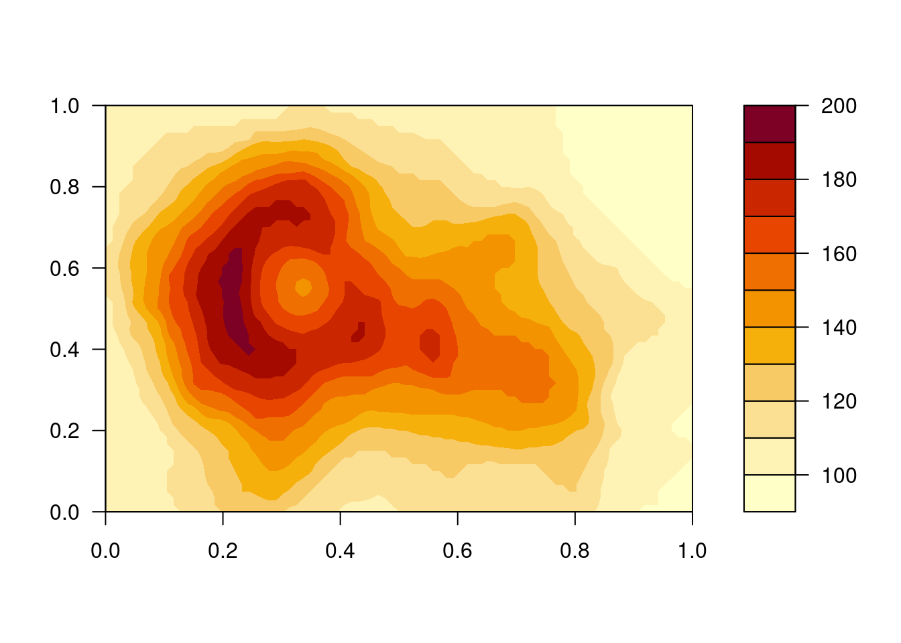
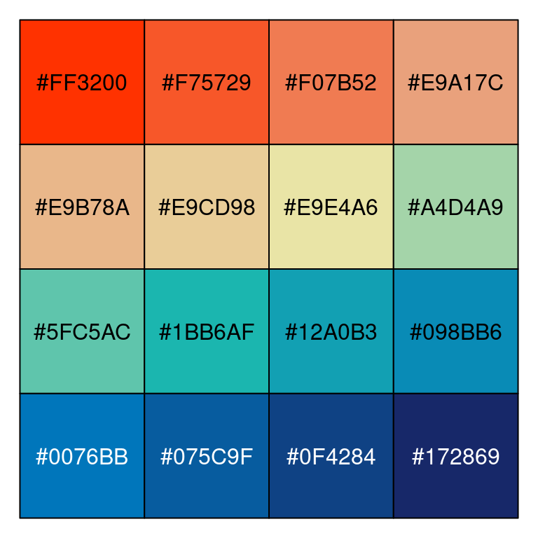

# 可视化之配色 {#chap-visualization-colors}


```r
library(ggplot2)           # ggplot2 图形
library(patchwork)
library(magrittr)
```

[^why-ggplot2]: http://varianceexplained.org/r/why-I-use-ggplot2/
[^why-not-ggplot2]: https://simplystatistics.org/2016/02/11/why-i-dont-use-ggplot2/

David Robinson 给出为何使用 ggplot2 [^why-ggplot2] 当然也有 Jeff Leek 指出在某些重要场合不适合 ggplot2 [^why-not-ggplot2] 并且给出强有力的 [证据](http://motioninsocial.com/tufte/)，其实不管怎么样，适合自己的才是好的。也不枉费 Garrick Aden-Buie 花费 160 页幻灯片逐步分解介绍 [优雅的ggplot2](https://pkg.garrickadenbuie.com/gentle-ggplot2)，[Malcolm Barrett](https://malco.io/) 也介绍了 [ggplot2 基础用法](https://malco.io/slides/hs_ggplot2)，还有 Selva Prabhakaran 精心总结给出了 50 个 ggplot2 数据可视化的 [例子](https://r-statistics.co/Top50-Ggplot2-Visualizations-MasterList-R-Code.html) 以及 Victor Perrier 为小白用 ggplot2 操碎了心地开发 RStudio 插件 [esquisse](https://github.com/dreamRs/esquisse) 包，Claus O. Wilke 教你一步步创建出版级的图形 <https://github.com/clauswilke/practical_ggplot2>。

ggplot2 是十分方便的统计作图工具，相比 Base R，为了一张出版级的图形，不需要去调整每个参数，实现快速出图。集成了很多其它统计计算的 R 包，支持丰富的统计分析和计算功能，如回归、平滑等，实现了作图和模型的无缝连接。比如图\@ref(fig:awesome-ggplot2)，使用 loess 局部多项式平滑得到数据的趋势，不仅仅是散点图，代码量也非常少。


```r
ggplot(mpg, aes(displ, hwy)) +
  geom_point(aes(color = class)) +
  geom_smooth(se = TRUE, method = "loess") +
  labs(
    title = "Fuel efficiency generally decreases with engine size",
    subtitle = "Two seaters (sports cars) are an exception because of their light weight",
    caption = "Data from fueleconomy.gov"
  )
```

<div class="figure" style="text-align: center">

<p class="caption">(\#fig:awesome-ggplot2)简洁美观</p>
</div>

故事源于一幅图片，我不记得第一次见到这幅图是什么时候了，只因多次在多个场合中见过，所以留下了深刻的印象，后来才知道它出自于一篇博文 --- [Using R packages and education to scale Data Science at Airbnb](https://medium.com/airbnb-engineering/using-r-packages-and-education-to-scale-data-science-at-airbnb)，作者 Ricardo Bion 还在其 Github 上传了相关代码^[<https://github.com/ricardo-bion/medium_visualization>]。


如 Berton Gunter 所说，数据可视化只是一种手段，根据数据实际情况作展示才是重要的，并不是要追求酷炫。

> 3-D bar plots are an abomination. Just because Excel can do them doesn't mean you should. (Dismount pulpit).
>
> --- Berton Gunter [^BG-help-2007]

[^BG-help-2007]: <https://stat.ethz.ch/pipermail/r-help/2007-October/142420.html>

**grid** 是 **lattice** 和 **ggplot2** 的基础，**gganimate** 是 ggplot2 一个扩展，它将静态图形视为帧，调用第三方工具合成 GIF 动图或 MP4 视频等，要想深入了解 ggplot2，可以去看 [Hadley Wickham](http://hadley.nz), [Danielle Navarro](https://djnavarro.net), and [Thomas Lin Pedersen](https://www.data-imaginist.com) 合著的《ggplot2: elegant graphics for data analysis》第三版 <https://ggplot2-book.org/>。

配色真的是一门学问，有的人功力非常深厚，仅用黑白灰就可以创造出一个世界，如中国的水墨画，科波拉执导的《教父》，沃卓斯基姐妹执导的《黑客帝国》等。黑西装、白衬衫和黑领带是《黑客帝国》的经典元素，《教父》开场的黑西装、黑领结和白衬衫，尤其胸前的红玫瑰更是点睛之笔。导演将黑白灰和光影混合形成了层次丰富立体的画面，打造了一场视觉盛宴，无论是呈现在纸上还是银幕上都可以给人留下深刻的印象。正所谓食色性也，花花世界，岂能都是法印眼中的白骨！再说《红楼梦》里，芍药丛中，桃花树下，滴翠亭边，栊翠庵里，处处都是湘云、黛玉、宝钗、妙玉留下的四季诗歌。


```r
filled.contour(volcano, nlevels = 10, color.palette = terrain.colors)
filled.contour(volcano, nlevels = 10, color.palette = heat.colors)
filled.contour(volcano, nlevels = 10, color.palette = topo.colors)
filled.contour(volcano, nlevels = 10, color.palette = cm.colors)
```

<div class="figure" style="text-align: center">

<p class="caption">(\#fig:old-color-palette)R 3.6.0 以前的调色板</p>
</div>


```r
filled.contour(volcano,
  nlevels = 10,
  color.palette = function(n, ...) hcl.colors(n, "Grays", rev = TRUE, ...)
)
filled.contour(volcano,
  nlevels = 10,
  color.palette = function(n, ...) hcl.colors(n, "YlOrRd", rev = TRUE, ...)
)
filled.contour(volcano,
  nlevels = 10,
  color.palette = function(n, ...) hcl.colors(n, "purples", rev = TRUE, ...)
)
filled.contour(volcano,
  nlevels = 10,
  color.palette = function(n, ...) hcl.colors(n, "viridis", rev = FALSE, ...)
)
```

<div class="figure" style="text-align: center">

<p class="caption">(\#fig:new-color-palette)R 3.6.0 以后的调色板</p>
</div>

::: {.rmdnote data-latex="{注意}"}
`hcl.colors()` 函数是在 R 3.6.0 引入的，之前的 R 软件版本中没有，同时内置了 110 个调色板，详见 `hcl.pals()`。
:::

<!--
R Colors in CSS for R Markdown HTML Documents
https://www.garrickadenbuie.com/blog/r-colors-css/

https://www.garrickadenbuie.com/blog/ 及其系列博客
-->

## 调色板 {#subsec-color-palettes}

R 预置的灰色有224种，挑出其中的调色板


```r
grep("^gr(a|e)y", grep("gr(a|e)y", colors(), value = TRUE), 
     value = TRUE, invert = TRUE)
```

```
##  [1] "darkgray"       "darkgrey"       "darkslategray"  "darkslategray1"
##  [5] "darkslategray2" "darkslategray3" "darkslategray4" "darkslategrey" 
##  [9] "dimgray"        "dimgrey"        "lightgray"      "lightgrey"     
## [13] "lightslategray" "lightslategrey" "slategray"      "slategray1"    
## [17] "slategray2"     "slategray3"     "slategray4"     "slategrey"
```


```r
gray_colors <- paste0(rep(c("slategray", "darkslategray"), each = 4), seq(4))
barplot(1:8, col = gray_colors, border = NA)
```

<div class="figure" style="text-align: center">

<p class="caption">(\#fig:gray-palettes)灰度调色板</p>
</div>

gray 与 grey 是一样的，类似 color 和 colour 的关系，可能是美式和英式英语的差别，且看


```r
all.equal(
  col2rgb(paste0("gray", seq(100))),
  col2rgb(paste0("grey", seq(100)))
)
```

```
## [1] TRUE
```

`gray100` 代表白色，`gray0` 代表黑色，提取灰色调色板，去掉首尾部分是必要的


```r
barplot(1:8,
  col = gray.colors(8, start = .3, end = .9),
  main = "gray.colors function", border = NA
)
```

<div class="figure" style="text-align: center">

<p class="caption">(\#fig:gray-colors)提取 10 种灰色做调色板</p>
</div>

首先选择一组合适的颜色，比如从桃色到梨色，选择6种颜色，以此为基础，可以借助 `grDevices::colorRampPalette()` 函数扩充至想要的数目，用 `graphics::rect()` 函数预览这组颜色配制的调色板


```r
# Colors from https://github.com/johannesbjork/LaCroixColoR
colors_vec <- c("#FF3200", "#E9A17C", "#E9E4A6", 
                "#1BB6AF", "#0076BB", "#172869")
# 代码来自 ?colorspace::rainbow_hcl
pal <- function(n = 20, colors = colors, border = "light gray", ...) {
  colorname <- (grDevices::colorRampPalette(colors))(n)
  plot(0, 0,
    type = "n", xlim = c(0, 1), ylim = c(0, 1),
    axes = FALSE, ...
  )
  rect(0:(n - 1) / n, 0, 1:n / n, 1, col = colorname, border = border)
}
par(mar = rep(0, 4))
pal(n = 20, colors = colors_vec, xlab = "Colors from Peach to Pear", ylab = "")
```

<div class="figure" style="text-align: center">

<p class="caption">(\#fig:peach-pear-palette)桃色至梨色的渐变</p>
</div>

`colorRampPalette()` 自制调色板


```r
create_palette <- function(n = 1000, colors = c("blue", "orangeRed")) {
  color_palette <- colorRampPalette(colors)(n)
  barplot(rep(1, times = n), col = color_palette, 
          border = color_palette, axes = FALSE)
}
par(mfrow = c(3, 1), mar = c(0.1, 0.1, 0.5, 0.1), xaxs = "i", yaxs = "i")
create_palette(n = 1000, colors = c("blue", "orangeRed"))
create_palette(n = 1000, colors = c("darkgreen", "yellow", "orangered"))
create_palette(n = 1000, colors = c("blue", "white", "orangered"))
```

<div class="figure" style="text-align: center">

<p class="caption">(\#fig:custom-palettes)colorRampPalette 自制调色板</p>
</div>


```r
par(mar = c(0, 4, 0, 0))
RColorBrewer::display.brewer.all()
```

<div class="figure" style="text-align: center">

<p class="caption">(\#fig:rcolorbrewer-palette)RColorBrewer 调色板</p>
</div>


```r
# 代码来自 ?palettes
demo.pal <- function(n, border = if (n < 32) "light gray" else NA,
           main = paste("color palettes: alpha = 1,  n=", n),
           ch.col = c(
             "rainbow(n, start=.7, end=.1)", "heat.colors(n)",
             "terrain.colors(n)", "topo.colors(n)",
             "cm.colors(n)", "gray.colors(n, start = 0.3, end = 0.9)"
           )) {
    nt <- length(ch.col)
    i <- 1:n
    j <- n / nt
    d <- j / 6
    dy <- 2 * d
    plot(i, i + d, type = "n", axes = FALSE, ylab = "", xlab = "", main = main)
    for (k in 1:nt) {
      rect(i - .5, (k - 1) * j + dy, i + .4, k * j,
        col = eval(parse(text = ch.col[k])), border = border
      )
      text(2 * j, k * j + dy / 4, ch.col[k])
    }
  }
n <- if (.Device == "postscript") 64 else 16
# Since for screen, larger n may give color allocation problem
par(mar = c(0, 0, 2, 0))
demo.pal(n)
```

<div class="figure" style="text-align: center">

<p class="caption">(\#fig:builtin-palettes)grDevices 调色板 </p>
</div>


```r
par(mfrow = c(33, 1), mar = c(0, 0, .8, 0))
for (i in seq(32)) {
  pal(
    n = length((1 + 20 * (i - 1)):(20 * i)),
    colors()[(1 + 20 * (i - 1)):(20 * i)],
    main = paste(1 + 20 * (i - 1), "to", 20 * i)
  )
}
pal(n = 17, colors()[641:657], main = "641 to 657")
```

<div class="figure" style="text-align: center">

<p class="caption">(\#fig:demo-colors)grDevices 调色板</p>
</div>


```r
library(colorspace)
## a few useful diverging HCL palettes
par(mar = c(0,0,2,0), mfrow = c(16, 2))

pal(n = 16, diverge_hcl(16), main = "diverging HCL palettes")
pal(n = 16, diverge_hcl(16, h = c(246, 40), c = 96, l = c(65, 90)))
pal(n = 16, diverge_hcl(16, h = c(130, 43), c = 100, l = c(70, 90)))
pal(n = 16, diverge_hcl(16, h = c(180, 70), c = 70, l = c(90, 95)))

pal(n = 16, diverge_hcl(16, h = c(180, 330), c = 59, l = c(75, 95)))
pal(n = 16, diverge_hcl(16, h = c(128, 330), c = 98, l = c(65, 90)))
pal(n = 16, diverge_hcl(16, h = c(255, 330), l = c(40, 90)))
pal(n = 16, diverge_hcl(16, c = 100, l = c(50, 90), power = 1))

## sequential palettes
pal(n = 16, sequential_hcl(16), main= "sequential palettes")
pal(n = 16, heat_hcl(16, h = c(0, -100), 
                     l = c(75, 40), c = c(40, 80), power = 1))
pal(n = 16, terrain_hcl(16, c = c(65, 0), l = c(45, 95), power = c(1/3, 1.5)))
pal(n = 16, heat_hcl(16, c = c(80, 30), l = c(30, 90), power = c(1/5, 1.5)))

## compare base and colorspace palettes
## (in color and desaturated)
## diverging red-blue colors
pal(n = 16, diverge_hsv(16), main = "diverging red-blue colors")
pal(n = 16, diverge_hcl(16, c = 100, l = c(50, 90)))
pal(n = 16, desaturate(diverge_hsv(16)))
pal(n = 16, desaturate(diverge_hcl(16, c = 100, l = c(50, 90))))

## diverging cyan-magenta colors
pal(n = 16, cm.colors(16), main = "diverging cyan-magenta colors")
pal(n = 16, diverge_hcl(16, h = c(180, 330), c = 59, l = c(75, 95)))
pal(n = 16, desaturate(cm.colors(16)))
pal(n = 16, desaturate(diverge_hcl(16, h = c(180, 330), c = 59, l = c(75, 95))))

## heat colors
pal(n = 16, heat.colors(16), main = "heat colors")
pal(n = 16, heat_hcl(16))
pal(n = 16, desaturate(heat.colors(16)))
pal(n = 16, desaturate(heat_hcl(16)))

## terrain colors
pal(n = 16, terrain.colors(16), main = "terrain colors")
pal(n = 16, terrain_hcl(16))
pal(n = 16, desaturate(terrain.colors(16)))
pal(n = 16, desaturate(terrain_hcl(16)))

pal(n = 16, rainbow_hcl(16, start = 30, end = 300), main = "dynamic")
pal(n = 16, rainbow_hcl(16, start = 60, end = 240), main = "harmonic")
pal(n = 16, rainbow_hcl(16, start = 270, end = 150), main = "cold")
pal(n = 16, rainbow_hcl(16, start = 90, end = -30), main = "warm")
```

<div class="figure" style="text-align: center">

<p class="caption">(\#fig:colorspace-palette)colorspace 调色板</p>
</div>

除之前提到的 **grDevices** 包， [**colorspace**](https://colorspace.r-forge.r-project.org/) (<https://hclwizard.org/>) 包 [@colorspace_2009_rainbow; @colorspace_2009_rgb; @colorspace_2019]，[RColorBrewer](https://CRAN.R-project.org/package=RColorBrewer) 包 [@RColorBrewer] <https://colorbrewer2.org/>，[viridis](https://github.com/sjmgarnier/viridis) 包、[colourvalues](https://github.com/SymbolixAU/colourvalues)、[wesanderson](https://github.com/karthik/wesanderson)、[dichromat](https://CRAN.R-project.org/package=dichromat) 包、[pals](https://github.com/kwstat/pals) 包，[palr](https://github.com/AustralianAntarcticDivision/palr) 包，[colorRamps](https://cran.r-project.org/package=colorRamps) 包、[ColorPalette](https://cran.r-project.org/package=ColorPalette) 包、[colortools](https://cran.r-project.org/package=colortools) 包就不一一详细介绍了。

[colormap](https://github.com/bhaskarvk/colormap) 包基于 node.js 的 colormap 模块提供 44 个预定义的调色板
[paletteer](https://github.com/EmilHvitfeldt/paletteer) 包收集了很多 R 包提供的调色板，同时也引入了很多依赖。根据电影 Harry Potter 制作的调色板 [harrypotter](https://github.com/aljrico/harrypotter)，根据网站 [CARTO](https://carto.com/) 设计的 [rcartocolor](https://github.com/Nowosad/rcartocolor) 包，[colorblindr](https://github.com/clauswilke/colorblindr) 模拟色盲环境下的配色方案。

[yarrr](https://github.com/ndphillips/yarrr) 包主要是为书籍 [《YaRrr! The Pirate's Guide to R》](https://bookdown.org/ndphillips/YaRrr/) <https://github.com/ndphillips/ThePiratesGuideToR> 提供配套资源，兼顾收集了一组[调色板](https://bookdown.org/ndphillips/YaRrr/more-colors.html)。


::: {.rmdnote data-latex="{注意}"}
RColorBrewer 调色板数量必须至少 3 个，这是上游 colorbrewer 的 [问题](https://github.com/axismaps/colorbrewer/issues/23)，具体体现在调用
`RColorBrewer::brewer.pal(n = 2, name = "Set2")` 时会有警告。 plotly 调用

```
[1] "#66C2A5" "#FC8D62" "#8DA0CB"
Warning message:
In RColorBrewer::brewer.pal(n = 2, name = "Set2") :
  minimal value for n is 3, returning requested palette with 3 different levels
```
:::


```r
par(mar = c(1, 2, 1, 0), mfrow = c(3, 2))
set.seed(1234)
x <- sample(seq(8), 8, replace = FALSE)
barplot(x, col = palette(), border = "white")
barplot(x, col = heat.colors(8), border = "white")
barplot(x, col = gray.colors(8), border = "white")
barplot(x, col = "lightblue", border = "white")
barplot(x, col = colorspace::sequential_hcl(8), border = "white")
barplot(x, col = colorspace::diverge_hcl(8,
  h = c(130, 43),
  c = 100, l = c(70, 90)
), border = "white")
```

<div class="figure" style="text-align: center">

<p class="caption">(\#fig:select-color)源起</p>
</div>

与图 \@ref(fig:geom-tile) 对比，图\@ref(fig:palette-spectral) 的层次更加丰富，识别性更高


```r
expand.grid(months = month.abb, years = 1949:1960) |> 
  transform(num = as.vector(AirPassengers)) |> 
  ggplot(aes(x = years, y = months, fill = num)) +
  scale_fill_distiller(palette = "Spectral") +
  geom_tile(color = "white", size = 0.4) +
  scale_x_continuous(
    expand = c(0.01, 0.01),
    breaks = seq(1949, 1960, by = 1),
    labels = 1949:1960
  ) +
  theme_minimal(
    base_size = 10.54,
    base_family = "Noto Serif CJK SC"
  ) +
  labs(x = "年", y = "月", fill = "人数")
```

```
## Warning: Using `size` aesthetic for lines was deprecated in ggplot2 3.4.0.
## ℹ Please use `linewidth` instead.
## This warning is displayed once every 8 hours.
## Call `lifecycle::last_lifecycle_warnings()` to see where this warning was
## generated.
```

<div class="figure" style="text-align: center">

<p class="caption">(\#fig:palette-spectral)Spectral 调色板</p>
</div>

再举例子，图 \@ref(fig:faithfuld) 是正负例对比，其中好在哪里呢？这张图要表达美国黄石国家公园的老忠实泉间歇喷发的时间规律，那么好的标准就是层次分明，以突出不同颜色之间的时间差异。这个差异，还要看起来不那么费眼睛，一目了然最好。


```r
erupt <- ggplot(faithfuld, aes(waiting, eruptions, fill = density)) +
  geom_raster() +
  scale_x_continuous(NULL, expand = c(0, 0)) +
  scale_y_continuous(NULL, expand = c(0, 0)) +
  theme(legend.position = "none")
p1 <- erupt + scale_fill_gradientn(colours = gray.colors(7))
p2 <- erupt + scale_fill_distiller(palette = "Spectral")
p3 <- erupt + scale_fill_gradientn(colours = terrain.colors(7))
p4 <- erupt + scale_fill_continuous(type = 'viridis')
(p1 + p2) / (p3 + p4)
```

<div class="figure" style="text-align: center">

<p class="caption">(\#fig:faithfuld)美国黄石国家公园的老忠实泉</p>
</div>

RColorBrewer 包 提供了有序 (Sequential) 、定性 (Qualitative) 和发散 (Diverging) 三类调色板，一般来讲，分别适用于连续或有序分类变量、无序分类变量、两类分层对比变量的绘图。再加上强大的 ggplot2 包内置的对颜色处理的函数，如 `scale_alpha_*` 、 `scale_colour_*` 和 `scale_fill_*` 等，详见：


```r
ls("package:ggplot2", pattern = "scale_col(ou|o)r_")
```

```
##  [1] "scale_color_binned"      "scale_color_brewer"     
##  [3] "scale_color_continuous"  "scale_color_date"       
##  [5] "scale_color_datetime"    "scale_color_discrete"   
##  [7] "scale_color_distiller"   "scale_color_fermenter"  
##  [9] "scale_color_gradient"    "scale_color_gradient2"  
## [11] "scale_color_gradientn"   "scale_color_grey"       
## [13] "scale_color_hue"         "scale_color_identity"   
## [15] "scale_color_manual"      "scale_color_ordinal"    
## [17] "scale_color_steps"       "scale_color_steps2"     
## [19] "scale_color_stepsn"      "scale_color_viridis_b"  
## [21] "scale_color_viridis_c"   "scale_color_viridis_d"  
## [23] "scale_colour_binned"     "scale_colour_brewer"    
## [25] "scale_colour_continuous" "scale_colour_date"      
## [27] "scale_colour_datetime"   "scale_colour_discrete"  
## [29] "scale_colour_distiller"  "scale_colour_fermenter" 
## [31] "scale_colour_gradient"   "scale_colour_gradient2" 
## [33] "scale_colour_gradientn"  "scale_colour_grey"      
## [35] "scale_colour_hue"        "scale_colour_identity"  
## [37] "scale_colour_manual"     "scale_colour_ordinal"   
## [39] "scale_colour_steps"      "scale_colour_steps2"    
## [41] "scale_colour_stepsn"     "scale_colour_viridis_b" 
## [43] "scale_colour_viridis_c"  "scale_colour_viridis_d"
```

```r
ls("package:ggplot2", pattern = "scale_fill_")
```

```
##  [1] "scale_fill_binned"     "scale_fill_brewer"     "scale_fill_continuous"
##  [4] "scale_fill_date"       "scale_fill_datetime"   "scale_fill_discrete"  
##  [7] "scale_fill_distiller"  "scale_fill_fermenter"  "scale_fill_gradient"  
## [10] "scale_fill_gradient2"  "scale_fill_gradientn"  "scale_fill_grey"      
## [13] "scale_fill_hue"        "scale_fill_identity"   "scale_fill_manual"    
## [16] "scale_fill_ordinal"    "scale_fill_steps"      "scale_fill_steps2"    
## [19] "scale_fill_stepsn"     "scale_fill_viridis_b"  "scale_fill_viridis_c" 
## [22] "scale_fill_viridis_d"
```

colourlovers 包借助 XML, jsonlite 和 httr 包可以在线获取网站 [COLOURlovers](https://www.colourlovers.com/) 的调色板


```r
library(colourlovers)
palette1 <- clpalette('113451')
palette2 <- clpalette('92095')
palette3 <- clpalette('629637')
palette4 <- clpalette('694737')
```

使用调色板


```r
layout(matrix(1:4, nrow = 2))
par(mar = c(2, 2, 2, 2))

barplot(VADeaths, col = swatch(palette1)[[1]], border = NA)
barplot(VADeaths, col = swatch(palette2)[[1]], border = NA)
barplot(VADeaths, col = swatch(palette3)[[1]], border = NA)
barplot(VADeaths, col = swatch(palette4)[[1]], border = NA)
```

调色板的描述信息


```r
palette1
```

获取调色板中的颜色向量


```r
swatch(palette1)[[1]]
```

## 颜色模式 {#subsec-color-schames}

不同的颜色模式，从 RGB 到 HCL 的基本操作 <https://stat545.com/block018_colors.html>


```r
# https://github.com/hadley/ggplot2-book
hcl <- expand.grid(x = seq(-1, 1, length = 100), y = seq(-1, 1, length = 100)) |>
  subset(subset = x^2 + y^2 < 1) |>
  transform(
    r = sqrt(x^2 + y^2)
  ) |>
  transform(
    h = 180 / pi * atan2(y, x),
    c = 100 * r,
    l = 65
  ) |>
  transform(
    colour = hcl(h, c, l)
  )

# sin(h) = y / (c / 100)
# y = sin(h) * c / 100

cols <- scales::hue_pal()(5)
selected <- colorspace::RGB(t(col2rgb(cols)) / 255) %>%
  as("polarLUV") %>%
  colorspace::coords() %>%
  as.data.frame() %>%
  transform(
    x = cos(H / 180 * pi) * C / 100,
    y = sin(H / 180 * pi) * C / 100,
    colour = cols
  )

ggplot(hcl, aes(x, y)) +
  geom_raster(aes(fill = colour)) +
  scale_fill_identity() +
  scale_colour_identity() +
  coord_equal() +
  scale_x_continuous("", breaks = NULL) +
  scale_y_continuous("", breaks = NULL) +
  geom_point(data = selected, size = 10, color = "white") +
  geom_point(data = selected, size = 5, aes(colour = colour))
```

<div class="figure" style="text-align: center">

<p class="caption">(\#fig:unnamed-chunk-10)HCL调色</p>
</div>

R 内置了 502 种不同颜色的名称，下面随机地选取 20 种颜色


```r
sample(colors(TRUE), 20)
```

```
##  [1] "royalblue4"      "plum1"           "papayawhip"      "darkslategray"  
##  [5] "darkturquoise"   "gray79"          "darkred"         "maroon4"        
##  [9] "darkolivegreen4" "springgreen2"    "orchid4"         "lemonchiffon2"  
## [13] "paleturquoise4"  "gray49"          "cyan"            "antiquewhite1"  
## [17] "yellow2"         "gray13"          "cadetblue2"      "gray77"
```

R 包 grDevices 提供 hcl 调色板[^hcl-palettes] 调制两个色板

[^hcl-palettes]: https://developer.r-project.org/Blog/public/2019/04/01/hcl-based-color-palettes-in-grdevices/index.html


```r
# Colors from https://github.com/johannesbjork/LaCroixColoR
color_pal <- c("#FF3200", "#E9A17C", "#E9E4A6", "#1BB6AF", "#0076BB", "#172869")
n <- 16
more_colors <- (grDevices::colorRampPalette(color_pal))(n)
scales::show_col(colours = more_colors)
```

<div class="figure" style="text-align: center">

<p class="caption">(\#fig:color-pal)桃色至梨色的渐变</p>
</div>


```r
# colors in colortools from http://www.gastonsanchez.com/
fish_pal <- c(
  "#69D2E7", "#6993E7", "#7E69E7", "#BD69E7",
  "#E769D2", "#E76993", "#E77E69", "#E7BD69",
  "#D2E769", "#93E769", "#69E77E", "#69E7BD"
)
more_colors <- (grDevices::colorRampPalette(fish_pal))(n)
scales::show_col(colours = more_colors)
```

<div class="figure" style="text-align: center">

<p class="caption">(\#fig:fish-hsv-pal)Hue-Saturation-Value (HSV) 颜色模型</p>
</div>


```r
rgb(red = 86, green = 180, blue = 233, maxColorValue = 255) # "#56B4E9"
```

```
## [1] "#56B4E9"
```

```r
rgb(red = 0, green = 158, blue = 115, maxColorValue = 255) # "#009E73"
```

```
## [1] "#009E73"
```

```r
rgb(red = 240, green = 228, blue = 66, maxColorValue = 255) # "#F0E442"
```

```
## [1] "#F0E442"
```

```r
rgb(red = 0, green = 114, blue = 178, maxColorValue = 255) # "#0072B2"
```

```
## [1] "#0072B2"
```

举例子，直方图配色与不配色


```r
# library(pander)
# evalsOptions('graph.unify', TRUE)
# panderOptions('graph.colors') 获取调色板
# https://www.fontke.com/tool/rgbschemes/ 在线配色
cols <- c(
  "#56B4E9", "#009E73", "#F0E442", "#0072B2",
  "#D55E00", "#CC79A7", "#999999", "#E69F00"
)
hist(mtcars$hp, col = "#56B4E9", border = "white", grid = grid())
```

<div class="figure" style="text-align: center">

<p class="caption">(\#fig:unnamed-chunk-13)直方图</p>
</div>


```r
ggplot(mtcars) +
  geom_histogram(aes(x = hp, fill = as.factor(..count..)),
    color = "white", bins = 6
  ) +
  scale_fill_manual(values = rep("#56B4E9", 10)) +
  ggtitle("Histogram with ggplot2") +
  theme_minimal() +
  theme(legend.position = "none") 
```

```
## Warning: The dot-dot notation (`..count..`) was deprecated in ggplot2 3.4.0.
## ℹ Please use `after_stat(count)` instead.
## This warning is displayed once every 8 hours.
## Call `lifecycle::last_lifecycle_warnings()` to see where this warning was
## generated.
```

<div class="figure" style="text-align: center">

<p class="caption">(\#fig:unnamed-chunk-14)直方图</p>
</div>

### RGB

红(red)、绿(green)、蓝(blue)是三原色


```r
rgb(red, green, blue, alpha, names = NULL, maxColorValue = 1)
```

函数参数说明：

- `red, blue, green, alpha` 取值范围$[0,M]$，$M$ 是 *maxColorValue*
- `names` 字符向量，给这组颜色值取名
- `maxColorValue` 红，绿，蓝三色范围的最大值

The colour specification refers to the standard sRGB colorspace (IEC standard 61966).

rgb 产生一种颜色，如 `rgb(255, 0, 0, maxColorValue = 255)` 的颜色是 `"#FF0000"` ，这是一串16进制数，每两个一组，那么一组有 $16^2 = 256$ 种组合，整个一串有 $256^3 = 16777216$ 种组合，这就是RGB表达的所有颜色。

### HSL

色相饱和度亮度 hue--saturation--luminance (HSL)

### HSV

Create a vector of colors from vectors specifying hue, saturation and value. 色相饱和度值

```r
hsv(h = 1, s = 1, v = 1, alpha)
```

This function creates a vector of colors corresponding to the given values in HSV space. rgb and rgb2hsv for RGB to HSV conversion;

hsv函数通过设置色调、饱和度和亮度获得颜色，三个值都是0-1的相对量

RGB HSV HSL 都是不连续的颜色空间，缺点

### HCL

基于感知的颜色空间替代RGB颜色空间

通过指定色相(hue)，色度(chroma)和亮度(luminance/lightness)，创建一组（种）颜色


```r
hcl(h = 0, c = 35, l = 85, alpha, fixup = TRUE)
```

函数参数说明：

- **h** 颜色的色调，取值范围为[0,360]，0、120、240分别对应红色、绿色、蓝色

- **c** 颜色的色度，其上界取决于色调和亮度

- **l** 颜色的亮度，取值范围[0,100]，给定色调和色度，只有一部分子集可用

- **alpha** 透明度，取值范围[0,1]，0 和1分别表示透明和不透明

This function corresponds to polar coordinates in the CIE-LUV color space

选色为什么这么难

色相与阴影相比是无关紧要的，色相对于标记和分类很有用，但表示（精细的）空间数据或形状的效果较差。颜色是改善图形的好工具，但糟糕的配色方案 (color schemes) 可能会导致比灰度调色板更差的效果。[@colorspace_2009_rainbow]

黑、白、灰，看似有三种颜色，其实只有一种颜色，黑和白只是灰色的两极，那么如何设置灰色梯度，使得人眼比较好区分它们呢？这样获得的调色板适用于什么样的绘图环境呢？

### CMYK

印刷三原色：青 (cyan)、品红 (magenta)、黄 (yellow)

- 颜色模式转化

`col2rgb()` 、`rgb2hsv()` 和 `rgb()` 函数 `hex2RGB()` 函数 colorspace `col2hcl()` 函数 scales `col2HSV()` colortools `col2hex()`


```r
col2rgb("lightblue") # color to  RGB
```

```
##       [,1]
## red    173
## green  216
## blue   230
```

```r
scales::col2hcl("lightblue") # color to HCL
```

```
## [1] "#ADD8E6"
```

```r
# palr::col2hex("lightblue") # color to HEX
# colortools::col2HSV("lightblue") # color to HSV

rgb(173, 216, 230, maxColorValue = 255) # RGB to HEX
```

```
## [1] "#ADD8E6"
```

```r
colorspace::hex2RGB("#ADD8E6") # HEX to RGB
```

```
##              R         G         B
## [1,] 0.6784314 0.8470588 0.9019608
```

```r
rgb(.678, .847, .902, maxColorValue = 1) # RGB to HEX
```

```
## [1] "#ADD8E6"
```

```r
rgb2hsv(173, 216, 230, maxColorValue = 255) # RGB to HSV
```

```
##        [,1]
## h 0.5409357
## s 0.2478261
## v 0.9019608
```

## LaTeX 配色 {#subsec-latex-colors}

LaTeX 宏包 [xcolor](https://www.ctan.org/pkg/xcolor) 中定义颜色的常用方式有两种，其一，`\textcolor{green!40!yellow}`{.TeX} 表示 40% 的绿色和 60% 的黄色混合色彩，其二，`\textcolor[HTML]{34A853}`{.TeX} HEX 表示的色彩直接在 LaTeX 文档中使用的方式，类似地 `\textcolor[RGB]{52,168,83}`{.TeX} 也表示 Google 图标中的绿色。

```tex
\documentclass[tikz,border=10pt]{standalone}
\begin{document}
\begin{tikzpicture}
\draw (0,0) rectangle (2,1) node [midway] {\textcolor[RGB]{52,168,83}{Hello} \textcolor[HTML]{34A853}{\TeX}};
\end{tikzpicture}
\end{document}
```

对应于 R 中的调用方式为：


```r
rgb(52, 168, 83, maxColorValue = 255)
```

```
## [1] "#34A853"
```

## ggplot2 配色 {#subsec-ggplot2-colors}


```r
boxplot(weight ~ group,
  data = PlantGrowth, col = "lightgray",
  notch = FALSE, varwidth = TRUE
)
# 类似 boxplot
ggplot(data = PlantGrowth, aes(x = group, y = weight)) +
  geom_boxplot(notch = FALSE, varwidth = TRUE, fill = "lightgray")

# 默认调色板
ggplot(data = PlantGrowth, aes(x = group, y = weight, fill = group)) +
  geom_boxplot(notch = FALSE, varwidth = TRUE)

# Google 调色板
ggplot(data = PlantGrowth, aes(x = group, y = weight, fill = group)) +
  geom_boxplot(notch = FALSE, varwidth = TRUE) +
  scale_fill_manual(values = c("#4285f4", "#34A853", "#FBBC05", "#EA4335"))
```

<div class="figure" style="text-align: center">

<p class="caption">(\#fig:colorize-boxplot)几种不同的箱线图</p>
</div>

